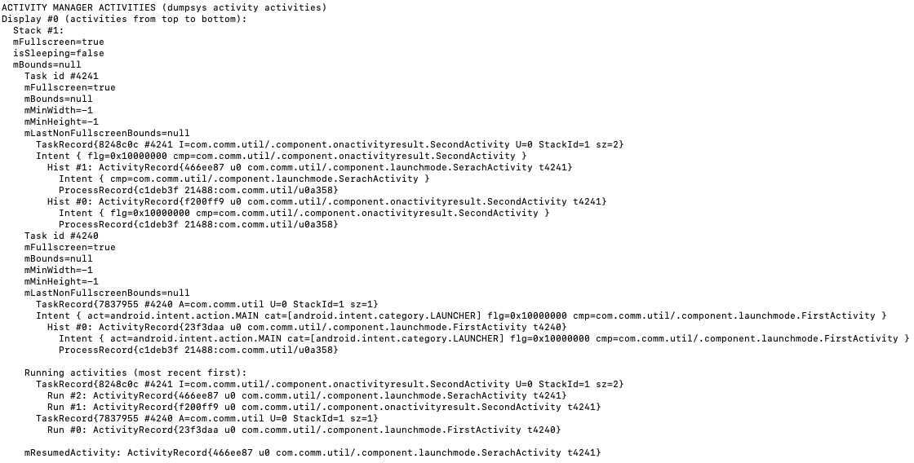

#### Activity

An activity is a single, focused thing that the user can do. Almost all activities interact with the user, so the Activity class takes care of creating a window for you in which you can place your UI with setContentView(View).
Acitivty和用户交互，所以也是用的最多的

 

想到一个问题:界面Ａ　到界面Ｂ，是Ａ的onStop()先执行　还是Ｂ的onResume()先走

先用事实说话吧

     I/BaseActivity: MainActivity -- onCreate() -- 
     I/BaseActivity: MainActivity -- onStart() -- 
     I/BaseActivity: MainActivity -- onResume() -- 
     I/BaseActivity: MainActivity -- onPause() -- 
     I/BaseActivity: StopResumeActivity -- onCreate() -- 
     I/BaseActivity: StopResumeActivity -- onStart() -- 
     I/BaseActivity: StopResumeActivity -- onResume() -- 
     I/BaseActivity: MainActivity -- onStop() -- 

从打印结果可以看到StopResumeActivity.onResume()先执行,然后是MainActivity的onStop
先看看
onResume() : Called when the activity will start interacting with the user. At this point your activity is at the top of the activity stack, with user input going to it.

onStop() : Called when the activity is no longer visible to the user, because another activity has been resumed and is covering this one. This may happen either because a new activity is being started, an existing one is being brought in front of this one, or this one is being destroyed.
Followed by either onRestart() if this activity is coming back to interact with the user, or onDestroy() if this activity is going away.

大概知道原因，但是还是不够说服力，因为onStart()方法已经对用户可见了，为什么MainActivity -- onStop()不在 StopResumeActivity -- onStart()后面呢？
onStart：　Called when the activity is becoming visible to the user.
Followed by onResume() if the activity comes to the foreground, or onStop() if it becomes hidden.

参考：https://developer.android.com/reference/android/app/Activity.html

#### Activity luanch mode

##### 4种启动模式

* standard 

Default. The system creates a new instance of the activity in the task from which it was started and routes the intent to it. The activity can be instantiated multiple times, each instance can belong to different tasks, and one task can have multiple instances. 

* singleTop

  > 　 If an instance of the activity already exists at the top of the current task, the system routes the intent to that instance through a call to its `onNewIntent()` method, rather than creating a new instance of the activity. The activity can be instantiated multiple times, each instance can belong to different tasks, and one task can have multiple instances (but only if the activity at the top of the back stack is *not* an existing instance of the activity).
  > 　　　　For example, suppose a task's back stack consists of root activity A with activities B, C, and D on top (the stack is A-B-C-D; D is on top). An intent arrives for an activity of type D. If D has the default `"standard"` launch mode, a new instance of the class is launched and the stack becomes A-B-C-D-D. However, if D's launch mode is `"singleTop"`, the existing instance of D receives the intent through `onNewIntent()`, because it's at the top of the stack—the stack remains A-B-C-D. However, if an intent arrives for an activity of type B, then a new instance of B is added to the stack, even if its launch mode is `"singleTop"`.

* singleTask
  
  > The system creates a new task and instantiates the activity at the root of the new task. However, if an instance of the activity already exists in a separate task, the system routes the intent to the existing instance through a call to its `onNewIntent()` method, rather than creating a new instance. Only one instance of the activity can exist at a time.

* singleInstance 

  > Same as `"singleTask"`, except that the system doesn't launch any other activities into the task holding the instance. The activity is always the single and only member of its task; any activities started by this one open in a separate task.


除了 singleInstance 不好验证 所在task是否只有唯一的activity ，其他的启动模式比较清晰

查看运行的activity

```
adb shell dumpsys activity activities | sed -En -e '/Running activities/,/Run #0/p'
```

##### 两种方式

1. AndroidMenifest

   ```xml
   <activity
             android:name = "com.ryg.chapter_1.SecondActivity"
             android:launchMode="singleTask"
             />
   ```

2. Intent设置

   ```java
   intent.addFlasg(Intent.FLAG_ACTIVITY_NEW_TASK)
   ```

 2优先级高于1级


##### SingleInstance 无taskAffinity

SingleInstance会创建一个新的任务栈

```xml
<activity android:name=".component.launchmode.FirstActivity">
    <intent-filter>
        <action android:name="android.intent.action.MAIN" />

        <category android:name="android.intent.category.LAUNCHER" />
    </intent-filter>
</activity>

<activity
    android:name=".component.launchmode.SecondActivity"
    android:launchMode="singleInstance" />

<activity android:name=".component.launchmode.ThirdActivity" />
```

 ```
 D/FirstActivity LaunchModeActivity: onCreate() taskId  86
 D/FirstActivity LaunchModeActivity: onStart()
 D/FirstActivity LaunchModeActivity: onResume()
 D/FirstActivity LaunchModeActivity: onPause()
 D/SecondActivity LaunchModeActivity: onCreate() taskId  85
 D/SecondActivity LaunchModeActivity: onStart()
 D/SecondActivity LaunchModeActivity: onRestoreInstanceState()
 D/SecondActivity LaunchModeActivity:  onNewIntent(Intent intent)
 D/SecondActivity LaunchModeActivity: onResume()
 D/FirstActivity LaunchModeActivity: onSaveInstanceState()
 D/FirstActivity LaunchModeActivity: onStop()
 D/SecondActivity LaunchModeActivity: onPause()
 D/ThirdActivity LaunchModeActivity: onCreate() taskId  86
 D/ThirdActivity LaunchModeActivity: onStart()
 D/ThirdActivity LaunchModeActivity: onResume()
 D/SecondActivity LaunchModeActivity: onSaveInstanceState()
 D/SecondActivity LaunchModeActivity: onStop()
 ```

可以看到 FirstActivity 、ThirdActivity在同一个栈中，SecondActivity单独在一个栈中

所以按返回键盘，先到 FirstActivity，然后到SecondActivity .

##### 栈内Activity查看

```xml
     <activity android:name=".component.launchmode.SerachActivity" />
        <activity
            android:name=".component.onactivityresult.SecondActivity"
            android:launchMode="singleTask"
            android:taskAffinity="" />
        <activity
            android:name=".component.launchmode.FirstActivity"
            android:configChanges="orientation"
            android:launchMode="singleTask">
            <intent-filter>
                <action android:name="android.intent.action.MAIN" />

                <category android:name="android.intent.category.LAUNCHER" />
            </intent-filter>
        </activity>
```

> adb shell dumpsys activity




* taskAffinity属性的值为字符串，且中间必须含有分隔符"."
* standard模式，taskAffinity继承自Application的taskAffinity，而Application默认taskAffinity为包名，所以MainActivity的taskAffinity为包名。

https://developer.android.com/guide/components/activities/tasks-and-back-stack

https://blog.csdn.net/mynameishuangshuai/article/details/51491074

https://blog.csdn.net/zhangjg_blog/article/details/10923643


#### OnNewIntent()

onNewIntent

added in [API level 1](https://developer.android.com/guide/topics/manifest/uses-sdk-element.html#ApiLevels)

```
void onNewIntent (Intent intent)
```

if the Activity was already created and a new Intent is being delivered to `onNewIntent(android.content.Intent)`

This is called for activities that set launchMode to "singleTop" in their package, or if a client used the `FLAG_ACTIVITY_SINGLE_TOP` flag when calling `startActivity(Intent)`. In either case, when the activity is re-launched while at the top of the activity stack instead of a new instance of the activity being started, onNewIntent() will be called on the existing instance with the Intent that was used to re-launch it.

An activity will always be paused before receiving a new intent, so you can count on `onResume()` being called after this method.

Note that `getIntent()` still returns the original Intent. You can use `setIntent(Intent)` to update it to this new Intent.

| Parameters |                                                             |
| ---------- | ----------------------------------------------------------- |
| `intent`   | `Intent`: The new intent that was started for the activity. |

这个方法用于singleTop  singleTask两种启动模式

先看看  singleTask方式：FirstActivity  

```
<activity android:name=".launchmode.FirstActivity"
            android:launchMode="singleTask"/>
```

​		

   从 FirstActivity  --> LaunchActivity --> FirstActivity 生命周期方法


>  04-24 11:49:14.602 26674-26674/com.jonzhou.mineutils D/FirstActivity LaunchMode: onCreate()
>  04-24 11:49:14.672 26674-26674/com.jonzhou.mineutils D/FirstActivity LaunchMode: onStart()
>  04-24 11:49:14.679 26674-26674/com.jonzhou.mineutils D/FirstActivity LaunchMode: onResume()
>  04-24 11:49:32.085 26674-26674/com.jonzhou.mineutils D/FirstActivity LaunchMode: onPause()
>  04-24 11:49:32.099 26674-26674/com.jonzhou.mineutils D/LaunchActivity LaunchMode: onCreate()
>  04-24 11:49:32.127 26674-26674/com.jonzhou.mineutils D/LaunchActivity LaunchMode: onStart()
>  04-24 11:49:32.132 26674-26674/com.jonzhou.mineutils D/LaunchActivity LaunchMode: onResume()
>  04-24 11:49:32.462 26674-26674/com.jonzhou.mineutils D/FirstActivity LaunchMode: onStop()
>  04-24 11:49:53.681 26674-26674/com.jonzhou.mineutils D/LaunchActivity LaunchMode: onPause()
>  04-24 11:49:53.701 26674-26674/com.jonzhou.mineutils D/FirstActivity LaunchMode:  onNewIntent(Intent intent)
>  04-24 11:49:53.702 26674-26674/com.jonzhou.mineutils D/FirstActivity LaunchMode: onStart()
>  04-24 11:49:53.703 26674-26674/com.jonzhou.mineutils D/FirstActivity LaunchMode: onResume()
>  04-24 11:49:54.049 26674-26674/com.jonzhou.mineutils D/LaunchActivity LaunchMode: onStop()
>  04-24 11:49:54.049 26674-26674/com.jonzhou.mineutils D/LaunchActivity LaunchMode: onDestroy()


然后可以通过 onNewIntent(Intent intent);获取传回来的数据

```
        String data1 = intent.getStringExtra(newIntent);
        String data2 = getIntent().getStringExtra(newIntent);  //这种方式获取不到
        setIntent(intent);                                     //通过这种设置获取
        String data3 = getIntent().getStringExtra(newIntent);
        Timber.d("onNewIntent  " + data3);
```


为什么要设置 setIntent(intent)

> 我们在多次启动同一个栈唯一模式下的activity时，在onNewIntent()里面的getIntent()得到的intent感觉都是第一次的那个数据。对，这里就是这个陷阱。因为它就是会返回第一个intent的数据

https://blog.csdn.net/qq_16628781/article/details/51539715


* 生命周期视图

http://yhz61010.iteye.com/blog/2389877

https://blog.csdn.net/qq_16628781/article/details/51539715


#### 然而 ANDROID 4.4 启动模式会出现问题


http://www.jianshu.com/p/2a9fcf3c11e4

http://blog.csdn.net/mynameishuangshuai/article/details/51491074


