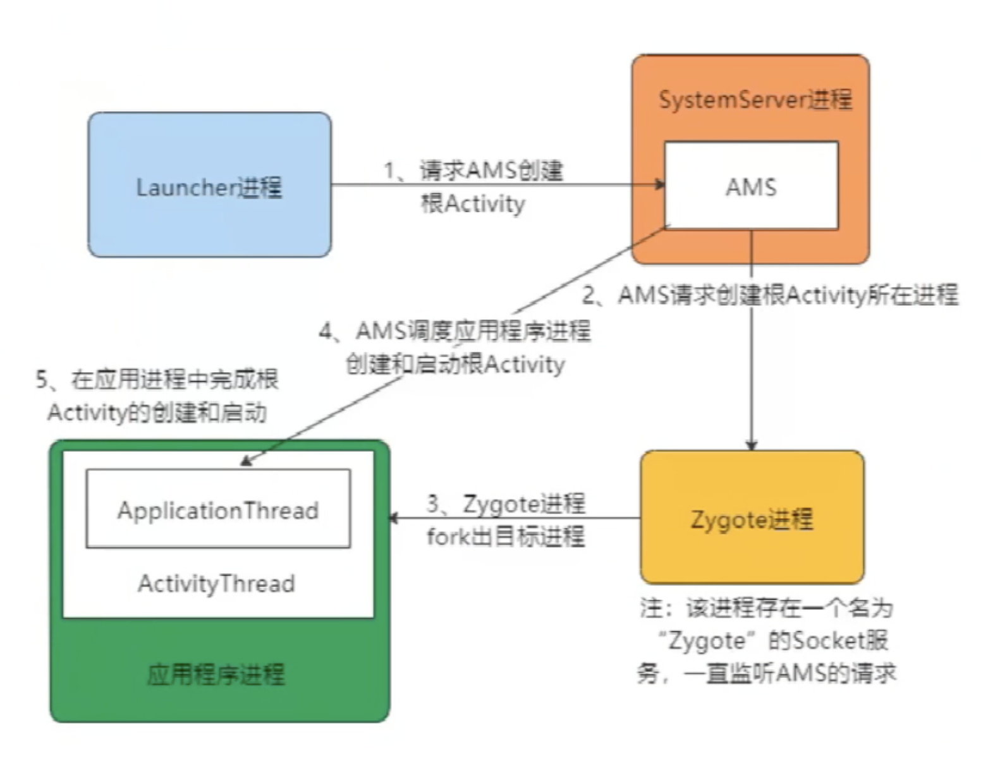

#### 系统启动

​	

#### AMS

AMS属于SystemServer进程,主要是为了加载Activity 管理Activity生命周期 .

Launcher请求AMS创建根Activity所在进程（如果之前没有该进程），AMS请求Zygote进程fork应用进程。

android启动流程

https://www.bilibili.com/video/BV1DQ4y197oX?from=search&seid=14802265503756746151

https://www.bilibili.com/video/BV1Pi4y1A7Sr?from=search&seid=17031756056912732811

一般 https://www.bilibili.com/video/BV1K541177GU?p=3 

#### 应用启动流程

##### Launcher请求AMS阶段

