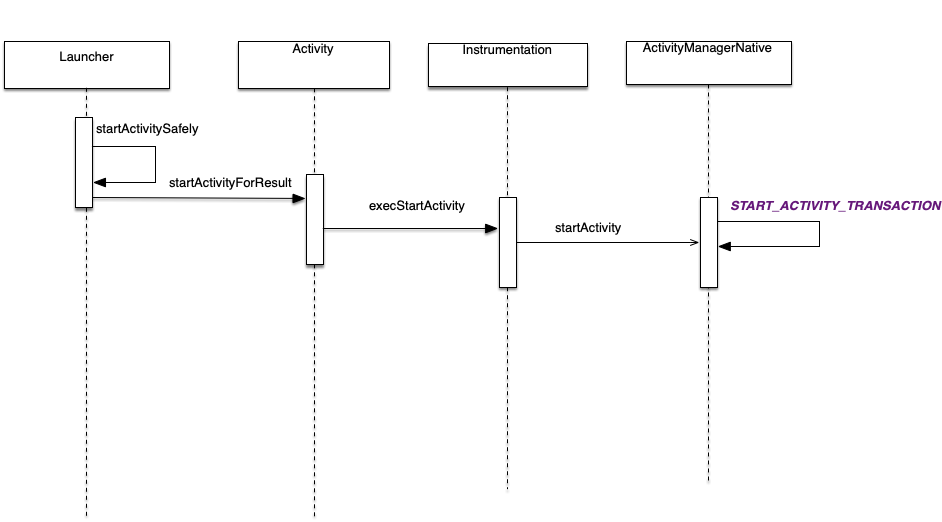
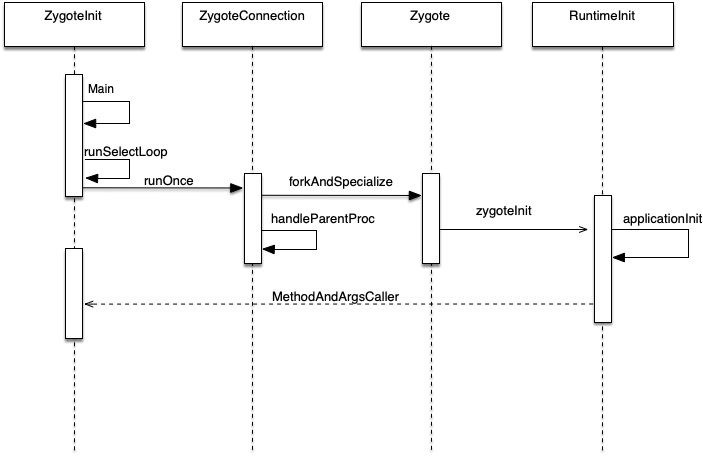

　Activity创建

​	生命周期方法调用


本篇文章将根据源码解剖Android的Activity的启动流程，需注意的是下列的分析均基于Android7.0, 7.0版本相较于之前几个版本做了许多改动和重构，但是整体的流程是变化不大。根据启动Activity时机的不同，可分为根Activity的启动流程和普通Activity启动流程，根Activity启动流程又可以称为应用程序启动流程，即在桌面上点击一个应用图标到进入到应用第一个Activity的流程。而普通Activity的启动流程就是在一个应用里开启另外一个Activity的流程。由于两种启动流程是有重叠的，而根Activity的启动流程更加复杂，所以接下来我们重点分析根Activity的启动流程，而普通Activity的启动流程在涉及的地方会稍微提一下。由于考虑到篇幅较长，这里将分为两篇来介绍。

这篇将分析启动流程中的应用进程的创建：

- Launcher进程请求AMS
- AMS发送创建应用进程请求
- Zygote进程接受请求并孵化应用进程
- 应用进程启动ActivityThread


MainActivity组件是由Launcher 组件来启动的，而Launcher组件又是通过Activity管理服务ActivityManagerServ ice来启动Main Activity组件的’。MainActivity组件、Launcher组件和 ActivityManagerService是分别运行在不同的进程中的，因此，MainActivity组件的启动过程就涉及到了三个进程。这三个进程是通过Binder进程间通信机制来完成MainActivity组件的启动过程的。 Launcher组件启动MainActivity组件的过程如下所示。

 (1)Launcher组件向ActivityManagerService发送一个启动MainActivity组件的进程间通信请求。

 ( 2 ) ActivityManagerService首先将要启动的MainActivity组件的信息保存下来，然后再向Launcher 组件发送一个进入中止状态的进程间通信请求。

 ( 3 ) Launcher组件进入到中止状态之后，就会向ActivityManagerService发送一个已进人中止状态 的进程间通信请求，以便ActivityManagerServ ice可以继续执行启动MainActivity组件的操作。

 (4) ActivityManagerService发现用来运行MairiActivity组件的应用程序进程不存在，因此，它就会 先启动一个新的应用程序进程。

 (5）新的应用程序进程启动完成之后，就会向ActivityManagerServi(e发送一个启动完成的进程间 通信请求，以便ActivityManagerService可以继续执行启动MainActivity组件的操作。

 (6) ActivityManagerService将第2步保存下来的MainActivity组件的信息发送给第4步创建的应用程序进程，以便它可以将MainActivity组件启动起来。 


# 一、Launcher进程请求AMS

上面我们提到根Activity的启动流程其实就是桌面上点击一个应用图标进入到应用的第一个Activity的流程，其实桌面也可以看成一个程序，即Launcher。当系统开机后，Launcher也随之被启动，然后将已经安装的应用程序图标显示到桌面上，所以当我们点击一个应用图标其实就是相当于点击Activity中的一个button,其相应事件就是Launcher进程请求AMS来启动该应用程序。

## 1. 时序图





## 2. 详细过程

请求的入口就是Launcher的startActivitySafe方法，如下：

> packages/apps/Launcher3/src/com/android/launcher3/Launcher.java

```
    public boolean startActivitySafely(View v, Intent intent, ItemInfo item) {
        ...
        // 根Activity会在新的任务栈中启动
        intent.addFlags(Intent.FLAG_ACTIVITY_NEW_TASK);
        
        try {
            ...
            if (isShortcut) {
                // Shortcuts need some special checks due to legacy reasons.
                startShortcutIntentSafely(intent, optsBundle, item);
            } else if (user == null || user.equals(Process.myUserHandle())) {
                // 调用startActivity
                startActivity(intent, optsBundle);
            } else {
                LauncherAppsCompat.getInstance(this).startActivityForProfile(
                        intent.getComponent(), user, intent.getSourceBounds(), optsBundle);
            }
            ...
            return true;
        } catch (ActivityNotFoundException|SecurityException e) {
            ...
        }
        return false;
    }

```

可以发现该方法为根Activity设置了flag，即根Activity会在新的任务栈中启动。然后会调用我们熟悉的startActivity方法,而在Launcher并没有这个方法，所以我们自然想到了应该是父类的方法，然后让我们来看看Launcher继承了哪些类？

```
public class Launcher extends BaseDraggingActivity implements LauncherExterns,
        LauncherModel.Callbacks, LauncherProviderChangeListener, UserEventDelegate{
            
        }
public abstract class BaseDraggingActivity extends BaseActivity
        implements WallpaperColorInfo.OnChangeListener {
        
        }
public abstract class BaseActivity extends Activity implements UserEventDelegate{
}

```

其实一直追踪下去，你就会发现其实Launcher调用的startActivity其实就是Activity中的startActivity。从这里也可以证明Launcher其实也是个Activity。所以在Launcher启动一个app，和我们平时在startActivity基本是一样的（基本一样，不代表完全一样，通过后文分析你就会明白！），于是我们来看看我们熟悉的Activity中的startActivity的源码是如何的：

> 源码：frameworks/base/core/java/android/app/Activity.java

```
    @Override
    public void startActivity(Intent intent, @Nullable Bundle options) {
        //第二个参数为-1表示Launcher不需要知道根Activity的启动结果
        if (options != null) {
            startActivityForResult(intent, -1, options);
        } else {
            // Note we want to go through this call for compatibility with
            // applications that may have overridden the method.
            startActivityForResult(intent, -1);
        }
    }
    public void startActivityForResult(@RequiresPermission Intent intent, int requestCode) {
        startActivityForResult(intent, requestCode, null);
    }


    public void startActivityForResult(@RequiresPermission Intent intent, int requestCode,
            @Nullable Bundle options) {
        //mParent表示当前Activity的父类，当根活动还没创建则mParent==null    
        if (mParent == null) {
            options = transferSpringboardActivityOptions(options);
            Instrumentation.ActivityResult ar =
                mInstrumentation.execStartActivity(
                    this, mMainThread.getApplicationThread(), mToken, this,
                    intent, requestCode, options);
           ... 
        } 
        ...
    }

```

从上面代码可以发现startActivity的最终实现是startActivityForResult，startActivity()第二个参数为-1表示Launcher不需要知道根Activity的启动结果,然后在startActivityForResult中由于此时根Activity还没有创建，故mParent=null,所以我们只需要关注mParent=null的情况。在这种情况中会调用Instrumentation的execStartActivity。这时候也许你就会问这个Instrumentation是什么？为什么要交给它处理？其实Instrumentation这个类很重要，重要体现在对Activity生命周期的调用。每个Activity都持有Instrumentation对象的一个引用，但是整个进程只会存在一个Instrumentation对象。看看Instrumentation的execStartActivity这个方法。

> frameworks/base/core/java/android/app/Instrumentation.java

```
    public ActivityResult execStartActivity(
            Context who, IBinder contextThread, IBinder token, Activity target,
            Intent intent, int requestCode, Bundle options) {
        ...
        try {
		   ...
		    //获取AMS的代理对象
            int result = ActivityManager.getService()
                .startActivity(whoThread, who.getBasePackageName(), intent,
                        intent.resolveTypeIfNeeded(who.getContentResolver()),
                        token, target != null ? target.mEmbeddedID : null,
                        requestCode, 0, null, options);
            checkStartActivityResult(result, intent);
        } catch (RemoteException e) {
            throw new RuntimeException("Failure from system", e);
        }
        return null;
    }

```

在这个方法会调用ActivityManager的getService方法来得到AMS的代理对象，然后调用这个代理对象的

startActivity方法，那么这个代理对象是谁呢？让我们一探究竟

```
    @UnsupportedAppUsage
    public static IActivityManager getService() {
        return IActivityManagerSingleton.get();
    }

    @UnsupportedAppUsage
    private static final Singleton<IActivityManager> IActivityManagerSingleton =
            new Singleton<IActivityManager>() {
                @Override
                protected IActivityManager create() {
                    //得到activity的service引用，即IBinder类型的AMS引用
                    final IBinder b = ServiceManager.getService(Context.ACTIVITY_SERVICE);
					//转换成IActivityManager对象
                    final IActivityManager am = IActivityManager.Stub.asInterface(b);
                    return am;
                }
            };

```

可以发现在Singleton中的create方法中由于b是AMS引用作为服务端处于SystemServer进程中，与当前Launcher进程作为客户端与服务端不在同一个进程，所以am返回的是IActivityManager.Stub的代理对象，此时如果要实现客户端与服务端进程间的通信，只需要在AMS继承了IActivityManager.Stub类并实现了相应的方法，而通过下面的代码可以发现AMS刚好是继承了IActivityManager.Stub类的，这样Launcher进程作为客户端就拥有了服务端AMS的代理对象，然后就可以调用AMS的方法来实现具体功能了，就这样Launcher的工作就交给AMS实现了。

```
public class ActivityManagerService extends IActivityManager.Stub
        implements Watchdog.Monitor, BatteryStatsImpl.BatteryCallback {
        
        }
复制代码
```

# 二、AMS发送创建应用进程请求

通过上面的分析，我们已经知道现在任务已经交给了AMS，入口是AMS的startActivity。

## 1. 时序图


## 2. 详细过程

### 2.1 AMS将请求任务转移给Process

首先来看看在AMS中的startActivity方法：

> 源码：frameworks/base/services/core/java/com/android/server/am/ActivityManagerService.java

```
    @Override
    public final int startActivity(IApplicationThread caller, String callingPackage,
            Intent intent, String resolvedType, IBinder resultTo, String resultWho, int requestCode,
            int startFlags, ProfilerInfo profilerInfo, Bundle bOptions) {
        return startActivityAsUser(caller, callingPackage, intent, resolvedType, resultTo,
                resultWho, requestCode, startFlags, profilerInfo, bOptions,
                UserHandle.getCallingUserId());
    }

    @Override
    public final int startActivityAsUser(IApplicationThread caller, String callingPackage,
            Intent intent, String resolvedType, IBinder resultTo, String resultWho, int requestCode,
            int startFlags, ProfilerInfo profilerInfo, Bundle bOptions, int userId) {
        return startActivityAsUser(caller, callingPackage, intent, resolvedType, resultTo,
                resultWho, requestCode, startFlags, profilerInfo, bOptions, userId,
                true /*validateIncomingUser*/);
    }

    public final int startActivityAsUser(IApplicationThread caller, String callingPackage,
            Intent intent, String resolvedType, IBinder resultTo, String resultWho, int requestCode,
            int startFlags, ProfilerInfo profilerInfo, Bundle bOptions, int userId,
            boolean validateIncomingUser) {

			
        //判断调用者的进程是否隔离
        enforceNotIsolatedCaller("startActivity");
        //检查调用者权限
        userId = mActivityStartController.checkTargetUser(userId, validateIncomingUser,
                Binder.getCallingPid(), Binder.getCallingUid(), "startActivityAsUser");

        // TODO: Switch to user app stacks here.
        return mActivityStartController.obtainStarter(intent, "startActivityAsUser")
                .setCaller(caller)
                .setCallingPackage(callingPackage)
                .setResolvedType(resolvedType)
                .setResultTo(resultTo)
                .setResultWho(resultWho)
                .setRequestCode(requestCode)
                .setStartFlags(startFlags)
                .setProfilerInfo(profilerInfo)
                .setActivityOptions(bOptions)
                .setMayWait(userId)
                .execute();

    }

```

startActivity方法经过多个方法调用会去执行startActivityAsUser方法，在startActivityAsUser方法最后会返回mActivityStartController的一长串链式调用方法，如果AlertDialog的话，应该不难看出这链式方法肯定都是返回一个类型的对象的，我们只需要看看obtainStarter的返回类型就可以知道这个对象是什么类型了。

> frameworks/base/services/core/java/com/android/server/am/ActivityStartController.java

```
    ActivityStarter obtainStarter(Intent intent, String reason) {
        return mFactory.obtain().setIntent(intent).setReason(reason);
    }

```

可以发现这个obtainStarter返回的是ActivityStarter类型的，所以链式方法就是对ActivityStarter对象设置了要启动的活动的相关信息，最后再调用ActivityStarter对象execute方法。所以我们下一步所需要看的就是这个execute方法。

> frameworks/base/services/core/java/com/android/server/am/ActivityStarter.java

```
    int execute() {
        try {
            // TODO(b/64750076): Look into passing request directly to these methods to allow
            // for transactional diffs and preprocessing.
            if (mRequest.mayWait) {
                return startActivityMayWait(mRequest.caller, mRequest.callingUid,
                        mRequest.callingPackage, mRequest.intent, mRequest.resolvedType,
                        mRequest.voiceSession, mRequest.voiceInteractor, mRequest.resultTo,
                        mRequest.resultWho, mRequest.requestCode, mRequest.startFlags,
                        mRequest.profilerInfo, mRequest.waitResult, mRequest.globalConfig,
                        mRequest.activityOptions, mRequest.ignoreTargetSecurity, mRequest.userId,
                        mRequest.inTask, mRequest.reason,
                        mRequest.allowPendingRemoteAnimationRegistryLookup,
                        mRequest.originatingPendingIntent);
            } else {
                return startActivity(mRequest.caller, mRequest.intent, mRequest.ephemeralIntent,
                        mRequest.resolvedType, mRequest.activityInfo, mRequest.resolveInfo,
                        mRequest.voiceSession, mRequest.voiceInteractor, mRequest.resultTo,
                        mRequest.resultWho, mRequest.requestCode, mRequest.callingPid,
                        mRequest.callingUid, mRequest.callingPackage, mRequest.realCallingPid,
                        mRequest.realCallingUid, mRequest.startFlags, mRequest.activityOptions,
                        mRequest.ignoreTargetSecurity, mRequest.componentSpecified,
                        mRequest.outActivity, mRequest.inTask, mRequest.reason,
                        mRequest.allowPendingRemoteAnimationRegistryLookup,
                        mRequest.originatingPendingIntent);
            }
        } finally {
            onExecutionComplete();
        }
    }

```

因为在startActivityAsUser的链式方法中我们调用了setMayWait这个方法，所以这里的mRequest.mayWait为true，故会继续调用startActivityMayWait方法。

> ActivityStarter#startActivityMayWait

```
    private int startActivityMayWait(IApplicationThread caller, int callingUid,
            String callingPackage, Intent intent, String resolvedType,
            IVoiceInteractionSession voiceSession, IVoiceInteractor voiceInteractor,
            IBinder resultTo, String resultWho, int requestCode, int startFlags,
            ProfilerInfo profilerInfo, WaitResult outResult,
            Configuration globalConfig, SafeActivityOptions options, boolean ignoreTargetSecurity,
            int userId, TaskRecord inTask, String reason,
            boolean allowPendingRemoteAnimationRegistryLookup,
            PendingIntentRecord originatingPendingIntent) {
        .....
        //根据intent在系统中找到合适的应用的activity，如果有多个activity可选择，
		//则会弹出ResolverActivity让用户选择合适的应用。
        ActivityInfo aInfo = mSupervisor.resolveActivity(intent, rInfo, startFlags, profilerInfo);


        int res = startActivity(caller, intent, ephemeralIntent, resolvedType, aInfo, rInfo,
                    voiceSession, voiceInteractor, resultTo, resultWho, requestCode, callingPid,
                    callingUid, callingPackage, realCallingPid, realCallingUid, startFlags, options,
                    ignoreTargetSecurity, componentSpecified, outRecord, inTask, reason,
                    allowPendingRemoteAnimationRegistryLookup, originatingPendingIntent);
        ....

    }

    private int startActivity(IApplicationThread caller, Intent intent, Intent ephemeralIntent,
            String resolvedType, ActivityInfo aInfo, ResolveInfo rInfo,
            IVoiceInteractionSession voiceSession, IVoiceInteractor voiceInteractor,
            IBinder resultTo, String resultWho, int requestCode, int callingPid, int callingUid,
            String callingPackage, int realCallingPid, int realCallingUid, int startFlags,
            SafeActivityOptions options, boolean ignoreTargetSecurity, boolean componentSpecified,
            ActivityRecord[] outActivity, TaskRecord inTask, String reason,
            boolean allowPendingRemoteAnimationRegistryLookup) {
        ...
        mLastStartActivityResult = startActivity(caller, intent, ephemeralIntent, resolvedType,
                aInfo, rInfo, voiceSession, voiceInteractor, resultTo, resultWho, requestCode,
                callingPid, callingUid, callingPackage, realCallingPid, realCallingUid, startFlags,
                options, ignoreTargetSecurity, componentSpecified, mLastStartActivityRecord,
                inTask, allowPendingRemoteAnimationRegistryLookup);
        ...
        return getExternalResult(mLastStartActivityResult);
    }

    private int startActivity(IApplicationThread caller, Intent intent, Intent ephemeralIntent,
            String resolvedType, ActivityInfo aInfo, ResolveInfo rInfo,
            IVoiceInteractionSession voiceSession, IVoiceInteractor voiceInteractor,
            IBinder resultTo, String resultWho, int requestCode, int callingPid, int callingUid,
            String callingPackage, int realCallingPid, int realCallingUid, int startFlags,
            SafeActivityOptions options,
            boolean ignoreTargetSecurity, boolean componentSpecified, ActivityRecord[] outActivity,
            TaskRecord inTask, boolean allowPendingRemoteAnimationRegistryLookup) {
        ...
        return startActivity(r, sourceRecord, voiceSession, voiceInteractor, startFlags,
                true /* doResume */, checkedOptions, inTask, outActivity);
    }

    private int startActivity(final ActivityRecord r, ActivityRecord sourceRecord,
                IVoiceInteractionSession voiceSession, IVoiceInteractor voiceInteractor,
                int startFlags, boolean doResume, ActivityOptions options, TaskRecord inTask,
                ActivityRecord[] outActivity) {
        ...
            result = startActivityUnchecked(r, sourceRecord, voiceSession, voiceInteractor,
                    startFlags, doResume, options, inTask, outActivity);
        ...

        postStartActivityProcessing(r, result, mTargetStack);

        return result;
    }

```

startActivityMayWait方法经过调用多次的startActivity方法后会调用到startActivityUnchecked这个方法，那这个方法是干啥的呢？这个方法会根据启动标志位和Activity启动模式来决定如何启动一个Activity以及是否要调用deliverNewIntent方法通知Activity有一个Intent试图重新启动它。比如我们在一开始将活动设置了FLAG_ACTIVITY_NEW_TASK后将创建一个任务栈，其它的就自行看代码。

```
  private int startActivityUnchecked(final ActivityRecord r, ActivityRecord sourceRecord,
            IVoiceInteractionSession voiceSession, IVoiceInteractor voiceInteractor,
            int startFlags, boolean doResume, ActivityOptions options, TaskRecord inTask,
            ActivityRecord[] outActivity) {
...
 if (mStartActivity.resultTo == null && mInTask == null && !mAddingToTask
                && (mLaunchFlags & FLAG_ACTIVITY_NEW_TASK) != 0) {
            newTask = true;
            //创建新的TaskRecord
            result = setTaskFromReuseOrCreateNewTask(
                    taskToAffiliate, preferredLaunchStackId, topStack);
        } else if (mSourceRecord != null) {
            result = setTaskFromSourceRecord();
        } else if (mInTask != null) {
            result = setTaskFromInTask();
        } else {
            setTaskToCurrentTopOrCreateNewTask();
        }
       ...
 if (mDoResume) {
            final ActivityRecord topTaskActivity =
                    mStartActivity.getTask().topRunningActivityLocked();
            if (!mTargetStack.isFocusable()
                    || (topTaskActivity != null && topTaskActivity.mTaskOverlay
                    && mStartActivity != topTaskActivity)) {
               ...
            } else {
                if (mTargetStack.isFocusable() && !mSupervisor.isFocusedStack(mTargetStack)) {
                    mTargetStack.moveToFront("startActivityUnchecked");
                }
                mSupervisor.resumeFocusedStackTopActivityLocked(mTargetStack, mStartActivity,
                        mOptions);
            }
        } else {
            mTargetStack.addRecentActivityLocked(mStartActivity);
        }
        ...

}

```

然后无论以何种模式启动最终都会调用ActivityStackSupervisor.resumeFocusedStackTopActivityLocked方法。

> frameworks/base/services/core/java/com/android/server/am/ActivityStackSupervisor.java

```
    boolean resumeFocusedStackTopActivityLocked(
            ActivityStack targetStack, ActivityRecord target, ActivityOptions targetOptions) {
        ....
        if (targetStack != null && isFocusedStack(targetStack)) {
            return targetStack.resumeTopActivityUncheckedLocked(target, targetOptions);
        }
        ....
    }

```

于是又调用了ActivityStack的resumeTopActivityUncheckedLocked

> frameworks/base/services/core/java/com/android/server/am/ActivityStack.java

```
    @GuardedBy("mService")
    boolean resumeTopActivityUncheckedLocked(ActivityRecord prev, ActivityOptions options) {
       ...
        try {
            // Protect against recursion.
            mStackSupervisor.inResumeTopActivity = true;
            result = resumeTopActivityInnerLocked(prev, options);
        }
       ...

    }

private boolean resumeTopActivityInnerLocked(ActivityRecord prev, ActivityOptions options) {
      ...
           mStackSupervisor.startSpecificActivityLocked(next, true, true);
       }
        if (DEBUG_STACK) mStackSupervisor.validateTopActivitiesLocked();
       return true;
}

```

emmmm.....，看到这估计都懵逼了，几个类跳来跳去也不知道干了些什么，不慌，让我们坚持看下ActivityStackSupervisor.startSpecificActivityLocked,因为这个方法很重要。这个方法将是普通Activity和根Activity启动流程的分岔路口。

> ActivityStackSupervisor#startSpecificActivityLocked

```
    void startSpecificActivityLocked(ActivityRecord r,
            boolean andResume, boolean checkConfig) {
        //获取即将要启动的Activity的所在的应用程序进程
        ProcessRecord app = mService.getProcessRecordLocked(r.processName,
                r.info.applicationInfo.uid, true);
        //如果应用进程已经存在
        if (app != null && app.thread != null) {
            try {
                if ((r.info.flags&ActivityInfo.FLAG_MULTIPROCESS) == 0
                        || !"android".equals(r.info.packageName)) {
                    // Don't add this if it is a platform component that is marked
                    // to run in multiple processes, because this is actually
                    // part of the framework so doesn't make sense to track as a
                    // separate apk in the process.
                    app.addPackage(r.info.packageName, r.info.applicationInfo.longVersionCode,
                            mService.mProcessStats);
                }
                realStartActivityLocked(r, app, andResume, checkConfig);
                return;
            } catch (RemoteException e) {
                Slog.w(TAG, "Exception when starting activity "
                        + r.intent.getComponent().flattenToShortString(), e);
            }

            // If a dead object exception was thrown -- fall through to
            // restart the application.
        }
		//应用进程还未创建，则通过AMS调用startProcessLocked向Zygote进程发送请求
        mService.startProcessLocked(r.processName, r.info.applicationInfo, true, 0,
                "activity", r.intent.getComponent(), false, false, true);
    }

```

阅读上面的代码我们可以知道在方法中首先获取到了即将要启动的Activity所在的应用进程，假如是普通的Activity的启动流程的活，这个进程肯定是存在的，所以将执行realStartActivityLocked的方法。但是我们现在讨论的是根Activity的启动流程，由于应用都还未启动，意味着根Activity所在的应用进程还未创建，而mService其实就是AMS，所以这里将调用AMS的startProcessLocked。于是我们又回到了最初的起点AMS。

> ActivityManagerService.java

```
    final ProcessRecord startProcessLocked(String processName,
            ApplicationInfo info, boolean knownToBeDead, int intentFlags,
            String hostingType, ComponentName hostingName, boolean allowWhileBooting,
            boolean isolated, boolean keepIfLarge) {
        return startProcessLocked(processName, info, knownToBeDead, intentFlags, hostingType,
                hostingName, allowWhileBooting, isolated, 0 /* isolatedUid */, keepIfLarge,
                null /* ABI override */, null /* entryPoint */, null /* entryPointArgs */,
                null /* crashHandler */);
    }

    final ProcessRecord startProcessLocked(String processName, ApplicationInfo info,
            boolean knownToBeDead, int intentFlags, String hostingType, ComponentName hostingName,
            boolean allowWhileBooting, boolean isolated, int isolatedUid, boolean keepIfLarge,
            String abiOverride, String entryPoint, String[] entryPointArgs, Runnable crashHandler) {
        ...
        final boolean success = startProcessLocked(app, hostingType, hostingNameStr, abiOverride);
        ...
    }

    @GuardedBy("this")
    private final boolean startProcessLocked(ProcessRecord app,
            String hostingType, String hostingNameStr, String abiOverride) {
        return startProcessLocked(app, hostingType, hostingNameStr,
                false /* disableHiddenApiChecks */, abiOverride);
    }

    private final boolean startProcessLocked(ProcessRecord app, String hostingType,
            String hostingNameStr, boolean disableHiddenApiChecks, String abiOverride) {
       ...

            int uid = app.uid; //创建应用进程的用户ID
            int[] gids = null;
            int mountExternal = Zygote.MOUNT_EXTERNAL_NONE;
            if (!app.isolated) {
                int[] permGids = null;
                try {
                    checkTime(startTime, "startProcess: getting gids from package manager");
                    final IPackageManager pm = AppGlobals.getPackageManager();
                    permGids = pm.getPackageGids(app.info.packageName,
                            MATCH_DEBUG_TRIAGED_MISSING, app.userId);
                    StorageManagerInternal storageManagerInternal = LocalServices.getService(
                            StorageManagerInternal.class);
                    mountExternal = storageManagerInternal.getExternalStorageMountMode(uid,
                            app.info.packageName);
                } catch (RemoteException e) {
                    throw e.rethrowAsRuntimeException();
                }

                /*
                 * 对用户组进行创建和赋值
                 */
                if (ArrayUtils.isEmpty(permGids)) {
                    gids = new int[3];
                } else {
                    gids = new int[permGids.length + 3];
                    System.arraycopy(permGids, 0, gids, 3, permGids.length);
                }
                gids[0] = UserHandle.getSharedAppGid(UserHandle.getAppId(uid));
                gids[1] = UserHandle.getCacheAppGid(UserHandle.getAppId(uid));
                gids[2] = UserHandle.getUserGid(UserHandle.getUserId(uid));

                // Replace any invalid GIDs
                if (gids[0] == UserHandle.ERR_GID) gids[0] = gids[2];
                if (gids[1] == UserHandle.ERR_GID) gids[1] = gids[2];
            }
            ...
            //这个参数后文会提到
            final String entryPoint = "android.app.ActivityThread";    

            return startProcessLocked(hostingType, hostingNameStr, entryPoint, app, uid, gids,
                    runtimeFlags, mountExternal, seInfo, requiredAbi, instructionSet, invokeWith,
                    startTime);        
    }
    private boolean startProcessLocked(String hostingType, String hostingNameStr, String entryPoint,
            ProcessRecord app, int uid, int[] gids, int runtimeFlags, int mountExternal,
            String seInfo, String requiredAbi, String instructionSet, String invokeWith,
            long startTime) {
        ....
					//重点关注
                    final ProcessStartResult startResult = startProcess(app.hostingType, entryPoint,
                            app, app.startUid, gids, runtimeFlags, mountExternal, app.seInfo,
                            requiredAbi, instructionSet, invokeWith, app.startTime);
              
        ...
    }

    private ProcessStartResult startProcess(String hostingType, String entryPoint,
            ProcessRecord app, int uid, int[] gids, int runtimeFlags, int mountExternal,
            String seInfo, String requiredAbi, String instructionSet, String invokeWith,
            long startTime) {
            ....
            if (hostingType.equals("webview_service")) {
                startResult = startWebView(entryPoint,
                        app.processName, uid, uid, gids, runtimeFlags, mountExternal,
                        app.info.targetSdkVersion, seInfo, requiredAbi, instructionSet,
                        app.info.dataDir, null,
                        new String[] {PROC_START_SEQ_IDENT + app.startSeq});

            } else {

			
				//通过Process.start方法来为应用创建进程
                startResult = Process.start(entryPoint,
                        app.processName, uid, uid, gids, runtimeFlags, mountExternal,
                        app.info.targetSdkVersion, seInfo, requiredAbi, instructionSet,
                        app.info.dataDir, invokeWith,
                        new String[] {PROC_START_SEQ_IDENT + app.startSeq});
            }
            checkTime(startTime, "startProcess: returned from zygote!");
            return startResult;
        } finally {
            Trace.traceEnd(Trace.TRACE_TAG_ACTIVITY_MANAGER);
        }
    }


```

通过调用多个startProcessLocked方法后最终将调用startProcess方法，不过需要重点看一下上面的第四个startProcessLocked，在该方法中有个entryPoint参数为 "android.app.ActivityThread"，这个参数将在后文讲到创建应用进程后启动ActivityThread会用到。然后在startProcess方法里将调用Process.start来发送应用创建进程的请求。这样AMS就将发送请求的事交给了Process

### 2.2 Process向Zygote进程发送创建应用进程请求

> frameworks/base/core/java/android/os/Process.java

```
    public static final ProcessStartResult start(final String processClass,
                                  final String niceName,
                                  int uid, int gid, int[] gids,
                                  int runtimeFlags, int mountExternal,
                                  int targetSdkVersion,
                                  String seInfo,
                                  String abi,
                                  String instructionSet,
                                  String appDataDir,
                                  String invokeWith,
                                  String[] zygoteArgs) {
        return ZYGOTE_PROCESS.start(processClass, niceName, uid, gid, gids,
                    runtimeFlags, mountExternal, targetSdkVersion, seInfo,
                    abi, instructionSet, appDataDir, invokeWith,
                    /*useBlastulaPool=*/ true, zygoteArgs);
    }


    public final Process.ProcessStartResult start(final String processClass,
                                                  final String niceName,
                                                  int uid, int gid, int[] gids,
                                                  int runtimeFlags, int mountExternal,
                                                  int targetSdkVersion,
                                                  String seInfo,
                                                  String abi,
                                                  String instructionSet,
                                                  String appDataDir,
                                                  String invokeWith,
                                                  boolean useBlastulaPool,
                                                  String[] zygoteArgs) {
        try {

		    //重点关注
            return startViaZygote(processClass, niceName, uid, gid, gids,
                    runtimeFlags, mountExternal, targetSdkVersion, seInfo,
                    abi, instructionSet, appDataDir, invokeWith,
                    /*startChildZygote=*/false,
                    useBlastulaPool, zygoteArgs);
        } catch (ZygoteStartFailedEx ex) {
            Log.e(LOG_TAG,
                    "Starting VM process through Zygote failed");
            throw new RuntimeException(
                    "Starting VM process through Zygote failed", ex);
        }
    }

```

从上面可以发现，Process中的start方法的实现是startViaZygote方法，所以我们重点观察下这个方法。

```
    private Process.ProcessStartResult startViaZygote(final String processClass,
                                                      final String niceName,
                                                      final int uid, final int gid,
                                                      final int[] gids,
                                                      int runtimeFlags, int mountExternal,
                                                      int targetSdkVersion,
                                                      String seInfo,
                                                      String abi,
                                                      String instructionSet,
                                                      String appDataDir,
                                                      String invokeWith,
                                                      boolean startChildZygote,
                                                      boolean useBlastulaPool,
                                                      String[] extraArgs)
                                                      throws ZygoteStartFailedEx {
        ArrayList<String> argsForZygote = new ArrayList<String>();

        // --runtime-args, --setuid=, --setgid=,
        //创建字符串列表argsForZygote，并将启动应用进程的启动参数保存在这个列表中
        argsForZygote.add("--runtime-args");
        argsForZygote.add("--setuid=" + uid);
        argsForZygote.add("--setgid=" + gid);
        argsForZygote.add("--runtime-flags=" + runtimeFlags);
        if (mountExternal == Zygote.MOUNT_EXTERNAL_DEFAULT) {
            argsForZygote.add("--mount-external-default");
        } else if (mountExternal == Zygote.MOUNT_EXTERNAL_READ) {
            argsForZygote.add("--mount-external-read");
        } else if (mountExternal == Zygote.MOUNT_EXTERNAL_WRITE) {
            argsForZygote.add("--mount-external-write");
        }
        argsForZygote.add("--target-sdk-version=" + targetSdkVersion);

        ...
        synchronized(mLock) {


		    //重点关注
            return zygoteSendArgsAndGetResult(openZygoteSocketIfNeeded(abi),
                                              useBlastulaPool,
                                              argsForZygote);
        }
    }

```

在startViaZygote中会创建字符串列表argsForZygote来保存将要创建的应用进程的启动参数，然后最后会调用zygoteSendArgsAndGetResult方法，而在这个方法中第一个参数会调用openZygoteSocketIfNeeded方法，第三个参数就是启动参数列表。所以我们先看看openZygoteSocketIfNeeded这个方法的实现。

```
    private ZygoteState openZygoteSocketIfNeeded(String abi)
            throws ZygoteStartFailedEx {

        Preconditions.checkState(Thread.holdsLock(mLock), "ZygoteProcess lock not held");
		//64位进程中的
        if (primaryZygoteState == null || primaryZygoteState.isClosed()) {
            try {


			    //调用ZygoteState的connect函数与mZygoteSocketAddress建立连接，
                //这里mZygoteSocketAddress的值为“zygote”
                primaryZygoteState =
                    ZygoteState.connect(mZygoteSocketAddress, mBlastulaPoolSocketAddress);
            } catch (IOException ioe) {
                throw new ZygoteStartFailedEx("Error connecting to primary zygote", ioe);
            }

            maybeSetApiBlacklistExemptions(primaryZygoteState, false);
            maybeSetHiddenApiAccessLogSampleRate(primaryZygoteState);
        }

        if (primaryZygoteState.matches(abi)) {

		    //Socket进行连接成功并匹配abi后会返回ZygoteState类型对象
            return primaryZygoteState;
        }
		

        // 32位Zygote进程中
        if (secondaryZygoteState == null || secondaryZygoteState.isClosed()) {
            try {
                secondaryZygoteState =
                    ZygoteState.connect(mZygoteSecondarySocketAddress,
                                        mBlastulaPoolSecondarySocketAddress);
            } catch (IOException ioe) {
                throw new ZygoteStartFailedEx("Error connecting to secondary zygote", ioe);
            }

            maybeSetApiBlacklistExemptions(secondaryZygoteState, false);
            maybeSetHiddenApiAccessLogSampleRate(secondaryZygoteState);
        }

        if (secondaryZygoteState.matches(abi)) {
            return secondaryZygoteState;
        }

        throw new ZygoteStartFailedEx("Unsupported zygote ABI: " + abi);
    } 

```

openZygoteSocketIfNeeded这个方法从方法名就可以推测出这个方法的作用，大概就是与Zygote建立Socket连接。而从代码中也证实了这一点，在代码中会根据Zygote进程的位数来建立相应的Socket连接，然后返回ZygoteState类型的对象。既然与Zygote建立好Socket连接后，接下来当然是发送请求！我们来看看zygoteSendArgsAndGetResult这个方法中是如何发送请求的！

```
	//将传入的应用进程的启动参数argsForZygote写入到ZygoteState
    @GuardedBy("mLock")
    private static Process.ProcessStartResult zygoteSendArgsAndGetResult(
            ZygoteState zygoteState, boolean useBlastulaPool, ArrayList<String> args)
            throws ZygoteStartFailedEx {
        String msgStr = Integer.toString(args.size()) + "\n"
                        + String.join("\n", args) + "\n";

        // Should there be a timeout on this?
        Process.ProcessStartResult result = new Process.ProcessStartResult();

        // TODO (chriswailes): Move branch body into separate function.
        if (useBlastulaPool && Zygote.BLASTULA_POOL_ENABLED && isValidBlastulaCommand(args)) {
            LocalSocket blastulaSessionSocket = null;

            try {
                blastulaSessionSocket = zygoteState.getBlastulaSessionSocket();

                final BufferedWriter blastulaWriter =
                        new BufferedWriter(
                                new OutputStreamWriter(blastulaSessionSocket.getOutputStream()),
                                Zygote.SOCKET_BUFFER_SIZE);
                final DataInputStream blastulaReader =
                        new DataInputStream(blastulaSessionSocket.getInputStream());

                blastulaWriter.write(msgStr);
                blastulaWriter.flush();

                result.pid = blastulaReader.readInt();
                // Blastulas can't be used to spawn processes that need wrappers.
                result.usingWrapper = false;

                if (result.pid < 0) {
                    throw new ZygoteStartFailedEx("Blastula specialization failed");
                }

                return result;
            } catch (IOException ex) {
                // If there was an IOException using the blastula pool we will log the error and
                // attempt to start the process through the Zygote.
                Log.e(LOG_TAG, "IO Exception while communicating with blastula pool - "
                               + ex.toString());
            } finally {
                try {
                    blastulaSessionSocket.close();
                } catch (IOException ex) {
                    Log.e(LOG_TAG, "Failed to close blastula session socket: " + ex.getMessage());
                }
            }
        }

        try {
            final BufferedWriter zygoteWriter = zygoteState.mZygoteOutputWriter;
            final DataInputStream zygoteInputStream = zygoteState.mZygoteInputStream;

            zygoteWriter.write(msgStr);
            zygoteWriter.flush();

            // Always read the entire result from the input stream to avoid leaving
            // bytes in the stream for future process starts to accidentally stumble
            // upon.
            result.pid = zygoteInputStream.readInt();
            result.usingWrapper = zygoteInputStream.readBoolean();
        } catch (IOException ex) {
            zygoteState.close();
            Log.e(LOG_TAG, "IO Exception while communicating with Zygote - "
                    + ex.toString());
            throw new ZygoteStartFailedEx(ex);
        }

        if (result.pid < 0) {
            throw new ZygoteStartFailedEx("fork() failed");
        }

        return result;
    }

```

因为在openZygoteSocketIfNeeded中我们已经与Zygote进程建立了Socket连接，所以在这个方法中将传入的应用进程的启动参数argsForZygote写入到ZygoteState。这样AMS就完成了向Zygote进程发送创建应用进程的请求的任务。

# 三、Zygote进程接受请求并孵化应用进程

从上面我们知道，AMS已经与Zygote进程建立Socket连接并发送了创建应用进程的请求，那么Zygote进程是在哪里收到请求，收到请求后又是怎么处理的呢？通过阅读后我们知道Zygote进程是在ZygoteInit的main方法中接受请求的。所以现在的入口就是ZygoteInit的main方法。

## 1. 时序图


## 2. 详细过程

从时序图与上面的分析我们知道现在Zygote进程接受请求是在main方法，就让我们来看看这个main方法

> frameworks/base/core/java/com/android/internal/os/ZygoteInit.java

```
    @UnsupportedAppUsage
    public static void main(String argv[]) {
        ZygoteServer zygoteServer = new ZygoteServer();
        Runnable caller;
        try {
            ...
			//创建名为zygote的Socket
            zygoteServer.createZygoteSocket(socketName);
            ....
			//由于在init.rc中设置了start-system-server参数,因此
			//这里将启动SystemServer,可见SystemServer由Zygote创建的第一个进程
            if (startSystemServer) {
                Runnable r = forkSystemServer(abiList, socketName, zygoteServer);
                if (r != null) {
                    r.run();
                    return;
                }
            }
           
            caller = Zygote.initBlastulaPool();
            if (caller == null) {
                Log.i(TAG, "Accepting command socket connections");
                //等待AMS的请求
                runSelectLoop(abiList);
            }
        } catch (Throwable ex) {
            Log.e(TAG, "System zygote died with exception", ex);
            throw ex;
        } finally {
            zygoteServer.closeServerSocket();
        }

        // We're in the child process and have exited the select loop. Proceed to execute the
        // command.
        if (caller != null) {
            caller.run();
        }
    }

复制代码
```

通过main方法，我们可以知道在这个main方法首先要创建一个Server端的Socket，这个name为”zygote”的Socket用来等待ActivityManagerService来请求Zygote来创建新的应用程序进程,在上面AMS请求的分析中我们也知道客户端将根据这个name来与Zygote的Socket建立连接。接下去会启动SystemServer进程，这个进程会启动各种系统服务，比如与Activity启动息息相关的AMS。最后会调用ZygoteServer.runSelectLoop(abiList)来使创建的Socket进入无限循环，等待AMS请求。让我们来看看这个runSelectLoop

> frameworks/base/core/java/com/android/internal/os/ZygoteServer.java

```
    Runnable runSelectLoop(String abiList) {
   
        ArrayList<ZygoteConnection> peers = new ArrayList<ZygoteConnection>();
        peers.add(null);
        while (true) {

            while (--pollIndex >= 0) {
                if ((pollFDs[pollIndex].revents & POLLIN) == 0) {
                    continue;
                }

                if (pollIndex == 0) {
				  //监听Socket连接，充当服务端Socket
                    ZygoteConnection newPeer = acceptCommandPeer(abiList);
                    peers.add(newPeer);
                    socketFDs.add(newPeer.getFileDescriptor());
                } else if (pollIndex < blastulaPoolEventFDIndex) { 
                    try {
						//不断处理客户端的AMS的请求，然后交给processOneCommand
                        ZygoteConnection connection = peers.get(pollIndex);
                        final Runnable command = connection.processOneCommand(this);
                    } 
                    ....
                }
            }
        }
    }
复制代码
```

可以发现这个方法是死循环表示不停的监听着Socket连接。acceptCommandPeer方法就是监听是否收到了请求，如果收到了请求就交给processOneCommand来实现

> frameworks/base/core/java/com/android/internal/os/ZygoteConnection.java

```
    Runnable processOneCommand(ZygoteServer zygoteServer) {
        String args[];
        ZygoteArguments parsedArgs = null;
        FileDescriptor[] descriptors;
        try {
		    //获取应用程序进程的启动参数
            args = Zygote.readArgumentList(mSocketReader);
            // TODO (chriswailes): Remove this and add an assert.
            descriptors = mSocket.getAncillaryFileDescriptors();
        } catch (IOException ex) {
            throw new IllegalStateException("IOException on command socket", ex);
        }
        ....
        parsedArgs = new ZygoteArguments(args);
        ....
		//fork当前进程创建一个子进程
        pid = Zygote.forkAndSpecialize(parsedArgs.mUid, parsedArgs.mGid, parsedArgs.mGids,
                parsedArgs.mRuntimeFlags, rlimits, parsedArgs.mMountExternal, parsedArgs.mSeInfo,
                parsedArgs.mNiceName, fdsToClose, fdsToIgnore, parsedArgs.mStartChildZygote,
                parsedArgs.mInstructionSet, parsedArgs.mAppDataDir, parsedArgs.mTargetSdkVersion);

        try {

		    //pid为0则代表这个进程为子进程，即新创建的应用程序进程
            if (pid == 0) {
                zygoteServer.setForkChild();
                zygoteServer.closeServerSocket();
                IoUtils.closeQuietly(serverPipeFd);
                serverPipeFd = null;

                return handleChildProc(parsedArgs, descriptors, childPipeFd,
                        parsedArgs.mStartChildZygote);
            } else {
                // In the parent. A pid < 0 indicates a failure and will be handled in
                // handleParentProc.
                IoUtils.closeQuietly(childPipeFd);
                childPipeFd = null;
                handleParentProc(pid, descriptors, serverPipeFd);
                return null;
            }
        } finally {
            IoUtils.closeQuietly(childPipeFd);
            IoUtils.closeQuietly(serverPipeFd);
        }
    }

复制代码
```

在这个方法中将对请求进行处理，首先获取到将要启动的应用进程的启动参数，然后调用forkAndSpecialize来创建应用进程。

> frameworks/base/core/java/com/android/internal/os/Zygote.java

```
    public static int forkAndSpecialize(int uid, int gid, int[] gids, int runtimeFlags,
            int[][] rlimits, int mountExternal, String seInfo, String niceName, int[] fdsToClose,
            int[] fdsToIgnore, boolean startChildZygote, String instructionSet, String appDataDir,
            int targetSdkVersion) {
        ZygoteHooks.preFork();
        // Resets nice priority for zygote process.
        resetNicePriority();
        int pid = nativeForkAndSpecialize(
                uid, gid, gids, runtimeFlags, rlimits, mountExternal, seInfo, niceName, fdsToClose,
                fdsToIgnore, startChildZygote, instructionSet, appDataDir);
        // Enable tracing as soon as possible for the child process.
        if (pid == 0) {
            Zygote.disableExecuteOnly(targetSdkVersion);
            Trace.setTracingEnabled(true, runtimeFlags);

            // Note that this event ends at the end of handleChildProc,
            Trace.traceBegin(Trace.TRACE_TAG_ACTIVITY_MANAGER, "PostFork");
        }
        ZygoteHooks.postForkCommon();
        return pid;
    }
复制代码
```

在forkAndSpecialize中，最终将创建应用进程的任务交给nativeForkAndSpecialize，而这个方法可以看出来应该是本地方法，所以具体如何创建的我们就不深究了，在这里我们这需要知道nativeForkAndSpecialize最终是通过fork当前线程来创建一个子线程，而fork后会有返回值给pid:

- 父进程中，fork返回新创建的子进程pid;
- 子进程中，fork返回0；
- 出现错误时，fork返回负数。

于是到这里子线程也就是应用进程就被孵化出来了。你以为这样就结束了？其实还早呢！别忘了我们的最终使命是根Activity的启动，而现在只是有了根Activity所需要的应用进程，革命尚未成功，仍需要努力！

# 四、应用进程启动ActivityThread

## 1. 时序图





## 2. 详细过程

从上面我们知道应用进程已经被创建，那创建后呢？这就需要我们回头看上面的processOneCommand方法，细心的你肯定会发现再孵化出应用进程后，还是有返回值的。

> frameworks/base/core/java/com/android/internal/os/ZygoteConnection.java

```
    Runnable processOneCommand(ZygoteServer zygoteServer) {
        ....
		//fork当前进程创建一个子进程
        pid = Zygote.forkAndSpecialize(parsedArgs.mUid, parsedArgs.mGid, parsedArgs.mGids,
                parsedArgs.mRuntimeFlags, rlimits, parsedArgs.mMountExternal, parsedArgs.mSeInfo,
                parsedArgs.mNiceName, fdsToClose, fdsToIgnore, parsedArgs.mStartChildZygote,
                parsedArgs.mInstructionSet, parsedArgs.mAppDataDir, parsedArgs.mTargetSdkVersion);

        try {

		    //pid为0则代表这个进程为子进程，即新创建的应用程序进程
            if (pid == 0) {
                ....
                return handleChildProc(parsedArgs, descriptors, childPipeFd,
                        parsedArgs.mStartChildZygote);
            } else {
                ...
            }
        }
        ....
    }


```

在上面我们分析了当pid=0的时候，则代表了当前进程已经是子进程了，即应用进程。所以下一步将执行handleChildProc方法。

```
    private Runnable handleChildProc(ZygoteArguments parsedArgs, FileDescriptor[] descriptors,
            FileDescriptor pipeFd, boolean isZygote) {
            .....
            if (!isZygote) {
                return ZygoteInit.zygoteInit(parsedArgs.mTargetSdkVersion,
                        parsedArgs.mRemainingArgs, null /* classLoader */);
            } else {
               ....
            }
    }

```

而handleChildProc最终又会调用ZygoteInit.zygoteInit方法。如下

> frameworks/base/core/java/com/android/internal/os/ZygoteInit.java

```
    public static final Runnable zygoteInit(int targetSdkVersion, String[] argv,
            ClassLoader classLoader) {
        if (RuntimeInit.DEBUG) {
            Slog.d(RuntimeInit.TAG, "RuntimeInit: Starting application from zygote");
        }

        Trace.traceBegin(Trace.TRACE_TAG_ACTIVITY_MANAGER, "ZygoteInit");
        RuntimeInit.redirectLogStreams();
		//为当前的VM设置未捕获异常器
        RuntimeInit.commonInit();
		//Binder驱动初始化，该方法完成后，可通过Binder进行进程通信
        ZygoteInit.nativeZygoteInit();
		//主要调用SystemServer的main方法
        return RuntimeInit.applicationInit(targetSdkVersion, argv, classLoader);
    }

```

在这个方法里会创建当前进程的Binder线程池，便于后续与其它进程通信，然后调用了RuntimeInit的applicationInit方法，如下：

> frameworks/base/core/java/com/android/internal/os/RuntimeInit.java

```
   protected static Runnable applicationInit(int targetSdkVersion, String[] argv,
            ClassLoader classLoader) {
        ...
        final Arguments args = new Arguments(argv);
        // Remaining arguments are passed to the start class's static main
        return findStaticMain(args.startClass, args.startArgs, classLoader);
    }

```

这个方法最终会调用findStaticMain方法，不过需注意的是方法的第一个参数args.startClass其实就是我们上文AMS将请求任务转移给Process中在最后强调的那个参数：android.app.ActivityThread。然后我们看看findStaticMain的实现

```
    protected static Runnable findStaticMain(String className, String[] argv,
            ClassLoader classLoader) {
        Class<?> cl;
        try {
            cl = Class.forName(className, true, classLoader);//1
        } catch (ClassNotFoundException ex) {
           ....
        }
        Method m;
        try {
            m = cl.getMethod("main", new Class[] { String[].class });//2
        } catch (NoSuchMethodException ex) {
            ...
        } catch (SecurityException ex) {
            ...
        }
        return new MethodAndArgsCaller(m, argv);
    }

```

在这个方法中首先在注释1通过反射获取到android.app.ActivityThread类，然后在注释2获取到ActivityThread的main方法，最后通过main方法来构造MethodAndArgsCaller。而这个MethodAndArgsCaller是什么呢？如下：

> frameworks/base/core/java/com/android/internal/os/RuntimeInit.java

```
static class MethodAndArgsCaller implements Runnable {
        /** method to call */
        private final Method mMethod;

        /** argument array */
        private final String[] mArgs;

        public MethodAndArgsCaller(Method method, String[] args) {
            mMethod = method;
            mArgs = args;
        }

        public void run() {
            try {
                mMethod.invoke(null, new Object[] { mArgs });
            } catch (IllegalAccessException ex) {
                throw new RuntimeException(ex);
            } catch (InvocationTargetException ex) {
                Throwable cause = ex.getCause();
                if (cause instanceof RuntimeException) {
                    throw (RuntimeException) cause;
                } else if (cause instanceof Error) {
                    throw (Error) cause;
                }
                throw new RuntimeException(ex);
            }
        }
    }

```

追踪下去，MethodAndArgsCaller其实是RuntimeInit的一个内部类并且继承了Runnable,然后在run方法中会通过反射调用了mMethod方法，此时mMethod是ActivityThread的main方法，即run方法中将会执行ActivityThread的main方法，在这里你可能会有疑问了，那这个run方法什么时候执行呢？让我们来看看最开始的ZygoteInit的main方法。

> frameworks/base/core/java/com/android/internal/os/ZygoteInit.java

```
    @UnsupportedAppUsage
    public static void main(String argv[]) {
        Runnable caller;
        try {
           ....
            caller = Zygote.initBlastulaPool();
            if (caller == null) {
                Log.i(TAG, "Accepting command socket connections");
                //等待AMS的请求
                caller = zygoteServer.runSelectLoop(abiList);
            }
        } catch (Throwable ex) {
            Log.e(TAG, "System zygote died with exception", ex);
            throw ex;
        } finally {
            zygoteServer.closeServerSocket();
        }
        if (caller != null) {
            caller.run();
        }
    }


```

从分析Zygote进程接受请求并孵化应用进程的一开始，我们就是分析runSelectLoop(abiList)这个方法，而分析到最后findStaticMain方法将返回MethodAndArgsCaller对象（继承Runnable）,所以这时候在ZygoteInit的main方法caller会等于这个MethodAndArgsCaller对象，显然caller不等于null，故最后会执行caller.run方法，即执行ActivityThread的main方法。于是应用进程成功启动ActivityThread。


https://juejin.im/post/5d9d948de51d45782c23fabc

https://juejin.im/post/5a936c5a6fb9a0633229ca74

http://codemx.cn/2018/01/26/AndroidOS008-Activity/

[Android系统启动流程（二）解析Zygote进程启动过程](http://liuwangshu.cn/framework/booting/2-zygote.html)


https://juejin.im/post/6867744083809419277

https://juejin.im/post/6887431834041483271


启动流程目的

https://juejin.cn/post/6897892195483779080