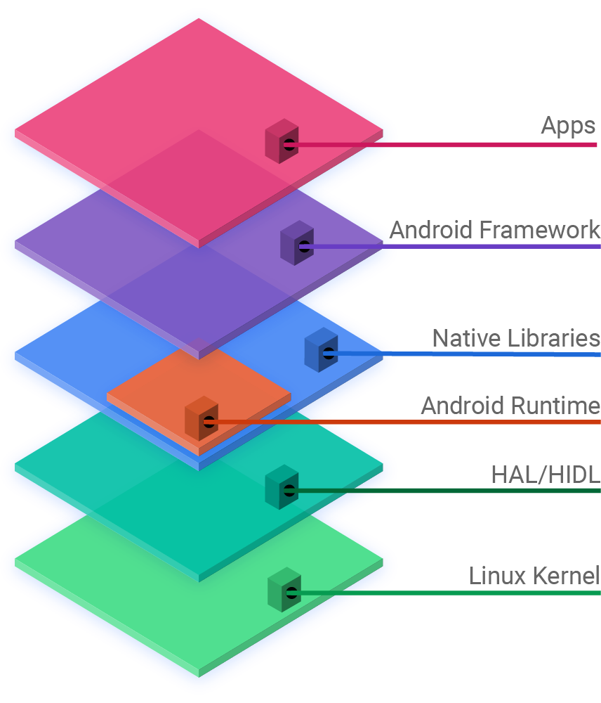
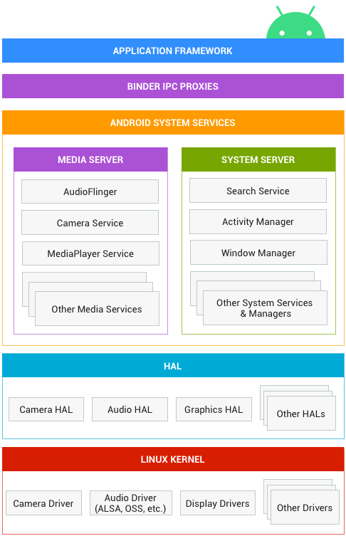

##### 源码调试

要学习Android源码需要编译一份，然后安装要求导入AndroidStudio,可以参考:
http://blog.csdn.net/huaiyiheyuan/article/details/52069122

```
public class Application extends ContextWrapper implements ComponentCallbacks2 {}
```
当我点开父类ContextWrapper后，发现引用的是jar立面的class文件，既然有源码这肯定不是我所需要的，
可以这要操作:Project Structure->Dependencies(可以看到很多jar依赖删掉)->　＋JARS And Dierctories ->添加源码要关联的frameworks 、packages...

1. 新建JDK1.8　选择openjdk8

　


2. 删除依赖

  　

  

3.　选择需要的包


4.　这一步要衡量一下，转为gradle项目后，project structure下面就没有moudles了
 
    这个设置后麻烦可以大了，后面不得不删除了android.ipr、android.iws、android.iml这三个文件重新生成

５.　跳转到源码
　　找到pacages-> apps->Settings　`public class SettingsDrawerActivity extends Activity {`

  点开Activity发现还是跳转到jar的内容
   点击Ok后再测试下

  
  终于成功了

** 哈哈　然后就可以愉快的调试源码了
**

/home/jon/noteforme.github.io/public/2017/08/10/DesignParrerns

https://cloud.tencent.com/developer/news/277549

* Activity启动过程

 对应用程序Activity进行编译和打包

      /home/jon/桌面/LaoLuo/chapter-7/src/packages/experimental/Activity
      make snod
      emulator

然后查看activity信息，在这里通过源码里面的 adb

    cd  /home/jon/AOSP/out/host/linux-x86/bin
    adb shell dumpsys activity


##### Android open source project	

##### 			

Android Architecture

         

https://source.android.com/													 https://source.android.com/devices/architecture

> 	Android源码根目录	描述
> abi	应用程序二进制接口
> art	全新的ART运行环境
> bionic	系统C库
> bootable	启动引导相关代码
> build	存放系统编译规则及generic等基础开发包配置
> cts	Android兼容性测试套件标准
> dalvik art	虚拟机
> developers	开发者目录
> development	应用程序开发相关
> device	设备相关配置
> docs	参考文档目录
> external	开源模组相关文件
> frameworks	应用程序框架，Android系统核心部分，由Java和C++编写
> hardware	主要是硬件抽象层的代码
> libcore	核心库相关文件
> libnativehelper	动态库，实现JNI库的基础
> ndk	NDK相关代码，帮助开发人员在应用程序中嵌入C/C++代码
> out	编译完成后代码输出在此目录
> packages	应用程序包
> pdk	Plug Development Kit 的缩写，本地开发套件
> platform_testing	平台测试
> prebuilts	x86和arm架构下预编译的一些资源
> sdk	sdk和模拟器
> system	底层文件系统库、应用和组件
> toolchain	工具链文件
> tools	工具文件
> Makefile	全局Makefile文件，用来定义编译规则
> ————————————————
>
> https://blog.csdn.net/wenzhi20102321/article/details/80739649
>
> https://blog.csdn.net/wen0006/article/details/5804639


