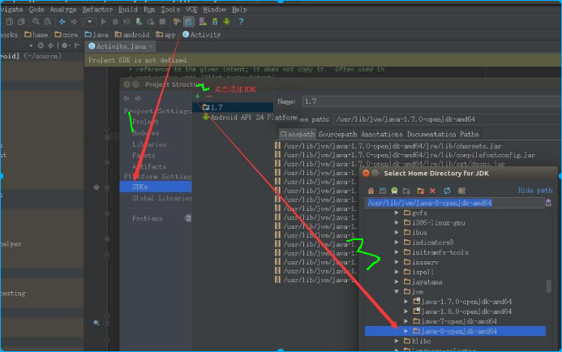
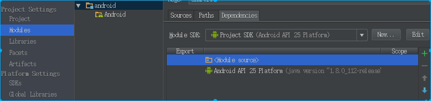
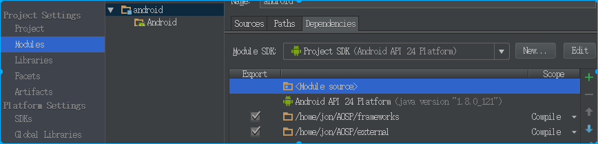
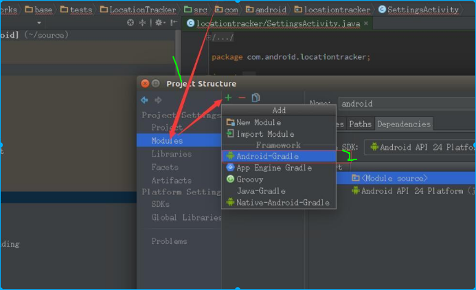
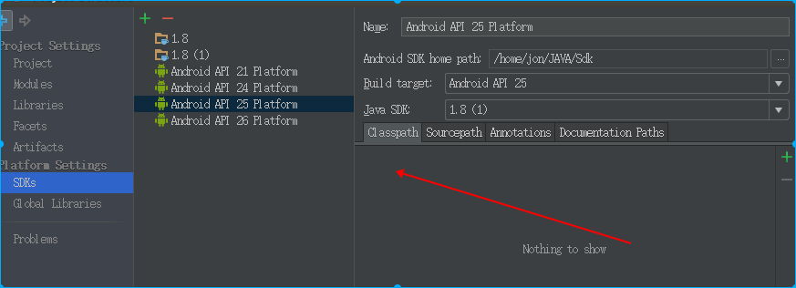
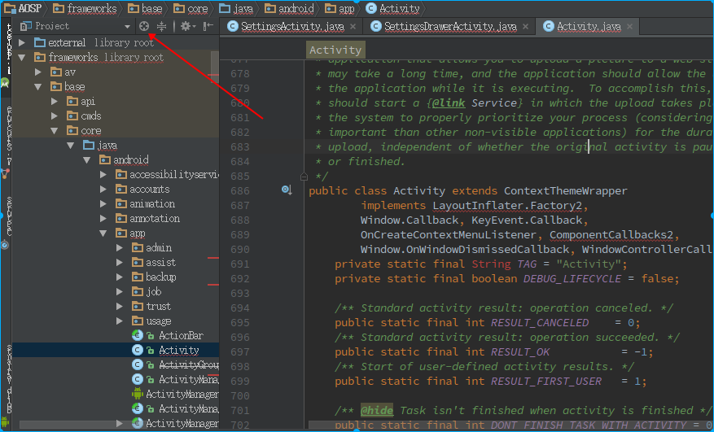

## 源码调试

要学习Android源码需要编译一份，然后安装要求导入AndroidStudio,可以参考:
http://blog.csdn.net/huaiyiheyuan/article/details/52069122

```
public class Application extends ContextWrapper implements ComponentCallbacks2 {}
```
当我点开父类ContextWrapper后，发现引用的是jar立面的class文件，既然有源码这肯定不是我所需要的，
可以这要操作:Project Structure->Dependencies(可以看到很多jar依赖删掉)->　＋JARS And Dierctories ->添加源码要关联的frameworks 、packages...

1. 新建JDK1.8　选择openjdk8

　


2. 删除依赖

  　
  
  

3.　选择需要的包



4.　这一步要衡量一下，转为gradle项目后，project structure下面就没有moudles了
 
  这个设置后麻烦可以大了，后面不得不删除了android.ipr、android.iws、android.iml这三个文件重新生成

５.　跳转到源码
　　找到pacages-> apps->Settings　`public class SettingsDrawerActivity extends Activity {`
  
  点开Activity发现还是跳转到jar的内容
   点击Ok后再测试下
  
  
  终于成功了
  
 
** 哈哈　然后就可以愉快的调试源码了
**


## Activity启动过程
 对应用程序Activity进行编译和打包
 
      /home/jon/桌面/LaoLuo/chapter-7/src/packages/experimental/Activity
      make snod
      emulator
      
然后查看activity信息，在这里通过源码里面的 adb

    cd  /home/jon/AOSP/out/host/linux-x86/bin
    adb shell dumpsys activity
    


/home/jon/noteforme.github.io/public/2017/08/10/DesignParrerns