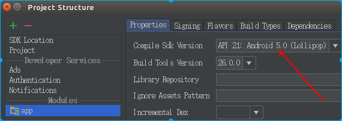

## 降低　compileSdkVersion　版本
 　有时候需要看低版本的源码，就要修改compileSdkVersion版本

1. 修改编译版本
   
2. targetSdkVersion版本修改成　21   然后   compile 'com.android.support:appcompat-v7:21.+' 继承的AppCompatActivity改成Activity

3. 编译后报错　Error:(11) No resource identifier found for attribute 'roundIcon' in package 'android'
    根据错误删除　android:roundIcon ,然后编译

  参考：http://blog.csdn.net/hyr83960944/article/details/39941683


## 　android stuido代理

*  普通代理
修改Gradle配置文件后就一直卡在那，在　build.gradle值修改下面
如果用了ss代理，在ubuntu设置http没用，可以在 工程根目录下 gradle.properties  添加

`org.gradle.jvmargs=-DsocksProxyHost=127.0.0.1 -DsocksProxyPort=1080
`
参考: https://www.zhihu.com/question/37810416


平常github下载项目导入AndroidStudio直接卡死，心里真不是...., 目前实验一种方式应该会快点
修改 gradle\wrapper\gradle-wrapper.properties下的 distributionUrl=https\://services.gradle.org/distributions/gradle-3.3-all.zip， 我的AndroidStudio默认是这个 所以就修改成这样的.

*  jcenter库代理　(这几句话花了关键得一天时间)

前天升级了系统，之前下得Demo一直跑不起来，'https://jitpack.io'得文件一直下载不下来　
　＞错误：　jcenter.bintray.com:443 failed to respond
　折腾了一天终于弄好了,需要设置proxy代理,把socket流量转为http
　然后在　Ｍanual proxy configuration下面选择HTTP 填上
　 ` 127.0.0.1 　 8118
　 `
　 就可以下载jitpack里面得文件了


## 下载gradle

  有时候想用新的的gradle，但是新的更新几十M的文件，一天都不一定能下下来
   直接去官网下载 https://gradle.org/releases/  ，对应版本的zip文件，放到相应目录
  比如我的就是 C:\Users\Administrator\.gradle\wrapper\dists\gradle-3.3-all\55gk2rcmfc6p2dg9u9ohc3hw9\

还一个是在${home}/.gradle目录下得gradle.properties文件配置应该也是可以的


## 修改Log颜色

android studio log默认都是白色的，在 setting -> Android Log下去掉Use inherited attributes
.gradle/gradle.properties 
我的颜色按照这个修改的
http://www.jianshu.com/p/e3f8f7383c3d


## 自动生成 findViewById
可以使用 butterknife,但是我在7升级到8时就麻烦了
也可以使用 BorePlugin代码生成插件
https://github.com/boredream/BorePlugin


## 快捷键

>
> Ctrl＋F12，可以显示当前文件的结构
> Ctrl＋Shift＋F7 可以高亮当前元素在当前文件中的使用 
>  Ctrl＋E，可以显示最近编辑的文件列表
>  Alt＋Up 和 Alt＋Down可在方法间快速移动
>  Shift＋Click可以关闭文件
>  Ctrl+ H 查看类的继承关系
>  Ctrl＋Alt＋B可以跳转到抽象方法的实现
>  Ctrl＋Q可以看JavaDoc

3.Ctrl＋[或]可以跳到大括号的开头结尾
4.Ctrl＋Shift＋Backspace可以跳转到上次编辑的地方
5.
6.Ctrl＋F7可以查询当前元素在当前文件中的引用，然后按F3可以选择
7.Ctrl＋N，可以快速打开类
8.Ctrl＋Shift＋N，可以快速打开文件
9.Alt＋Q可以看到当前方法的声明
10.Ctrl＋W可以选择单词继而语句继而行继而函数
11.Alt＋F1可以将正在编辑的元素在各个面板中定位
12.Ctrl＋P，可以显示参数信息
13.Ctrl＋Shift＋Insert可以选择剪贴板内容并插入
14.Alt＋Insert可以生成构造器/Getter/Setter等
15.Ctrl＋Alt＋V 可以引入变量。例如把括号内的SQL赋成一个变量
16.Ctrl＋Alt＋T可以把代码包在一块内，例如try/catch
18.在一些地方按Alt＋Enter可以得到一些Intention Action，例如将”==”改为”equals()”
19.Ctrl＋Shift＋Alt＋N可以快速打开符号
20.Ctrl＋Shift＋Space在很多时候都能够给出Smart提示
21.Alt＋F3可以快速寻找
22.Ctrl＋/和Ctrl＋Shift＋/可以注释代码

24.Ctrl＋O可以选择父类的方法进行重写
26.Ctrl＋Alt＋Space是类名自动完成
27.快速打开类/文件/符号时，可以使用通配符，也可以使用缩写
30.Ctrl＋Alt＋Up /Ctrl＋Alt＋Down可以快速跳转搜索结果
31.Ctrl＋Shift＋J可以整合两行
32.Alt＋F8是计算变量值

参考：https://github.com/1sters/Android-Studio-Guide/blob/master/tips-shortcuts.md

常用快捷键:https://mp.weixin.qq.com/s/lYBHtg342-t3NkPPY9E-YQ


## debug问题

> 15:40	Error running 'app'
> 		Cannot debug application from module app on device huawei-pra_al00-HMKNW17A12007001.
> 		This application does not have the debuggable attribute enabled in its manifest.
> 		If you have manually set it in the manifest, then remove it and let the IDE automatically assign it.
> 		If you are using Gradle, make sure that your current variant is debuggable.


* Build Variants 设置成debug

*   ```
      debug {
              debuggable false
              minifyEnabled false
              signingConfig signingConfigs.debug
          }
    ```

   debuggable设置成 true


#####  SVN分支合并 主干,主干新增文件被删除

弄了两个多小时，说多了都是泪

https://www.jianshu.com/p/e50af339259f


##### android命名规范

https://juejin.im/entry/5b6a4ca9f265da0f4c6fe566