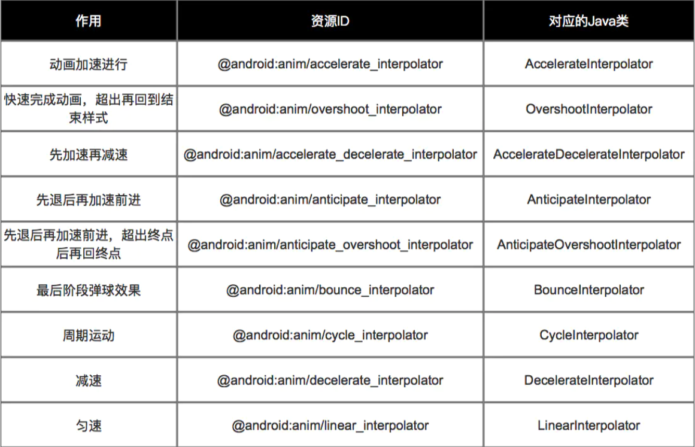

 

#### 估值器（TypeEvaluator）

设置动画 如何从初始值 过渡到 结束值 的逻辑

* 插值器（`Interpolator`）决定 值 的变化模式（匀速、加速）
* 估值器（`TypeEvaluator`）决定 值 的具体变化数值


####  ValueAnimator

实现原理 : 通过不断控制 值的变化， 再不断赋值给对象的属性，从而实现动画的效果。


从上面原理可以看出：`ValueAnimator`类中有3个重要方法：

1. `ValueAnimator.ofInt（int values）`
2. `ValueAnimator.ofFloat（float values）`
3. `ValueAnimator.ofObject（int values）`


#### ValueAnimator.ofInt（int values）

将初始值 **以整型数值的形式** 过渡到结束值

> 即估值器是整型估值器 - `IntEvaluator`


##### 模板代码

实际开发中，建议使用Java代码实现属性动画：因为很多时候属性的起始值是无法提前确定的（无法使用XML设置），这就需要在`Java`代码里动态获取。


```java
// 步骤1：设置动画属性的初始值 & 结束值
ValueAnimator anim = ValueAnimator.ofInt(0, 3);
        // ofInt（）作用有两个
        // 1. 创建动画实例
        // 2. 将传入的多个Int参数进行平滑过渡:此处传入0和1,表示将值从0平滑过渡到1
        // 如果传入了3个Int参数 a,b,c ,则是先从a平滑过渡到b,再从b平滑过渡到C，以此类推
        // ValueAnimator.ofInt()内置了整型估值器,直接采用默认的.不需要设置，即默认设置了如何从初始值 过渡到 结束值
        // 关于自定义插值器我将在下节进行讲解
        // 下面看看ofInt()的源码分析 ->>关注1
        
// 步骤2：设置动画的播放各种属性
        anim.setDuration(500);
        // 设置动画运行的时长
        
        anim.setStartDelay(500);
        // 设置动画延迟播放时间

        anim.setRepeatCount(0);
        // 设置动画重复播放次数 = 重放次数+1
        // 动画播放次数 = infinite时,动画无限重复
        
        anim.setRepeatMode(ValueAnimator.RESTART);
        // 设置重复播放动画模式
        // ValueAnimator.RESTART(默认):正序重放
        // ValueAnimator.REVERSE:倒序回放
     
// 步骤3：将改变的值手动赋值给对象的属性值：通过动画的更新监听器
        // 设置 值的更新监听器
        // 即：值每次改变、变化一次,该方法就会被调用一次
        anim.addUpdateListener(new ValueAnimator.AnimatorUpdateListener() {
            @Override
            public void onAnimationUpdate(ValueAnimator animation) {

                int currentValue = (Integer) animation.getAnimatedValue();
                // 获得改变后的值
                
                System.out.println(currentValue);
                // 输出改变后的值

        // 步骤4：将改变后的值赋给对象的属性值，下面会详细说明
                View.setproperty（currentValue）；

       // 步骤5：刷新视图，即重新绘制，从而实现动画效果
                View.requestLayout();
                
                
            }
        });

        anim.start();
        // 启动动画
    }

// 关注1：ofInt（）源码分析
    public static ValueAnimator ofInt(int... values) {
        // 允许传入一个或多个Int参数
        // 1. 输入一个的情况（如a）：从0过渡到a；
        // 2. 输入多个的情况（如a，b，c）：先从a平滑过渡到b，再从b平滑过渡到C
        
        ValueAnimator anim = new ValueAnimator();
        // 创建动画对象
        anim.setIntValues(values);
        // 将传入的值赋值给动画对象
        return anim;
    }
```


##### XML设置

```xml
// ValueAnimator采用<animator>  标签
<animator xmlns:android="http://schemas.android.com/apk/res/android"  
    android:valueFrom="0"   // 初始值
    android:valueTo="100"  // 结束值
    android:valueType="intType" // 变化值类型 ：floatType & intType

    android:duration="3000" // 动画持续时间（ms），必须设置，动画才有效果
    android:startOffset ="1000" // 动画延迟开始时间（ms）
    android:fillBefore = “true” // 动画播放完后，视图是否会停留在动画开始的状态，默认为true
    android:fillAfter = “false” // 动画播放完后，视图是否会停留在动画结束的状态，优先于fillBefore值，默认为false
    android:fillEnabled= “true” // 是否应用fillBefore值，对fillAfter值无影响，默认为true
    android:repeatMode= “restart” // 选择重复播放动画模式，restart代表正序重放，reverse代表倒序回放，默认为restart|
    android:repeatCount = “0” // 重放次数（所以动画的播放次数=重放次数+1），为infinite时无限重复
    android:interpolator = @[package:]anim/interpolator_resource // 插值器，即影响动画的播放速度,下面会详细讲
/>  
```


```java
Animator animator = AnimatorInflater.loadAnimator(context, R.animator.set_animation);  
// 载入XML动画

animator.setTarget(view);  
// 设置动画对象

animator.start();  
// 启动动画
```


##### 实战 

按钮的宽度从 `200px` 放大到 `500px`

```xml
<Button
    android:id="@+id/bt_value_anim"
    android:layout_width="200px"
    android:layout_height="wrap_content"
    android:layout_centerInParent="true"
    android:text="动画" />
```

？代码设置初始值

```kotlin
// 步骤1：设置属性数值的初始值(此处在xml中200) & 结束值(600)
val valueAnimator = ValueAnimator.ofInt(bt_value_anim.layoutParams.width, 600)
    // ValueAnimator.ofInt()内置了整型估值器,直接采用默认的.不需要设置
       // 即默认设置了如何从初始值200 过渡到 结束值500

// 步骤2：设置动画的播放各种属性
valueAnimator.duration = 2000

// 步骤3：将改变的值手动赋值给对象的属性值：通过动画的更新监听器
        // 设置 值的更新监听器
        // 即：值每次改变、变化一次,该方法就会被调用一次
valueAnimator.addUpdateListener {
    val currentValue = it.animatedValue
    // 获得每次变化后的属性值
    Timber.d("currentValue $currentValue")

    // 每次值变化时，将值手动赋值给对象的属性
    bt_value_anim.layoutParams.width = currentValue as Int
    // 即将每次变化后的值 赋 给按钮的宽度，这样就实现了按钮宽度属性的动态变化

  // 步骤4：刷新视图，即重新绘制，从而实现动画效果
    bt_value_anim.requestLayout()
}

valueAnimator.start()
```


#### 浮点型：ValueAnimator.oFloat（）

将初始值 以浮点型数值的形式 过渡到结束值


- `ValueAnimator.oFloat（）`采用默认的浮点型估值器 (`FloatEvaluator`)
- `ValueAnimator.ofInt（）`采用默认的整型估值器（`IntEvaluator`）

在使用上完全没有区别


##### ValueAnimator.ofObject（） 

将初始值 以对象的形式 过渡到结束值

> 即通过操作 对象 实现动画效果


##### 实战

可以看到 `ValueAnimator.ofObject（）`的本质还是操作 **值**,将多个值封装到一个对象里的方式，同时对多个值一起操作

PointEvaluator

```
class PointEvaluator : TypeEvaluator<Point> {
    override fun evaluate(fraction: Float, startValue: Point?, endValue: Point?): Point {

        // 将动画初始值startValue 和 动画结束值endValue 强制类型转换成Point对象
        val startPoint = startValue
        val endPoint =  endValue

        // 根据fraction来计算当前动画的x和y的值
        val x = startPoint!!.x + fraction * (endPoint!!.x - startPoint!!.x)
        val y = startPoint!!.y + fraction * (endPoint!!.y - startPoint!!.y)

        // 将计算后的坐标封装到一个新的Point对象中并返回
        val point = Point(x,y)
        return  point
    }
}
```


Point

```kotlin
class Point(val x: Float, val y: Float)
```


MyView

```kotlin
class MyView : View {

    constructor(context: Context?, attrs: AttributeSet?) : super(context, attrs)

    // 设置需要用到的变量
    val RADIUS = 70f // 圆的半径 = 70

    private var currentPoint // 当前点坐标
            : Point? = null
    val mPaint = Paint(Paint.ANTI_ALIAS_FLAG).apply {
        color = Color.BLUE
    }


    init {

    }

    override fun onDraw(canvas: Canvas?) {

        // 如果当前点坐标为空(即第一次执行)
        if (currentPoint == null) {
            currentPoint = Point(RADIUS, RADIUS)
            val x = currentPoint?.x
            val y = currentPoint?.y
            if (x != null && y != null) {
                canvas?.drawCircle(x, y, RADIUS, mPaint)
            }
            // (重点关注)将属性动画作用到View中
            // 步骤1:创建初始动画时的对象点  & 结束动画时的对象点
            // (重点关注)将属性动画作用到View中
            // 步骤1:创建初始动画时的对象点  & 结束动画时的对象点
            val startPoint = Point(RADIUS, RADIUS) // 初始点为圆心(70,70)

            val endPoint = Point(700f, 1000f) // 结束点为(700,1000)

            // 步骤2:创建动画对象 & 设置初始值 和 结束值
            val anim = ValueAnimator.ofObject(PointEvaluator(), startPoint, endPoint)
            // 参数说明
            // 参数1：TypeEvaluator 类型参数 - 使用自定义的PointEvaluator(实现了TypeEvaluator接口)
            // 参数2：初始动画的对象点
            // 参数3：结束动画的对象点


            // 步骤3：设置动画参数
            anim.duration = 5000

            // 设置 值的更新监听器
            // 即每当坐标值（Point对象）更新一次,该方法就会被调用一次
            anim.addUpdateListener {
                currentPoint = it.animatedValue as Point?
                // 将每次变化后的坐标值（估值器PointEvaluator中evaluate（）返回的Piont对象值）到当前坐标值对象（currentPoint）
                // 从而更新当前坐标值（currentPoint）
                Timber.d("currentPoint==null  ${currentPoint?.x}  ${currentPoint?.y}")
                // 步骤4：每次赋值后就重新绘制，从而实现动画效果
                invalidate()
            }
            anim.start()
        } else {
          
          	//除了第一次，后面每次都根据addUpdateListener回调，在这画圆
          
            // 所以坐标值每改变一次,就会调用onDraw()一次,就会画一次圆,从而实现动画效果

            // 在该点画一个圆:圆心 = (30,30),半径 = 30
            val x = currentPoint!!.x
            val y = currentPoint!!.y
            canvas?.drawCircle(x, y, RADIUS, mPaint)
					
            Timber.d("currentPoint currentPoint!=null  ${currentPoint?.x}  ${currentPoint?.y}")

        }
    }
}
```


#### 插值器

#####  xml设置

当在XML文件设置插值器时，只需传入对应的插值器资源ID即可

主要是设置插值器属性`android:interpolator`

```xml
<?xml version="1.0" encoding="utf-8"?>
<scale xmlns:android="http://schemas.android.com/apk/res/android"

    android:interpolator="@android:anim/overshoot_interpolator"
    // 通过资源ID设置插值器
    android:duration="3000"
    android:fromXScale="0.0"
    android:fromYScale="0.0"
    android:pivotX="50%"
    android:pivotY="50%"
    android:toXScale="2"
    android:toYScale="2" />
>
```

##### 代码设置

当在Java代码设置插值器时，只需创建对应的插值器对象即可

```java
Button mButton = (Button) findViewById(R.id.Button);
// 步骤1:创建 需要设置动画的 视图View

Animation alphaAnimation = new AlphaAnimation(1,0);
// 步骤2：创建透明度动画的对象 & 设置动画效果

alphaAnimation.setDuration(3000);
Interpolator overshootInterpolator = new OvershootInterpolator();
// 步骤3：创建对应的插值器类对象

alphaAnimation.setInterpolator(overshootInterpolator);
// 步骤4：给动画设置插值器

mButton.startAnimation(alphaAnimation);
// 步骤5：播放动画
```


##### 系统内置插值器




##### 自定义插值器

​	根据动画的进度（0%-100%）计算出当前属性值改变的百分比

​	自定义插值器需要实现 `Interpolator` / `TimeInterpolator`接口 & 复写`getInterpolation（）`

1. 补间动画 实现 `Interpolator`接口；属性动画实现`TimeInterpolator`接口
2. `TimeInterpolator`接口是属性动画中新增的，用于兼容`Interpolator`接口，这使得所有过去的`Interpolator`实现类都可以直接在属性动画使用

```java
// Interpolator接口 tween动画
public interface Interpolator {  

    // 内部只有一个方法
     float getInterpolation(float input) {  
         // 参数说明
         // input值值变化范围是0-1，且随着动画进度（0% - 100% ）均匀变化
        // 即动画开始时，input值 = 0；动画结束时input = 1
        // 而中间的值则是随着动画的进度（0% - 100%）在0到1之间均匀增加
        
      ...// 插值器的计算逻辑

      return xxx；
      // 返回的值就是用于估值器继续计算的fraction值，下面会详细说明
    }  

// TimeInterpolator接口  属性动画
// 同上
public interface TimeInterpolator {  
  
    float getInterpolation(float input);  
}  
```


3. 匀速插值器

   ```java
   // 匀速差值器：LinearInterpolator
   @HasNativeInterpolator  
   public class LinearInterpolator extends BaseInterpolator implements NativeInterpolatorFactory {  
      // 仅贴出关键代码
     ...
       public float getInterpolation(float input) {  
           return input;  
           // 没有对input值进行任何逻辑处理，直接返回
           // 即input值 = fraction值
           // 因为input值是匀速增加的，因此fraction值也是匀速增加的，所以动画的运动情况也是匀速的，所以是匀速插值器
       }  
   
   
   // 先加速再减速 差值器：AccelerateDecelerateInterpolator
   @HasNativeInterpolator  
   public class AccelerateDecelerateInterpolator implements Interpolator, NativeInterpolatorFactory {  
         // 仅贴出关键代码
     ...
       public float getInterpolation(float input) {  
           return (float)(Math.cos((input + 1) * Math.PI) / 2.0f) + 0.5f;
           // input的运算逻辑如下：
           // 使用了余弦函数，因input的取值范围是0到1，那么cos函数中的取值范围就是π到2π。
           // 而cos(π)的结果是-1，cos(2π)的结果是1
           // 所以该值除以2加上0.5后，getInterpolation()方法最终返回的结果值还是在0到1之间。只不过经过了余弦运算之后，最终的结果不再是匀速增加的了，而是经历了一个先加速后减速的过程
           // 所以最终，fraction值 = 运算后的值 = 先加速后减速
           // 所以该差值器是先加速再减速的
       }  
   }
   ```

4. 先加速再减速 插值器：`AccelerateDecelerateInterpolator`

   ```java
   // 先加速再减速 差值器：AccelerateDecelerateInterpolator
   @HasNativeInterpolator  
   public class AccelerateDecelerateInterpolator implements Interpolator, NativeInterpolatorFactory {  
         // 仅贴出关键代码
     ...
       public float getInterpolation(float input) {  
           return (float)(Math.cos((input + 1) * Math.PI) / 2.0f) + 0.5f;
           // input的运算逻辑如下：
           // 使用了余弦函数，因input的取值范围是0到1，那么cos函数中的取值范围就是π到2π。
           // 而cos(π)的结果是-1，cos(2π)的结果是1
           // 所以该值除以2加上0.5后，getInterpolation()方法最终返回的结果值还是在0到1之间。只不过经过了余弦运算之后，最终的结果不再是匀速增加的了，而是经历了一个先加速后减速的过程
           // 所以最终，fraction值 = 运算后的值 = 先加速后减速
           // 所以该差值器是先加速再减速的
       }  
   }
   ```

**对input值 根据动画的进度（0%-100%）通过逻辑计算 计算出当前属性值改变的百分比**


实战

DecelerateAccelerateInterpolator

```kotlin
class DecelerateAccelerateInterpolator : TimeInterpolator {
    override fun getInterpolation(input: Float): Float {
        var result: Float = 0.0f
        if (input <= 0.5) {
            result = Math.sin(Math.PI * input).toFloat() / 2
            // 使用正弦函数来实现先减速后加速的功能，逻辑如下：
            // 因为正弦函数初始弧度变化值非常大，刚好和余弦函数是相反的
            // 随着弧度的增加，正弦函数的变化值也会逐渐变小，这样也就实现了减速的效果。
            // 当弧度大于π/2之后，整个过程相反了过来，现在正弦函数的弧度变化值非常小，渐渐随着弧度继续增加，变化值越来越大，弧度到π时结束，这样从0过度到π，也就实现了先减速后加速的效果
        } else {
             result= (2 - Math.sin(Math.PI * input)).toFloat() / 2
        }
        return result
        // 返回的result值 = 随着动画进度呈先减速后加速的变化趋势
    }
}
```

InterpolatorActivity

```
val curTranslationX = bt_anim_interpolator.translationX

val animator = ObjectAnimator.ofFloat(bt_anim_interpolator, "translationX", curTranslationX, 300f, curTranslationX)
animator.duration = 5000
animator.interpolator = DecelerateAccelerateInterpolator()
animator.start()
```


#### `ObjectAnimator`与 `ValueAnimator`类的区别

* `ValueAnimator` 类是先改变值，然后 **手动赋值** 给对象的属性从而实现动画；是 **间接** 对对象属性进行操作；
* `ObjectAnimator` 类是先改变值，然后 **自动赋值** 给对象的属性从而实现动画；是 **直接** 对对象属性进行操作

###  估值器（TypeEvaluator) 和插值器

1. 插值器（`Interpolator`）决定 值 的变化模式（匀速、加速）
2. 估值器（`TypeEvaluator`）决定 值 的具体变化数值,设置动画从初始值过渡到结束值的逻辑。


https://blog.csdn.net/carson_ho/article/details/99619871

作者：Carson_Ho
链接：https://www.jianshu.com/p/7c95342f4bc2

​			https://www.jianshu.com/p/2f19fe1e3ca1

来源：简书
著作权归作者所有。商业转载请联系作者获得授权，非商业转载请注明出处。