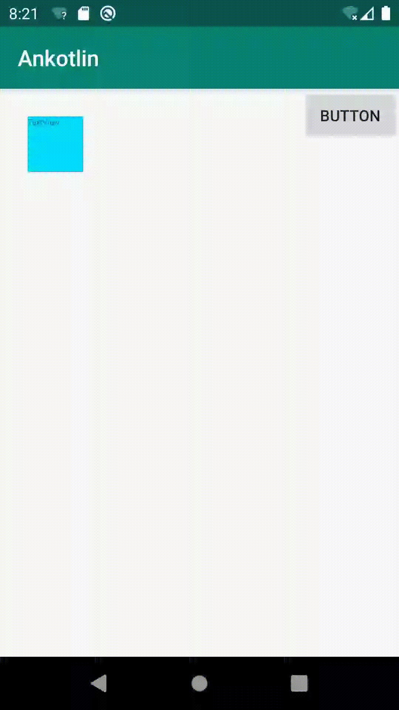

##### View Animation

第一种就pass了，看下View Animation:

>You can use the view animation system to perform tweened animation on Views. Tween animation calculates the animation with information such as the start point, end point, size, rotation, and other common aspects of an animation.

这种动画可以在一个视图容器执行　位置、大小、旋转、透明度的变化，使用XML定义更具可读性

>-set
>|-android:interpolator -> 插值器，影响动画的速度
>  |-默认值 -> @android:anim/accelerate_decelerate_interpolator
>|-android:shareInterpolator -> 集合所有动画是否使用同一插值器
>|-android:fillAfter -> 动画结束后View是否停留在结束的位置
>|-android:startOffset -> 动画多少秒之后执行
>|-android:repeatMode -> 重复的模式,默认为restart,即重头开始重新运行,reverse即从结束开始向前重新运行
>-TranslateAnimation -> 移动View
>|-<translate>
>  |-android:fillAfter ->
>  |-android:duration -> 表示动画持续的时间
>  |-android:fromXDelta -> 表示 x 的起始值
>  |-android:toXDelta -> 表示 x 的结束值
>  |-android:fromYDelta -> 表示 y 的起始值
>  |-android:toYDelta -> 表示 y 的结束值
>-scaleAnimation -> 放大或者缩小View
>|-<scale>
>  |-android:duration -> 表示动画持续的时间
>  |-android:fromXScale -> 表示水平方向缩放的起始值
>  |-android:fromYScale -> 表示竖直方向缩放的起始值
>  |-android:pivotX -> 表示缩放中心点的 X 坐标
>  |-android:pivotY -> 表示缩放中心点的 Y 坐标
>  |-android:toXScale -> 表示水平方向缩放的结束值
>  |-android:toYScale -> 表示竖直方向缩放的结束值
>-RotateAnimation -> 旋转View
>|-<rotate>
>  |-android:duration -> 表示动画持续的时间
>  |-android:fromDegrees -> 旋转开始的角度
>  |-android:toDegrees -> 旋转结束的角度
>  |-android:pivotX -> 旋转中心点的 X 坐标
>  |-android:pivotY -> 旋转中心点的 Y 坐标
>-AlphaAnimation -> 改变View的透明度
>|-<alpha>
>  |-android:duration -> 表示动画持续的时间
>  |-android:fromAlpha -> 透明度的起始值
>  |-android:toAlpha -> 透明度的结束值
>-自定义View动画 -> (不会,待实践中学习)	

```
private fun  anim(resAnim:Int){
    val translateAnimation = AnimationUtils.loadAnimation(this,resAnim)
    textView5.startAnimation(translateAnimation)
}
```


1. view_anim_translate.xml

   ```
    // 以下参数是4种动画效果的公共属性,即都有的属性
     android:duration="3000" // 动画持续时间（ms），必须设置，动画才有效果
     android:startOffset ="1000" // 动画延迟开始时间（ms）
     android:fillBefore = “true” // 动画播放完后，视图是否会停留在动画开始的状态，默认为true
     android:fillAfter = “false” // 动画播放完后，视图是否会停留在动画结束的状态，优先于fillBefore值，默认为false
     android:fillEnabled= “true” // 是否应用fillBefore值，对fillAfter值无影响，默认为true
     android:repeatMode= “restart” // 选择重复播放动画模式，restart代表正序重放，reverse代表倒序回放，默认为restart|
     android:repeatCount = “0” // 重放次数（所以动画的播放次数=重放次数+1），为infinite时无限重复
     android:interpolator = @[package:]anim/interpolator_resource // 插值器，即影响动画的播放速度,下面会详细讲
   
     // 以下参数是平移动画特有的属性
     android:fromXDelta="0" // 视图在水平方向x 移动的起始值
     android:toXDelta="500" // 视图在水平方向x 移动的结束值
   
     android:fromYDelta="0" // 视图在竖直方向y 移动的起始值
     android:toYDelta="500" // 视图在竖直方向y 移动的结束值
   ```

2. View_anim_translate.xml

   ```
   <!--  // 以下参数是4种动画效果的公共属性,即都有的属性
     android:duration="3000" // 动画持续时间（ms），必须设置，动画才有效果
     android:startOffset ="1000" // 动画延迟开始时间（ms）
     android:fillBefore = “true” // 动画播放完后，视图是否会停留在动画开始的状态，默认为true
     android:fillAfter = “false” // 动画播放完后，视图是否会停留在动画结束的状态，优先于fillBefore值，默认为false
     android:fillEnabled= “true” // 是否应用fillBefore值，对fillAfter值无影响，默认为true
     android:repeatMode= “restart” // 选择重复播放动画模式，restart代表正序重放，reverse代表倒序回放，默认为restart|
     android:repeatCount = “0” // 重放次数（所以动画的播放次数=重放次数+1），为infinite时无限重复
     android:interpolator = @[package:]anim/interpolator_resource // 插值器，即影响动画的播放速度,下面会详细讲
   
     // 以下参数是缩放动画特有的属性
     android:fromXScale="0.0"
     // 动画在水平方向X的起始缩放倍数
     // 0.0表示收缩到没有；1.0表示正常无伸缩
     // 值小于1.0表示收缩；值大于1.0表示放大
   
     android:toXScale="2"  //动画在水平方向X的结束缩放倍数
   
     android:fromYScale="0.0" //动画开始前在竖直方向Y的起始缩放倍数
     android:toYScale="2" //动画在竖直方向Y的结束缩放倍数
   
     android:pivotX="50%" // 缩放轴点的x坐标
     android:pivotY="50%" // 缩放轴点的y坐标
     // 轴点 = 视图缩放的中心点
   
     // pivotX pivotY,可取值为数字，百分比，或者百分比p
     // 设置为数字时（如50），轴点为View的左上角的原点在x方向和y方向加上50px的点。在Java代码里面设置这个参数的对应参数是Animation.ABSOLUTE。
     // 设置为百分比时（如50%），轴点为View的左上角的原点在x方向加上自身宽度50%和y方向自身高度50%的点。在Java代码里面设置这个参数的对应参数是Animation.RELATIVE_TO_SELF。
     // 设置为百分比p时（如50%p），轴点为View的左上角的原点在x方向加上父控件宽度50%和y方向父控件高度50%的点。在Java代码里面设置这个参数的对应参数是Animation.RELATIVE_TO_PARENT
   
     // 两个50%表示动画从自身中间开始，具体如下图
   ```

    android:pivotX="50%" // 缩放轴点的x坐标
     android:pivotY="50%" // 缩放轴点的y坐标

   这个拿掉看看效果

   

   

   添加　
   
   pivotX pivotY
   
   

3. Rotate

   ```
    // 以下参数是旋转动画特有的属性
      android:duration="1000"
      android:fromDegrees="0" // 动画开始时 视图的旋转角度(正数 = 顺时针，负数 = 逆时针)
      android:toDegrees="270" // 动画结束时 视图的旋转角度(正数 = 顺时针，负数 = 逆时针)
      android:pivotX="50%" // 旋转轴点的x坐标
      android:pivotY="0" // 旋转轴点的y坐标
      // 轴点 = 视图缩放的中心点
   
      // pivotX pivotY,可取值为数字，百分比，或者百分比p
      // 设置为数字时（如50），轴点为View的左上角的原点在x方向和y方向加上50px的点。在Java代码里面设置这个参数的对应参数是Animation.ABSOLUTE。
      // 设置为百分比时（如50%），轴点为View的左上角的原点在x方向加上自身宽度50%和y方向自身高度50%的点。在Java代码里面设置这个参数的对应参数是Animation.RELATIVE_TO_SELF。
      // 设置为百分比p时（如50%p），轴点为View的左上角的原点在x方向加上父控件宽度50%和y方向父控件高度50%的点。在Java代码里面设置这个参数的对应参数是Animation.RELATIVE_TO_PARENT
      // 两个50%表示动画从自身中间开始，具体如下图
   ```

   4. alpha

   ```
   // 以下参数是4种动画效果的公共属性,即都有的属性
   android:duration="3000" // 动画持续时间（ms），必须设置，动画才有效果
   android:startOffset ="1000" // 动画延迟开始时间（ms）
   android:fillBefore = “true” // 动画播放完后，视图是否会停留在动画开始的状态，默认为true
   android:fillAfter = “false” // 动画播放完后，视图是否会停留在动画结束的状态，优先于fillBefore值，默认为false
   android:fillEnabled= “true” // 是否应用fillBefore值，对fillAfter值无影响，默认为true
   android:repeatMode= “restart” // 选择重复播放动画模式，restart代表正序重放，reverse代表倒序回放，默认为restart|
   android:repeatCount = “0” // 重放次数（所以动画的播放次数=重放次数+1），为infinite时无限重复
   android:interpolator = @[package:]anim/interpolator_resource // 插值器，即影响动画的播放速度,下面会详细讲
   
   // 以下参数是透明度动画特有的属性
   android:fromAlpha="1.0" // 动画开始时视图的透明度(取值范围: -1 ~ 1)
   android:toAlpha="0.0"// 动画结束时视图的透明度(取值范围: -1 ~ 1)
   ```


5. 组合动画

    ```
   <?xml version="1.0" encoding="utf-8"?>
   // 采用< Set/>标签
   <set xmlns:android="http://schemas.android.com/apk/res/android">
   
   // 组合动画同样具备公共属性
       android:duration="3000" // 动画持续时间（ms），必须设置，动画才有效果
       android:startOffset ="1000" // 动画延迟开始时间（ms）
       android:fillBefore = “true” // 动画播放完后，视图是否会停留在动画开始的状态，默认为true
       android:fillAfter = “false” // 动画播放完后，视图是否会停留在动画结束的状态，优先于fillBefore值，默认为false
       android:fillEnabled= “true” // 是否应用fillBefore值，对fillAfter值无影响，默认为true
       android:repeatMode= “restart” // 选择重复播放动画模式，restart代表正序重放，reverse代表倒序回放，默认为restart|
       android:repeatCount = “0” // 重放次数（所以动画的播放次数=重放次数+1），为infinite时无限重复
       android:interpolator = @[package:]anim/interpolator_resource // 插值器，即影响动画的播放速度,下面会详细讲
       
   // 组合动画独特的属性
       android:shareinterpolator = “true”
       // 表示组合动画中的动画是否和集合共享同一个差值器
       // 如果集合不指定插值器，那么子动画需要单独设置
   
   // 组合动画播放时是全部动画同时开始
   // 如果想不同动画不同时间开始就要使用android:startOffset属性来延迟单个动画播放时间
   
   // 设置旋转动画，语法同单个动画
       <rotate
           android:duration="1000"
           android:fromDegrees="0"
           android:toDegrees="360"
           android:pivotX="50%"
           android:pivotY="50%"
           android:repeatMode="restart"
           android:repeatCount="infinite"
           />
   
   // 设置平移动画，语法同单个动画
       <translate
           android:duration="10000"
           android:startOffset = “1000”// 延迟该动画播放时间
           android:fromXDelta="-50%p"
           android:fromYDelta="0"
           android:toXDelta="50%p"
           android:toYDelta="0" />
   
   // 设置透明度动画，语法同单个动画
       <alpha
           android:startOffset="7000"
           android:duration="3000"
           android:fromAlpha="1.0"
           android:toAlpha="0.0" />
   
   
   // 设置缩放动画，语法同单个动画
       <scale
           android:startOffset="4000"
           android:duration="1000"
           android:fromXScale="1.0"
           android:fromYScale="1.0"
           android:pivotX="50%"
           android:pivotY="50%"
           android:toXScale="0.5"
           android:toYScale="0.5" />
   // 特别注意：
   // 1. 在组合动画里scale缩放动画设置的repeatCount（重复播放）和fillBefore（播放完后，视图是否会停留在动画开始的状态）是无效的。
   // 2. 所以如果需要重复播放或者回到原位的话需要在set标签里设置
   // 3. 但是由于此处rotate旋转动画里已设置repeatCount为infinite，所以动画不会结束，也就看不到重播和回复原位
   </set>
   
   ```

     它是一个接一个播放，可以通过设置repeatCount 达到同时播放的目的

##### 　监听动画


* Animation.addListener
* anim.addListener(new AnimatorListenerAdapter()

##### 应用

1. Activity入场

   activity_anim_enter.xml

   ```
   <?xml version="1.0" encoding="utf-8"?>
   <set xmlns:android="http://schemas.android.com/apk/res/android">
       <translate
               android:duration= "3000"
               android:fromXDelta="100%p"
               android:toXDelta="0%p"/>
   </set>
   ```

    activity_anim_exit.xml

   ```
   <?xml version="1.0" encoding="utf-8"?>
   <set xmlns:android="http://schemas.android.com/apk/res/android">
       <translate
               android:duration= "3000"
               android:fromXDelta="0%p"
               android:toXDelta="-100%p"/>
   </set>
   ```

##### 视图组（ViewGroup）动画

##### 插值器

https://www.jianshu.com/p/2f19fe1e3ca1

https://blog.csdn.net/carson_ho/article/details/72827747