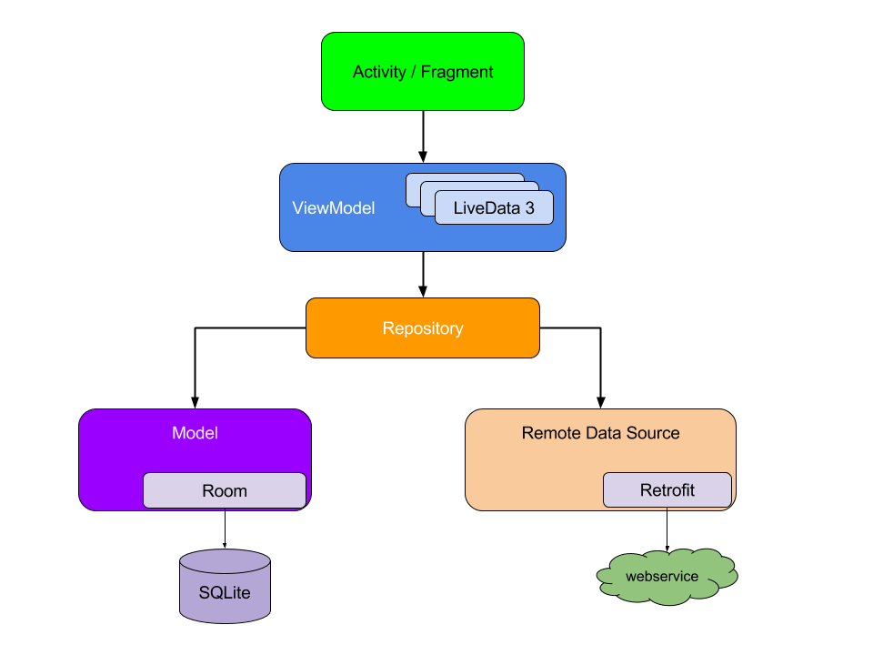
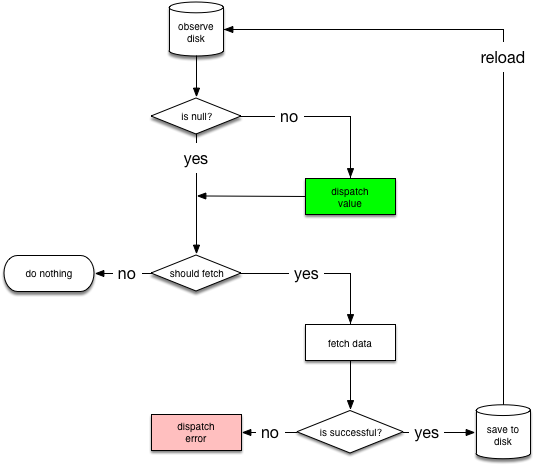

---

title: Architecture
comments: true
date: 2018-06-14 09:31:59
tags:
categories: Architecture
---

#####  Jetpack

It helps to be familiar with software architectural patterns that separate data from the user interface, such as MVP or MVC

https://developer.android.com/jetpack/docs/getting-started

* modules should interact

* NetworkBoundResource

It starts by observing the database for the resource. When the entry is loaded from the database for the first time, `NetworkBoundResource` checks whether the result is good enough to be dispatched or that it  should be re-fetched from the network. Note that both of these  situations can happen at the same time, given that you probably want to  show cached data while updating it from the network.

[googlesamples](https://github.com/googlesamples/android-architecture-components)

https://developer.android.com/topic/libraries/architecture

https://codelabs.developers.google.com/codelabs/android-lifecycles/#1

架构学习从codelab开始吧!

https://github.com/qingmei2/MVVM-Architecture

https://juejin.im/post/5dafc49b6fb9a04e17209922

https://juejin.im/post/5d2be05ff265da1bd605d49a

* DataBinding learn

https://developer.android.com/topic/libraries/data-binding

googlecodelabs/[android-databinding](https://github.com/googlecodelabs/android-databinding)

##### Room

 https://codelabs.developers.google.com/codelabs/android-room-with-a-view/#0

kotlin need familiar [basic coroutines](https://codelabs.developers.google.com/codelabs/kotlin-coroutines/#0)

https://mp.weixin.qq.com/s?__biz=MzAwODY4OTk2Mg==&mid=2652046992&idx=1&sn=b8b4c47537be1227eecd01c1eaee2550&chksm=808ca6d5b7fb2fc32d9ec361c91a2958e51a2db1c6b20370e7ef6493bb5cb20314cda6ab059c&scene=38#wechat_redirect

https://juejin.im/post/5d2be05ff265da1bd605d49a

https://mp.weixin.qq.com/s/4UP-pDs0FK66g1QUQvRN6A

MVC MVP. MVVM三种架构介绍

http://www.jcodecraeer.com/a/anzhuokaifa/2017/1024/8636.html

https://mp.weixin.qq.com/s/Kc1826MQ3ReMkoIWlsQGVw

https://juejin.im/post/5dafc49b6fb9a04e17209922

* MVP

https://juejin.im/entry/5955e7166fb9a06bc23a8598

https://github.com/yaozs/YzsBaseActivity

##### 多个activity对p的复用

https://juejin.im/post/599ce8016fb9a0247e4255f4

#### Component

https://mp.weixin.qq.com/s/8_8gGpkpO2QFNkWgSRBwIg

https://www.jianshu.com/p/6a50ef1ef45c

https://developer.android.com/studio/build/dependencies#duplicate_classes

https://developer.android.com/studio/build/manifest-merge?hl=zh-cn

#### merge androidmanifest

<https://developer.android.com/studio/build/manifest-merge?hl=zh-cn>