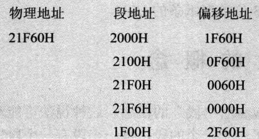

#### 8086 14个寄存器

AX , BX , CX , DX , SI , DI , SP , BP, IP , CS , SS, DS ,ES ,PSW

实验环境搭建

https://github.com/froginwell/assembly

https://www.bilibili.com/s/video/BV1254y1B75r

CS:IP  他们指示了CPU当前要读取指令的地址。

CS为代码段地址

IP 指令指针寄存器

jmp ax ,含义上类似 ： mov IP , ax

#### 第三章

##### DS和address

debug中，内存单元从左到右是地址从低到高顺序排列的。

8086CPU自动取ds中的数据为内存单元的段地址

##### move , add , sub

[0] ， 0表示内存单元的偏移地址

SS:SP 指向栈顶元素，栈顶的段地址存放在栈顶，偏移地址存放在SP中。

##### Loop

5.3 在Debug中跟踪用loop指令实现的循环程序 

​             

#### 实验四

  向内存0:200H~0:23fH依次传送数据0~63（3FH）

  内存0:200H~0:23fH空间与0020:0-0020:3f内存空间是一样的   (0:200  0020:0物理地址相同)                                                                                                                             

答案 

https://www.cnblogs.com/Base-Of-Practice/category/1005745.html

https://blackdragonf.github.io/2017/03/09/%E7%8E%8B%E7%88%BD%E6%B1%87%E7%BC%96%E8%AF%AD%E8%A8%80%E7%AC%AC%E4%B8%89%E7%89%88%E5%AE%9E%E9%AA%8C/

 视频 小甲鱼

#### [剑指 Offer 58 - II. 左旋转字符串](https://leetcode.cn/problems/zuo-xuan-zhuan-zi-fu-chuan-lcof/)

##### 数组System.arraycopy 

深入分析用到了汇编指令,后面可以加强学习,其实底层的知识还是需要的，要不然没法深入下去了

https://blog.csdn.net/jackgo73/article/details/111866491