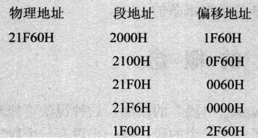

#### 8086 14个寄存器

AX , BX , CX , DX , SI , DI , SP , BP, IP , CS , SS, DS ,ES ,PSW

# 环境搭建

ubuntu

https://github.com/froginwell/assembly

https://www.bilibili.com/s/video/BV1254y1B75r

macos

doxbox-x

从下载masm 

https://github.com/froginwell/assembly/tree/master/software

# 实验

命令将cs修改成2000

命令将ip修改成1000

验证

```bash
r cs 2000
r ip 0000

-a 2000:0
2000:0000 mov ax ,0123
2000:0003 mov bx, 3
2000:0006 mov ax , bx
2000:0008 add ax,bx
2000:000A
-u
2000:0000 B82301            MOV     AX,0123
2000:0003 BB0300            MOV     BX,0003
2000:0006 89D8              MOV     AX,BX
2000:0008 01D8              ADD     AX,BX
```

CS:IP  他们指示了CPU当前要读取指令的地址。

CS为代码段地址

IP 指令指针寄存器

jmp ax ,含义上类似 ： mov IP , ax

```bash
mov ax, 4E20
add ax, 1416 
mov bx, 2000 
add ax, bx
mov bx,ax
add ax,bx
mov ax, 001A
mov bx, 0026
add al,bl
add ah, bl
add bh, al
mov ah,0
add al,bl
add al,9C
```

copy 后 pdf的bl ，到这里后成了b1,导致计算问题

 我 们 用 到 的debug 功 能 。
 用Debug 的R 命令查看、改变CPU 寄存器的内容;
 用Debug 的D命令查看内存中的内容;
 用Debug 的E命令改写内存中的内容;
 用Debug 的U 命令将内存中的机器指令翻译成汇编指令;
 用Debug 的T工命令执行 一条机器指令;

用 Debug的 A 命 令 以 汇 编 指 令 的 格 式 在 内 存 中 写 入一 条 机 器 指 令

```
-t
AX=8236 BX=2000 CX=0000 DX=0000 SP=FFFE BP=0000 SI=0000 DI=0000
DS=0DAB ES=0DAB SS=0DAB CS=2000 IP=000B OV UP EI NG NZ NA PE NC
2000:000B 89C3              MOV     BX,AX
-t
AX=8236 BX=8236 CX=0000 DX=0000 SP=FFFE BP=0000 SI=0000 DI=0000
DS=0DAB ES=0DAB SS=0DAB CS=2000 IP=000D OV UP EI NG NZ NA PE NC
2000:000D 01D8              ADD     AX,BX
-t
AX=046C BX=8236 CX=0000 DX=0000 SP=FFFE BP=0000 SI=0000 DI=0000
DS=0DAB ES=0DAB SS=0DAB CS=2000 IP=000F OV UP EI PL NZ NA PE CY
2000:000F B81A00            MOV     AX,001A
-t
AX=001A BX=8236 CX=0000 DX=0000 SP=FFFE BP=0000 SI=0000 DI=0000
DS=0DAB ES=0DAB SS=0DAB CS=2000 IP=0012 OV UP EI PL NZ NA PE CY
2000:0012 BB2600            MOV     BX,0026
-t
AX=001A BX=0026 CX=0000 DX=0000 SP=FFFE BP=0000 SI=0000 DI=0000
DS=0DAB ES=0DAB SS=0DAB CS=2000 IP=0015 OV UP EI PL NZ NA PE CY
2000:0015 04B1              ADD     AL,B1
-t
AX=00CB BX=0026 CX=0000 DX=0000 SP=FFFE BP=0000 SI=0000 DI=0000
DS=0DAB ES=0DAB SS=0DAB CS=2000 IP=0017 NV UP EI NG NZ NA PO NC
2000:0017 80C4B1            ADD     AH,B1
```

# 第三章

## 3.2 DS和address

debug中，内存单元从左到右是地址从低到高顺序排列的。

8086CPU自动取ds中的数据为内存单元的段地址

| 10000H | 23  |
| ------ | --- |
| 10001H | 11  |
| 10002H | 22  |
| 10003H | 66  |

mov ax, [0] 

[0] 是1123H ,

mov bx, [2]

[2] 是 6622

### 问题3.3

| 10000H | 34  |
| ------ | --- |
| 10001H | 2C  |
| 10002H | 22  |
| 10003H | 11  |

```bash
-e 1000:0 23 11 22 66
-d 1000:0
-a     //另一种输入方式
mov ax, 1000
mov ds,ax
mov ax, 2C34   //十进制 11316
mov [0],ax
mov bx, [0]
sub bx, [2]
mov [2],bx

-r
```

ds = 1000H

ax = 2C34H

bx = 2C34H  // [0] 实际内存地址 = 1000 * 16 +0 = 10000

bx =  2C34H - 1122H = 1B12H

​        

### 3.5数据段

监测点3.1

（1）在 debug 中 ， 用 “ d 0 : 0 1 f ” 查 看 内 存 ， 结 果 如 下。 
0000:0000 70 80 FO 30 EF 60 30 E2-00 80 80 12 66 20 22 60
0000:0010 62 26 E6 D6 CC 2E 3C 3B-AB BA 00 00 26 06 66 88
下面的程序执行前，AX=0，BX=0， 写出每条汇编指令执行完后相关寄存器中的值。
 mov ax, 1
mov ds, ax
mov ax, [0000]

[0000]实际访问地址是： 0010H ,所以 mov ax, [0000] 执行后，ax = 2662

物理地址 = DS × 16 + 偏移
         = 0001H × 10H + 0000H
         = 0010H

验证

```bash
-e 0000:0000 70 80 F0 30 EF 60 30 E2 00 80 80 12 66 20 22 60
-e 0000:0010 62 26 E6 D6 CC 2E 3C 3B AB BA 00 00 26 06 66 88
-a     
mov ax, 1. //dosbox-x 运行后窗口会弹出分辨率变大，重新输入上面指令 执行就没问题
mov ds, ax
mov ax, [0000]    
mov bx, [0001]
mov ax,bx
mov ax, [0000]
mov bx, [0002]
add ax,bx 
add ax, [0004]
mov ax, 0
mov al, [0002]
mov bx, 0
mov bl, [000C]
add al, bl

-r
```

dosbox-x 运行后窗口 报错需要重新输入

| mov ax, 1      |           |
| -------------- | --------- |
| mov ds, ax     |           |
| mov ax, [0000] | AX =2662  |
| mov bx, [0001] | BX = E626 |
| mov ax,bx      | AX=E626   |
| mov ax, [0000] | AX =2662  |
| mov bx, [0002] | BX=D6E6   |
| add ax,bx      | AX =FD48  |
| add ax, [0004] | AX=2C14   |
| mov ax, 0      | AX =0000  |
| mov al, [0002] | AX=00E6   |
| mov bx, 0      | BX=0000   |
| mov bl, [000C] | BX = 0026 |
| add al, bl     | AX=000C   |

（2） 内存中的情况如图 3.6 所示。

 各寄存器的初始值：CS=2000H, IP=0, DS=1000H, AX=0, BX=0;

0ff0:0100  :  0ff0左移4位 ff00 + 0100 = 10000

ax = 6622, 

ax = 2000

ds = 2000

ax=C389

ax = EA66

## 3.9 push pop指令

问题3. 10

push 和pop 指令同mov指令不同，CPU执行mov指令只需1步操作，就是传送，而执行push、pop 指令却需要两步操作。执行push 时，CPU 的两步 操作是:先改变SP，后向SS:SP 处传送。执行pop 时，CPU 的两步操作是:先读取 SS : S P 处 的 数 据 ， 后 改 变 SP 。

注意，push，pop 等栈操作指令，修改的只是SP。也就是说，栈顶的变化范围最大
%: O-FFFFH.

栈的综述
( 1)8086CpU提供了栈操作机制，方案如下。 在SS、SP 中存放栈顶的段地址和偏移地址;

提 供 入 栈 和 出 栈 指 会 ， 它 们 根 据 s s : S P 指 示 的 地 址 ， 按 照 栈 的 方 式 访 问 内 存 单 元。

(2) push指令的执行步骤: SP=SP-2: 向SS:SP 指向的字单元中送入数据。
(3) pop指令的执行步骤: 从SS:SP指向的字单元中读取数据: SP-SP+2。
() 任意时刻，SS: SP 指向栈项元素。
(5) 8086CPU 只记录栈顶，栈空间的大小我们要白己管理。

 (6)用栈来暂存以后需要恢复的寄存器的内容时，奇存器出栈的顺序要和入栈的顺序相反。

(7)  push、pop 实质上是一种内存传送指令，注意它们的灵活应用。

3.10 栈断

1️⃣ 为什么是 `0 ~ FFFFH`？

`FFFFH` 是一个 **16位二进制数的最大值**：

- 二进制：`1111 1111 1111 1111`
- 十进制：65535

也就是说，一个 **16位地址** 能表示的范围是：

0 ~ 65535

用十六进制表示就是：

0000H ~ FFFFH

---

 2️⃣ 一共有多少个地址？

注意一个容易错的点：**是包含0的！**

所以总地址数是：

FFFFH - 0000H + 1 = 65536 个地址

---

3️⃣ 每个地址代表多少容量？

在内存中：

👉 **每个地址 = 1 字节（Byte）**

---

4️⃣总容量是多少？

总容量 = 地址个数 × 每个地址的大小  
       = 65536 × 1 Byte  
       = 65536 Bytes

---

5️⃣ 转换成 KB

1 KB = 1024 Bytes  

65536 ÷ 1024 = 64 KB

### 

## 检测点 3.2

https://github.com/CuB3y0nd/assembly/tree/master/%E3%80%8A%E6%B1%87%E7%BC%96%E8%AF%AD%E8%A8%80%E3%80%8B%EF%BC%88%E7%AC%AC%204%20%E7%89%88%EF%BC%89/ch03#%E6%A3%80%E6%B5%8B%E7%82%B9-32


（1）补全下面的程序，使其可以将 10000H~1000FH 中的 8 个字，逆序复制到 20000H~2000FH 中。逆序复制的含义如图 3.17 所示（图中内存里的数据均为假设）。


mov sp, 0x0000 ,是因为pop指令需要从 低地址出栈，SP-SP+2。


### 实验三

dosbox

```bash
mount c /Applications/dosbox-x.app/Contents/MacOS/masm
c:
masm demo1.asm

link demo1
debug DEMO1.exeå
```

### 实验四

  向内存0:200H~0:23fH依次传送数据0~63（3FH）

  内存0:200H~0:23fH空间与0020:0-0020:3f内存空间是一样的   (0:200  0020:0物理地址相同)                                                                                                                             



答案 

https://www.cnblogs.com/Base-Of-Practice/category/1005745.html

https://blackdragonf.github.io/2017/03/09/%E7%8E%8B%E7%88%BD%E6%B1%87%E7%BC%96%E8%AF%AD%E8%A8%80%E7%AC%AC%E4%B8%89%E7%89%88%E5%AE%9E%E9%AA%8C/

 视频 小甲鱼

#### [剑指 Offer 58 - II. 左旋转字符串](https://leetcode.cn/problems/zuo-xuan-zhuan-zi-fu-chuan-lcof/)

##### 数组System.arraycopy

深入分析用到了汇编指令,后面可以加强学习,其实底层的知识还是需要的，要不然没法深入下去了

https://blog.csdn.net/jackgo73/article/details/111866491

video看到了3 [bx+idata]方式寻址,都是质量和计算器的介绍，后面打算跳着看，不懂的再查。

[3 [bx+idata]方式寻址_哔哩哔哩_bilibili](https://www.bilibili.com/video/BV1Wu411B72F?spm_id_from=333.788.videopod.episodes&vd_source=d4c5260002405798a57476b318eccac9&p=33)