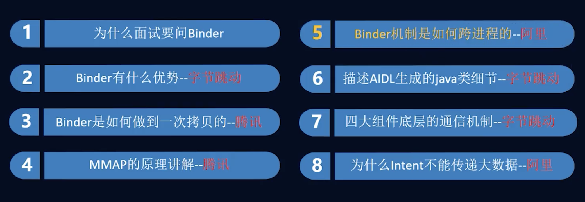
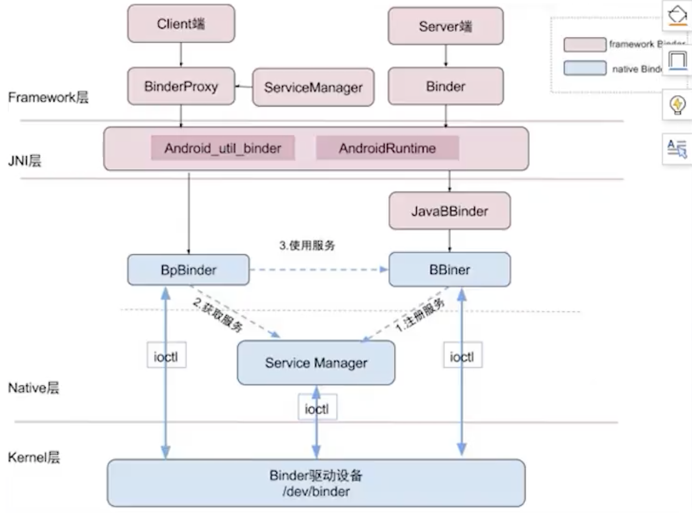
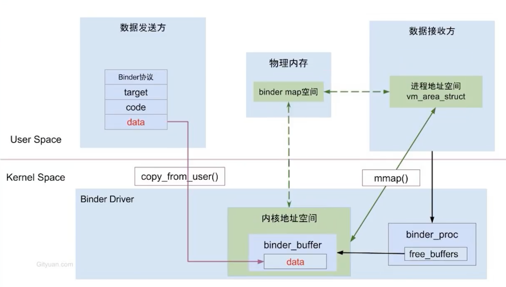

####  IPC方式

信号量

共享内存 : 容易导致同步问题。因为用户端没法解决。

Socket

Binder: 服务端映射后， 官方解决了同步问题。





#### 多进程作用


#### Binder流程




#### Binder机制

##### mmap作用

让一块虚拟内存 指向一块已知的物理内存。  这个物理内存是binder提供的。




#### 传统进程通信


#### Binder进程通信


#####  查看进程分配的内存大小

```
AppledeMacBook-Pro:MineUtils apple$ adb shell
generic_x86:/ $ getprop dalvik.vm.heapsize
512m
```

https://www.bilibili.com/video/BV1Hr4y1P7QC?from=search&seid=18026610356055236655

https://www.bilibili.com/video/BV1Hr4y1P7QC?p=4

https://www.bilibili.com/video/BV1Hr4y1P7QC?p=5&spm_id_from=pageDriver

https://github.com/weidongshan/APP_0005_Binder_JAVA_App

https://www.bilibili.com/video/BV1tW411i7aB?p=22
