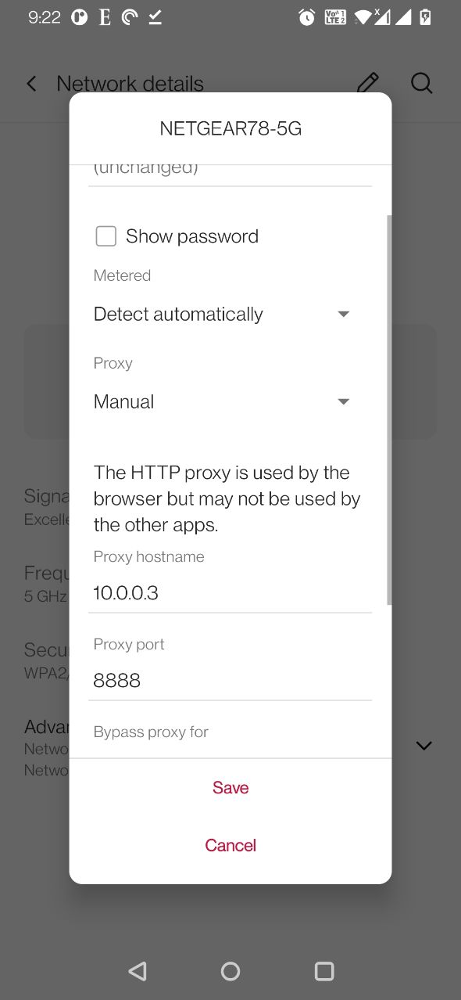
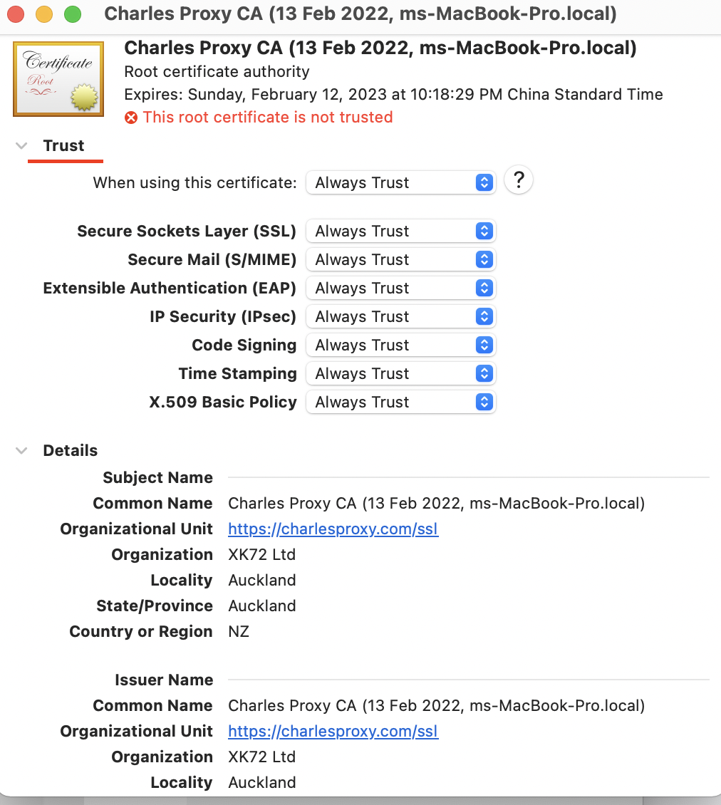
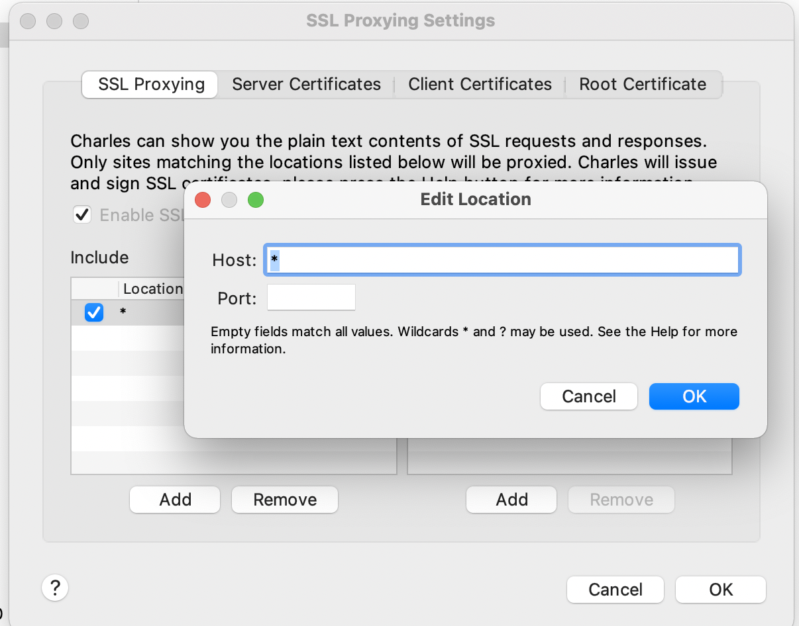

#### Charles抓包

按照这个地址配置

https://www.jianshu.com/p/e8dd1091d6d7

设置http代理

Https乱码问题

https://www.jianshu.com/p/0caaea590c8c

1. keychain 

   

   

还有设置就解决了https乱码的问题

https://www.jianshu.com/p/0caaea590c8c

Okhttp

https://juejin.im/post/5ddddd2a6fb9a07161483fb2

Mock data

https://zhuanlan.zhihu.com/p/140942687

####  Fiddler

https://www.jianshu.com/p/4a8dae519efe
https://www.jianshu.com/p/99b6b4cd273c

####  WireShark

安装
https://www.linuxidc.com/Linux/2016-08/134526.htm

http://www.cnblogs.com/wangqiguo/p/4529250.html
http://www.cnblogs.com/TankXiao/archive/2012/10/10/2711777.html

https://juejin.im/post/5cc313755188252d6f11b463

