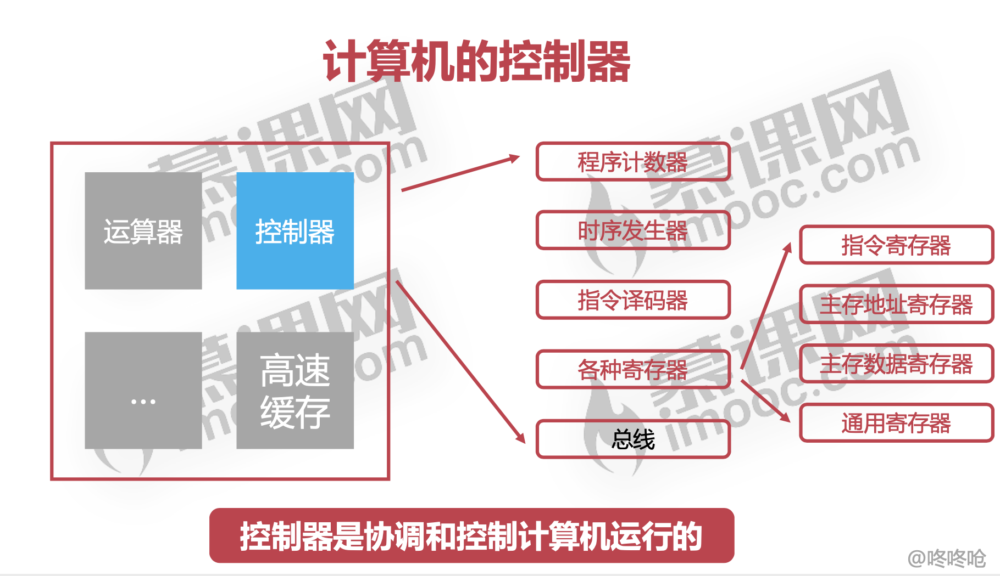
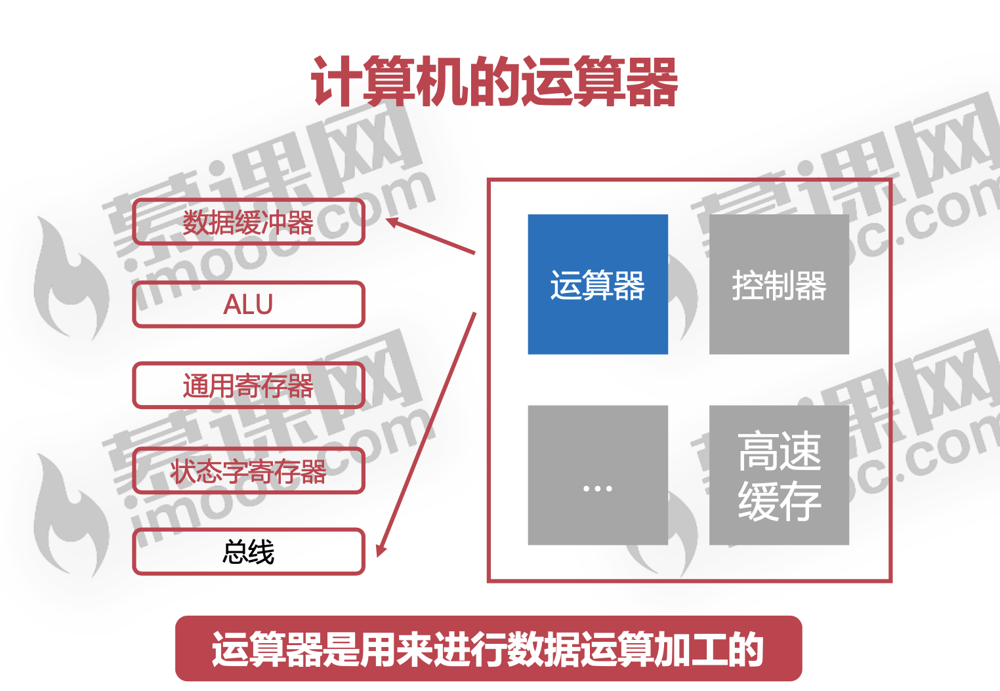
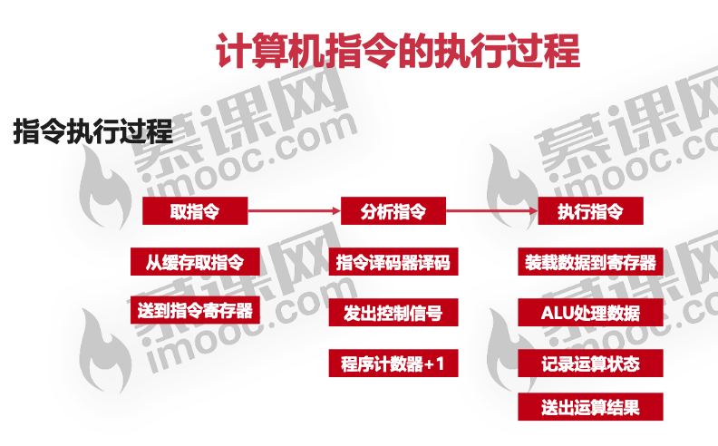

组成原理

CPU

运算器  控制器  高速缓存

主存储器= 内存

#### 控制器

* 程序计数器:

   用于提供其他控制单元，当前要执行的指令地址

* 时序发生器:

   用于发送时序脉冲， 依据不同的时序脉冲有节奏的进行工作

* 寄存器

  指令寄存器 :从主存或高速缓存取计算机指令

  主存地址寄存器：保存当前CPU正要访问的内存单元的地址

  主存地址寄存器： 保存当前CPU正要读或写的主存数据

  通用寄存器:

  用于暂存或传送数据或指令

  可保存ALU的运算中间结果

  容量比一般专用寄存器要大

  

​	

#### 运算器

##### 数据缓冲器

​	分为输入缓冲和输出缓冲

​	输入缓冲暂时存放外设送过来的数据

​	输出缓冲暂时存放送往外设的数据

##### ALU

​	ALU:算术逻辑单元，是运算器的主要组成

​	常见的位运算(左右移、与或非等)

​	算术运算(加减乘除等)

##### 通用寄存器

​	用于暂时存放或传送数据或指令

​	可保存ALU的运算中间结果

​	容量比一般专用寄存器要大

##### 状态字寄存器

​	存放运算状态(条件码、进位、溢出、结果正负等)

​	存放运算控制信息(调试跟踪标记位、允许中断位等)

#### 高速缓存

#### 指令执行过程

#### 高速缓存

命中率

不在缓存的数据需要去主存拿

 ####  4GB是寻址空间为什么是4G ,byte而不是 bit 

现在的内存可以看作一个很长的，每项宽度8位（即1Bit）的很长的数列,**既然是数列，那么每一项便对应一个序号，这个序号便是地址，就如同你家在一条大街的第几号一样**

https://www.zhihu.com/question/61974351