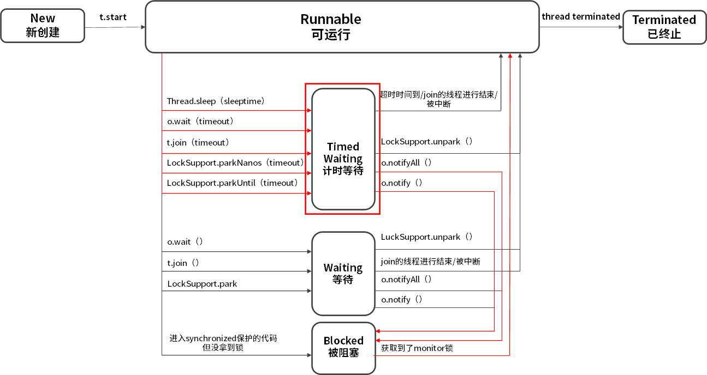

#### 线程是如何在 6 种状态之间转换

##### 线程的6中状态

1. New（新创建）
2. Runnable（可运行）
3. Blocked（被阻塞）
4. Waiting（等待）
5. Timed Waiting（计时等待）
6. Terminated（被终止）



##### 状态分析

* New

  ​		当我们用 new Thread() 新建一个线程时，如果线程没有开始运行 start() 方法，所以也没有开始执行 run() 方法里面的代码，那么此时它的状态就是 New。而一旦线程调用了 start()，它的状态就会从 New 变成 Runnable

  如果一个正在运行的线程是 Runnable 状态，当它运行到任务的一半时，执行该线程的 CPU 被调度去做其他事情，导致该线程暂时不运行，它的状态依然不变，还是 Runnable，因为它有可能随时被调度回来继续执行任务。

* **Blocked**

  ​	从 Runnable 状态进入 Blocked 状态只有一种可能，就是进入 synchronized 保护的代码时没有抢到 monitor 锁，无论是进入 synchronized 代码块，还是 synchronized 方法，都是一样。

* ###### Waiting 等待

  1. 没有设置 Timeout 参数的 Object.wait() 方法。

  2. 没有设置 Timeout 参数的 Thread.join() 方法。

  3. LockSupport.park() 方法。

     

  Blocked 仅仅针对 synchronized monitor 锁，可是在 Java 中还有很多其他的锁，比如 ReentrantLock，如果线程在获取这种锁时没有抢到该锁就会进入 Waiting 状态，因为本质上它执行了 LockSupport.park() 方法，所以会进入 Waiting 状态。同样，Object.wait() 和 Thread.join() 也会让线程进入 Waiting 状态。

  Blocked 与 Waiting 的区别是 Blocked 在等待其他线程释放 monitor 锁，而 Waiting 则是在等待某个条件，比如 join 的线程执行完毕，或者是 notify()/notifyAll() 。

* ###### Timed Waiting 限期等待

  在 Waiting 上面是 Timed Waiting 状态，这两个状态是非常相似的，区别仅在于有没有时间限制，Timed Waiting 会等待超时，由系统自动唤醒，或者在超时前被唤醒信号唤醒。

  以下情况会让线程进入 Timed Waiting 状态。

  1. 设置了时间参数的 Thread.sleep(long millis) 方法；
  2. 设置了时间参数的 Object.wait(long timeout) 方法；
  3. 设置了时间参数的 Thread.join(long millis) 方法；
  4. 设置了时间参数的 LockSupport.parkNanos(long nanos) 方法和 LockSupport.parkUntil(long deadline) 方法。

  想要从 Blocked 状态进入 Runnable 状态，要求线程获取 monitor 锁，而从 Waiting 状态流转到其他状态则比较特殊，因为首先 Waiting 是不限时的，也就是说无论过了多长时间它都不会主动恢复。

  如果其他线程调用 notify() 或 notifyAll()来唤醒它，它会直接进入 Blocked 状态，这是为什么呢？因为唤醒 Waiting 线程的线程如果调用 notify() 或 notifyAll()，要求必须首先持有该 monitor 锁，所以处于 Waiting 状态的线程被唤醒时拿不到该锁，就会进入 Blocked 状态，直到执行了 notify()/notifyAll() 的唤醒它的线程执行完毕并释放 monitor 锁，才可能轮到它去抢夺这把锁，如果它能抢到，就会从 Blocked 状态回到 Runnable 状态。

  同样在 Timed Waiting 中执行 notify() 和 notifyAll() 也是一样的道理，它们会先进入 Blocked 状态，然后抢夺锁成功后，再回到 Runnable 状态。

* Terminated

  run() 方法执行完毕，线程正常退出。

  出现一个没有捕获的异常，终止了 run() 方法，最终导致意外终止。


##### 注意

1. 线程的状态是需要按照箭头方向来走的，比如线程从 New 状态是不可以直接进入 Blocked 状态的，它需要先经历 Runnable 状态。
2. 线程生命周期不可逆：一旦进入 Runnable 状态就不能回到 New 状态；一旦被终止就不可能再有任何状态的变化。所以一个线程只能有一次 New 和 Terminated 状态，只有处于中间状态才可以相互转换。


#### 线程的停止方法

##### 原因

通常情况下，我们不会手动停止一个线程，而是允许线程运行到结束，

贸然强制停止线程就可能会造成一些安全的问题，为了避免造成问题就需要给对方一定的时间来整理收尾工作。比如：线程正在写入一个文件，这时收到终止信号，它就需要根据自身业务判断，是选择立即停止，还是将整个文件写入成功后停止，而如果选择立即停止就可能造成数据不完整，不管是中断命令发起者，还是接收者都不希望数据出现问题。

#### 正确的停止方式

对于 Java 而言，最正确的停止线程的方式是使用 interrupt。但 interrupt 仅仅起到通知被停止线程的作用。而对于被停止的线程而言，它拥有完全的自主权，它既可以选择立即停止，也可以选择一段时间后停止，也可以选择压根不停止。那么为什么 Java 不提供强制停止线程的能力呢

```java
while (!Thread.currentThread().isInterrupted() && more work to do) {
    do more work
}
```

例子1

```java
public class StopThread implements Runnable {
    @Override
    public void run() {
        int count = 0;
        while (!Thread.currentThread().isInterrupted() && count < 1000) {
            System.out.println("count = " + count++);
        }
        System.out.println("sleep isInterrupted " + Thread.currentThread().isInterrupted());
    }

    public static void main(String[] args) throws InterruptedException {
        Thread thread = new Thread(new StopThread());
        thread.start();
        Thread.sleep(5);
        thread.interrupt();
    }
}
```

运行结果

```
count = 0
count = 1
count = 2
.
.
count = 304
count = 305
count = 306
sleep isInterrupted true
```


##### sleep 期间能否感受到中断

1. try catch在while外面

   ```java
   public class StopDuringSleep {
       public static void main(String[] args) throws InterruptedException {
           Runnable runnable = () -> {
               int num = 0;
               try {
                   while (!Thread.currentThread().isInterrupted() && num <= 1000) {
                       System.out.println(num);
                       num++;
                       Thread.sleep(1000000);
                   }
               } catch (InterruptedException e) {
                   e.printStackTrace();
               }
           };
           Thread thread = new Thread(runnable);
           thread.start();
           Thread.sleep(5);
           thread.interrupt();
       }
   }
   ```

   在还没打印完1000个数的时候就会停下来，这种就属于通过 interrupt 正确停止线程的情况。

   输出

   > 0

2. try catch在while里面

   外层设置标志中断

   ```java
   public class StopDuringSleep_answer01 {
       public static void main(String[] args) throws InterruptedException {
           Runnable runnable = () -> {
               while (!Thread.currentThread().isInterrupted()) {
                   try {
                       subTas2();
                   } catch (InterruptedException e) {
   //                    Thread.currentThread().interrupt(); 注释2
                   }
               }
               System.out.println("thread  isInterrupted " + Thread.currentThread().isInterrupted());
           };
           Thread thread = new Thread(runnable);
           thread.start();
           Thread.sleep(50);
   
           thread.interrupt();
       }
   
       private static void subTas2() throws InterruptedException {
           System.out.println("subTas2  isInterrupted " + Thread.currentThread().isInterrupted());
           Thread.sleep(1000);
       }
   }
   ```

   输出

   > subTas2  isInterrupted false
   > subTas2  isInterrupted false
   > subTas2  isInterrupted false
   > subTas2  isInterrupted false

   把注释打开输出

   > subTas2  isInterrupted false
   > thread  isInterrupted true

   结论 ：如果 sleep、wait 等可以让线程进入阻塞的方法使线程休眠了，而处于休眠中的线程被中断，那么线程是可以感受到中断信号的，并且会抛出一个 InterruptedException 异常，**同时清除中断信号，将中断标记位设置成 false**。这样一来就不用担心长时间休眠中线程感受不到中断了，因为即便线程还在休眠，仍然能够响应中断通知，并抛出异常。

   我们先来看下 try/catch 的处理逻辑。如上面的代码所示，catch 语句块里代码是空的，它并没有进行任何处理。假设线程执行到这个方法，并且正在 sleep，此时有线程发送 interrupt 通知试图中断线程，就会立即抛出异常，并清除中断信号。抛出的异常被 catch 语句块捕捉。

   但是，捕捉到异常的 catch 没有进行任何处理逻辑，相当于把中断信号给隐藏了，这样做是非常不合理的，那么究竟应该怎么处理呢？首先，可以选择在方法签名中抛出异常。

3. 另一种处理方式类似

   ```java
   public class StopDuringSleep_answer01 {
       public static void main(String[] args) throws InterruptedException {
           Runnable runnable = () -> {
               while (!Thread.currentThread().isInterrupted()) {
                   subTas1();
               }
               System.out.println("thread  isInterrupted " + Thread.currentThread().isInterrupted());
           };
           Thread thread = new Thread(runnable);
           thread.start();
           Thread.sleep(50);
   
           thread.interrupt();
       }
   
       private static void subTas2() throws InterruptedException {
           System.out.println("subTas2  isInterrupted " + Thread.currentThread().isInterrupted());
           Thread.sleep(1000);
       }
   
       private static void subTas1() {
           try {
               Thread.sleep(1000);
           } catch (InterruptedException e) {
               // 在这里不处理该异常是非常不好的
               Thread.currentThread().interrupt();
           }
       }
   
   }
   ```

   再次中断方式 设置标志,在方法中处理，上一种是抛出上一层,在上一层设置标志中断

#### volatile 修饰标记位不适用的场景

##### 生产者/消费者模式的案例来演示为什么说  volatile 标记位的停止方法是不完美的。

生产者

```java
public class Producer implements Runnable {
    public volatile boolean canceled = false;
    BlockingQueue storage;

    public Producer(BlockingQueue storage) {
        this.storage = storage;
    }

    @Override
    public void run() {
        int num = 0;
        try {
            while (num <= 100000 && !canceled) {
                if (num % 50 == 0) {
                    storage.put(num);
                    System.out.println(num + "是50的倍数,被放到仓库中了。");
                }
                num++;
            }
        } catch (InterruptedException e) {
            e.printStackTrace();
        } finally {
            System.out.println("生产者结束运行");
        }
    }
}
```


消费者

```java
public class Consumer {
    BlockingQueue storage;

    public Consumer(BlockingQueue storage) {
        this.storage = storage;
    }

    public boolean needMoreNums() {
        if (Math.random() > 0.97) {
            return false;
        }
        return true;
    }
}
```


```java
ArrayBlockingQueue storage = new ArrayBlockingQueue(8);

Producer producer = new Producer(storage);
Thread producerThread = new Thread(producer);
producerThread.start();
try {
    Thread.sleep(500);
} catch (InterruptedException e) {
    e.printStackTrace();
}

Consumer consumer = new Consumer(storage);
while (consumer.needMoreNums()) {
    try {
        System.out.println(consumer.storage.take() + "被消费了");
    } catch (InterruptedException e) {
        e.printStackTrace();
    }
    try {
        Thread.sleep(3000);
    } catch (InterruptedException e) {
        e.printStackTrace();
    }
}
System.out.println("消费者不需要更多数据了。");

//一旦消费不需要更多数据了，我们应该让生产者也停下来，但是实际情况却停不下来
producer.canceled = true;
System.out.println(producer.canceled);
```

当 `producer.canceled = true`时,生产者Producer跳出循环 while (num <= 100000 && !canceled) ,来到运行

```java
 System.out.println("生产者结束运行");
```

然而结果却不是我们想象的那样，尽管已经把 canceled 设置成 true，但生产者仍然没有停止，这是因为在这种情况下，生产者在执行 storage.put(num) 时发生阻塞，在它被叫醒之前是没有办法进入下一次循环判断 canceled 的值的，所以在这种情况下用 volatile 是没有办法让生产者停下来的，相反如果用 interrupt 语句来中断，即使生产者处于阻塞状态，仍然能够感受到中断信号，并做响应处理。


##### 修复版本

```java
public class WrongWayVolatileFixed {
    public static void main(String[] args) throws InterruptedException {
        ArrayBlockingQueue storage = new ArrayBlockingQueue(10);
        WrongWayVolatileFixed body = new WrongWayVolatileFixed();
        Producer producer = body.new Producer(storage);
        Thread producerThread = new Thread(producer);
        producerThread.start();
        Thread.sleep(1000);

        Consumer consumer = body.new Consumer(storage);
        while (consumer.needMoreNums()) {
            System.out.println(storage.take()+"被消费");
            Thread.sleep(100);
        }
        System.out.println("消费者不需要更多数据了");
        /**
         *  一旦消费不需要更多数据了，我们应该让生产者也停下来，
         *  但是实际情况,在 storage.put(num);处被阻塞了，无法进入新的一层while()循环中判断，!Canceled 的值也就无法判断
         */
        producerThread.interrupt();

    }
    class Producer implements Runnable{

        BlockingQueue storage;

        public Producer(BlockingQueue storage) {
            this.storage = storage;
        }

        @Override
        public void run() {
            int num = 0;
            try {
                //canceled为true，则无法进入
                while (num <= 100000 && !Thread.currentThread().isInterrupted()) {
                    if (num % 100 == 0) {
                        storage.put(num);
                        System.out.println(num + "是100的倍数,被放到仓库中了。");
                    }
                    num++;
                }
            } catch (InterruptedException e) {
                e.printStackTrace();
            } finally {
                System.out.println("生产者结束运行");
            }
        }

    }

    class Consumer {

        BlockingQueue storage;

        public Consumer(BlockingQueue storage) {
            this.storage = storage;
        }

        public boolean needMoreNums() {
            if (Math.random() > 0.95) {
                return false;
            }
            return true;
        }
    }

}
```

 producerThread.interrupt();去打断

##### 线程池关闭方式

```java
public class ShutdownTest {
    public static void main(String[] args) {
        ExecutorService exec = Executors.newCachedThreadPool();
        exec.submit(new ShutDownThread());
        try {
            TimeUnit.SECONDS.sleep(3);
        } catch (InterruptedException e) {
            e.printStackTrace();
        }
        exec.shutdownNow();

    }

    static class ShutDownThread implements Runnable {
        static int taskId = 0;

        @Override
        public void run() {
            while (!Thread.currentThread().isInterrupted()){
                try {
                    Thread.sleep(5000);
                    System.out.println();
                } catch (InterruptedException e) {
                    e.printStackTrace();
                    Thread.currentThread().interrupt();
                }
                System.out.println("taskId Terminated" + taskId++);
            }
            System.out.println("");
        }
    }
}
```

