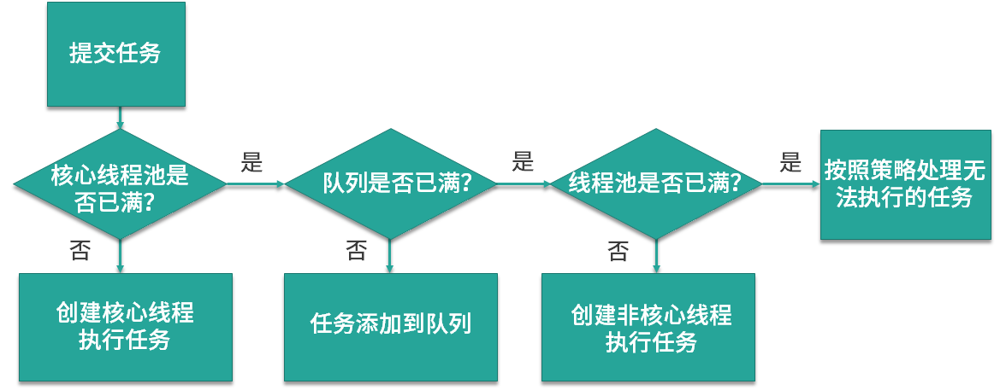
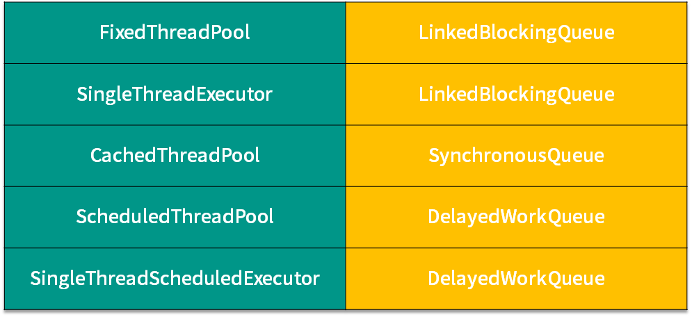

#### 正确停用线程


#### 线程池

##### 拒绝策略

* 第一种拒绝策略是 AbortPolicy，这种拒绝策略在拒绝任务时，会直接抛出一个类型为 RejectedExecutionException 的 RuntimeException，让你感知到任务被拒绝了，于是你便可以根据业务逻辑选择重试或者放弃提交等策略。

* 第二种拒绝策略是 DiscardPolicy，这种拒绝策略正如它的名字所描述的一样，当新任务被提交后直接被丢弃掉，也不会给你任何的通知，相对而言存在一定的风险，因为我们提交的时候根本不知道这个任务会被丢弃，可能造成数据丢失。

* 第三种拒绝策略是 DiscardOldestPolicy，如果线程池没被关闭且没有能力执行，则会丢弃任务队列中的头结点，通常是存活时间最长的任务，这种策略与第二种不同之处在于它丢弃的不是最新提交的，而是队列中存活时间最长的，这样就可以腾出空间给新提交的任务，但同理它也存在一定的数据丢失风险。

* 第四种拒绝策略是 CallerRunsPolicy，相对而言它就比较完善了，当有新任务提交后，如果线程池没被关闭且没有能力执行，则把这个任务交于提交任务的线程执行，也就是谁提交任务，谁就负责执行任务。这样做主要有两点好处。
  第一点新提交的任务不会被丢弃，这样也就不会造成业务损失。
  第二点好处是，由于谁提交任务谁就要负责执行任务，这样提交任务的线程就得负责执行任务，而执行任务又是比较耗时的，在这段期间，提交任务的线程被占用，也就不会再提交新的任务，减缓了任务提交的速度，相当于是一个负反馈。在此期间，线程池中的线程也可以充分利用这段时间来执行掉一部分任务，腾出一定的空间，相当于是给了线程池一定的缓冲期。

  **提交任务的线程是不固定的，取决于具体是哪个线程执行submit等方法的**

https://kaiwu.lagou.com/course/courseInfo.htm?courseId=16#/detail/pc?id=248

##### 6 种线程池



1. FixedThreadPool

   它的核心线程数和最大线程数是一样的

2. CachedThreadPool

   它的特点在于线程数是几乎可以无限增加的（实际最大可以达到 Integer.MAX_VALUE，为 2^31-1),当我们提交一个任务后，线程池会判断已创建的线程中是否有空闲线程，如果有空闲线程则将任务直接指派给空闲线程，如果没有空闲线程，则新建线程去执行任务，这样就做到了动态地新增线程。

   ```java
   ExecutorService service = Executors.newCachedThreadPool();
       for (int i = 0; i < 1000; i++) { 
           service.execute(new Task() { 
       });
    }
   ```

   使用 for 循环提交 1000 个任务给 CachedThreadPool，假设这些任务处理的时间非常长，会发生什么情况呢？因为 for 循环提交任务的操作是非常快的，但执行任务却比较耗时，就可能导致 1000 个任务都提交完了但第一个任务还没有被执行完，所以此时 CachedThreadPool 就可以动态的伸缩线程数量，随着任务的提交，不停地创建 1000 个线程来执行任务，而当任务执行完之后，假设没有新的任务了，那么大量的闲置线程又会造成内存资源的浪费，这时线程池就会检测线程在 60 秒内有没有可执行任务，如果没有就会被销毁，最终线程数量会减为 0。

3. ScheduledThreadPool

   周期性的执行任务


#### 线程数量和CPU核数关系

`线程数 = CPU 核心数 *（1+平均等待时间/平均工作时间）`

1. 线程平均等待时间所占比例越高，就需要越多的线程

   > 耗时 IO 型任务 , 比如数据库、文件的读写，网络通信等任务，这种任务的特点是并不会特别消耗 CPU 资源，但是 IO 操作很耗时，总体会占用比较多的时间 , 因为 IO 读写速度相比于 CPU 的速度而言是比较慢的，如果我们设置过少的线程数，就可能导致 CPU 资源的浪费,而如果我们设置更多的线程数，那么当一部分线程正在等待 IO 的时候，它们此时并不需要 CPU 来计算，那么另外的线程便可以利用 CPU 去执行其他的任务，互不影响，这样的话在任务队列中等待的任务就会减少，可以更好地利用资源。

2.  线程的平均工作时间所占比例越高，就需要越少的线程

   >  平均工作时间长 : CPU密集型任务，加密、解密、压缩、计算等一系列需要大量耗费 CPU 资源的任务。因为计算任务非常重，会占用大量的 CPU 资源，所以这时 CPU 的每个核心工作基本都是满负荷的，而我们又设置了过多的线程，每个线程都想去利用 CPU 资源来执行自己的任务，这就会造成不必要的上下文切换，此时线程数的增多并没有让性能提升，反而由于线程数量过多会导致性能下降。

   可以通过写代码等办法统计到各部分语句的运行时长


如果我们执行的任务类型不是固定的，比如可能一段时间是 CPU 密集型，另一段时间是 IO 密集型，或是同时有两种任务相互混搭。那么在这种情况下，我们可以把最大线程数设置成核心线程数的几倍，以便应对任务突发情况。当然更好的办法是用不同的线程池执行不同类型的任务，让任务按照类型区分开，而不是混杂在一起，这样就可以按照上一课时估算的线程数或经过压测得到的结果来设置合理的线程数了，达到更好的性能。

https://kaiwu.lagou.com/course/courseInfo.htm?courseId=16#/detail/pc?id=254


#### 阻塞队列



1. LinkedBlockingQueue (FixedThreadPool,SingleThreadExector)

   使用的有 FixedThreadPool ,SingleThreadExector,它们使用的阻塞队列是容量为 Integer.MAX_VALUE 的 LinkedBlockingQueue,可以认为是无界队列。由于 FixedThreadPool 线程池的线程数是固定的，所以没有办法增加特别多的线程来处理任务，这时就*需要 LinkedBlockingQueue 这样一个没有容量限制的阻塞队列来存放任务*。

   *缺点*: 最终大量堆积的任务会占用大量内存，并发生 OOM ，也就是OutOfMemoryError.

2. SynchronousQueue  (CachedThreadPool)

   对应的线程池是 CachedThreadPool,线程池 CachedThreadPool 的最大线程数是 Integer 的最大值，可以理解为线程数是可以无限扩展的。和LinkedBlockingQueue阻塞队列重复相反，

   *缺点*: 当任务数量特别多的时候，就可能会导致创建非常多的线程，最终超过了操作系统的上限而无法创建新线程，或者导致内存不足。

3. DelayedWorkQueue (DelayedWorkQueue)

   顾名思义，特点就是可以延迟执行任务

   *缺点*: 它采用的任务队列是 DelayedWorkQueue，这是一个延迟队列，同时也是一个无界队列，所以和 LinkedBlockingQueue 一样，如果队列中存放过多的任务，就可能导致 OOM

   

#### ThinkInJava

##### 并发

让步(yield)

  如果已经完成了run()方法循环的一次迭代过程所需的工作，可以给线程调度机制一个暗示：你的工作已经做的差不多了，可以让别的线程使用CPU了，这个暗示將通过调用yield()来做做出(不过这只是一个暗示，没有任何机制保证它將被采纳)，也只是建议相同优先级的其他线程运行。
  -ThinkInJava P661

加入一个线程 (join)

　在Joiner线程里面调用Sleeper线程 的join() , Joiner任务必须等Sleeper任务结束活被打断或结束　才恢复

```
class Sleeper extends Thread {
    private int duration;

    public Sleeper(String name, int sleepTime) {
        super(name);
        duration = sleepTime;
        start();
    }

    @Override
    public void run() {
        super.run();
        try {
            sleep(duration);
//            Print.print(getName()+"执行了");
        } catch (InterruptedException e) {
            Print.print(getName() + "  被打断" + "isInterrupted()  " + isInterrupted());
            return;
        }
        Print.print(getName() + "   has awakened");
    }
}

class Joiner extends Thread {
    private Sleeper sleeper;

    public Joiner(String name, Sleeper sleeper) {
        super(name);
        this.sleeper = sleeper;
        start();
    }

    @Override
    public void run() {
        super.run();
        try {
            sleeper.join();
        } catch (InterruptedException e) {
            e.printStackTrace();
        }
        Print.print(getName() + "   join completed");
    }
}

public class Joining {
    public static void main(String[] args) {
        Sleeper
                sleepy = new Sleeper("Sleepy", 1500),
                grumpy = new Sleeper("Grumpy", 1500);

        Joiner
                dopey = new Joiner("Dopey", sleepy),
                doc = new Joiner("Doc", grumpy);
        grumpy.interrupt();

```

其他对象上同步

 有时候必须在另一个对象上同步，如果需要这样，必须确保所有相关的任务都是在同一个对象上同步。
```
class DualSynch {
    private Object syncObject = new Object();

    public synchronized void f() {
        for (int i = 0; i < 5; i++) {
            System.out.print("  f()  ");
            Thread.yield();
        }
    }

    public  void g() {
        synchronized (syncObject) {
            for (int i = 0; i < 5; i++) {
                System.out.print("  g()  ");
                Thread.yield();
            }
        }
    }
}

public class SyncObject {
    public static void main(String[] args) {
        DualSynch ds = new DualSynch();
        new Thread() {
            @Override
            public void run() {
                super.run();
                ds.f();
            }
        }.start();
        ds.g();
    }
}
```
这两个方式在同时运行，任何一个方法都没有对另一个方法同步而阻塞

线程间的协作

wait() :  在wait期间　对象锁是释放的,而Sleep期间是没有的

##  

CountDownLatch

https://www.jianshu.com/p/cef6243cdfd9

latch.countDown();//完成一个任务就调用一次


#####  学习方法

https://mp.weixin.qq.com/s/BHDrSgwUVXkzvswK1khidQ

https://github.com/Snailclimb/programmer-advancement

https://juejin.im/post/5a743c526fb9a063557d7eba


https://juejin.im/post/6855586076132655118


#### 并发编程之美

9  //线程A阻塞 ，并释放获取到的 resourceA的锁

System.out.println (”threadA release resourceA lock"); 

resourceA .wait() ; //并释放获取到的 resourceA的锁? 为什么会释放


