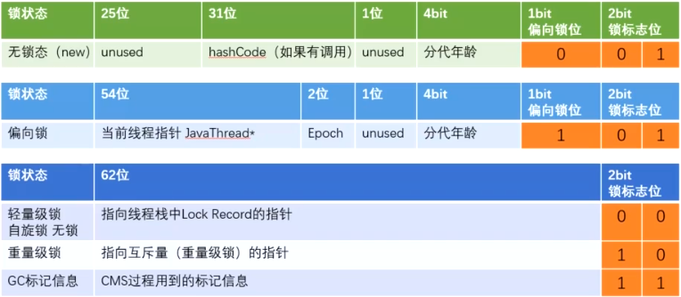

#### 锁的7大类

##### 偏向锁/轻量级锁/重量级锁；



 * 偏向锁

   ​	如果自始至终，对于这把锁都不存在竞争，那么其实就没必要上锁，只需要打个标记就行了，这就是偏向锁的思想。

 * 轻量级锁

   ​	JVM 开发者发现在很多情况下，synchronized 中的代码是被多个线程交替执行的，而不是同时执行的，也就是说并不存在实际的	竞争，或者是只有短时间的锁竞争，用 CAS 就可以解决，这种情况下，用完全互斥的重量级锁是没必要的。

 * 重量级锁

   ​	重量级锁是互斥锁，它是利用操作系统的同步机制实现的，所以开销相对比较大。当多个线程直接有实际竞争，且锁竞争时间长的时候，轻量级锁不能满足需求，锁就会膨胀为重量级锁。重量级锁会让其他申请却拿不到锁的线程进入阻塞状态。

   

   

   ##### 锁升级

   

   * synchronized锁升级

     偏向锁： markword记录这个线程ID -》如果线程争用升级为自旋锁 -》10次以后升级为重量级锁

   #### synchronized的monitor 锁

   ##### 同步代码块

   ```java
   public class SynTest {
       public void synBlock() {
           synchronized (this) {
               System.out.println("lagou");
           }
       }
   }
   ```

   反编译后的字节码

   ```java
    public void synBlock();
       descriptor: ()V
       flags: ACC_PUBLIC
       Code:
         stack=2, locals=3, args_size=1
            0: aload_0
            1: dup
            2: astore_1
            3: monitorenter
            4: getstatic     #2                  // Field java/lang/System.out:Ljava/io/PrintStream;
            7: ldc           #3                      // String lagou
            9: invokevirtual #4               // Method java/io/PrintStream.println:(Ljava/lang/String;)V
           12: aload_1
           13: monitorexit
           14: goto          22
           17: astore_2
           18: aload_1
           19: monitorexit
           20: aload_2
           21: athrow
           22: return
   ```

   synchronized 代码块实际上多了 monitorenter 和 monitorexit 指令，标红的第3、13、19行指令分别对应的是 monitorenter 和 monitorexit.可以把执行 monitorenter 理解为加锁，执行 monitorexit 理解为释放锁，每个对象维护着一个记录着被锁次数的计数器。未被锁定的对象的该计数器为 0。

   1. monitorenter

   执行 monitorenter 的线程尝试获得 monitor 的所有权，会发生以下这三种情况之一：

   a. 如果该 monitor 的计数为 0，则线程获得该 monitor 并将其计数设置为 1。然后，该线程就是这个 monitor 的所有者。

   b. 如果线程已经拥有了这个 monitor ，则它将重新进入，并且累加计数。

   c. 如果其他线程已经拥有了这个 monitor，那个这个线程就会被阻塞，直到这个 monitor 的计数变成为 0，代表这个 monitor 已经被释放了，于是当前这个线程就会再次尝试获取这个 monitor。

   2. monitorexit
      monitorexit 的作用是将 monitor 的计数器减 1，直到减为 0 为止。代表这个 monitor 已经被释放了，已经没有任何线程拥有它了，也就代表着解锁，所以，其他正在等待这个 monitor 的线程，此时便可以再次尝试获取这个 monitor 的所有权。

   从上面也可看到  **synchronized是可重入锁**

   ######  synchronized 方法

   ​		同步代码块是使用 monitorenter 和 monitorexit 指令实现的。而对于 synchronized 方法，并不是依靠 monitorenter 和 monitorexit 指令实现的，被 javap 反汇编后可以看到，synchronized 方法和普通方法大部分是一样的，不同在于，这个方法会有一个叫作 ACC_SYNCHRONIZED 的 flag 修饰符，来表明它是同步方法。

   ```java
   public synchronized void method() {
       method body
   }
   ```

   反编译后的指令

   ```java
     public synchronized void synMethod();
   
       descriptor: ()V
   
       flags: ACC_PUBLIC, ACC_SYNCHRONIZED
   
       Code:
   
         stack=0, locals=1, args_size=1
   
            0: return
   
         LineNumberTable:
   
           line 16: 0
   
   ```

   

   被 synchronized 修饰的方法会有一个 ACC_SYNCHRONIZED 标志。当某个线程要访问某个方法的时候，会首先检查方法是否有 ACC_SYNCHRONIZED 标志，如果有则需要先获得 monitor 锁，然后才能开始执行方法，方法执行之后再释放 monitor 锁。其他方面， synchronized 方法和刚才的 synchronized 代码块是很类似的，例如这时如果其他线程来请求执行方法，也会因为无法获得 monitor 锁而被阻塞。

   

   ###### synchronized 和 Lock选择

   1. 如果能不用最好既不使用 Lock 也不使用 synchronized。因为在许多情况下你可以使用 java.util.concurrent 包中的机制，它会为你处理所有的加锁和解锁操作，也就是推荐优先使用工具类来加解锁。

   2. 如果 synchronized 关键字适合你的程序， 那么请尽量使用它，这样可以减少编写代码的数量，减少出错的概率。因为一旦忘记在 finally 里 unlock，代码可能会出很大的问题，而使用 synchronized 更安全。

   3. 如果特别需要 Lock 的特殊功能，比如尝试获取锁、可中断、超时功能等，才使用 Lock。

      

   ###### Lock

   ```java
   public interface Lock {
       void lock();
       void lockInterruptibly() throws InterruptedException;
       boolean tryLock();
       boolean tryLock(long time, TimeUnit unit) throws InterruptedException;
       void unlock();
       Condition newCondition();
   }
   ```

   1. lock() 

      lock() 是最基础的获取锁的方法,获取锁和释放锁都是显式的，不像 synchronized 那样是隐式的，所以 Lock 不会像 synchronized 一样在异常时自动释放锁（synchronized 即使不写对应的代码也可以释放）,使用 lock() 时必须由我们自己主动去释放锁，因此最佳实践是执行 lock() 后，首先在 try{} 中操作同步资源，如果有必要就用 catch{} 块捕获异常，然后在 finally{} 中释放锁，以保证发生异常时锁一定被释放.

      ```java
      Lock lock = ...;
      lock.lock();
      try{
          //获取到了被本锁保护的资源，处理任务
          //捕获异常
      }finally{
          lock.unlock();   //释放锁
      }
      ```

      

   2. tryLock()

      ​	尝试获取锁，如果当前锁没有被其他线程占用，则获取成功，返回 true，否则返回 false，代表获取锁失败。该方法会立即返回，即便在拿不到锁时也不会一直等待，所以通常情况下，我们用 if 语句判断 tryLock() 的返回结果.

      ```java
      Lock lock = ...;
      if(lock.tryLock()) {
           try{
               //处理任务
           }finally{
               lock.unlock();   //释放锁
           } 
      }else {
          //如果不能获取锁，则做其他事情
      }
      ```

      这个方法可以方便的解决死锁问题

      ```java
       public void tryLock(Lock lock1, Lock lock2) throws InterruptedException {
              while (true) {
                  if (lock1.tryLock()) {
                      try {
                          if (lock2.tryLock()) {
                              try {
                                  System.out.println("获取到了两把锁，完成业务逻辑");
                                  return;
                              } finally {
                                  lock2.unlock();
                              }
                          }
                      } finally {
                          lock1.unlock();
                      }
                  } else {
                      Thread.sleep(new Random().nextInt(1000));
                  }
              }
          }
      ```

      如果代码中我们不用 tryLock() 方法,比如有两个线程同时调用这个方法，传入的 lock1 和 lock2 恰好是相反的，那么如果第一个线程获取了 lock1 的同时，第二个线程获取了 lock2，它们接下来便会尝试获取对方持有的那把锁，但是又获取不到，于是便会陷入死锁，使用tryLock()后，如果获取到了 lock1 但没有获取到 lock2，那么也会释放掉 lock1

   3. tryLock(long time, TimeUnit unit)

      使用 tryLock(long time, TimeUnit unit) 时，在等待了一段指定的超时时间后，线程会主动放弃这把锁的获取，避免永久等待；在等待的期间，也可以随时中断线程，这就避免了死锁的发生。

      

   4. lockInterruptibly()

      如果这个锁当前是可以获得的，那么这个方法会立刻返回,，但是如果这个锁当前是不能获得的（被其他线程持有），那么当前线程便会开始等待，除非它等到了这把锁或者是在等待的过程中被Thread的interrupt()方法中断了，否则这个线程便会一直在这里执行这行代码。一直尝试获取直到获取到为止。

      相比于不能响应中断的 synchronized 锁，lockInterruptibly() 可以让程序更灵活，可以在获取锁的同时，保持对中断的响应。我们可以把这个方法理解为超时时间是无穷长的 tryLock(long time, TimeUnit unit)，因为 tryLock(long time, TimeUnit unit) 和 lockInterruptibly() 都能响应中断，只不过 lockInterruptibly() 永远不会超时。

      ```java
       public void lockInterruptibly() {
              try {
                  lock.lockInterruptibly();
                  try {
                      System.out.println("操作资源");
                  } finally {
                      lock.unlock();
                  }
              } catch (InterruptedException e) {
                  e.printStackTrace();
              }
          }
      ```

   5. unlock()

      最后要介绍的方法是 unlock() 方法，是用于解锁的，u方法比较简单，对于 ReentrantLock 而言，执行 unlock() 的时候，内部会把锁的“被持有计数器”减 1，直到减到 0 就代表当前这把锁已经完全释放了，如果减 1 后计数器不为 0，说明这把锁之前被“重入”了，那么锁并没有真正释放，仅仅是减少了持有的次数。

   

   

   https://www.yinxiang.com/everhub/note/c27d346d-ed4d-4e7b-aef9-0b501a44deb7

   

   https://www.bilibili.com/video/BV1NT4y1G7WE?p=5

   https://www.bilibili.com/video/BV1qE411q7fk?p=10

   https://www.cnblogs.com/aspirant/p/11470858.html
   
   

##### 可重入锁/非可重入锁；

​	可重入锁 ： 可重入锁指的是线程当前已经持有这把锁了，能在不释放这把锁的情况下，再次获取这把锁。	

​	synchronized是可冲入锁

```java
public class T {
    synchronized void  m1(){
        System.out.println("m1 start");
        try {
            TimeUnit.SECONDS.sleep(1);
        } catch (InterruptedException e) {
            e.printStackTrace();
        }
        m2();
        System.out.println("m1 end");
    }

    private void m2() {
        try {
            TimeUnit.SECONDS.sleep(2);
        } catch (InterruptedException e) {
            e.printStackTrace();
        }
        System.out.println("m2");
    }

    public static void main(String[] args) {
        new T().m1();
    }
}
```

运行结果

```
m1 start
m2
m1 end
```

如果synchronized不是可重入锁，执行m1()执行m2()会发生死锁,

为什么synchronized必须是可重入锁呢?

如果父类m2()是synchronized方法,子类重写m2()方法，调用子类m2(),接着调用super.m2()就会发生死锁

##### 共享锁/独占锁

 * 共享锁

   共享锁指的是我们同一把锁可以被多个线程同时获得

 * 独占锁 

   这把锁只能同时被一个线程获得

   

   读写锁就最好地诠释了共享锁和独占锁的理念。读写锁中的读锁，是共享锁，而写锁是独占锁。读锁可以被同时读，可以同时被多个线程持有，而写锁最多只能同时被一个线程持有。

整体思路是它有两把锁，第 1 把锁是写锁，获得写锁之后，既可以读数据又可以修改数据，而第 2 把锁是读锁，获得读锁之后，只能查看数据，不能修改数据。读锁可以被多个线程同时持有，所以多个线程可以同时查看数据。

我们在使用读写锁时遵守下面的获取规则：

1. 如果有一个线程已经占用了读锁，则此时其他线程如果要申请读锁，可以申请成功。
2. 如果有一个线程已经占用了读锁，则此时其他线程如果要申请写锁，则申请写锁的线程会一直等待释放读锁，因为读写不能同时操作。
3. 如果有一个线程已经占用了写锁，则此时其他线程如果申请写锁或者读锁，都必须等待之前的线程释放写锁，同样也因为读写不能同时，并且两个线程不应该同时写。

所以我们用一句话总结：要么是一个或多个线程同时有读锁，要么是一个线程有写锁，但是两者不会同时出现。也可以总结为：读读共享、其他都互斥（写写互斥、读写互斥、写读互斥）。

```java
/**
 * 描述：     演示读写锁用法
 */
public class ReadWriteLockDemo {

    private static final ReentrantReadWriteLock reentrantReadWriteLock = new ReentrantReadWriteLock(
            false);
    private static final ReentrantReadWriteLock.ReadLock readLock = reentrantReadWriteLock
            .readLock();
    private static final ReentrantReadWriteLock.WriteLock writeLock = reentrantReadWriteLock
            .writeLock();

    private static void read() {
        readLock.lock();
        try {
            System.out.println(Thread.currentThread().getName() + "得到读锁，正在读取");
            Thread.sleep(500);
        } catch (InterruptedException e) {
            e.printStackTrace();
        } finally {
            System.out.println(Thread.currentThread().getName() + "释放读锁");
            readLock.unlock();
        }
    }

    private static void write() {
        writeLock.lock();
        try {
            System.out.println(Thread.currentThread().getName() + "得到写锁，正在写入");
            Thread.sleep(500);
        } catch (InterruptedException e) {
            e.printStackTrace();
        } finally {
            System.out.println(Thread.currentThread().getName() + "释放写锁");
            writeLock.unlock();
        }
    }

    public static void main(String[] args) throws InterruptedException {
        new Thread(() -> read()).start();
        new Thread(() -> read()).start();
        new Thread(() -> write()).start();
        new Thread(() -> write()).start();
    }
}
```

运行结果

```
Thread-0得到读锁，正在读取
Thread-1得到读锁，正在读取
Thread-0释放读锁
Thread-1释放读锁
Thread-2得到写锁，正在写入
Thread-2释放写锁
Thread-3得到写锁，正在写入
Thread-3释放写锁
```

读锁可以同时被多个线程获得，而写锁不能。

为什么要对读加锁 :  读本身是线程安全的，加读锁，主要是为了让写锁感知到，在有人读取的时候，不要同时写入。


ReentrantReadWriteLockTest.java

```
private static ReentrantReadWriteLock reentrantLock = new ReentrantReadWriteLock();
private static ReentrantReadWriteLock.ReadLock readLock = reentrantLock.readLock();
private static ReentrantReadWriteLock.WriteLock writeLock = reentrantLock.writeLock();

public static void read() {
    readLock.lock();
    try {
        System.out.println(Thread.currentThread().getName() + "获取读锁，开始执行");
        Thread.sleep(2000);
    } catch (Exception e) {
        e.printStackTrace();
    } finally {
        readLock.unlock();
        System.out.println(Thread.currentThread().getName() + "释放读锁");
    }
}
public static void write() {
    writeLock.lock();
    try {
        System.out.println(Thread.currentThread().getName() + "获取写锁，开始执行");
        Thread.sleep(2000);
    } catch (Exception e) {
        e.printStackTrace();
    } finally {
        writeLock.unlock();
        System.out.println(Thread.currentThread().getName() + "释放写锁");
    }
}

public static void main(String[] args) {
    new Thread(() -> read(), "Thread1").start();
    new Thread(() -> read(), "Thread2").start();
    new Thread(() -> write(), "Thread3").start();
    new Thread(() -> write(), "Thread4").start();
}
```

运行结果:

<u>Thread1获取读锁，开始执行
Thread2获取读锁，开始执行
Thread1释放读锁
Thread2释放读锁
Thread3获取写锁，开始执行
Thread3释放写锁
Thread4获取写锁，开始执行
Thread4释放写锁</u>


线程1和线程2可以同时获取读锁，而线程3和线程4只能依次获取写锁，因为线程4必须等待线程3释放写锁后才能获取到锁


https://blog.csdn.net/fanrenxiang/article/details/104312606


##### 公平锁/非公平锁；

* 公平锁 

  线程就都会进入等待，开始排队，在等待队列里等待时间长的线程会优先拿到这把锁，有先来先得的意思，公平锁指的是按照线程请求的顺序，来分配锁

* 非公平锁

  它会在一定情况下，忽略掉已经在排队的线程，发生插队现象，而非公平锁指的是不完全按照请求的顺序，在一定情况下，可以允许插队
  
  公平锁 `new ReentrantLock(false);`


```java
public class FairAndUnfair {
    public static void main(String args[]) {
        PrintQueue printQueue = new PrintQueue();


        Thread thread[] = new Thread[10];
        for (int i = 0; i < 10; i++) {
            thread[i] = new Thread(new Job(printQueue), "Thread " + i);
        }


        for (int i = 0; i < 10; i++) {
            thread[i].start();
            try {
                Thread.sleep(100);
            } catch (InterruptedException e) {
                e.printStackTrace();
            }
        }
    }

}


class Job implements Runnable {


    private PrintQueue printQueue;


    public Job(PrintQueue printQueue) {
        this.printQueue = printQueue;
    }


    @Override
    public void run() {
        System.out.printf("%s: Going to print a job\n", Thread.currentThread().getName());
        printQueue.printJob(new Object());
        System.out.printf("%s: The document has been printed\n", Thread.currentThread().getName());
    }


}


class PrintQueue {


    private final Lock queueLock = new ReentrantLock(false); //非公平锁


    public void printJob(Object document) {
        queueLock.lock();


        try {
            Long duration = (long) (Math.random() * 10000);
            System.out.printf("%s: PrintQueue: Printing a Job during %d seconds\n",
                    Thread.currentThread().getName(), (duration / 1000));
            Thread.sleep(duration);
        } catch (InterruptedException e) {
            e.printStackTrace();
        } finally {
            queueLock.unlock();
        }


        queueLock.lock();
        try {
            Long duration = (long) (Math.random() * 10000);
            System.out.printf("%s: PrintQueue: Printing a Job during %d seconds\n",
                    Thread.currentThread().getName(), (duration / 1000));
            Thread.sleep(duration);
        } catch (InterruptedException e) {
            e.printStackTrace();
        } finally {
            queueLock.unlock();
        }
    }
}
```


​		运行结果

```
Thread 0: Going to print a job
Thread 0: PrintQueue: Printing a Job during 8 seconds
Thread 1: Going to print a job
Thread 2: Going to print a job
Thread 3: Going to print a job
Thread 4: Going to print a job
Thread 5: Going to print a job
Thread 6: Going to print a job
Thread 7: Going to print a job
Thread 8: Going to print a job
Thread 9: Going to print a job
Thread 0: PrintQueue: Printing a Job during 2 seconds
Thread 0: The document has been printed
Thread 1: PrintQueue: Printing a Job during 8 seconds
Thread 1: PrintQueue: Printing a Job during 8 seconds
Thread 1: The document has been printed
Thread 2: PrintQueue: Printing a Job during 7 seconds
Thread 2: PrintQueue: Printing a Job during 5 seconds
Thread 2: The document has been printed
Thread 3: PrintQueue: Printing a Job during 5 seconds
Thread 3: PrintQueue: Printing a Job during 0 seconds
Thread 3: The document has been printed
Thread 4: PrintQueue: Printing a Job during 5 seconds
Thread 4: PrintQueue: Printing a Job during 9 seconds
Thread 4: The document has been printed
Thread 5: PrintQueue: Printing a Job during 6 seconds
Thread 5: PrintQueue: Printing a Job during 6 seconds
Thread 5: The document has been printed
Thread 6: PrintQueue: Printing a Job during 1 seconds
Thread 6: PrintQueue: Printing a Job during 5 seconds
Thread 6: The document has been printed
Thread 7: PrintQueue: Printing a Job during 1 seconds
Thread 7: PrintQueue: Printing a Job during 1 seconds
Thread 7: The document has been printed
Thread 8: PrintQueue: Printing a Job during 6 seconds
Thread 8: PrintQueue: Printing a Job during 1 seconds
Thread 8: The document has been printed
Thread 9: PrintQueue: Printing a Job during 1 seconds
Thread 9: PrintQueue: Printing a Job during 0 seconds
Thread 9: The document has been printed
```

可以看到thread1释放锁后又重新获取到锁


​	ReentrantLockTest.java

```
private static final int COUNT = 100;
private static int start = 1;
static ReentrantLock lock = new ReentrantLock(true);

public static void main(String[] args) {
    Runnable task = () -> {
        for (; ; ) {
            lock.lock();
            try {
                if (start <= COUNT) {
                    System.out.println(Thread.currentThread().getName() + "=> " + start++);
                } else {
                    System.exit(0);
                }
            } finally {
                lock.unlock();
            }
        }
    };
    new Thread(task).start();
    new Thread(task).start();
```

运行结果:

<br>

Thread-0=> 1
Thread-1=> 2
Thread-0=> 3
Thread-1=> 4
...
Thread-1=> 36
Thread-1=> 37
Thread-1=> 38
Thread-1=> 39

Thread-1=> 40
Thread-1=> 41
Thread-1=> 42
Thread-1=> 43
Thread-1=> 44
Thread-1=> 45
Thread-1=> 46
Thread-1=> 47
Thread-1=> 48

</br>

Otherwise this lock does not guarantee any particular access order.可见公平锁不保证有序。

https://juejin.cn/post/6844903983308341261

https://docs.oracle.com/javase/8/docs/api/java/util/concurrent/locks/ReentrantLock.html


##### 悲观锁/乐观锁；

1. 悲观锁

   > 必须先拿到锁，以便达到“独占”的状态，当前线程在操作资源的时候，其他线程由于不能拿到锁.
   >
   > 它认为如果不锁住这个资源，别的线程就会来争抢，就会造成数据结果错误，所以悲观锁为了确保结果的正确性，会在每次获取并修改数据时，都把数据锁住，让其他线程无法访问该数据，这样就可以确保数据内容万无一失。
>
   > 
>
   > Java 中悲观锁的实现包括 synchronized 关键字和 Lock 相关类等，我们以 Lock 接口为例，例如 Lock 的实现类 ReentrantLock，类中的 lock() 等方法就是执行加锁，而 unlock() 方法是执行解锁。处理资源之前必须要先加锁并拿到锁，等到处理完了之后再解开锁，这就是非常典型的悲观锁思想。

   synchronized 关键字和 Lock 接口

   

   大喜大悲：数据库

   > 数据库中同时拥有悲观锁和乐观锁的思想。例如，我们如果在 MySQL 选择 select for update 语句，那就是悲观锁，在提交之前不允许第三方来修改该数据，这当然会造成一定的性能损耗，在高并发的情况下是不可取的
   >
   > 
   >
   > 相反，我们可以利用一个版本 version 字段在数据库中实现乐观锁。在获取及修改数据时都不需要加锁，但是我们在获取完数据并计算完毕，准备更新数据时，会检查版本号和获取数据时的版本号是否一致，如果一致就直接更新，如果不一致，说明计算期间已经有其他线程修改过这个数据了，那我就可以选择重新获取数据，重新计算，然后再次尝试更新数据。


2. 乐观锁

利用 CAS 理念，在不独占资源的情况下，完成了对资源的修改。

为了确保数据正确性，在更新之前，会去对比在我修改数据期间，数据有没有被其他线程修改过：如果没被修改过，就说明真的只有我自己在操作，那我就可以正常的修改数据；如果发现数据和我一开始拿到的不一样了，说明其他线程在这段时间内修改过数据，那说明我迟了一步，所以我会放弃这次修改，并选择报错、重试等策略。

​	

##### 自旋锁/非自旋锁；

 * 自旋锁

   自旋锁的理念是如果线程现在拿不到锁，并不直接陷入阻塞或者释放 CPU 资源，而是开始利用循环，不停地尝试获取锁，这个循环过程被形象地比喻为“自旋”

   

   阻塞和唤醒线程都是需要高昂的开销的，如果同步代码块中的内容不复杂，那么可能转换线程带来的开销比实际业务代码执行的开销还要大。

 * 非自旋锁

   如果它发现此时获取不到锁，它就把自己的线程切换状态，让线程休眠，然后 CPU 就可以在这段时间去做很多其他的事情，直到之前持有这把锁的线程释放了锁，于是 CPU 再把之前的线程恢复回来，让这个线程再去尝试获取这把锁。


```java
/**
 * 持有锁的线程，null表示锁未被线程持有
 */
private AtomicReference<Thread> ref = new AtomicReference<>();

public void lock(){
    Thread currentThread = Thread.currentThread();
    while(!ref.compareAndSet(null, currentThread)){
        //当ref为null的时候compareAndSet返回true，反之为false
        //通过循环不断的自旋判断锁是否被其他线程持有
    }
}

public void unLock() {
    Thread cur = Thread.currentThread();
    if(ref.get() != cur){
        //exception ...
    }
    ref.set(null);
}

static int count  = 0;

public static void main(String[] args) throws InterruptedException {
    ExecutorService executorService = Executors.newFixedThreadPool(100);
    CountDownLatch countDownLatch = new CountDownLatch(100);
    SimpleSpinningLock simpleSpinningLock = new SimpleSpinningLock();
    for (int i = 0 ; i < 100 ; i++){
        executorService.execute(() -> {
            simpleSpinningLock.lock();
            ++count;
            simpleSpinningLock.unLock();
            countDownLatch.countDown();
        });

    }
    countDownLatch.await();
    System.out.println(count);
}
```


##### 可中断锁/不可中断锁。


第 7 种分类是可中断锁和不可中断锁。在 Java 中，synchronized 关键字修饰的锁代表的是不可中断锁，一旦线程申请了锁，就没有回头路了，只能等到拿到锁以后才能进行其他的逻辑处理。而我们的 ReentrantLock 是一种典型的可中断锁，例如使用 lockInterruptibly 方法在获取锁的过程中，突然不想获取了，那么也可以在中断之后去做其他的事情，不需要一直傻等到获取到锁才离开。


#### 死锁

* 条件

1. 互斥条件 :   任务使用的资源至少有一个是不能共享的；chopstick一次只能被一个Philosopher使用
2. 请求保持条件:   至少有一个任务必须持有跟一个资源且正在等待获取一个当前被别的任务持有的资源
3. 不可剥夺条件:  资源不能被任务抢占
4. 环路等待条件:  必须有循环等待。一个任务等待其他任务所持有的资源，后者又等待另一个任务所持有的资源,使得大家都被锁住.

   

**当两个（或多个）线程（或进程）相互持有对方所需要的资源，却又都不主动释放自己手中所持有的资源，导致大家都获取不到自己想要的资源**


那么为什么会产生死锁呢? 学过操作系统的朋友应该都知道，死锁的产生必须具备以
下四个条件 。

1. 互斥条件: 指线程对己经获取到的资源进行排它性使用 ，即该资源同时只由 一个线
   程占用。如果 此时 还有其 他 线程请求获取该资源 ，则 请求者只能等待，直至占有资
   源 的 线程释放该资源。
2. .请求并持有条件 : 指一个线程己经持有了至少一个资源，但又提出了新的资源请求，
   而新资源己被其 他 线程占有，所 以 当前线程会被阻塞 ，但 阻塞 的同时 并不释放自 己
   己经获取的资源。
3. 不可剥夺条件 : 指线程获取到的资源在自己使用完之前不能被其他线程抢占 ， 只有在自己使用完 毕后才 由 自 己释放该资源。
4. 环路等待条件 : 指在发生死锁时 ，必然存在一个线程→资源的环形链 ，即线程集合
   {TO,TLT2，...，Tn}中的TO正在等待一个Tl占用的资源， Tl正在等待T2占 用的资源，......Tn正在等待己被 TO 占用的资源。

##### 避免死锁

要想避免死锁，只需要破坏掉至少一个构造死锁的必要条件即可， 但是学过操作系统

的读者应该都知道，目前只有请求并持有和环路等待条件是可 以被破坏 的。
造成死锁的原因其实和申请资源的顺序有很大关系 ，

#### 经典的哲学家吃饭问题

 5位哲学家 ，5只筷子在他们之间.    

* 筷子

  ```java
  public class Chopstick {
      private boolean taken = false;
  
      public int getNumber() {
          return number;
      }
  
      public void setNumber(int number) {
          this.number = number;
      }
  
      private int number;
  
  
      public synchronized void take(int numChop) throws InterruptedException {
          while (taken) {
              Print.print(numChop+"   wait");
              wait();
          }
          taken = true;
      }
  
      public synchronized void drop() {
          taken = false;
          notifyAll();
      }
  }
  
  ```

  

* 哲学家 

  ```java
  public class Philosopher implements Runnable {
      private Chopstick left;
      private Chopstick right;
      private final int id;
      private final int ponderFactor;
      private Random rand = new Random(47);
  
      private void pause() throws InterruptedException {
          if (ponderFactor == 0) return;
          TimeUnit.MILLISECONDS.sleep(rand.nextInt(ponderFactor * 250));
      }
  
      public Philosopher(Chopstick left, Chopstick right, int id, int ponderFactor) {
          this.id = id;
          this.ponderFactor = ponderFactor;
          this.left = left;
          this.right = right;
      }
  
      @Override
      public void run() {
          try {
              while (!Thread.interrupted()) {
                  Print.print(this + " " + "need thinking " + ponderFactor + "    毫秒");
                  pause();
                  //Philosopher becomes hungry
                  Print.print(this + "  " + "grabbing right  第" + (id + 1) + "  号筷子");
                  right.take(id + 1);
  //                if (id == 2) {
  //                    System.out.println(right.taken);
  //                }
                  pause();            //拿起右边的筷子进入等待状态
                  Print.print(this + " ." + "try grabbing left   第  " + (id) + "  号筷子");  //尝试拿起左边的筷子
                  left.take(id);
                  Print.print(this + " " + "eating");
                  pause();
                  right.drop();
                  left.drop();
              }
          } catch (InterruptedException e) {
              Print.print(this + " " + "exiting via interrupt");
          }
      }
  
      @Override
      public String toString() {
          return "Philosopher" + id;
      }
  }
  ```

* 运行

  ```java
  public class DeadlockingDiningPhilosophers {
      public static void main(String[] args) throws Exception {
          int ponder = 5; //默认 Philosopher思考的时间
          if (args.length > 0)
              ponder = Integer.parseInt(args[0]);
          int size = 5;  //默认筷子的个数
          if (args.length > 1)
              size = Integer.parseInt(args[1]);
  
          ExecutorService exec = Executors.newCachedThreadPool();
          Chopstick[] sticks = new Chopstick[size];
          for (int i = 0; i < size; i++)
              sticks[i] = new Chopstick();
          for (int i = 0; i < size; i++)
              exec.execute(new Philosopher(sticks[i], sticks[(i + 1) % size], i, ponder));
  
  //        if (args.length == 3 && args[2].equals("timeout"))
          TimeUnit.SECONDS.sleep(5);
  //        else {
  //            System.out.println("Press ''Enter to quit");
  //            System.in.read();
  //        }
  
          exec.shutdownNow();
      }
  }
  ```

  

* 结果

  ```
  Philosopher0 need thinking 5    毫秒
  Philosopher3 need thinking 5    毫秒
  Philosopher2 need thinking 5    毫秒
  Philosopher1 need thinking 5    毫秒
  Philosopher4 need thinking 5    毫秒
  Philosopher0  grabbing right  第1  号筷子
  Philosopher3  grabbing right  第4  号筷子
  Philosopher2  grabbing right  第3  号筷子
  Philosopher1  grabbing right  第2  号筷子
  Philosopher4  grabbing right  第5  号筷子
  Philosopher0 .try grabbing left   第  0  号筷子
  Philosopher3 .try grabbing left   第  3  号筷子
  Philosopher2 .try grabbing left   第  2  号筷子
  Philosopher1 .try grabbing left   第  1  号筷子
  Philosopher4 .try grabbing left   第  4  号筷子
  2   wait
  3   wait
  4   wait
  0   wait
  1   wait
  Philosopher1 exiting via interrupt
  Philosopher4 exiting via interrupt
  Philosopher0 exiting via interrupt
  Philosopher3 exiting via interrupt
  Philosopher2 exiting via interrupt
  ```

  

  #### 银行转账问题

  ```java
  public class TransferMoney implements Runnable {
      int flag;
      static Account a = new Account(800);
      static Account b = new Account(600);
  
      static class Account {
  
          public Account(int balance) {
              this.balance = balance;
          }
  
          int balance;
      }
  
      @Override
      public void run() {
          if (flag == 1) {
              transferMoney(a, b, 200);
          }
          if (flag == 0) {
              transferMoney(b, a, 200);
          }
      }
  
      public static void transferMoney(Account from, Account to, int amount) {
          //先获取两把锁，然后开始转账
          int fromHash = System.identityHashCode(from);
          int toHash = System.identityHashCode(to);
          System.out.println(Thread.currentThread().getName() +  "  fromHash < toHash "+(fromHash < toHash));
          if (fromHash < toHash) {
              synchronized (from) {
                  System.out.println(Thread.currentThread().getName() + " 获得锁A    " + from.balance);
                  try {
                      Thread.sleep(5000);
                  } catch (InterruptedException e) {
                  }
                  synchronized (to) {
                      System.out.println(Thread.currentThread().getName() + " 获得锁B    " + to.balance);
  
                      if (from.balance - amount < 0) {
                          System.out.println(Thread.currentThread().getName() + " 余额不足，转账失败。");
                          return;
                      }
  //                    from.balance -= amount;
  //                    to.balance += amount;
                      System.out.println(Thread.currentThread().getName() + " 成功转账" + amount + "元");
                  }
              }
          } else if (fromHash > toHash) {
              synchronized (to) {
                  System.out.println(Thread.currentThread().getName() + " 获得锁A    " + to.balance);
                  try {
                      Thread.sleep(5000);
                  } catch (InterruptedException e) {
                  }
                  synchronized (from) {
                      System.out.println(Thread.currentThread().getName() + " 获得锁B    " + from.balance);
                      if (from.balance - amount < 0) {
                          System.out.println(Thread.currentThread().getName() + "  余额不足，转账失败。");
                          return;
                      }
  //                    from.balance -= amount;
  //                    to.balance += amount;
                      System.out.println(Thread.currentThread().getName() + "   成功转账" + amount + "元");
                  }
              }
          }
  
      }
  
      public static void main(String[] args) throws InterruptedException {
          TransferMoney r1 = new TransferMoney();
          TransferMoney r2 = new TransferMoney();
          r1.flag = 1;
          r2.flag = 0;
          Thread t1 = new Thread(r1, "t1");
          Thread t2 = new Thread(r2, "t2");
          t1.start();
          t2.start();
          t1.join();
          t2.join();
  //        System.out.println("a的余额" + a.balance);
  //        System.out.println("b的余额" + b.balance);
      }
  }
  
  ```

  打印结构

  > t1 fromHash 1967932108 toHash 2072748565  fromHash < toHash true
  > t2 fromHash 2072748565 toHash 1967932108  fromHash < toHash false
  > t1 获得锁A
  > t1 获得锁B
  > t1 成功转账200元
  > t2 获得锁B
  > t2 获得锁A
  > t2   成功转账200元
  > a的余额500
  >
  > #### b的余额500
  
  
  
  1. **使用 HashCode 的值来决定顺序**
  
     主要思想是，两个线程都先获取 锁A,再获取锁B,这样就不会有死锁了
  
  2. **主键 ID 具有唯一、不重复的特点**
  
     由主键 ID 大小来决定获取锁的顺序，就可以确保避免死锁。


##### CAS

AtomicStampedReference 在变量前面添加版本号，每次变量更新的时候都把版本号加1

##### AQS

https://www.cnblogs.com/dennyzhangdd/p/7218510.html


##### 信号量

```java
public class SemaphoreTestMain {

    static Semaphore sSemaphore = new Semaphore(6);

    public static void main(String[] args)  {

            final SemaphoreTestMain semaphoreTestMain = new SemaphoreTestMain();
            for (int i = 0 ; i < 1000;i++)
            {
               Thread myThread = new Thread()
                {
                    @Override
                    public void run() {
                        super.run();
                        try {
                            semaphoreTestMain.test();
                        } catch (InterruptedException e) {
                            e.printStackTrace();
                        }

                    }
                };
               myThread.setName("threat index:" + i);
                myThread.start();

            }

    }


    public void test() throws InterruptedException {
        sSemaphore.acquire();
        System.out.println(Thread.currentThread().getName() + "--in");
        Thread.sleep(1000);
        System.out.println(Thread.currentThread().getName() + "--out" );
        sSemaphore.release();

    }

}
```

https://www.bilibili.com/video/BV1B7411L7tE


https://tech.meituan.com/2018/11/15/java-lock.html

https://blog.csdn.net/javazejian/article/details/72828483#t2


https://tech.meituan.com/2018/11/15/java-lock.html
