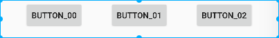
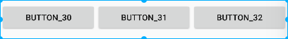

##### introduce

https://developer.android.google.cn/reference/androidx/constraintlayout/widget/ConstraintLayout

https://juejin.cn/post/6949186887609221133#heading-6


##### Widgets dimension constraints

widget的尺寸可以通过设置`android:layout_width`和`android:layout_height`的属性值来指定，有如下三种方式：

- 使用具体值
- 使用`WRAP_CONTENT`，这样widget会计算自身的尺寸
- 使用`0dp`，这等于“`MATCH_CONSTRAINT`”


##### Group

可以控制一组控件的隐藏和显示

```
  <androidx.constraintlayout.widget.Group
        android:id="@+id/gp_1"
        android:layout_width="wrap_content"
        android:layout_height="wrap_content"
        android:visibility="gone"
        app:constraint_referenced_ids="cl_h4,cl_h2" />
```

```
((Group)findViewById(R.id.gp_1)).setVisibility(View.GONE);
```

​	`findViewById(R.id.gp_2).setVisibility(View.INVISIBLE);  doesnt not work`

https://juejin.cn/post/6844903875569254414#heading-17


#####  Guideline使用

https://developer.android.com/reference/android/support/constraint/Guideline.html

```
app:layout_constraintGuide_percent="0.2"
app:layout_constraintGuide_begin="100dp"
```

#####   特色属性

* layout_constraintDimensionRatio

  指定高度，宽度随着宽高比自适应

  ```
  <ImageView
      android:id="@+id/iv_img01"
      android:layout_width="0dp"
      android:layout_height="wrap_content"
      android:src="@mipmap/img_1"
      app:layout_constraintDimensionRatio="1:1"
      app:layout_constraintLeft_toLeftOf="parent" />
  ```

  <!--指定高度，宽度随着宽高比自适应 app:layout_constraintDimensionRatio="H,16:9"  H: 表示高宽比-->     

* layout_constraintHorizontal_bias  先设置约束

```
app:layout_constraintLeft_toLeftOf="parent"
app:layout_constraintRight_toRightOf="parent"
```

#####  然后是比例


##### **Bias**

上面的水平居中,是使用的与父亲左侧对齐+与父亲右侧对齐.  可以理解为左右的有一种约束力,默认情况下,左右的力度是一样大的,那么view就居中了.

当左侧的力度大一些时,view就会偏向左侧.就像下面这样.


> layout_constraintHorizontal_bias 水平约束力
> layout_constraintVertical_bias 垂直约束力


```xml
<android.support.constraint.ConstraintLayout
    <Button
        android:text="按钮1"
        app:layout_constraintHorizontal_bias="0.3"
        app:layout_constraintLeft_toLeftOf="parent"
        app:layout_constraintRight_toRightOf="parent"/>
</android.support.constraint.ConstraintLayout>    
```

上面代码就偏左约束


##### WRAP_CONTENT: 强制约束

我们可能希望使用`WRAP_CONTENT`，同时仍然强制执行约束以限制最终的尺寸

- `app:layout_constrainedWidth=”true|false”`


button1居中显示，button2约束在button1的右边、parent的左边：

```xml
<Button
    android:id="@+id/button1"
    android:layout_width="wrap_content"
    android:layout_height="wrap_content"
    android:text="aaaaaaa"
    app:layout_constraintStart_toStartOf="parent"
    app:layout_constraintEnd_toEndOf="parent"
    app:layout_constraintTop_toTopOf="parent"
    app:layout_constraintBottom_toBottomOf="parent"/>

<Button
    android:id="@+id/button2"
    android:layout_width="wrap_content"
    android:layout_height="wrap_content"
    android:text="22222222222222222222222222222"
    app:layout_constrainedWidth="true"
    android:layout_marginTop="40dp"
    app:layout_constraintTop_toTopOf="@id/button1"
    app:layout_constraintStart_toEndOf="@id/button1"
    app:layout_constraintEnd_toEndOf="parent"/>

```


对button2使不使用`app:layout_constrainedWidth="true"`的效果如下：


约束width前 & 约束width后


##### 占用父布局的比例


#####  chain

Chains are controlled by attributes set on the first element of the chain (the "head" of the chain):


 3个Button 两两依赖,相当于组成了一个链

* Button均分 width = match_constraint (0dp)

 


```
 <Button
        android:id="@+id/bt_00"
        android:layout_width="0dp"
        android:layout_height="wrap_content"
        android:text="Button_00"
        app:layout_constraintLeft_toLeftOf="parent"
        app:layout_constraintRight_toLeftOf="@+id/bt_01" />

    <Button
        android:id="@+id/bt_01"
        android:layout_width="0dp"
        android:layout_height="wrap_content"
        android:text="Button_01"
        app:layout_constraintLeft_toRightOf="@+id/bt_00"
        app:layout_constraintRight_toLeftOf="@+id/bt_02" />

    <Button
        android:id="@+id/bt_02"
        android:layout_width="0dp"
        android:layout_height="wrap_content"
        android:text="Button_02"
        app:layout_constraintLeft_toRightOf="@+id/bt_01"
        app:layout_constraintRight_toRightOf="parent" />
```


app:layout_constraintHorizontal_weight="2"`　

看属性也可以猜到是干嘛用的了.


```
 <androidx.constraintlayout.widget.ConstraintLayout
        android:layout_width="match_parent"
        app:layout_constraintTop_toBottomOf="@+id/guideline_00"
        android:layout_height="wrap_content">
        <Button
            android:id="@+id/bt_00"
            android:layout_width="0dp"
            android:layout_height="wrap_content"
            android:text="Button_00"
            app:layout_constraintHorizontal_weight="2"
            app:layout_constraintLeft_toLeftOf="parent"
            app:layout_constraintRight_toLeftOf="@+id/bt_01" />

        <Button
            android:id="@+id/bt_01"
            android:layout_width="0dp"
            android:layout_height="wrap_content"
            android:text="Button_01"
            app:layout_constraintHorizontal_weight="1"
            app:layout_constraintLeft_toRightOf="@+id/bt_00"
            app:layout_constraintRight_toLeftOf="@+id/bt_02" />

        <Button
            android:id="@+id/bt_02"
            android:layout_width="0dp"
            android:layout_height="wrap_content"
            app:layout_constraintHorizontal_weight="1"
            android:text="Button_02"
            app:layout_constraintLeft_toRightOf="@+id/bt_01"
            app:layout_constraintRight_toRightOf="parent" />
    </androidx.constraintlayout.widget.ConstraintLayout>
```


* Button均份　宽度不为match_constraint




```
 <Button
            android:id="@+id/bt_10"
            android:layout_width="wrap_content"
            android:layout_height="wrap_content"
            android:text="Button_00"
            app:layout_constraintLeft_toLeftOf="parent"
            app:layout_constraintRight_toLeftOf="@+id/bt_11" />

        <Button
            android:id="@+id/bt_11"
            android:layout_width="wrap_content"
            android:layout_height="wrap_content"
            android:text="Button_01"
            app:layout_constraintLeft_toRightOf="@+id/bt_10"
            app:layout_constraintRight_toLeftOf="@+id/bt_12" />

        <Button
            android:id="@+id/bt_12"
            android:layout_width="wrap_content"
            android:layout_height="wrap_content"
            android:text="Button_02"
            app:layout_constraintLeft_toRightOf="@+id/bt_11"
            app:layout_constraintRight_toRightOf="parent" />
```
* layout_constraintHorizontal_chainStyle

    这个属性默认是　spread，还有另外两种方式 packed 和spread_inside

* packed


```
  <Button
            android:id="@+id/bt_20"
            android:layout_width="wrap_content"
            android:layout_height="wrap_content"
            android:text="Button_20"
            app:layout_constraintHorizontal_chainStyle="packed"
            app:layout_constraintLeft_toLeftOf="parent"
            app:layout_constraintRight_toLeftOf="@+id/bt_21" />

        <Button
            android:id="@+id/bt_21"
            android:layout_width="wrap_content"
            android:layout_height="wrap_content"
            android:text="Button_21"
            app:layout_constraintLeft_toRightOf="@+id/bt_20"
            app:layout_constraintRight_toLeftOf="@+id/bt_22" />

        <Button
            android:id="@+id/bt_22"
            android:layout_width="wrap_content"
            android:layout_height="wrap_content"
            android:text="Button_22"
            app:layout_constraintLeft_toRightOf="@+id/bt_21"
            app:layout_constraintRight_toRightOf="parent" />
```


*  spread_inside     :  width = wrap_content
    

*  spread_inside     :  width = 0dp
    

[代码](http://45.77.222.97:3000/root/MineUtils/src/master/app/src/main/java/com/jonzhou/mineutils/layout) 

* 概述

经过上面的实践，再来张官方的图就好理解了


> 1、 Spread: The views are evenly distributed (after margins are accounted for). This is the default.
> 2 、 Spread inside: The first and last view are affixed to the constraints on each end of the chain and the rest are evenly distributed.
> ３、Weighted: When the chain is set to either spread or spread inside, you can fill the remaining space by setting one or more views to "match constraints" (0dp). By default, the space is evenly distributed between each view that's set to "match constraints," but you can assign a weight of importance to each view using the layout_constraintHorizontal_weight and layout_constraintVertical_weight attributes. If you're familiar with layout_weight in a linear layout, this works the same way. So the view with the highest weight value gets the most amount of space; views that have the same weight get the same amount of space.
> ４、Packed: The views are packed together (after margins are accounted for). You can then adjust the whole chain's bias (left/right or up/down) by changing the chain's head view bias.

参考:https://developer.android.com/training/constraint-layout/index.html
最后就是边应用边理解了

##### Barrier 

用于控制 Barrier 相对于给定的 View 的位置， app:barrierDirection="right",表示barrier在constraint_referenced_ids给定ID的右侧,constraint_referenced_ids的id就是左侧的这些控件

输入信息挺有用的 

https://mp.weixin.qq.com/s/QIuww9b0TsNjajEUS8c2fg

```
  <android.support.constraint.ConstraintLayout
        android:layout_width="match_parent"
        android:layout_height="wrap_content"
        android:layout_margin="@dimen/dimen_11">

        <TextView
            android:id="@+id/tv_order_num"
            android:layout_width="wrap_content"
            android:layout_height="wrap_content"
            android:text="订单编号：10002220000001234"
            android:textColor="#ff999999"
            android:textSize="19sp"
            app:layout_constraintTop_toTopOf="parent"
            app:layout_constraintStart_toStartOf="parent" />

        <TextView
            android:id="@+id/tv_order_pro"
            android:layout_width="wrap_content"
            android:layout_height="wrap_content"
            android:layout_marginTop="@dimen/dimen_11"
            android:text="订购产品：爱达康高血压监护服务"
            android:textColor="#ff666666"
            android:textSize="21sp"
            app:layout_constraintLeft_toLeftOf="parent"
            app:layout_constraintTop_toBottomOf="@+id/tv_order_num" />

        <TextView
            android:id="@+id/tv_service_team"
            android:layout_width="wrap_content"
            android:layout_height="wrap_content"
            android:text="服务团队：爱达康远程监护团队"
            android:textColor="#ff666666"
            android:textSize="21sp"
            app:layout_constraintLeft_toLeftOf="parent"
            app:layout_constraintTop_toBottomOf="@+id/tv_order_pro" />

        <TextView
            android:id="@+id/tv_period_valid"
            android:layout_width="wrap_content"
            android:layout_height="wrap_content"
            android:text="有效期：2019-03-01至2019-12-31"
            android:textColor="#ff999999"
            android:textSize="19sp"
            app:layout_constraintStart_toEndOf="@+id/barrier" />

        <TextView
            android:id="@+id/tv_order_time"
            android:layout_width="wrap_content"
            android:layout_height="wrap_content"
            android:layout_marginTop="@dimen/dimen_11"
            android:text="订购时间：2019-03-11 12:00:00"
            android:textColor="#ff666666"
            android:textSize="21sp"
            app:layout_constraintStart_toEndOf="@+id/barrier"
            app:layout_constraintTop_toBottomOf="@+id/tv_period_valid" />

        <TextView
            android:id="@+id/tv_order_count"
            android:layout_width="wrap_content"
            android:layout_height="wrap_content"
            android:text="订购数量：500次"
            android:textColor="#ff666666"
            android:textSize="21sp"
            app:layout_constraintStart_toEndOf="@+id/barrier"
            app:layout_constraintTop_toBottomOf="@+id/tv_order_time" />


        <android.support.constraint.Barrier
            android:id="@+id/barrier"
            android:layout_width="wrap_content"
            android:layout_height="wrap_content"
            app:barrierDirection="right"
            app:constraint_referenced_ids="tv_order_num,tv_order_pro,tv_service_team" />

    </android.support.constraint.ConstraintLayout>
```


#### Gone约束问题

https://ibotasky.github.io/2017/10/31/ConstraintLayout%E4%BB%8B%E7%BB%8D/


https://blog.yorek.xyz/android/other/constraintlayout/#63-wrap_content-11

https://mp.weixin.qq.com/s/QIuww9b0TsNjajEUS8c2fg

https://jishuin.proginn.com/p/763bfbd5c73f

