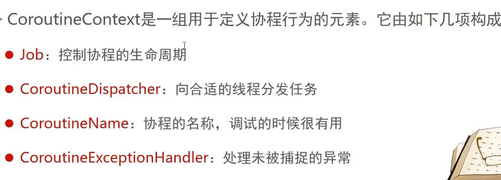
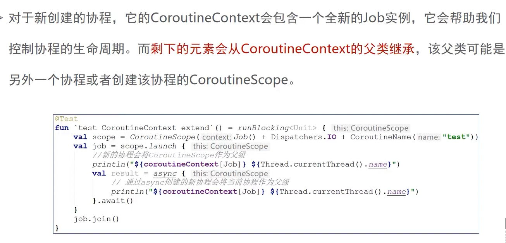
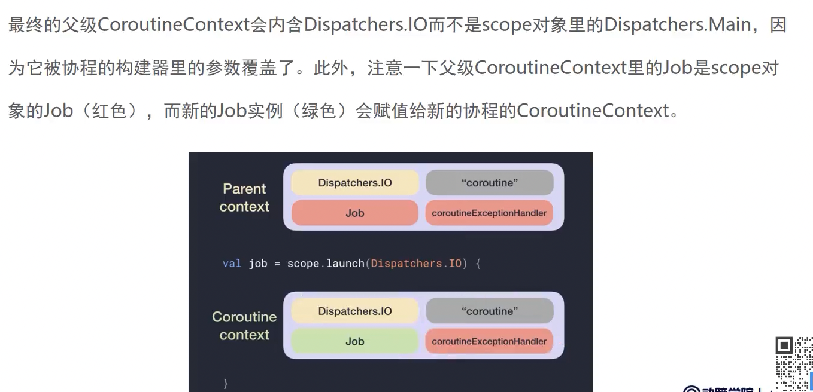
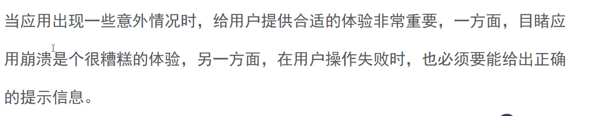
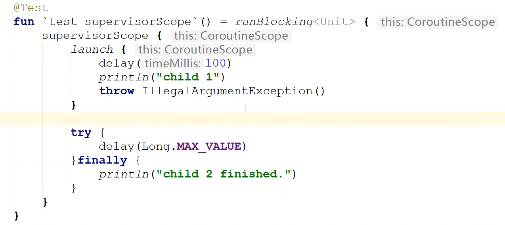
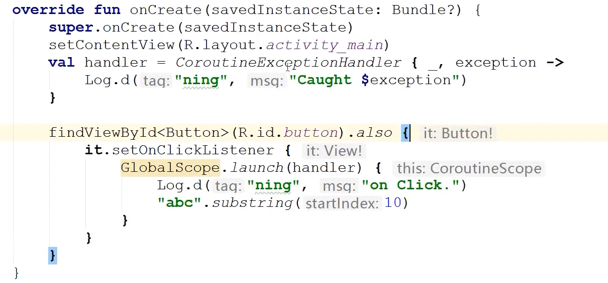
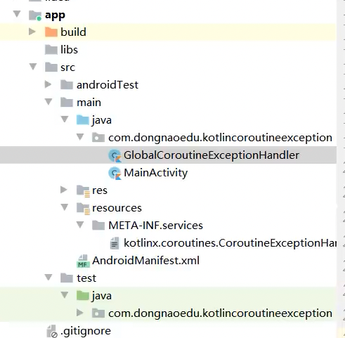
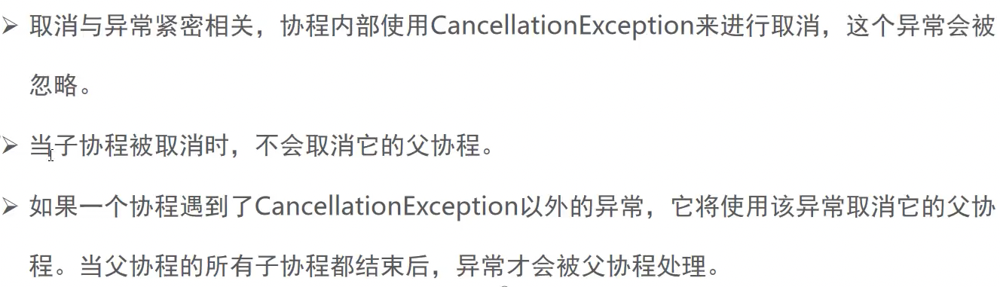
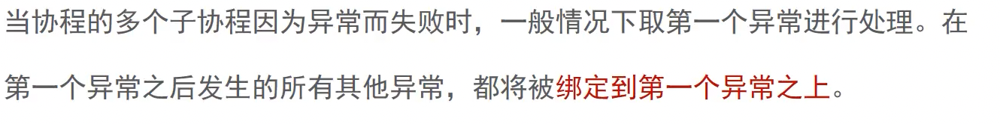

### P38 协程的上下文



##### P39协程的上下文


```kotlin
@Test
fun `test CoroutineContext `() = runBlocking<Unit> {
    launch (Dispatchers.Default + CoroutineName("test")){
        println("you are great ${Thread.currentThread().name}")
    }
}
```

you are great DefaultDispatcher-worker-1 @test#2


##### P40协程上下文的继承



```kotlin
val scope = CoroutineScope(Job() + Dispatchers.IO + CoroutineName("test"))
val job = scope.launch {
    println("${coroutineContext[Job]}  ${Thread.currentThread().name}")
    val result = async {
        println("${coroutineContext[Job]}  ${Thread.currentThread().name}")
    }.await()
}
job.join()
```


"test#2":StandaloneCoroutine{Active}@4d3fac66  DefaultDispatcher-worker-1 @test#2
"test#3":DeferredCoroutine{Active}@43e36bfa  DefaultDispatcher-worker-3 @test#3


##### P41协程上下文继承公式


```kotlin
val coroutineExceptionHandler = CoroutineExceptionHandler { _, exception ->
    println("caught $exception")
}
val scope = CoroutineScope(Job() + Dispatchers.Main + coroutineExceptionHandler)
val job = scope.launch(Dispatchers.IO) {
    //新协程
}
```





### 异常

##### P42学习协程异常处理的必要性




##### 43自动传播异常 与向用户暴露异常


```kotlin
        val job = GlobalScope.launch {
            try {
                throw IndexOutOfBoundsException()
            } catch (e: Exception) {
                println("Caught IndexOutOfBoundsException")
            }
        }
        job.join()
        val deferred = GlobalScope.async {
            throw ArithmeticException()
        }
//        try {
//            deferred.await()
//        } catch (e: Exception) {
//            println("Caught ArithmeticException")
//        }
        delay(1000) 
```


对于async ，根协程GlobalScope 调用.wait才会抛出异常,才能捕获异常


##### 44 非根协程的异常传播

```kotlin
val scope = CoroutineScope(Job())
val job = scope.launch {
    throw IllegalArgumentException()
    //如果async抛出异常，launch就会立即抛出异常，而需要调用 .await
}
job.join()
```

Exception in thread "DefaultDispatcher-worker-1 @coroutine#2" java.lang.IllegalArgumentException
	at com.john.kot.coroutine.dongnao.CoroutineTest44$test CoroutineContext $1$job$1.invokeSuspend(CoroutineTest44.kt:24)


##### 45异常的传播特性


##### 46 SupervisorJob

打破P45的异常传播特性


一个协程有问题 不会影响其他的协程


```kotlin
val supervisor = CoroutineScope(SupervisorJob())
val job1 = supervisor.launch {
    delay(100)
    println("child 1")
    throw IllegalArgumentException()
}
val job2 = supervisor.launch {
    try {
        delay(Long.MAX_VALUE)
    } finally {
        println("child 2 finished.")
    }
    throw IllegalArgumentException()
}
joinAll(job1, job2)
```

SupervisorJob()缓存 job(),都能正常打印了.

Supervisor.cancel() ,后所有协程都会取消


##### 47 SupervisorScope

当作业自身执行失败的时候，所有子作业将会被全部取消





```kotlin
val child = supervisorScope {
    launch {
        try {
            println("The child is sleeping")
            delay(Long.MAX_VALUE)
        } finally {
            println("The child is cancelled")
        }
    }
    yield()
    println("Throwing an exception from the scope")
    throw AssertionError()
```


The child is sleeping
Throwing an exception from the scope
The child is cancelled

作用域抛出异常，导致子协程取消


### 异常的捕获

##### P48-异常的捕获的时机与位置


##### P49- 异常捕获常见错误


```kotlin
val handler =
    CoroutineExceptionHandler { _, exception -> println("Caught $exception") }
val job = GlobalScope.launch(handler) {
    throw AssertionError()
}
val deferred = GlobalScope.async(handler) { throw ArithmeticException() }
job.join()
deferred.await()
```


被捕获

Caught java.lang.AssertionError

java.lang.ArithmeticException
	at com.john.kot.coroutine.dongnao.CoroutineTest48$test SupervisorJob $1$deferred$1.invokeSuspend(CoroutineTest48.kt:28)


```kotlin
val handler =
    CoroutineExceptionHandler { _, exception -> println("Caught $exception") }
val scope = CoroutineScope(Job())
val job = scope.launch(handler) {
    launch {
        throw IllegalArgumentException()
    }
}
job.join()
```

Caught java.lang.IllegalArgumentException


handler放在**内部**的情况

```kotlin
val handler =
    CoroutineExceptionHandler { _, exception -> println("Caught $exception") }
val scope = CoroutineScope(Job())
val job = scope.launch {
    launch(handler) {
        throw IllegalArgumentException()
    }
}
job.join()
```

这种情况捕获不到,

异常处理器不能安装到内部协程，要安装到外部协程


##### 50 异常捕获 防止App闪退



##### 51Android全局异常处理





##### 52取消与异常




异常取消顺序， 先自己


```kotlin
@Test
fun `test cancel and exception`() = runBlocking {
    val job = launch {
        val child = launch {
            try {
                try {
                    delay(Long.MAX_VALUE)
                } catch (e: Exception) {
                    e.printStackTrace()
                }
            } finally {
                println("Child is cancelled.")
            }
        }
        yield()
        println("Cancelling child")
        child.cancelAndJoin()
        yield()
        println("Parent is cancelled.")
    }
    job.join()
}
```


Cancelling child

Child is cancelled.
Parent is cancelled.


```kotlin
val handler = CoroutineExceptionHandler { _, exception ->
    println("Caught $exception")
}
val job = GlobalScope.launch(handler) {
    launch {
        try {
            delay(Long.MAX_VALUE)
        } finally {
            withContext(NonCancellable){
                println("Children are cancelled , but exception is not handled until ")
                delay(100)
                println("The first child finished its non cancellable block")
            }
        }
    }

    launch {
        delay(10)
        println("Second child throws an exception")
        throw ArithmeticException()
    }
}
job.join()
```


Second child throws an exception
Children are cancelled , but exception is not handled until 
The first child finished its non cancellable block
Caught java.lang.ArithmeticException


第2个协程取消，第1个也被取消，最后处理外面的异常


##### p53异常聚合

suppressed 捕获多个异常




```kotlin
val handler = CoroutineExceptionHandler { _, excetption ->
    println("Caught $excetption ${excetption.suppressed.contentToString()}")
}

val job = GlobalScope.launch(handler) {
    launch {
        try {
            delay(Long.MAX_VALUE)
        } finally {
            throw ArithmeticException() // 2
        }
    }
    launch {
        try {
            delay(Long.MAX_VALUE)
        } finally {
            throw ArithmeticException() // 2
        }
    }
    launch {
        delay(100)
        throw IndexOutOfBoundsException() // 3
    }
}
job.join()
```


一床存在数组中

Caught java.lang.IndexOutOfBoundsException [java.lang.ArithmeticException, java.lang.ArithmeticException]


