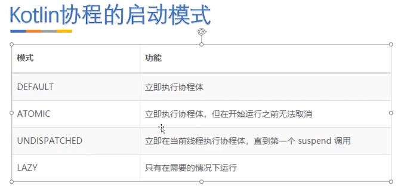

https://juejin.cn/post/6953441828100112392

https://www.cnblogs.com/joy99/p/15805916.html


#### 协程启动模式



DEFAULT


https://codelabs.developers.google.com/codelabs/kotlin-coroutines/#1


##### Dispatchers

By default, Kotlin coroutines provides three Dispatchers: [`Main`](https://kotlin.github.io/kotlinx.coroutines/kotlinx-coroutines-core/kotlinx.coroutines/-dispatchers/-main.html), [`IO`](https://kotlin.github.io/kotlinx.coroutines/kotlinx-coroutines-core/kotlinx.coroutines/-dispatchers/-i-o.html), and [`Default`](https://kotlin.github.io/kotlinx.coroutines/kotlinx-coroutines-core/kotlinx.coroutines/-dispatchers/-default.html). 

The IO dispatcher is optimized for IO work like reading from the network or disk,

 while the Default dispatcher is optimized for CPU intensive tasks.


# runBlocking vs CoroutineScope

runBlocking is also a coroutine builder that bridges the non-coroutine world of a regular fun main() and the code with coroutines inside of runBlocking { ... } curly braces. This is highlighted in an IDE by this: CoroutineScope hint right after the runBlocking opening curly brace.


https://kotlinlang.org/docs/coroutines-basics.html#your-first-coroutine

https://juejin.cn/post/6883652600462327821

runBlocking 只会等待相同作用域的协程完成才会退出

```kotlin
fun main{
	runBlocking{ // 不会阻塞正常的调用，阻塞主线程，让内部的程序执行完
		GlobalScope.launch{
      println("hello world")
    }
	}	
}
```


https://www.bilibili.com/video/BV1uo4y1y7ZF/?p=101

https://www.bilibili.com/video/BV1Yu411X73j?p=5

https://www.bilibili.com/video/BV164411C7FK?from=search&seid=2446477518780731765

https://kotlin.github.io/kotlinx.coroutines/kotlinx-coroutines-core/kotlinx.coroutines/-coroutine-scope/index.html


