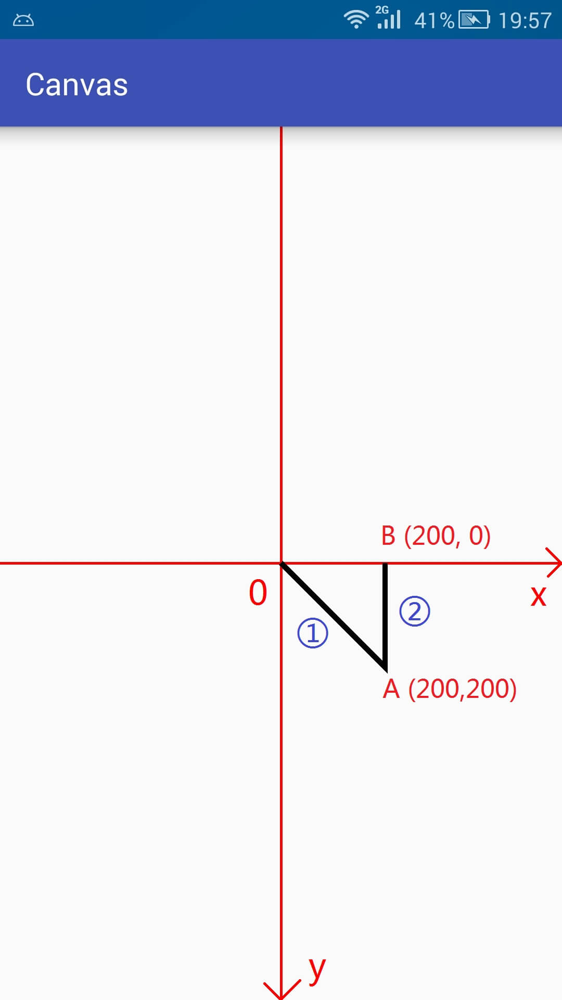

#### Path

* lineTo简单实现

```
 		canvas.translate(DeviceUtil.mWidth / 2, DeviceUtil.mHeight / 2); //原点移动到屏幕中心
        Path path = new Path();
        path.lineTo(200, 200);
        path.lineTo(200, 0);
        canvas.drawPath(path, mPaint);
```



从字面意思 lineto,顾名思义肯定就有from的坐标点，再看这个借的图，第一条线是从原点开始的，第二条线是从A开始的，

```
path.close();  //形成封闭的图形
```


绘制心电图

<https://github.com/SeekerFighter/LuckyEcgDemo>

<https://www.jianshu.com/p/16301de41a18>