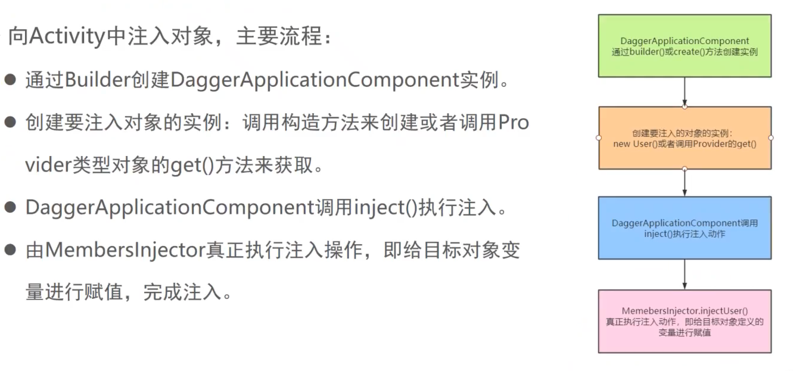
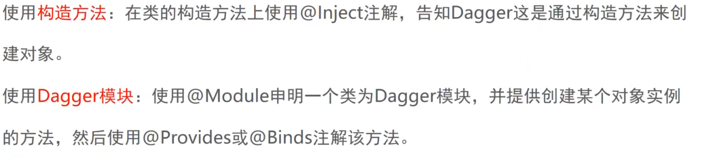
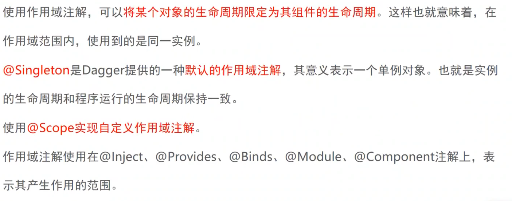

https://developer.android.google.cn/training/dependency-injection/dagger-basics

https://www.bilibili.com/video/BV1hF411W7aj 动脑


### 注入3要素


##### 注入流程



##### 构造方法对象注入

1. 创建User4对象 

   ```kotlin
   class User4 @Inject constructor()
   ```

2. 创建ApplicationComponent4

   ```kotlin
   @Component
   interface ApplicationComponent4 {
       fun inject(mainActivity: MainActivity4?)
   }
   ```

3. 执行注入.

```kotlin
class MainActivity4 : AppCompatActivity() {
    var TAG = javaClass.simpleName

    @Inject
    lateinit var user:User4
    override fun onCreate(savedInstanceState: Bundle?) {
        super.onCreate(savedInstanceState)
        setContentView(R.layout.activity_main3)
        DaggerApplicationComponent4.create().inject(this)
        Log.i(TAG, "onCreate: user= $user")
    }
}
```


##### 第三方对象注入(一)

Module :Module可以提供多个对象，返回类型要不一样 。

Component  :IOC容器, 用来注入对象,module集成到component身上,再由Component把对象注入到平时用的Activity或者目的类身上。

>  依赖的查找顺序为：先找@Module，如果找到了就停止，如果找不到就去找@Inject


```kotlin
class HttpObject // 也可直接在这里提供对象,不用Module

@Module
class HttpModule {

    @Provides
    fun provideHttpObject():HttpObject{ // 针对第三方sdk的对象，可以灵活提供
        return HttpObject()
    }
}

@Component(modules = [HttpModule::class, DataBaseModule::class])
interface MyComponent {
    //注入点
    fun inject(activity: DaggerxxActivity)
}

class DaggerxxActivity : AppCompatActivity() {
    private val binding by lazy { ActivityDaggerXxBinding.inflate(layoutInflater) }
    private val TAG = "DaggerxxActivity"

    @Inject
    lateinit var httpObject: HttpObject

    @Inject
    lateinit var databaseObject: DatabaseObject

    override fun onCreate(savedInstanceState: Bundle?) {
        super.onCreate(savedInstanceState)
        setContentView(binding.root)
        DaggerMyComponent.create().inject(this)
        Log.i(TAG, "onCreate: httpObject $httpObject  databaseObject  $databaseObject ")
    }
}

```

https://juejin.cn/post/6844903850319544328


##### 第三方对象注入(一)


```kotlin
class User6
```

```kotlin
@Module
class AppModule6 {
    @Provides
    fun provideUser(): User6 {
        return User6()
    }
}
```

```kotlin
@Singleton
@Component(modules = [AppModule6::class])
interface ApplicationComponent6 {
    fun inject(mainActivity: MainActivity6)
}
```

```kotlin
class MainActivity6 : AppCompatActivity() {
    @Inject
    lateinit var user: User6
    override fun onCreate(savedInstanceState: Bundle?) {
        DaggerApplicationComponent6.create().inject(this)
    }
}
```


### 依赖注入概念

1. 构造方法注入
2. Setter注入(字段注入)


```java
public class Car {
    Engine engine;
    
    //构造方法注入
    public Car(Engine engine) {
        this.engine = engine;
    }
    // setter注入(字段注入)
    public void setEngine(Engine engine) {
        this.engine = engine;
    }
    
    public void start(){
        engine = new Engine();
        engine.start();
    }   
}

class Engine{
    public void start(){}
}
```


##### IOC框架

1. 基于反射的方式实现： Spring IOC(动态的进行依赖关系的建立)
2. 静态方式 ： 程序在编译时就已经提供好了建立依赖关系的类。Dagger2


两种注入方式



### Dagger注入

##### 构造方法注入

构造方法构造实例注入步骤

1. 使用 @Inject注解在构造方法上；就是告知Dagger可以通过构造方法来创建并获取到User的实例

   ```kotlin
   // 1.使用 @Inject注解在构造方法上；就是告知Dagger可以通过构造方法来创建并获取到User的实例
   class User @Inject constructor()
   ```
   
2. 当作IOC容器,把对象注入到目标类中

   ```kotlin
   // 2. Component可以当作IOC容器,然后把对象注入到目标类中
   @Component
   interface ApplicationComponent {
       fun inject(daggerActivity: DaggerActivity?) //指定DaggerActivity作为要注入的目标类
   }
   ```

3. 设置Inject注解

   DaggerActivity.java

   ```kotlin
   //3.设置Inject注解
   @Inject
   User user;
   ```

4. 执行注入动作

   ```java
      //3.设置Inject注解
   		@Inject
   		User user;
   
   		@Override
       protected void onCreate(Bundle savedInstanceState) {
           super.onCreate(savedInstanceState);
           setContentView(R.layout.activity_dagger2);
     //4.执行注入动作
         DaggerApplicationComponent.create().inject(this);//DaggerApplicationComponent相当于DaggerApplication的实现类 
         // DaggerApplicationComponent.create()获取到实例,inject(this)注入到Activity中
           Log.i(TAG, "user: " + user);
       }
   ```


##### Dagger Module注入

第三方框架的类，实现依赖注入， 上面User是我们自己定义的类， 

1. 第二种方式告知Dagger,可以通过调用该方法来获取到注入对象的实例

   ```kotlin
   @Module
   class NetModule {
       fun providerUser(): User {
           return User()
       }
   
       //第二种方式告知Dagger,可以通过调用该方法来获取到注入对象的实例
       @Provides
       fun provideRetrofit(): Retrofit {
           return Retrofit.Builder()
               .baseUrl("http://www.google.com")
               .build()
       }
   }
   ```


2. compoent

   ```
   // 2. Component可以当作IOC容器,然后把对象注入到目标类中
   // 设置作用域和ApplicationComponent组件的生命周期一致
   @Component(modules = [NetModule::class]) //模块装载到组件上去
   interface ApplicationComponent {
       fun inject(daggerActivity: DaggerActivity?) //指定DaggerActivity作为要注入的目标类
   }
   ```

3. DaggerActivity.java

   ```java
   public class DaggerActivity extends AppCompatActivity {
       String TAG = "DaggerActivity";
   
       //3.设置Inject注解
    
       @Inject
       Retrofit retrofit;
     
       Log.i(TAG, "retrofit: " + retrofit);
   
   }
   ```


#####   Retrofit注入

```java
public interface ApiService {

    @GET("/user/info")
    Call<String> requestInfo();
}
```


```java
//Module已经知道怎么获取retrofit实例
//接着同一个Module中的方法，就可以作为参数直接传入 使用
// 比如provideApiService需要Retrofit实例，会从当前容器查找是否已经有Retrofit实例
// 然后从当前容器直接获取
@Provides
public ApiService provideApiService(Retrofit retrofit){
    return retrofit.create(ApiService.class);
}
```


```java
@Inject
ApiService apiService;

Log.i(TAG, "apiService: " +apiService);

```

Module已经知道怎么获取retrofit实例
接着同一个Module中的方法，就可以作为参数直接传入 使用
// 比如provideApiService需要Retrofit实例，会从当前容器查找是否已经有Retrofit实例
// 然后从当前容器直接获取


```java
@Module
public class NetModule {

    //第二种方式告知Dagger,可以通过调用该方法来获取到注入对象的实例
    @Provides
    public Retrofit provideRetrofit(){
        return new Retrofit.Builder()
            .baseUrl("http://www.google.com")
            .build();
    }

    //Module已经知道怎么获取retrofit实例
    //接着同一个Module中的方法，就可以作为参数直接传入 使用
    // 比如provideApiService需要Retrofit实例，会从当前容器查找是否已经有Retrofit实例
    // 然后从当前容器直接获取
    @Provides
    public ApiService provideApiService(Retrofit retrofit){
        return retrofit.create(ApiService.class);
    }


    @Provides
    public OkHttpClient provideOkHttpClient() {
        return new OkHttpClient.Builder().build();
    }
}

```


### 局部单例实现


##### 作用域




**将某个对象的生命周期限定为其组件的生命周期。**


下面User，Retrofit ,ApiService, OkHttpClient对象实例指定了作用域是Singleton,那么载入这些对象的组建ApplicationComponent1也必须用作用域是Singleton.

要么不使用 作用域 即默认的作用域， 如果使用的话，就必须保证他们的作用域一致。


##### 局部实例1

```java

//Dagger模块
@Module
public class NetModule1 {

    public User providerUser() {
        return new User();
    }

    //第二种方式告知Dagger,可以通过调用该方法来获取到注入对象的实例
    //@Provides
    //public Retrofit provideRetrofit() {
    //    return new Retrofit.Builder()
    //        .baseUrl("http://www.google.com")
    //        .build();
    //}
    @Singleton
    @Provides
    public Retrofit provideRetrofit(OkHttpClient okHttpClient) {
        return new Retrofit.Builder()
            .client(okHttpClient)
            .baseUrl("http://www.google.com")
            .build();
    }

    //Module已经知道怎么获取retrofit实例
    //接着同一个Module中的方法，就可以作为参数直接传入 使用
    // 比如provideApiService需要Retrofit实例，会从当前容器查找是否已经有Retrofit实例
    // 然后从当前容器直接获取
    @Singleton
    @Provides
    public ApiService provideApiService(Retrofit retrofit) {
        return retrofit.create(ApiService.class);
    }

    //@Singleton是Dagger提供的一种作用域
    // 作用域就是用来管理Component来获取对象实例的生命周期
    @Singleton
    @Provides
    public OkHttpClient provideOkHttpClient() {
        return new OkHttpClient.Builder().build();
    }
}
```


```java
// 2. 当作IOC容器,把对象注入到目标类中
@Singleton // 设置作用域和ApplicationComponent组件的生命周期一致
@Component(modules = {NetModule1.class}) //模块装载到组件上去
public interface ApplicationComponent1 {
    void inject(DaggerActivity daggerActivity);//指定目标类

    void inject(SecondActivity secondActivity);
}
```


```java
public class DaggerActivity extends AppCompatActivity {
    String TAG = "DaggerActivity";

    //3.设置Inject注解
    @Inject
    User user;

    @Inject
    User user2;

    @Inject
    Retrofit retrofit;

    @Inject
    ApiService apiService;

    @Inject
    ApiService apiService2;

    @Override
    protected void onCreate(Bundle savedInstanceState) {
        super.onCreate(savedInstanceState);
        setContentView(R.layout.activity_dagger2);
        //4.执行注入动作
        DaggerApplicationComponent.create().inject(this);//DaggerApplicationComponent相当于DaggerApplication的实现类

        Log.i(TAG, "user: " + user);
        Log.i(TAG, "user2: " + user2);

        Log.i(TAG, "retrofit: " + retrofit);

        Log.i(TAG, "apiService: " +apiService);
        Log.i(TAG, "apiService2: " +apiService2);
    }
}
```

运行结构

```
2092-2092/com.comm.util I/DaggerActivity: user: com.comm.util.dagger.dn.di.User@2129cef
2092-2092/com.comm.util I/DaggerActivity: user2: com.comm.util.dagger.dn.di.User@d97d3fc
2092-2092/com.comm.util I/DaggerActivity: retrofit: retrofit2.Retrofit@d243a85
2092-2092/com.comm.util I/DaggerActivity: apiService: retrofit2.Retrofit$1@a1fa0da
2092-2092/com.comm.util I/DaggerActivity: apiService2: retrofit2.Retrofit$1@a1fa0da
```

可以看到 user 是2个实例

apiService用了同一个对象实例,所以可以看到和DaggerApplicationComponent组件生命周期一致。


##### 局部实例2

添加一个Activity

```java
public class SecondActivity extends AppCompatActivity {
    String TAG = "SecondActivity";

    @Inject
    ApiService apiService3;

    @Override
    protected void onCreate(Bundle savedInstanceState) {
        super.onCreate(savedInstanceState);
        setContentView(R.layout.activity_second2);

        //DaggerApplicationComponent相当于DaggerApplication的实现类
        DaggerApplicationComponent.create().inject(this);

        Log.i(TAG, "apiService3: " + apiService3);
    }
}
```


```java
void inject(SecondActivity secondActivity);
```

```java
startActivity(new Intent(this,SecondActivity.class));
```


```
7410-7410/com.comm.util I/DaggerActivity: apiService: retrofit2.Retrofit$1@a1fa0da
7410-7410/com.comm.util I/DaggerActivity: apiService2: retrofit2.Retrofit$1@a1fa0da
2021-08-29 22:28:35.812 7410-7410/com.comm.util I/SecondActivity: apiService3: retrofit2.Retrofit$1@84eb79a
```

不同的DaggerApplicationComponent组件，不同的实例


##### 全局实例

保证组件全局实例

Module作用域生命周期和 ApplicationComponent保持一致。


MyApplication.java

```java
static ApplicationComponent  applicationComponent = DaggerApplicationComponent.create();

public static ApplicationComponent getApplicationComponent() {
    return applicationComponent;
}
```

```java
MyApplication.getApplicationComponent().inject(this);
```


```
8044-8044/com.comm.util I/DaggerActivity: apiService: retrofit2.Retrofit$1@516190b
8044-8044/com.comm.util I/DaggerActivity: apiService2: retrofit2.Retrofit$1@516190b
8044-8044/com.comm.util I/SecondActivity: apiService3: retrofit2.Retrofit$1@516190b
```


##### 使用作用域遵循的规则


组件ApplicationComponent指定了作用域,组件中的模块modules = {NetModule.class}，也要指定相同的作用域。


NetModule中的方法设置@Singleton 那么ApplicationComponent也必须设置@Singleton

NetModule中的方法设置@MyScope 那么ApplicationComponent也必须设置@MyScope


```java
@Singleton // 设置作用域和ApplicationComponent组件的生命周期一致，
@Component(modules = {NetModule.class})
public interface ApplicationComponent {
    void inject(DaggerActivity daggerActivity);//指定目标类

    void inject(SecondActivity secondActivity);
}

```


###  组件依赖

因为,一个Acitivty不能有两个组件直接注入,不如ApplicationComponent 和UserComponent.


组建依赖与子组建主要解决了不同作用域时组建之间复用问题.

* 在一个组件置顶作用域后，就已经确定了该组建创建对象的生命周期。 但是**有些对象的实例可能生命周期更短**。这个时候就需要定义新的组建。
* 新组件需要使用原组建的部分资源


两种实现方式

1. 为@Component添加dependencies参数,指定该组建依赖新的组件。
2. 直接使用@Subcomponent注解创建新的组件，并装载到父组件中。

https://www.bilibili.com/video/BV1Ki4y1A7hA?p=07


来看方式一

##### 实例部分全局

实现 Retrofit ,ApiService 进程下全局, User2类 Activity全局


MyScope是自定义的作用域，用Singleton也可以，主要是保证组建作用域全局单例，感觉和hilt有点不同

```kotlin
@MyScope // 设置作用域和ApplicationComponent组件的生命周期一致,如果ApplicationComponent是全局的，那么就是全局的
@Component(modules = {NetModule2.class}) //模块装载到组件上去
public interface ApplicationComponent2 {

    void inject(DaggerUserActivity daggerActivity);//指定目标类 //dependencies = {ApplicationComponent1.class}


    Retrofit retrofit();
    ApiService apiService();
}
```


```kotlin
@UserScope
@Component(modules = [UserModule2::class], dependencies = [ApplicationComponent2::class])
interface UserComponent2 {
    fun inject(activity: DaggerUserActivity2)
    fun inject(activity: DaggerSecondActivity2)
}
```


```kotlin
@Module
class NetModule2 {
    fun providerUser(): User2 {
        return User2()
    }

    //第二种方式告知Dagger,可以通过调用该方法来获取到注入对象的实例
    //@Provides
    //public Retrofit provideRetrofit() {
    //    return new Retrofit.Builder()
    //        .baseUrl("http://www.google.com")
    //        .build();
    //}
    @MyScope
    @Provides
    fun provideRetrofit(okHttpClient: OkHttpClient?): Retrofit {
        return Retrofit.Builder()
            .client(okHttpClient)
            .baseUrl("http://www.google.com")
            .build()
    }

    //Module已经知道怎么获取retrofit实例
    //接着同一个Module中的方法，就可以作为参数直接传入 使用
    // 比如provideApiService需要Retrofit实例，会从当前容器查找是否已经有Retrofit实例
    // 然后从当前容器直接获取
    @MyScope
    @Provides
    fun provideApiService(retrofit: Retrofit): ApiService {
        return retrofit.create(ApiService::class.java)
    }

    //@Singleton是Dagger提供的一种作用域
    // 作用域就是用来管理Component来获取对象实例的生命周期
    @MyScope
    @Provides
    fun provideOkHttpClient(): OkHttpClient {
        return OkHttpClient.Builder().build()
    }
}
```


注意ApplicationComponent2要提供对应Module的方法

```kotlin
@MyScope // 设置作用域和ApplicationComponent组件的生命周期一致，NetModule设置@Singleton 那么ApplicationComponent也必须设置
@Component(modules = [NetModule2::class]) //模块装载到组件上去
interface ApplicationComponent2 {
    fun inject(daggerActivity: DaggerUserActivity) //指定目标类 //dependencies = {ApplicationComponent1.class}
    fun retrofit(): Retrofit
    fun apiService(): ApiService

    fun provideContext(): Context
}
```


```java
public class MyApplication extends Application {
    static ApplicationComponent2 applicationComponent = DaggerApplicationComponent2.create();
    private static MyApplication app;

    public static ApplicationComponent2 getApplicationComponent2() {
        return applicationComponent;
    }

    //Dagger
    public static MyApplication getInstance() {
        return app;
    }
}
```


```kotlin
class DaggerUserActivity2 : AppCompatActivity() {
    var TAG = javaClass.simpleName

    @Inject
    lateinit var user1: User2

    @Inject
    lateinit var user2: User2

    @Inject
    lateinit var apiService1: ApiService

    @Inject
    lateinit var apiService2: ApiService

    var userComponent: UserComponent2? = null

    override fun onCreate(savedInstanceState: Bundle?) {
        super.onCreate(savedInstanceState)
        setContentView(R.layout.activity_dagger_user)
        userComponent = DaggerUserComponent2.builder().applicationComponent2(
            MyApplication.getApplicationComponent2()
        ).build()
        userComponent?.inject(this)
        Log.i(TAG, "user1: $user1")
        Log.i(TAG, "user2: $user2")

        Log.i(TAG, "apiService1: $apiService1")
        Log.i(TAG, "apiService2: $apiService2")
        startActivity(Intent(this, DaggerSecondActivity2::class.java))
    }
}
```


从结果上, Retrofit 是全局单例，User2对象是Activity单例

```
399 10821-10821/com.comm.util I/DaggerUserActivity2: user1: com.comm.util.dagger.dn.di.User2@1da0e9b
399 10821-10821/com.comm.util I/DaggerUserActivity2: user2: com.comm.util.dagger.dn.di.User2@1da0e9b
399 10821-10821/com.comm.util I/DaggerUserActivity2: apiService1: retrofit2.Retrofit$1@12da238
399 10821-10821/com.comm.util I/DaggerUserActivity2: apiService2: retrofit2.Retrofit$1@12da238
438 10821-10821/com.comm.util I/DaggerSecondActivity2: user3: com.comm.util.dagger.dn.di.User2@8233396
438 10821-10821/com.comm.util I/DaggerSecondActivity2: apiService3: retrofit2.Retrofit$1@12da238
```


##### 提供全局Application


demo代码有问题 NPR


##### 子组件方式

优势

```
  下面的interface ApplicationComponent3 
   父组件不用定义 这些方法
    fun retrofit(): Retrofit
    fun apiService(): ApiService
    fun context(): Context
```


```kotlin
// 2. 当作IOC容器,把对象注入到目标类中
@MyScope // 设置作用域和ApplicationComponent组件的生命周期一致，NetModule设置@Singleton 那么ApplicationComponent也必须设置
@Component(modules = [SubComponentModule::class]) //模块装载到组件上去
interface ApplicationComponent3 {
    fun inject(daggerActivity: DaggerUserActivity) //指定目标类

    fun studentComponent():StudentComponent.Factory
}
```

```kotlin
@Module(subcomponents = [StudentComponent::class])
class SubComponentModule 
```

```kotlin
@Module
class StudentModule {
    @Provides
    fun provideStudent(): Student {
        return Student()
    }
}
```

```kotlin
@Subcomponent(modules = [StudentModule::class])
interface StudentComponent {

    @Subcomponent.Factory
    interface Factory {
        fun create(): StudentComponent
    }

    fun inject(activity: DaggerSecondActivity3)
}
```

```ko]
class DaggerSecondActivity3 : AppCompatActivity() {
    var TAG = javaClass.simpleName

    @Inject
    lateinit var student: Student

    override fun onCreate(savedInstanceState: Bundle?) {
        super.onCreate(savedInstanceState)
        setContentView(R.layout.activity_second2)

        DaggerApplicationComponent3.create().studentComponent().create().inject(this)
        Log.i(TAG, "student: $student ")

    }
}
```


结果同样注入成功

> /com.comm.util I/DaggerSecondActivity3: student: com.comm.util.dagger.dn.di.Student@6c29d80 


### Binds注入接口实例

之前用的是 module总 provide对象提供方式 ,想下面这种的。

```kotlin
@Module
class StudentModule {
    @Provides
    fun provideStudent(): Student {
        return Student()
    }
}
```


通过这种方式注入的优势是,直接使用接口，不需要具体的实现, AInterfaceImpl01改成AInterfaceImpl02就能改注入实例

```kotlin
    @Inject
    lateinit var aInterface: AInterface
```


还一个优势是子组件StudentComponent也可以用来处理注入

```kotlin
@Subcomponent(modules = [StudentModule::class])
interface StudentComponent {

    @Subcomponent.Factory
    interface Factory {
        fun create(): StudentComponent
    }

    fun inject(activity: DaggerSecondActivity3)
    fun inject(activity: DaggerSecondActivity4)
}
```


```kotlin
class AInterfaceImpl01 : AInterface
class AInterfaceImpl02 : AInterface
```

```kotlin
@Module
abstract class TestModule {
    @Binds
    abstract fun bindAInterface(impl: AInterfaceImpl01): AInterface // AInterfaceImpl01改成AInterfaceImpl02就能改注入


    companion object {
        @JvmStatic
        @Provides
        fun provideAInterfaceImpl01(): AInterfaceImpl01 {
            return AInterfaceImpl01()
        }

        @JvmStatic
        @Provides
        fun provideAInterfaceImpl02(): AInterfaceImpl02 {
            return AInterfaceImpl02()
        }
    }
}
```


```kotlin
@MyScope // 设置作用域和ApplicationComponent组件的生命周期一致
@Component(modules = [SubComponentModule::class,TestModule::class]) //模块装载到组件上去
interface ApplicationComponent3 {
    fun inject(daggerActivity: DaggerUserActivity) //指定目标类

    fun studentComponent():StudentComponent.Factory
}
```

```kotlin
class DaggerSecondActivity4 : AppCompatActivity() {
    var TAG = javaClass.simpleName

    @Inject
    lateinit var student: Student

    @Inject
    lateinit var aInterface: AInterface

    override fun onCreate(savedInstanceState: Bundle?) {
        super.onCreate(savedInstanceState)
        setContentView(R.layout.activity_second2)

        DaggerApplicationComponent3.create().studentComponent().create().inject(this)
        Log.i(TAG, "student: $student ")
        Log.i(TAG, "aInterface: $aInterface ")
    }
}
```


### 相同类创建不同的对象


```kotlin
@Module
class StudentModule {

    @Named("student1") //  @Named 是Qualifier的实现
    @Provides
    fun provideStudent(): Student {
        return Student()
    }

    @Named("student2")
    @Provides
    fun provideStudent2(): Student {
        return Student("John")
    }
}
```


```kotlin
class DaggerSecondActivity4 : AppCompatActivity() {
    var TAG = javaClass.simpleName

    @Named("student1")
    @Inject
    lateinit var student1: Student

    @Named("student2")
    @Inject
    lateinit var student2: Student


    override fun onCreate(savedInstanceState: Bundle?) {
        super.onCreate(savedInstanceState)
        setContentView(R.layout.activity_second2)

        DaggerApplicationComponent3.create().studentComponent().create().inject(this)

        Log.i(TAG, "StudentQualifier1: $StudentQualifier1 ")
        Log.i(TAG, "StudentQualifier2: $StudentQualifier2 ")
    }
}
```


也可以自定义标识,注解标识，通过标识找到对象

```kotlin
@Qualifier
@Documented
@Retention(RUNTIME)
public @interface StudentQualifier1 {
}
```

```kotlin
@Module
class StudentModule {

    @Provides
    fun provideStudent1(): Student {
        return Student()
    }

    @Named("student1") //  @Named 是Qualifier的实现
    @Provides
    fun provideStudent(): Student {
        return Student()
    }

    @Named("student2")
    @Provides
    fun provideStudent2(): Student {
        return Student("John")
    }


    @StudentQualifier1 //  @Named 是Qualifier的实现
    @Provides
    fun provideQualifierStudent(): Student {
        return Student()
    }

    @StudentQualifier2
    @Provides
    fun provideQualifierStudent2(): Student {
        return Student("Qualifier2 John")
    }
}
```


```kotlin
class DaggerSecondActivity4 : AppCompatActivity() {
    var TAG = javaClass.simpleName

    @StudentQualifier1
    @Inject
    lateinit var StudentQualifier1: Student

    @StudentQualifier2
    @Inject
    lateinit var StudentQualifier2: Student
    override fun onCreate(savedInstanceState: Bundle?) {
        super.onCreate(savedInstanceState)
        setContentView(R.layout.activity_second2)
        DaggerApplicationComponent3.create().studentComponent().create().inject(this)

        Log.i(TAG, "StudentQualifier1: $StudentQualifier1 ")
        Log.i(TAG, "StudentQualifier2: $StudentQualifier2 ")

        Log.i(TAG, "aInterface: $aInterface ")
    }
}
```
