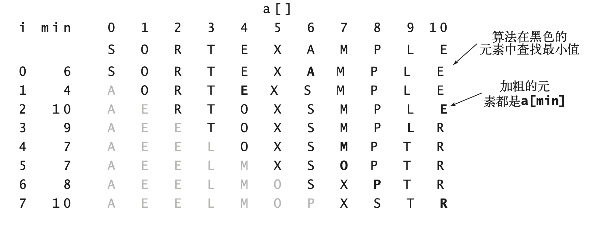
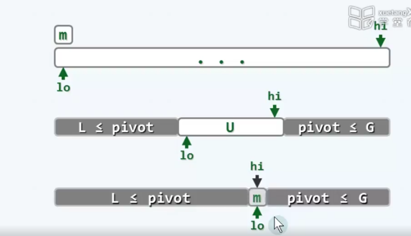
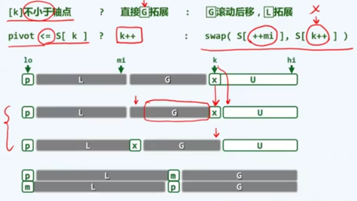
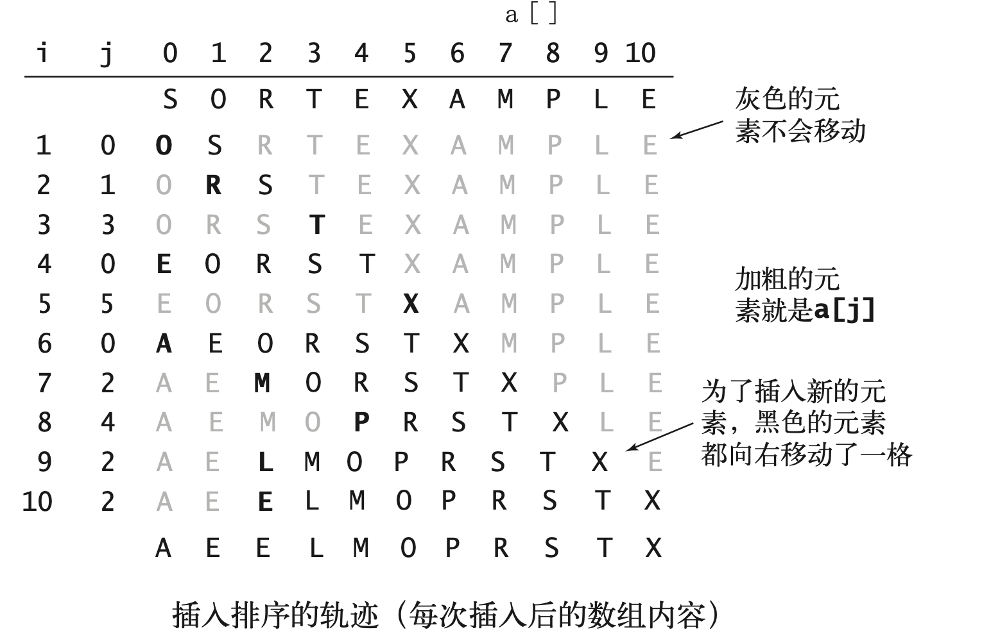
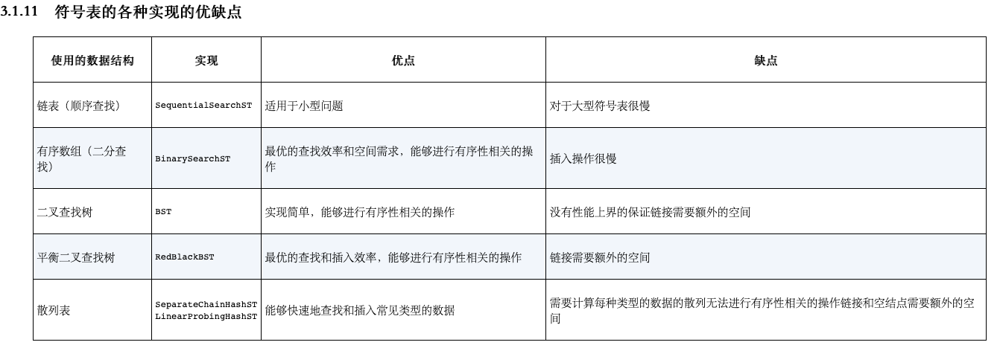
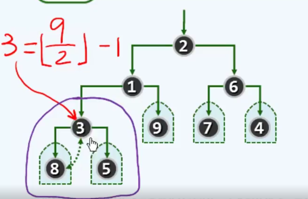

#### 排序

##### 冒泡


```java
public static void bubbleSort(int[] arr) {
    for (int i = arr.length - 1; i > 0; i--) { //剩余需要排序的长度
        for (int j = 0; j < i; j++) {
            if (arr[j] > arr[j + 1]) {
                int t = arr[j];
                arr[j] = arr[j + 1];
                arr[j + 1] = t;
            }
        }
    }
}
```

* 思路1: 

  第一次遍历最大的元素放到最右边，第二遍放倒数第二个位置，...

  一开始的想法是i 也递增，j< arr.length - 1 - i 。但是这样可读性就不如 i 递减的方式，还要注意数组越界的问题，所以int i = arr.length - 1


* 思路2

  还可以通过增加  swap，遍历后判断是否有序,当前一轮没有进行交换时，说明数组已经有序，没有必要再进行下一轮的循环了，直接退出

  

  ```java
    public static void bubbleSort2(int[] arr) {
          boolean swap;
          for (int i = arr.length - 1; i > 0; i--) { //剩余需要排序的长度
              swap = false;
              for (int j = 0; j < i; j++) {
                  if (arr[j] > arr[j + 1]) {
                      int t = arr[j];
                      arr[j] = arr[j + 1];
                      arr[j + 1] = t;
                      swap = true;
                  }
              }
              if (!swap) {
                  break;
              }
          }
      }
  ```


##### 选择排序

通过比较找到当前的最大元素M,并通过交换使值就位




```java
   //选择排序
    public static void selectionSort(int[] arr) {
        int maxIndex; //知道下标就能得到值
        int tmp;
        for (int i = arr.length - 1; i > 0; i--) {
            maxIndex = 0;
            for (int j = 1; j <= i; j++) {
                if (arr[j] > arr[maxIndex]) {
                    maxIndex = j;
                }
            }
            tmp = arr[i];
            arr[i] = arr[maxIndex];
            arr[maxIndex] = tmp;
        }
    }
```


##### 快速排序

思想：  前一序列的元素 都小于等于后一序列的元素，递归后 只剩单个元素时，自身就是有序的，可以作为递归基。

###### 快速排序1




初始情况U是整个序列， L G是空,然后 lo  hi都向内侧移动，最终hi lo指向同一个位置m,也就是最终的轴点。


L <= pivot <= G;  U =  [lo,hi]中，[lo]和[hi]交替空闲


1. 当_elem[hi]>pivot时，hi向左移动，自序列G跟着拓展。
2. 当_elem[hi]<pivot时，把_elem[hi]移动到lo位置上。
3. 向右移动lo,拓展子序列lo。
4. 当elem[lo] > pivot时，把elem[lo] 移动到hi位置上。
5. 最终hi lo指向同一个位置m,也就是最终的轴点pivot。


```java
public static void quickSort(int[] arr, int lo, int hi) {
    if (lo>=hi) return;
    int mi = partition(arr, lo, hi);
    quickSort(arr, lo, mi-1);
    quickSort(arr, mi + 1, hi);
}

private static int partition(int[] elem, int lo, int hi) {
    int pivot = elem[lo];
    while (lo < hi) {
        while (lo<hi&&elem[hi] >= pivot) hi--;
            elem[lo] = elem[hi];
        while (lo<hi&&elem[lo] < pivot) lo++;
            elem[hi] = elem[lo];
    }
    elem[lo]= pivot;
    return lo;
}
```


###### 快速排序2

快速排序变种




##### 插入排序





##### 希尔排序


https://www.bilibili.com/video/BV1LT4y137cK?from=search&seid=6852216660251002525


##### 归并排序

代码不太理解(学堂在线)


##### 符号表的各种实现的优缺点




##### 堆排序

[结合了数组与链表的特性](https://www.xuetangx.com/learn/THU08091002048/THU08091002048/5883385/video/9195336)


自下而上

2	1	6	3	9	7	4	8	5 

最末尾的**内部节点**所对应的秩开始  floor(9/2)-1=3,也就是第三个位置，接下来是堆6 1 2进行下滤操作


一开始很不理解为什么是 floor(9/2)-1，因为前面有 parent(i) = (i-1)>>1

其实这个9就是 arr.length,这里的 i是下标,也就是 arr.length-1,这样就很好理解为什么-1可以移出来 




######  [建堆](https://www.xuetangx.com/learn/THU08091002048/THU08091002048/5883385/video/9195388)


1. 按照树的层序遍历顺序，从左到右开始建堆。

2. 接着根据floyd算法开始调整， 5/2 - 1 = 1,第一个位置对应的是3，3上移

3. 接着是5,上移， 上面左下图是调整之后的，完全二叉堆

   

上面的数字太小，https://www.youtube.com/watch?v=WsNQuCa_-PU 这个视频有两次调整的情况

###### 选取与调整


类似于选择排序

1. 选取根节点5和末尾元素2交换,放到向量末尾，5放到 已排序序列，从完全二叉堆中移出。
2. 对根节点2下滤
3. 选取根节点4和末位置1交换，4放到已排序序列，下面依次操作


```java
    public static void heapSort(int[] arr) {
        buildHeap(arr, arr.length); //建堆
        selectSorted(arr); // 交换 下滤
    }

    private static void buildHeap(int[] arr, int length) {
        for (int k = (length - 1) >> 1; k >= 0; k--) {  //最后的内部节点 往前遍历
            addJustHeap(arr, k, length); 
        }
    }

    private static void addJustHeap(int[] arr, int k, int length) {
        for (int i = 2 * k + 1; i <= length; i = 2 * i + 1) { // 上面节点调整后，可能比子节点还小，需要继续调整
            if ((i + 1) < length && arr[i] < arr[i + 1]) {
                i++; // 左子树比右子树小，用右子树比较
            }

            if (i < length && arr[k] < arr[i]) {
                swap(arr, k, i);
                k = i;
            }
        }
    }

    private static void selectSorted(int[] arr) {
        for (int j = 0; j < arr.length - 1; j++) {
            swap(arr, 0, arr.length - 1 - j); //交换到已排序位置
            addJustHeap(arr, 0, arr.length - 1 - j); //继续调整
        }
    }

    private static void swap(int[] arr, int k, int i) {
        int tmp = arr[i];
        arr[i] = arr[k];
        arr[k] = tmp;
    }
```


https://zhuanlan.zhihu.com/p/42586566