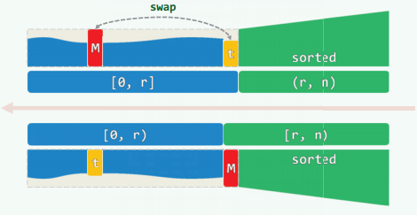
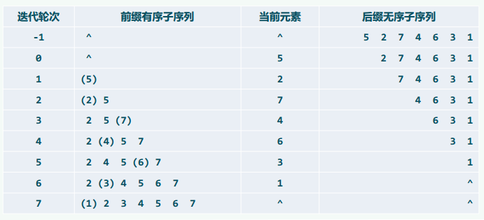
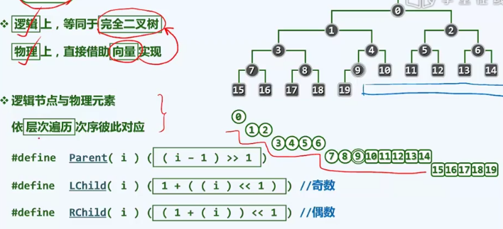
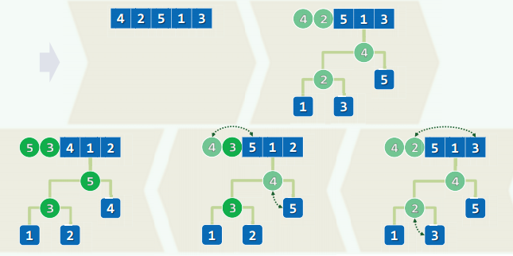
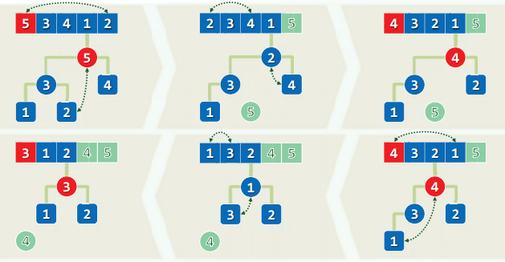
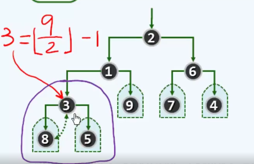
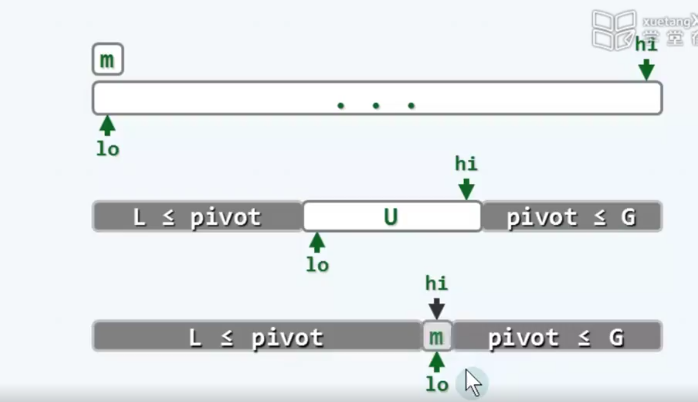
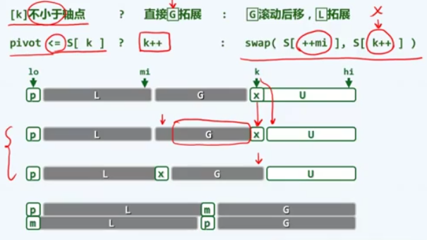

#### 排序

##### 选择排序

通过比较找到当前的最大元素M,并通过交换使值就位

##### 插入排序

#### 希尔排序

https://www.bilibili.com/video/BV1LT4y137cK?from=search&seid=6852216660251002525

##### 归并排序

代码不太理解(学堂在线)

#### 符号表的各种实现的优缺点

#### Floyd建堆算法

结合了数组与链表的特性

1. 建堆

2. 选取与调整

自下而上

最末尾的内部节点所对应的秩开始  floor(9/2)-1=3

#### 选择排序

