---

title: Data_Tree
comments: true
date: 2021-03-24 21:46:39
tags:
categories: DataStructure
---

#### 树

##### 分类

1. 满二叉树 :

​		在不增加树的层数的前提下，无法再多添加一个节点的二叉树就是满二叉树。

2. 完全二叉树 :

​		如果只是删除了满二叉树最底层最右边的连续若干个节点，这样形成的二叉树是完全二叉树。


##### 树的存储

二叉树表示法

​	先把一般树转化为二叉树，再存储二叉树。

​	一般树转化为二叉树的方法是:设法保证任意一个节点的

 1. 左指针域指向它的第一个孩子

 2. 右指针域指向它的下一个兄弟

    只要能满足此条件，就可以把一个普通树转化为二叉树来存储。


#### BST树- Binary search tree

##### 删除

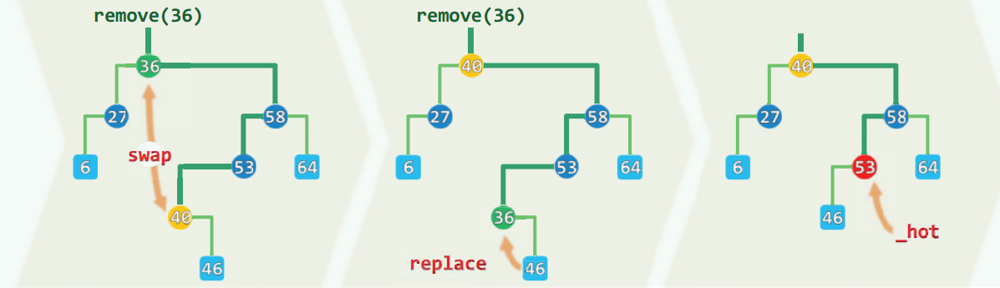


```c++
template<typename T>
static BinNodePosi<T> removeAt(BinNodePosi<T> &x, BinNodePosi<T> &hot) {
    printf(" x %d  \n",x->data);

    BinNodePosi<T> w = x; //实际被摘除的节点，初值同x
    BinNodePosi<T> succ = NULL; //实际被删除节点的接替者
    if (!HasLChild (*x)) //若*x的左子树为空，则可
        succ = x = x->rc; //直接将*x替换为其右子树
    else if (!HasRChild (*x)) //若右子树为空，则可
        succ = x = x->lc; //对称地处理——注意：此时succ != NULL
    else { //若左右子树均存在，则选择x的直接后继作为实际被摘除节点，为此需要
        w = w->succ(); //（在右子树中）找到*x的直接后继*w
        swap(x->data, w->data); //交换*x和*w的数据元素
        BinNodePosi<T> u = w->parent;
        printf("u %d  x %d  \n",u->data,x->data);
        ((u == x) ? u->rc : u->lc) = succ = w->rc; //隔离节点*w      // (u == x)感觉没作用呀 ???
    }
    hot = w->parent; //记录实际被删除节点的父亲
    if (succ) succ->parent = hot; //并将被删除节点的接替者与hot相联
    release(w->data);
    release(w);
    return succ; //释放被摘除节点，返回接替者
} //rele
```


​		

##### 树的遍历


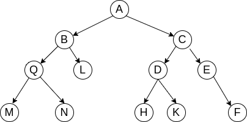

​	M N 作为根节点

1. 先序遍历[先访问根节点]

   先访问根节点

   再先序访问左子树

   再先序访问右子树

   A B Q M N L C D H K E F

   

2. 中序遍历[中间访问根节点]

   中序遍历左子树

   再访问根节点

   再中遍历右子树

   M Q N B L A H D K C  E F

   

3.  后序遍历[最后访问根节点]

   先中序遍历左子树

   再中序遍历右子树

   再访问根节点

   M N Q L B  H K D F E C A

###### 推导

通过先序和中序或者 中序和后序可以还原出 原始的二叉树.


1. 示例1

   先序: ABCDEFGH

   中序:BDCEAFHG

   求后序: DECBHGFA

2. 示例2

   先序: ABDGHCEFI

   中序:GDHBAECIF

   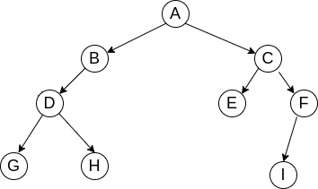

   

   求后序 :  G H D B E I F C A

   

##### 二叉树遍历示例

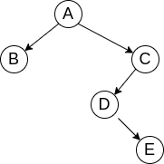


```c
#include <zconf.h>
#include <malloc.h>

struct BTNode {
    int data;
    struct BTNode *pLchild;
    struct BTNode *pRchild;
};


struct BTNode *createBTree();

void preTraverseBTree(struct BTNode *pNode);

int main() {
    struct BTNode *pT = createBTree();

//    preTraverseBTree(pT);
//    inTraverseBTree(pT);
    postTraverseBTree(pT);

    return 0;
}

void preTraverseBTree(struct BTNode *pNode) {
    if (pNode->data != NULL) {
        printf("%c\n", pNode->data);
        if (pNode->pLchild != NULL) {
            preTraverseBTree(pNode->pLchild);
        }

        if (pNode->pRchild != NULL) {
            preTraverseBTree(pNode->pRchild);
        }
    }
}

void inTraverseBTree(struct BTNode *pNode) {
    if (pNode->data != NULL) {

        if (pNode->pLchild != NULL) {
            inTraverseBTree(pNode->pLchild);
        }
        printf("%c\n", pNode->data);

        if (pNode->pRchild != NULL) {
            inTraverseBTree(pNode->pRchild);
        }
    }
}

void postTraverseBTree(struct BTNode *pNode) {
    if (pNode->data != NULL) {
        if (pNode->pLchild != NULL) {
            postTraverseBTree(pNode->pLchild);
        }
        if (pNode->pRchild != NULL) {
            postTraverseBTree(pNode->pRchild);
        }
        printf("%c\n", pNode->data);
    }
}

struct BTNode *createBTree() {
    struct BTNode *pA = (struct BTNode *) malloc(sizeof(struct BTNode));
    struct BTNode *pB = (struct BTNode *) malloc(sizeof(struct BTNode));
    struct BTNode *pC = (struct BTNode *) malloc(sizeof(struct BTNode));
    struct BTNode *pD = (struct BTNode *) malloc(sizeof(struct BTNode));
    struct BTNode *pE = (struct BTNode *) malloc(sizeof(struct BTNode));

    pA->data = 'A';
    pB->data = 'B';
    pC->data = 'C';
    pD->data = 'D';
    pE->data = 'E';

    pA->pLchild = pB;
    pA->pRchild = pC;
    pB->pLchild = pB->pRchild = NULL;
    pC->pLchild = pD;
    pC->pRchild = NULL;
    pD->pLchild = NULL;
    pD->pRchild = pE;
    pE->pLchild = pE->pRchild = NULL;
    return pA;
}
```


##### AVL树

左右子树的高度差 不超过1

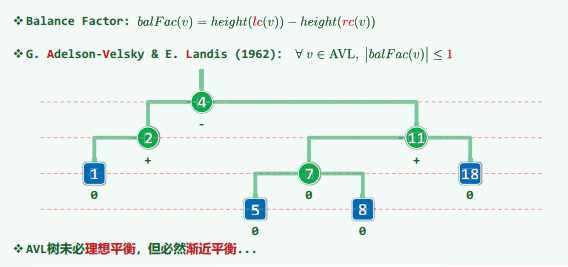


通过左旋或者右旋(左旋右旋后一定不会破坏二叉搜索树的查找规则


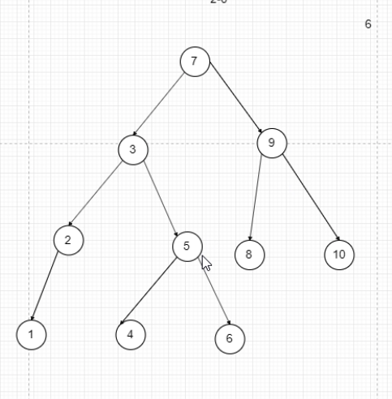


##### zig zag

zig    顺时针

zag  逆时针


g : grandparent节点

p : parent节点

##### zigzig


##### zigzag节点


类似工人组装魔方，确定好 G P V 所对应的 a b c ,何 0 1 2 3 所对应的 T0 T1 T2  T3,直接组装程图1的树


```c++
template <typename T> BinNodePosi<T> BST<T>::rotateAt ( BinNodePosi<T> v ) { //v为非空孙辈节点
    /*DSA*/if ( !v ) { printf ( "\a\nFail to rotate a null node\n" ); exit ( -1 ); }
    BinNodePosi<T> p = v->parent; BinNodePosi<T> g = p->parent; //视v、p和g相对位置分四种情况
    if ( IsLChild ( *p ) ) /* zig */
        if ( IsLChild ( *v ) ) { /* zig-zig */ //*DSA*/printf("\tzIg-zIg: ");
            p->parent = g->parent; //向上联接
            return connect34 ( v, p, g, v->lc, v->rc, p->rc, g->rc );
        } else { /* zig-zag */  //*DSA*/printf("\tzIg-zAg: ");
            v->parent = g->parent; //向上联接
            return connect34 ( p, v, g, p->lc, v->lc, v->rc, g->rc );
        }
    else  /* zag */
    if ( IsRChild ( *v ) ) { /* zag-zag */ //*DSA*/printf("\tzAg-zAg: ");
        p->parent = g->parent; //向上联接
        return connect34 ( g, p, v, g->lc, p->lc, v->lc, v->rc );
    } else { /* zag-zig */  //*DSA*/printf("\tzAg-zIg: ");
        v->parent = g->parent; //向上联接
        return connect34 ( g, v, p, g->lc, v->lc, v->rc, p->rc );
    }
}
```


#### 伸缩树

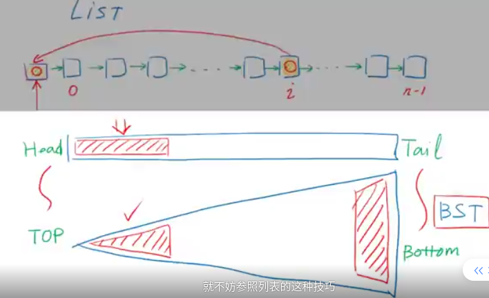


#### B-Tree


B树解决 一段一段从IO读取数据


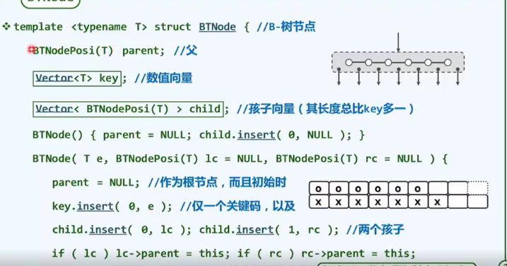

[地址](https://www.xuetangx.com/learn/THU08091002048/THU08091002048/5883385/video/9195150)


##### B树插入

因为新节点的插入，导致所属节点的分支数超过B树阶次m的情况称作overflow


​		     m=5时，每个节点的分支数不超过5，一般节点分支树不少于是3, (3,5)

​      	  m=6	对于6阶B树，分支树的上限是6，下限是3。 (3,6)


 #####  B树

######  上溢分裂


A[n/2]节点中点分裂


​               插入37，然后上溢分裂  


###### 下溢

 先从兄弟树借节点，借不到的话就合并

####  2-3-4树

##### 特点

1. 所有叶子节点都拥有相同的深度。

2. 节点只能是 2-节点、3-节点、4-节点之一。

   > 2-节点:包含 1 个元素的节点，有 2 个子节点; 
   >
   > 3-节点:包含 2 个元素的节点，有 3 个子节点; 
   >
   > 4-节点:包含 3 个元素的节点，有 4 个子节点; 所有节点必须至少包含1个元素

3. 元素始终保持排序顺序，整体上保持二叉查找树的性质，即父结点大于左子结点，小于右子结点;
     而且结点有多个元素时，每个元素必须大于它左边的和它的左子树中元素。


##### 2-3树的生长

和标准的二叉查找树由上向下生长不同，2-3树的生长是由下向上的。

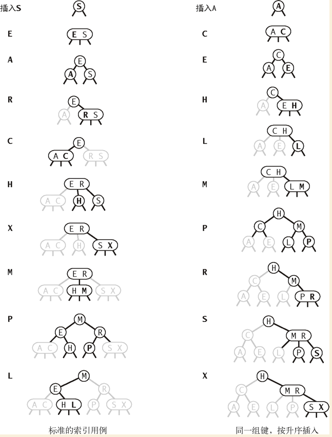


#### 红黑二叉查找树

##### 2-3-4树与红黑树的等价关系

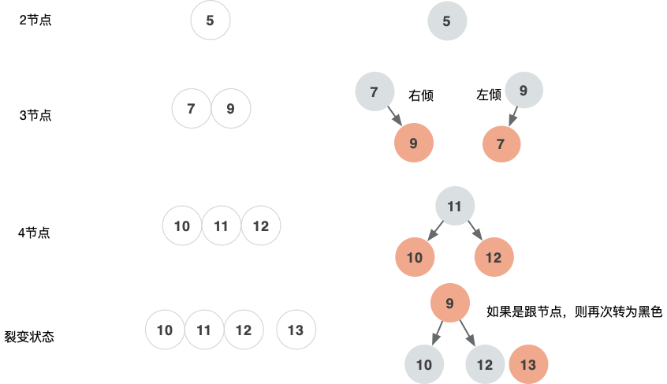

​	

​		裂变状态 9先从黑节点(从4节点)变成红节点，10、12先从红节点变成黑节点。


##### 2-3-4 树

新增操作，从叶子节点开始


 

##### 红黑树


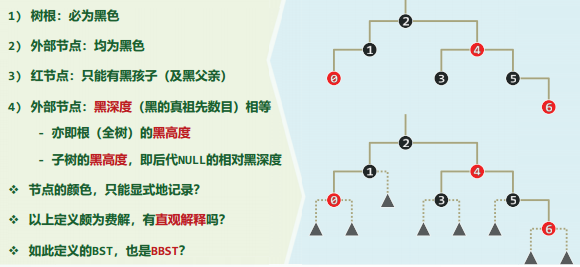

##### 性质

红黑树是一种结点带有颜色属性的二叉查找树，但它在二叉查找树之外，还有以下5大性质:

1. 节点是红色或黑色。
2. 根是黑色。
3. 所有叶子都是黑色(叶子是NIL节点，这类节点不可以忽视，否则代码会看不懂)。
4. 每个红色节点必须有两个黑色的子节点。(从每个叶子到根的所有路径上不能有两个连续的红色节点。)
5. 从任一节点到其每个叶子的所有简单路径都包含相同数目的黑色节点(黑色平衡)。// 2-3-4树层级相等.

https://www.cs.usfca.edu/~galles/visualization/RedBlack.html


红黑树 新增都是红色节点

根据上面的等价关系，把2-3-4树转换成下面的红黑树。


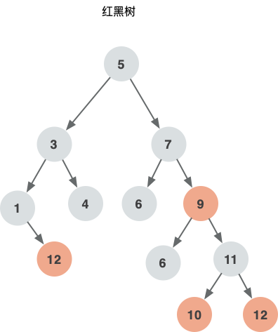

https://www.bilibili.com/video/BV135411h7wJ?p=4


##### 旋转


```java
  /**
     * 围绕p左旋
     *       pf                    pf
     *      /                     /
     *     p                     pr(r)
     *    / \          ==>      / \
     *  pl  pr(r)              p   rr
     *     / \                / \
     *    rl  rr             pl  rl
     *
     * @param p
     */
    private void leftRotate(RBNode p) {
        if (p != null) {
            RBNode r = p.right;
            p.right = r.left;
            if (r.left != null) {
                r.left.parent = p;
            }
            r.parent = p.parent;
            if (p.parent == null) {
                root = r;
            } else if (p.parent.left == p) {
                p.parent.left = r;
            } else {
                p.parent.right = r;
            }
            r.left = p;
            p.parent = r;
        }
    }
```


```java
  /**
     * 右旋
     *    pf                pf
     *     \                 \
     *      p             (l)pl
     *     / \      =>      /  \
     *(l)pl  pr            ll   p
     *   / \                   / \
     *  ll lr                 lr  pr
     *
     * @param p
     */
    private void rightRotate(RBNode p) {
        if (p != null) {
            RBNode l = p.left;
            p.left = l.right;
            if (l.right != null) {
                l.right.parent = p;
            }
            l.parent = p.parent;
            if (p.parent == null) {
                root = l;
            } else if (p.parent.right == p) {
                p.parent.right = l;
            } else {
                p.parent.left = l;
            }
            l.right = p;
            p.parent = l;
        }
    }
```


##### 新增

红黑树新增，第一个节点 是红节点


新增的节点都是红节点 


红黑树形成过程，忘了怎么形成，包括旋转 ， 节点颜色是怎么变化的。


##### 删除


https://www.cs.usfca.edu/~galles/visualization/RedBlack.html


#### 图

找到最优路径


