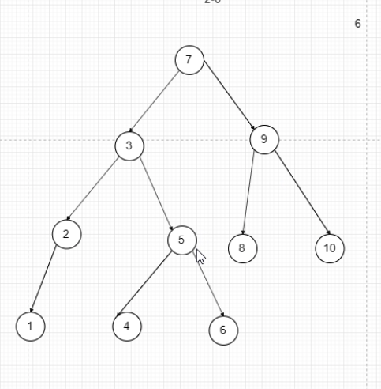
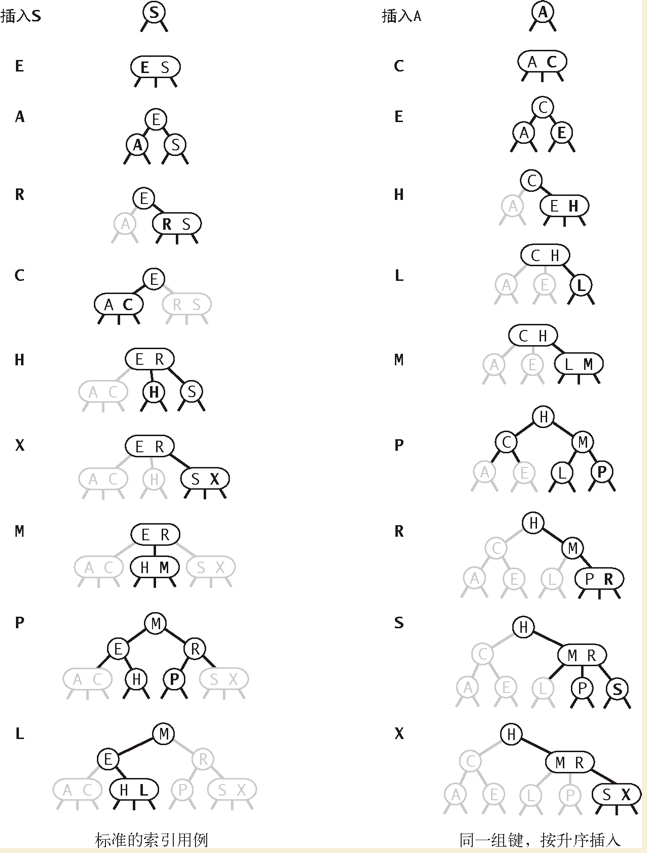
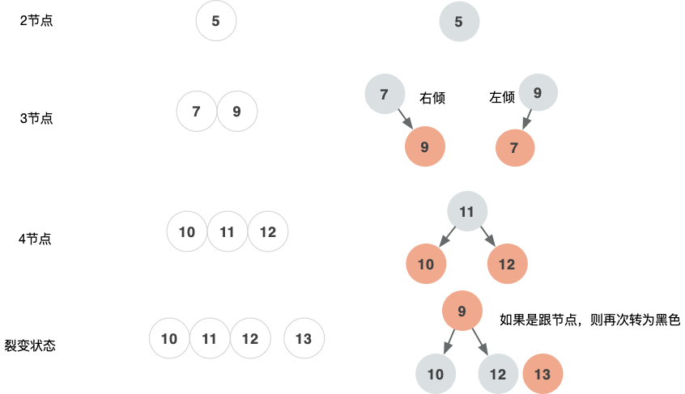
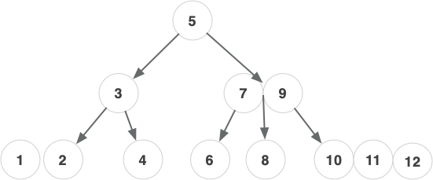
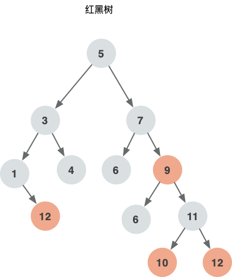
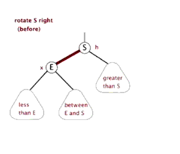
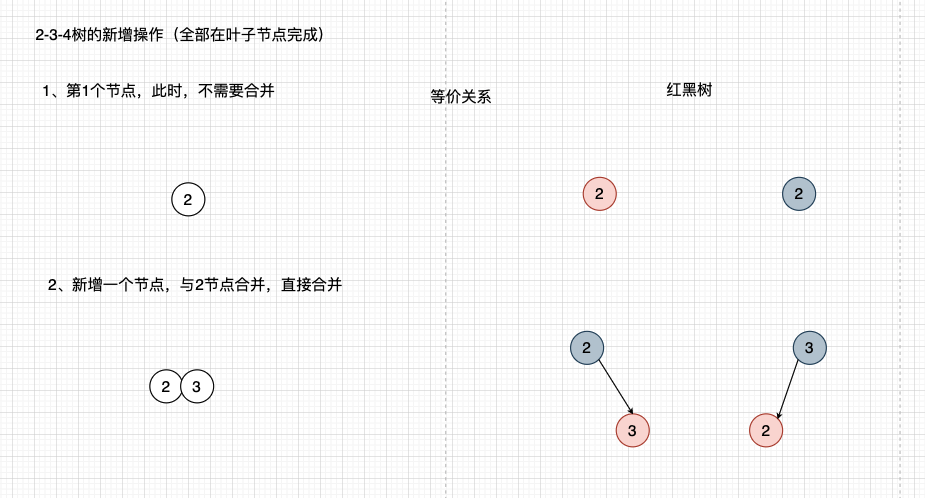
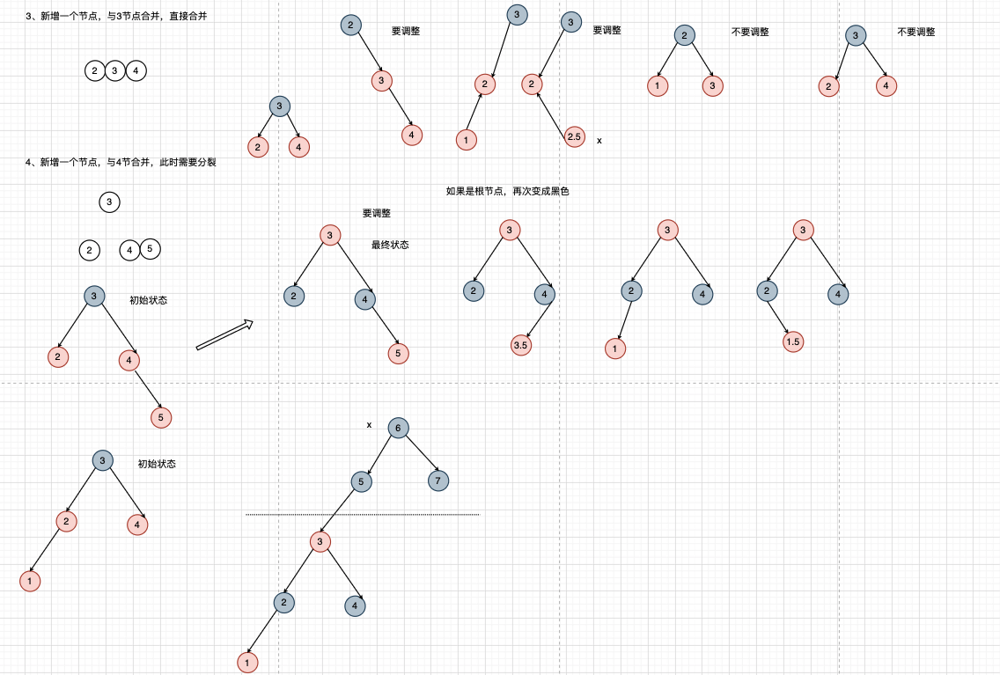

---


title: Data_Tree
comments: true
date: 2021-03-24 21:46:39
tags:
categories: DataStructure
---


#### 树

##### AVL树

通过左旋或者右旋(左旋右旋后一定不会破坏二叉搜索树的查找规则





####  2-3-4树

##### 特点

1. 所有叶子节点都拥有相同的深度。

2. 节点只能是 2-节点、3-节点、4-节点之一。

   > 2-节点:包含 1 个元素的节点，有 2 个子节点; 
   >
   > 3-节点:包含 2 个元素的节点，有 3 个子节点; 
   >
   > 4-节点:包含 3 个元素的节点，有 4 个子节点; 所有节点必须至少包含1个元素

3. 元素始终保持排序顺序，整体上保持二叉查找树的性质，即父结点大于左子结点，小于右子结点;
     而且结点有多个元素时，每个元素必须大于它左边的和它的左子树中元素。


##### 2-3树的生长

和标准的二叉查找树由上向下生长不同，2-3树的生长是由下向上的。




#### 红黑二叉查找树

##### 2-3-4树与红黑树的等价关系



​	

​		裂变状态 9先从黑节点(从4节点)变成红节点，10、12先从红节点变成黑节点。


##### 2-3-4 树

新增操作，从叶子节点开始




 

##### 红黑树

红黑树 新增都是红色节点

根据上面的等价关系，把2-3-4树转换成下面的红黑树。




https://www.bilibili.com/video/BV135411h7wJ?p=4

##### 性质

红黑树是一种结点带有颜色属性的二叉查找树，但它在二叉查找树之外，还有以下5大性质:

1. 节点是红色或黑色。
2. 根是黑色。
3. 所有叶子都是黑色(叶子是NIL节点，这类节点不可以忽视，否则代码会看不懂)。
4. 每个红色节点必须有两个黑色的子节点。(从每个叶子到根的所有路径上不能有两个连续的红色节点。)
5. 从任一节点到其每个叶子的所有简单路径都包含相同数目的黑色节点(黑色平衡)。// 2-3-4树层级相等.

https://www.cs.usfca.edu/~galles/visualization/RedBlack.html


#### 旋转


```java
  /**
     * 围绕p左旋
     *       pf                    pf
     *      /                     /
     *     p                     pr(r)
     *    / \          ==>      / \
     *  pl  pr(r)              p   rr
     *     / \                / \
     *    rl  rr             pl  rl
     *
     * @param p
     */
    private void leftRotate(RBNode p) {
        if (p != null) {
            RBNode r = p.right;
            p.right = r.left;
            if (r.left != null) {
                r.left.parent = p;
            }
            r.parent = p.parent;
            if (p.parent == null) {
                root = r;
            } else if (p.parent.left == p) {
                p.parent.left = r;
            } else {
                p.parent.right = r;
            }
            r.left = p;
            p.parent = r;
        }
    }
```




```java
  /**
     * 右旋
     *    pf                pf
     *     \                 \
     *      p             (l)pl
     *     / \      =>      /  \
     *(l)pl  pr            ll   p
     *   / \                   / \
     *  ll lr                 lr  pr
     *
     * @param p
     */
    private void rightRotate(RBNode p) {
        if (p != null) {
            RBNode l = p.left;
            p.left = l.right;
            if (l.right != null) {
                l.right.parent = p;
            }
            l.parent = p.parent;
            if (p.parent == null) {
                root = l;
            } else if (p.parent.right == p) {
                p.parent.right = l;
            } else {
                p.parent.left = l;
            }
            l.right = p;
            p.parent = l;
        }
    }
```


#### 新增

红黑树新增，第一个节点 是红节点







新增的节点都是红节点 


红黑树形成过程，忘了怎么形成，包括旋转 ， 节点颜色是怎么变化的。


#### 删除


https://www.cs.usfca.edu/~galles/visualization/RedBlack.html