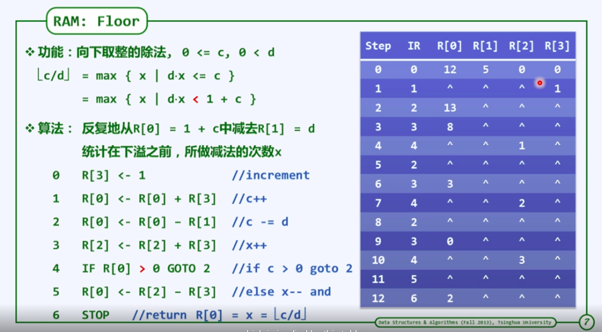
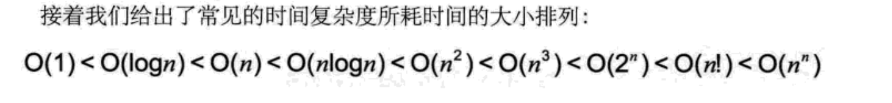
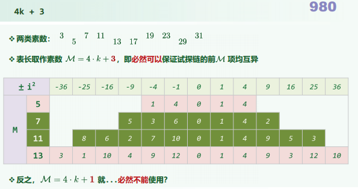

无论什么难题，降低复杂度的方法就是这三个步骤。只要你能深入理解这里的核心思想，就能把问题迎刃而解。

第一步，暴力解法。在没有任何时间、空间约束下，完成代码任务的开发。

第二步，无效操作处理。将代码中的无效计算、无效存储剔除，降低时间或空间复杂度。

第三步，时空转换。设计合理数据结构，完成时间复杂度向空间复杂度的转移。

既然说这是这门专栏的总纲，那么很显然后续的学习都是在这个总纲体系的框架中。第一步的暴力解法没有太多的套路，只要围绕你面临的问题出发，大胆发挥想象去尝试解决即可。第二步的无效操作处理中，你需要学会并掌握递归、二分法、排序算法、动态规划等常用的算法思维。第三步的时空转换，你需要对数据的操作进行细分，全面掌握常见数据结构的基础知识。再围绕问题，有针对性的设计数据结构、采用合理的算法思维，去不断完成时空转移，降低时间复杂度。


*https://github.com/labuladong/fucking-algorithm*

#### 复杂度




消耗计算时间和计算空间

##### 时间复杂度

* 对数阶

  ```c
  int count =1;
  while(count < n){
    count = count * 2;
  }
  ```

  > 代码看到 2 * 2 * 2 ... 最终离n很近，最终退出循环，2^x =n ,得到 x = log2^n,所以这个循环时间复杂度为O(logn)


##### 空间复杂度

空间方面主要体现在计算过程中,对于存储资源的消耗情况




#### 链表

​	


p,q指向的都是整体

```c
typedef struct node{
	int data; // 存储数据本身
    struct node *pNext; //pNext存储  它指向的下一个节点的指针
} NODE, *PNODE;
// NODE等价于struct node
//PNODE等价于struct node*


//将动态分配的新节点的地址赋给p
PNODE p = (PNODE)malloc(sizeof(NODE));

free(p) //删除p指向节点所占的内存，不是删除p本身所占的内存

p->pNext; //p所指向结构体变量中pNext成员本身
```

1. 插入q节点

   ```c
   方法1:
   r = p-> pNext ; p->pNext =q ; q->pNext = r;
   方法2:
   q->pNext = p->pNext;
   p->pNext = q;
   ```

2. 删除p后面的节点

   ```c
   r = p->pNext;
   p->pNext= r->pNext;
   free(r);
   ```


#### 双向链表

##### 插入


```c++
    ListNodePosi <T> insertAsPred(T const&e){//紧靠当前节点之前插入新节点
        ListNodePosi<T> x = new ListNode(e,pred,this); //创建新节点
        pred->succ = x;
        this->pred= x;//设置正向链接,这里是当前节点的前置节点的意思，容易和节点pred混淆
        return x; //返回新节点的位置
    }
```


#### 递归

1. 递归必须得有一个明确的中止条件。
2. 该函数所处理的数据规模必须在递减。


##### 递归复杂度

###### 递归跟踪(recursion trace)分析

```c++
sum(int A[],int n){
	return (n<1)?
        0:sum(A,n-1)+A[n-1]
}
```


检查每个**递归实例**，累计所需的时间(调用语句本身，计入对应的子实例)

其总和即算法执行时间

本例中，单个递归实例自身只需o(1)时间

T(n) = o(1)  * (n+1) = o(n)

 

###### 递归方程

求解sum(A,n) : 递归求解规模为n-1的问题sum(A,n-1) 加上 A[n-1]  。

​	T(n) = T(n-1) + o(1)  // 为了求解T(n)所需要的时间,花了T(n-1)的时间求解n-1的问题,然后再花了o(1)的时间 

​	 T(0) = o(1)

> T(n) = T(n-1) + o(1) //两边同时 -n
>
> T(n) -n = T(n-1) -(n-1) 
>
> ​			 = ...
>
> ​			 =T(2) - 2
>
> ​			= T(1) -1 
>
> ​			=T(0)
>
> T(n) = o(1) +n  = o(n)


##### 递归实例

###### 阶乘 、求和

```c

#include <stdio.h>

long f(int n);
long sum(int n);
int main(void) {
    printf("n=1 输出 %ld \n ", f(1));
    printf("n=2 输出 %ld \n ", f(2));
    printf("n=3 输出 %ld \n ", f(3));
    printf("n=4 输出 %ld \n ", f(4));
    printf("n=5 输出 %ld \n ", f(5));

    printf("n=100 相加 %ld \n ", sum(100));

    int val,mult = 1;
    printf("请输入一个数: val=");
    scanf("%d",&val);
    for (int i = 1; i <= val; ++i) {
        mult = mult * i;
    }
    printf("%d的阶乘是: %d\n",val,mult);
}

//假定n的值是1或大于1的值
long f(int n) {
    if (n == 1) {
        return 1;
    } else {
        return n * f(n - 1);
    }
}

// 1+2+...+100
long sum(int n) {
    if (n == 1) {
        return 1;
    } else {
        return (n + sum(n-1));
    }
}
```


###### 汉诺塔

```c
#include <stdio.h>

void hannuota(int n, char a, char b, char c) {
    /**
     *      一个盘子 :
     *              直接将a柱子上的盘子从a移动到b
     *      否则 :
     *              先将a柱子上的n-1个盘子借助c移到b
     *              直接将a柱子上的盘中从a移到c
     *              最后将b柱子上的n-1个盘子借助a移到c
     */
    if (1 == n) {
        printf("将编号为%d的盘子直接从%c柱子移到%c柱子\n", n, a, c);
    } else {
        hannuota(n - 1, a, c, b);
        printf("将编号为%d的盘子直接从%c柱子移到%c柱子\n", n, a, c);
        hannuota(n - 1, b, a, c);
    }
}

int main(void) {
    char ch1 = 'A';
    char ch2 = 'B';
    char ch3 = 'C';
    printf("请输入要移动盘子的个数:");
    int n;
    scanf("%d",&n);
    hannuota(n,'A','B','C');
    return 0;
}
```


###### Fibonacci.c

```c
#include <stdio.h>
#include <stdbool.h>

int  f(int n){
    if(n==0){
        return 0;
    } else if(n==1){
        return  1;
    } else{
        return f(n-1)+f(n-2);
    }
}


int main(){
    int n;
    printf("输入n的值为 ");
    while (true){
        scanf("%d",&n);
        printf("f(n) %d \n",f(n));
    }
}
```


上面这种求和方式，随着n增加，时间复杂度会指数型增加，到了40已经算不动了，里面会有大量重复的计算

```c
int f(int n) {
    int f = 0;
    int g = 1;
    while (n--){
        g = g+f;
        f = g-f;
    }
    return g;
}
```

这种时间复杂度O(n),不要太快,交替滚动向前推进。


#### Hash(散列)

[Hash(key) + 1^2] % M 		 以平方数为距离，确定下一试探桶单元

 M为三列表的容量





