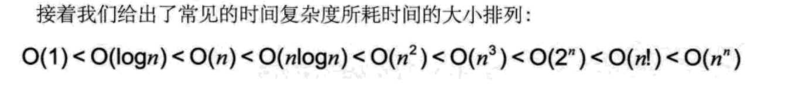
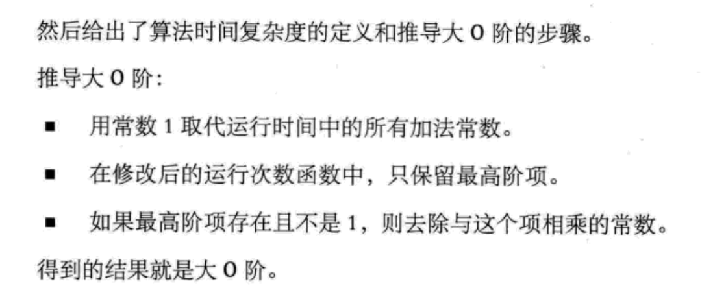
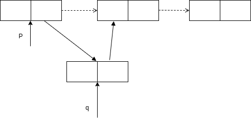

无论什么难题，降低复杂度的方法就是这三个步骤。只要你能深入理解这里的核心思想，就能把问题迎刃而解。

第一步，暴力解法。在没有任何时间、空间约束下，完成代码任务的开发。

第二步，无效操作处理。将代码中的无效计算、无效存储剔除，降低时间或空间复杂度。

第三步，时空转换。设计合理数据结构，完成时间复杂度向空间复杂度的转移。

既然说这是这门专栏的总纲，那么很显然后续的学习都是在这个总纲体系的框架中。第一步的暴力解法没有太多的套路，只要围绕你面临的问题出发，大胆发挥想象去尝试解决即可。第二步的无效操作处理中，你需要学会并掌握递归、二分法、排序算法、动态规划等常用的算法思维。第三步的时空转换，你需要对数据的操作进行细分，全面掌握常见数据结构的基础知识。再围绕问题，有针对性的设计数据结构、采用合理的算法思维，去不断完成时空转移，降低时间复杂度。


*https://github.com/labuladong/fucking-algorithm*

#### 复杂度

消耗计算时间和计算空间

##### 时间复杂度

* 对数阶

  ```c
  int count =1;
  while(count < n){
    count = count * 2;
  }
  ```

  > 代码看到 2 * 2 * 2 ... 最终离n很近，最终退出循环，2^x =n ,得到 x = log2^n,所以这个循环时间复杂度为O(logn)


##### 空间复杂度

空间方面主要体现在计算过程中,对于存储资源的消耗情况





#### 链表



p,q指向的都是整体

```c
typedef struct node{
	int data; // 存储数据本身
    struct node *pNext; //pNext存储  它指向的下一个节点的指针
} NODE, *PNODE;
// NODE等价于struct node
//PNODE等价于struct node*


//将动态分配的新节点的地址赋给p
PNODE p = (PNODE)malloc(sizeof(NODE));

free(p) //删除p指向节点所占的内存，不是删除p本身所占的内存

p->pNext; //p所指向结构体变量中pNext成员本身
```


1. 插入q节点

   ```c
   方法1:
   r = p-> pNext ; p->pNext =q ; q->pNext = r;
   方法2:
   q->pNext = p->pNext;
   p->pNext = q;
   ```

2. 删除p后面的节点

   ```c
   r = p->pNext;
   p->pNext= r->pNext;
   free(r);
   ```

   

   

   

