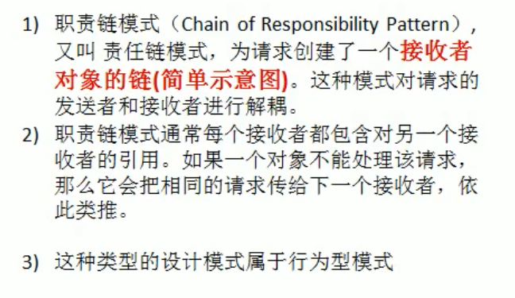
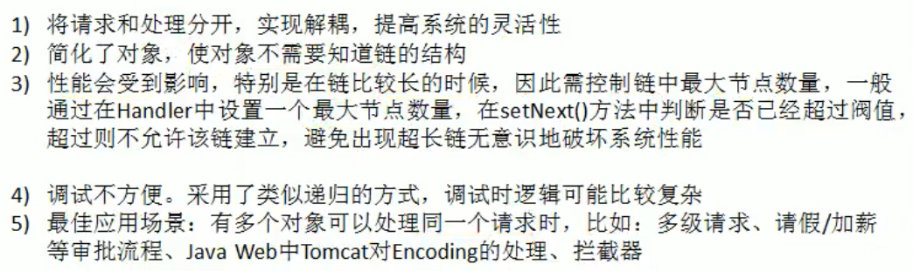

##### 传统方案OA系统审批问题


##### 职责链模式介绍



使多个对象都有机会处理请求，从而避免请求的发送者和接收者之间的耦合关系。将这个对象连城一条链，并沿着这条传递该请求。直到有一个对象处理它为止。


##### 大话示例

chain of Responsibility Pattern

```java
public class Request {
    public String requestType;
    public String requestContent;
    public int number;
}
```

```java
public abstract class Manager {
    protected String name;
    protected Manager superior;//管理者上级

    public Manager(String name) {
        this.name = name;
    }

    // 设置管理者上级
    public void setSuperior(Manager superior) {
        this.superior = superior;
    }

    //申请请求
    abstract void requestApplications(Request request);
}
```

```java
public class CommonManager extends  Manager {
    public CommonManager(String name) {
        super(name);
    }

    @Override
    void requestApplications(Request request) {
        if ("请假".equals(request.requestType)&&request.number<2){
            System.out.println(name+" "+ request.requestContent+ " 数量   "+ request.number+" 被批准");
        }else {
            if (superior!=null)
                superior.requestApplications(request);
        }
    }
}
```

```java
public class MajorDomo extends  Manager {
    public MajorDomo(String name) {
        super(name);
    }

    @Override
    void requestApplications(Request request) {
        if ("请假".equals(request.requestType)&&request.number<5){
            System.out.println(name+" "+ request.requestContent+ " 数量   "+ request.number+" 被批准");
        }else {
            if (superior!=null)
                superior.requestApplications(request);
        }
    }
}
```

```java
public class GeneralManager extends Manager {
    public GeneralManager(String name) {
        super(name);
    }

    @Override
    void requestApplications(Request request) {
        if ("请假".equals(request.requestType) && request.number < 5) {
            System.out.println(name + " " + request.requestContent + " 数量   " + request.number + "  被批准");
        } else if ("加薪".equals(request.requestType) && request.number < 500) {
            System.out.println(name + " " + request.requestContent + " 数量   " + request.number + "  被批准");
        }else if ("加薪".equals(request.requestType) && request.number > 500) {
            System.out.println(name + " " + request.requestContent + " 数量   " + request.number + "  再说吧");
        }
    }
}
```

```java
CommonManager commonManager = new CommonManager("经理");
MajorDomo majorDomo = new MajorDomo("总监");
GeneralManager generalManager = new GeneralManager("总经理");

commonManager.setSuperior(majorDomo);//设置上级
majorDomo.setSuperior(generalManager);

Request request = new Request();
request.requestType = "请假";
request.number = 4;
request.requestContent = "去找小姐姐";
commonManager.requestApplications(request);


Request request1 = new Request();
request1.requestType = "加薪";
request1.number = 888;
request1.requestContent = "给哥加薪";
commonManager.requestApplications(request1);
```

##### 责任链模式作用



https://www.bilibili.com/video/BV1G4411c7N4?p=149&spm_id_from=pageDriver

https://blog.csdn.net/weixin_45203607/article/details/120238491