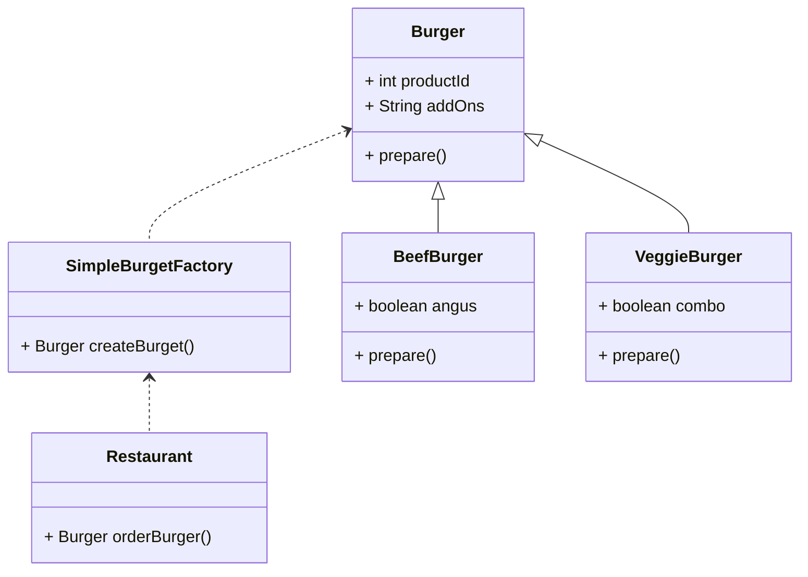
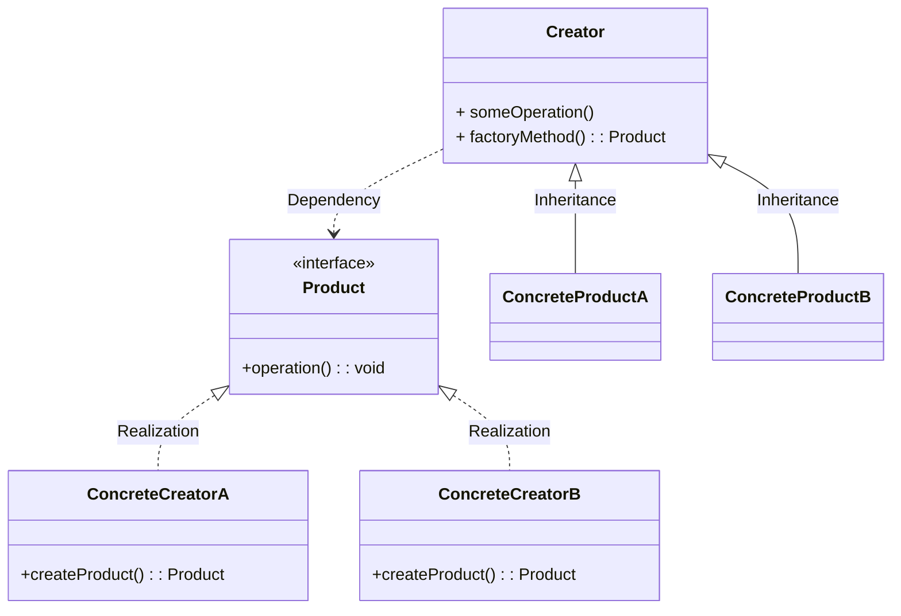
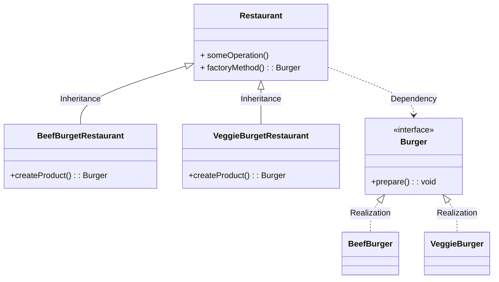

工厂方法模式   ： 只创建一种类型的实例，
抽象工厂方法模式 ： 创建多种类型的实例, 抽象工厂 只有一个实例后，也就是工厂方法。

https://www.youtube.com/watch?v=EdFq_JIThqM

# origin

1. donnot have a common base class

```
public class Restuarant{
    public ???? orderBuger(String request){
        if("BEEF".equals(request)){
            BeefBurger burger  = new BeefBurger();
            burget.prepare();
            return burger;
        }else if("VEGGIE".equals(request)){
            VeggieBurger burger = new VeggieBurger();
            burget.prepare();
            return burger;
        }
    }
}

```


工厂方法和抽象工厂方法 都是通过工厂生产产品，由于产品都实现了相同的接口，根据获取到的产品作相应的处理

工厂方法 :返回一个产品实例 ,  继承了工厂Dialog Base类,Base类抽象方法由sub类实现

抽象工厂方法:可以返回一组相关的产品实例,实现了创建不同产品的抽象工厂接口

# Simple factory


is not a full-fledged offical pattern

UML




implements

   
```
public class SimpleBurgetFactory{
    public Burger orderBuger(String request){
        if("BEEF".equals(request)){
            BeefBurger burger  = new BeefBurger();
        }else if("VEGGIE".equals(request)){
            VeggieBurger burger = new VeggieBurger();
        }
        burget.prepare();
        return burger;
    }
}
```


#  Factory method 

如果我们想新增一种类型或者修改，一种类型，那么就需要修改上面简单工厂的代码。

## Standard Uml

标准工厂UML




我们的工厂不再创造对象，而是把这个构建过程移到子类。


UML




```
public class Restaurant{
    public Burger orderBuger(String request){
        Burger burger  = createBurget();
        burget.prepare();
        return burger;
    }
    public abstract Burget createBurget();
}

public class BeefBurgetRestaurant extends Restaurant{
    @Override
    public  Burget createBurget(){
        return new BeefBurger();
    }
}

public class VeggieBurgetRestaurant extends Restaurant{
    @Override
    public  Burget createBurget(){
        return new  VeggieBurger();
    }
}

public interface Burger{
    void prepare();
}

public class BeefBurger implements Burger{
    void prepare(){}
}

public class VeggieBurger implements Burger{
    void prepare(){}
}

public static void main(String[] args) {
    BeefBurgetRestaurant beefResto = new BeefBurgetRestaurant();
    Burger beefBurger =  beefResto.orderBurget();

    VeggieBurgetRestaurant veggieResto = new VeggieBurgetRestaurant();
    Burger beefBurger =  veggieResto.orderBurget();
}

```


# Abstract Factory(抽象工厂 elementary )


简单工厂的工厂,产品族

https://blog.csdn.net/qq_18242391/article/details/81503370


