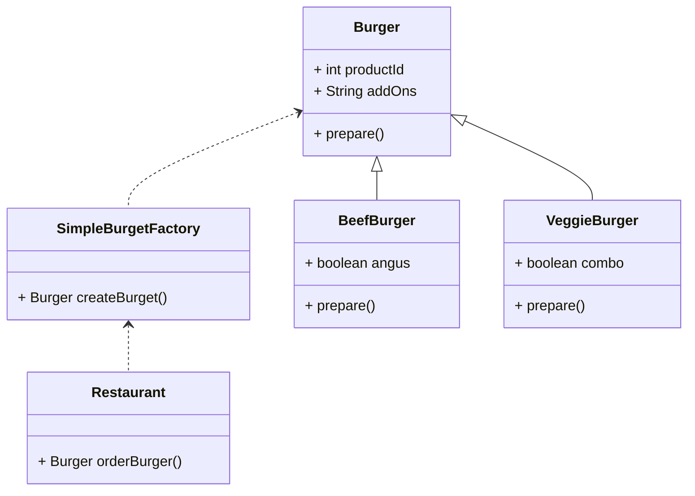
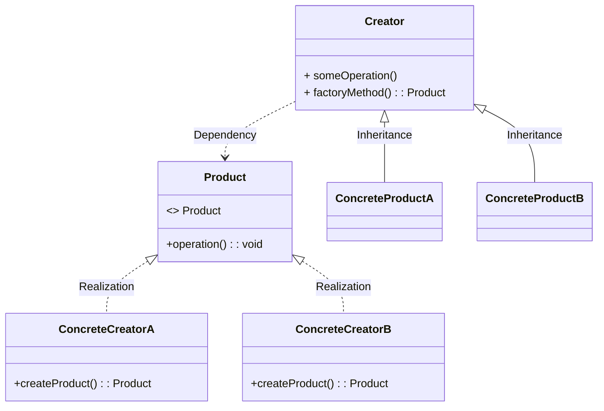

工厂方法模式   ： 只创建一种类型的实例，
抽象工厂方法模式 ： 创建多种类型的实例, 抽象工厂 只有一个实例后，也就是工厂方法。

https://www.youtube.com/watch?v=EdFq_JIThqM

# origin

1. donnot have a common base class

```
public class Restuarant{
    public ???? orderBuger(String request){
        if("BEEF".equals(request)){
            BeefBurger burger  = new BeefBurger();
            burget.prepare();
            return burger;
        }else if("VEGGIE".equals(request)){
            VeggieBurger burger = new VeggieBurger();
            burget.prepare();
            return burger;
        }
    }
}

```


工厂方法和抽象工厂方法 都是通过工厂生产产品，由于产品都实现了相同的接口，根据获取到的产品作相应的处理

工厂方法 :返回一个产品实例 ,  继承了工厂Dialog Base类,Base类抽象方法由sub类实现

抽象工厂方法:可以返回一组相关的产品实例,实现了创建不同产品的抽象工厂接口

# Simple factory


is not a full-fledged offical pattern

UML




implements

   
```
public class SimpleBurgetFactory{
    public Burger orderBuger(String request){
        if("BEEF".equals(request)){
            BeefBurger burger  = new BeefBurger();
        }else if("VEGGIE".equals(request)){
            VeggieBurger burger = new VeggieBurger();
        }
        burget.prepare();
        return burger;
    }
}
```


#  Factory method 

如果我们想新增一种类型或者修改，一种类型，那么就需要修改上面简单工厂的代码。

## Standard Uml

标准工厂UML




我们的工厂不再创造对象，而是把这个构建过程移到子类。


```
public class Restaurant{
    public Burger orderBuger(String request){
        Burger burger  = createBurget();
        burget.prepare();
        return burger;
    }
    public abstract Burget createBurget();
}

public class BeefBurgetRestaurant extends Restaurant{
    @Override
    public  Burget createBurget(){
        return new BeefBurger();
    }
}

public class VeggieBurgetRestaurant extends Restaurant{
    @Override
    public  Burget createBurget(){
        return new  VeggieBurger();
    }
}
public static void main(String[] args) {
    BeefBurgetRestaurant beefResto = new BeefBurgetRestaurant();
    Burger beefBurger =  beefResto.orderBurget();

    VeggieBurgetRestaurant veggieResto = new VeggieBurgetRestaurant();
    Burger beefBurger =  veggieResto.orderBurget();
}

public interface Burger{
    void prepare();
}

public class BeefBurger implements Burger{
    void prepare(){}
}

public class VeggieBurger implements Burger{
    void prepare(){}
}

```


假如我要实例化一个pig对象,那么肯定是要在Factory做添加的，接下来看看可以不修改其他类实现需求

2. Abstract Factory(抽象工厂 elementary )

```java
 public interface Provider {
  Animal produce();
 }

 public class DogFactory implements  Provider {
   @Override
   public Animal produce() {
    return new Dog();
   }
 }
```

```java
public class CatFactory implements Provider {
    @Override
    public Animal produce() {
        return new Cat();
    }
}
```

​    Provider provider = new CatFactory();
​     Animal cat = provider.produce();
​    cat.move();
  如果要实例化Pig，添加一个PigFactory 就可以了

##### 不同Button实例

```java
/**
 * // 抽象工厂接口声明了一组能返回不同抽象产品的方法。这些产品属于同一个系列
 * // 且在高层主题或概念上具有相关性。同系列的产品通常能相互搭配使用。系列产
 * // 品可有多个变体，但不同变体的产品不能搭配使用。
 */
public interface GUIFactory {
    Button createButton();
    CheckBox createCheckBox();
}
```

```java
// Concrete factories produce a family of products that belong
// to a single variant. The factory guarantees that the
// resulting products are compatible. Signatures of the concrete
// factory's methods return an abstract product, while inside
// the method a concrete product is instantiated.
public class WinFactory implements  GUIFactory {
    public Button createButton() {
        return new WinButton();
    }

    public CheckBox createCheckBox() {
        return new WinCheckbox();
    }
}
```

```java
public class MacFactory implements  GUIFactory {
    public Button createButton() {
        return new MacButton();
    }

    public CheckBox createCheckBox() {
        return new MacCheckbox();
    }
}
```

```java
/**
 * // 系列产品中的特定产品必须有一个基础接口。所有产品变体都必须实现这个接口。
 */
public interface Button {
    void  paint();
}
```

```java
// Concrete products are created by corresponding concrete
// factories.
public class WinButton implements Button{
    public void paint() {
        System.out.println("根据 Windows 样式渲染按钮   WinButton");
    }
}
```

```java
public class MacButton implements Button{
    public void paint() {
        System.out.println("根据 macOs 样式渲染按钮 MacButton");
    }
}
```

```java
// 这是另一个产品的基础接口。所有产品都可以互动，但是只有相同具体变体的产
// 品之间才能够正确地进行交互。
public interface CheckBox {
    void  paint();
}
```

```java
public class WinCheckbox implements  CheckBox {
    public void paint() {
        System.out.println("根据 Win 样式渲染复选框。   WinCheckbox");
    }
}
```

```java
public class MacCheckbox implements  CheckBox {
    public void paint() {
        System.out.println("根据 macOS 样式渲染复选框。   MacCheckbox");
    }
}
```

```java
public class Application {
    private GUIFactory factory;
    private Button button;
    private CheckBox checkBox;
    public Application(GUIFactory factory) {
        this.factory = factory;
    }

    public void createUi() {
        this.button = factory.createButton();
        this.checkBox = factory.createCheckBox();
    }

    public  void paint(){
        button.paint();
        checkBox.paint();
    }
}
```

https://refactoring.guru/design-patterns/abstract-factory

https://www.zhihu.com/question/20367734

##### 不同Dialog实例

```java
public abstract class Dialog {
    // The creator may also provide some default implementation
    // of the factory method.
    abstract Button createButton();

    // Note that, despite its name, the creator's primary
    // responsibility isn't creating products. It usually
    // contains some core business logic that relies on product
    // objects returned by the factory method. Subclasses can
    // indirectly change that business logic by overriding the
    // factory method and returning a different type of product
    // from it.
    void render() {
        // Call the factory method to create a product object.
        Button okButton = createButton();
        // Now use the product.
        okButton.onClick("closeDialog");
        okButton.render();
    }
}
```

```java
public class WindowsDialogFac extends Dialog {
    Button createButton() {
        return new WindowsButton();
    }
}
```

```java
public class WebDialogFac extends Dialog {
    Button createButton() {
        return new HTMLButton();
    }
}
```

```java
public interface Button {
    void render();
    void onClick(String  cls);
}
```

```
public class WindowsButton implements Button {
    public void render() {
        System.out.println("WindowsButton   render()");
    }

    public void onClick(String cls) {
        System.out.println("WindowsButton   onClick "+cls);
    }
}
```

```
public class HTMLButton implements Button {
    public void render() {
        System.out.println("HTMLButton   render()");
    }

    public void onClick(String cls) {
        System.out.println("HTMLButton   onClick "+cls);
    }
}
```

```java
public class Application {
    Dialog dialog;

    String configOs = "Windows";


    void initialize() throws Exception {
        if (configOs.equals("Windows")) {
            dialog = new WindowsDialogFac();
        } else if (configOs.equals("HTML")) {
            dialog = new WebDialogFac();
        } else
            throw new Exception("Error! Unknown operating system.");
    }

    // The client code works with an instance of a concrete
    // creator, albeit through its base interface. As long as
    // the client keeps working with the creator via the base
    // interface, you can pass it any creator's subclass.
    public void main() throws Exception {
        initialize();
        dialog.render();
    }

}
```

##### 抽象工厂

简单工厂的工厂,产品族

https://blog.csdn.net/qq_18242391/article/details/81503370


