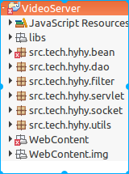
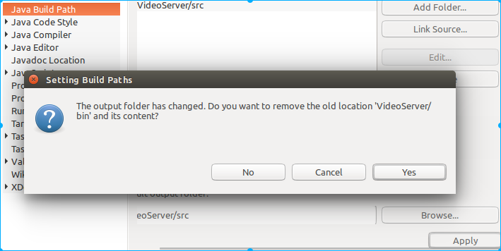
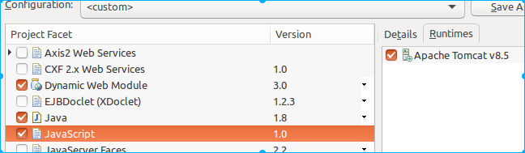

Eclipse导入web项目

1、src并入包
导入项目后可以看这种情况　
处理方法：VideoServer右键－>Build Path->Configure Build Path->Source->Brower->src->Apply;接着就可以看到,点击Yes后，项目目录正常了，但是发现这是一个Ｊava项目,没有javax.相关的包
- ２、Ｊava项目转Ｗeb项目
VideoServer右键－>Properties->Project Facets
- 在这里勾选　Dynamic Web Module:下面会有个提示　Ｄynamic Web Module 3.0 Requires Java 1.6 or newer.
- 勾选　Ｊava　　
- 勾选　ＪavaScript
点击Apply

