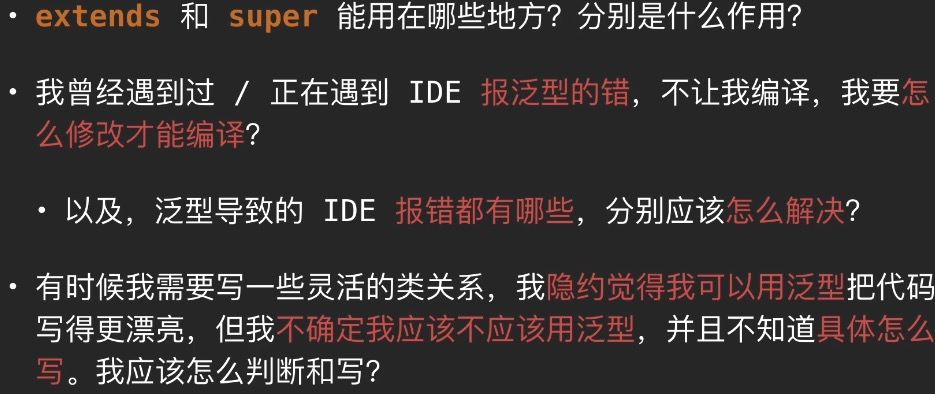
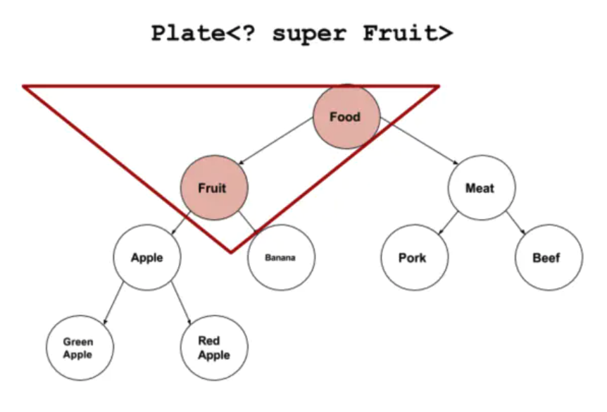

https://www.bilibili.com/video/BV1T441117u8

#### 泛型

##### 继承类型

```java
class Button extends TextView
```

不能把子类的List对象 ArrayList<Button>   赋值给父类的List引用 List<TextView>

Java

##### ? extends TextView 

```java
 List<TextView> textViews=new ArrayList<>();
  
 List<TextView> textViews=new ArrayList<Button>(); //报错
 
// 解决办法
 List<? extends TextView> textViews =new ArrayList<Button>(); //解除了赋值限制

//新增了限制，  只能消费使用,不能生产
 TextView textView = new TextView(this);
 textViews.add(textView); //报错， 不能调用textViews的包含 类型参数的方法

 TextView textView = textViews.get(0); // 没有问题


 List<Button> buttons=new ArrayList<Button>();
 textView = buttons;//报错

```


##### ? super Button

```java
ArrayList<Button> textViews1 = new ArrayList<TextView>();


ArrayList<? super Button> textViews2 = new ArrayList<TextView>();

 //新增了限制
Button button = textViews2.get(0); //报错, 不能使用，只能生产

textViews1.add(new Button(this)); // 没有问题

```


##### Java kotlin对比

Java

```java
List<? extends TextView> textViews;

List<? super Button> textViews;
```

Kotlin

```kotlin
var textVies: List<out TextView>
var textVies: List<in TextView>
```


##### kotlin新增用法

表示我这个类型,这个类只用来输出或者输入

```kotlin
interface Producer<out T>{
	fun produce(): T
}

interface Consumer<in T>{
	fun consume(product:T)
}
```


##### *用法

Java

```java
List<?> textViews;
相当于
List<? extends Object> textViews;
```


Kotlin

```kotlin
var textVies: List<*>
相当于
var textVies: List<out Any>
```


如果类型声明里，已经又了out或者in,这个限制在变量声明时也依然存在,不会被*去掉

```kotlin
interface Counter<out T : Number>{
	fun count(): T
}

var counter: Counter<*> =;
那么Counter<*>就相当于下面的情况 Counter<out Number>
var counter: Counter<out Number>
```


##### 类型声明上界

注意这里是T extend Animal ，和带? extend Animal  的声明不是一个东西

java

```java
class Monster<T extends Animal & Food>{

}
```


kotlin

```kotlin
class Monster<T : Animal>{} // 一个上界

class Monster<T> where T : Animal, T : Food{} // 多个上界

```


##### refield

java

```java
	<T> void printIfTypeMatch(Object item){
    if(item instanceof T){} // 报错，不能检查一个对象,是不是一个T的实例
  }
```

kotlin

```kotlin
	fun	<T> void printIfTypeMatch(item : Any){
    if(item instanceof T){} // 报错，不能检查一个对象,是不是一个T的实例
  }


	inline fun	<reified T> void printIfTypeMatch(item : Any){//reified自身限制，只能用在inline
    if(item instanceof T){} // 正常编译
  }
```





#### 泛型类

```java
public class Order<T> {
    String orderName;
    int orderId;

    T orderT;

    public Order() {
    }

    public Order(String orderName, int orderId, T orderT) {
        this.orderName = orderName;
        this.orderId = orderId;
        this.orderT = orderT;
    }

    public T getOrderT() {
        return orderT;
    }

    public void setOrderT(T orderT) {
        this.orderT = orderT;
    }
}
```


##### 子类不是泛型类

 父类指明类型,由于子类在继承带泛型的父类时，指明了泛型类型，则实例化子类对象时，不再需要指明泛型。

```java
public class SubOrder extends Order<Integer> {
}

@Test
public void  test1(){
        //由于子类在继承带泛型的父类时，指明了泛型类型，则实例化子类对象时，不再需要指明泛型。
        SubOrder subOrder = new SubOrder();
        subOrder.setOrderT(1122);
 }
```


##### 子父类关系

类A是类B的父类，G<A>和G<B>二者不具备父子类关系,也不具任何关系。

类A是类B的父类，A<G>是 B<G>的父类。


反证法:

https://www.bilibili.com/video/BV1fi4y1b7NM?p=11

##### 子类是泛型类


```java
public class SubOrder1<T> extends Order<T> {
}

SubOrder1<String> sub2 = new SubOrder1<>();
sub2.setOrderT("order...");
```


#### 泛型方法

```java
public class Person3<T> {
    //泛型普通方法
    public void show(T name) {
        System.out.println(name + "正在演讲");
    }
    public <M> void show1(M name) {
        System.out.println(name + "正在演讲");
    }
    //静态泛型方法中的类型占位符和类中的泛型占位符是没有关系的
    public static <W> void show2(W name) {
        System.out.println(name + "：静态方法正在演讲!");
    }

    public static <E> E show3(E name) {
        return name;
    }
}

```

#### 

#### 泛型接口


```kotlin
interface PerInt<T> {
    fun show(name: T)
}
```


1.  泛型接口的实现类 可以指定具体的泛型接口的具体泛型类型

   ```kotlin
   class PerImtImpl : PerInt<String> {
       override fun show(name: String) {
       }
   }
   ```

2. 泛型接口的实现类，如果没有指定具体的泛型类型，必须要在这个实现类中声明一个泛型类型的占位符给接口用

   ```kotlin
   class PerImtImpl01<T> : PerInt<T> {
       override fun show(name: T) {
       }
   }
   ```

   

#### 类型擦除

Java中的泛型基本上都是在编译器这个层次来实现的。在生成的Java字节码中是不包含泛型中的类型信息的。使用泛型的时候加上的类型参数，会在编译器在编译的时候去掉。这个过程就称为类型擦除。

泛型的作用是能在编译期间就提示错误，而不是运行时。


```kotlin
val p1 = PerImtImpl01<String>()
val p2 = PerImtImpl01<Int>()
println(p1.javaClass == p2.javaClass)
println(p1.javaClass === p2.javaClass)
```


#### 通配符

Java中的继承 ，在泛型中并不是父子类关系 

```kotlin
class PerImtImpl01<T> : PerInt<T> {
    var name: T
        get() {
            return name
        }
        set(value) {
            name = value
        }

    override fun show(name: T) {
    }

    fun show(p: PerImtImpl01<*>) {//如果是T类型 编译报错，虽然Int:Number,但是在泛型中不存在继承关系
        name = p.name as T
    }
}
```


```kotlin
val p3 = PerImtImpl01<Number>()
val p4 = PerImtImpl01<Int>()
p3.name = 111
p4.show(p3)
```


 ##### 符号区别

Java用 ？  Kotlin 用 *


无界通配符 意味着可以使用任何对象，因此使用它类似于使用原生类型


类A是类B的父类，G<A>和G<B>的公共的父类是: G<?>

##### 遍历List

```java
  @Test
    public void test2(){
        List<Object> list1 = null;
        List<String> list2 = null;

        List<?> list = null;
        list = list1;
        list = list2;

        print(list1);
        print(list2);
    }


    public void print(List<?> list){
        Iterator<?> iterator = list.iterator();
        while (iterator.hasNext()){
            Object o = iterator.next();
            System.out.println(o);
        }

        list.forEach(o -> {
            System.out.println(o);
        });
    }
```

对于List<?> 就不能向其添加数据。如果任何类型引用通过赋值给 List<?> 能添加数据，那定义泛型就没意义了

```java
 			  List<?> list = null;
 		    ArrayList<String> list3 = new ArrayList<>();
        list3.add("AA");
        list3.add("BB");
        list3.add("CC");
        list = list3;
        //添加(写入):对于List<?> 就不能向其添加数据，如果能添加数据，那定义泛型就没意义了。
        //除了添加null之外
//        list.add("MED");
//        list.add("?");
        list.add(null);

        //可以获取数据，读取的数据类型为Object
        Object o = list.get(0);
        System.out.println(o);
```


#### 上下界


**如果静态方法要使用泛型的话，必须将静态方法也定义成泛型方法** 

```java
public class StaticGenerator<T> {
    ....
    ....
    /**
     * 如果在类中定义使用泛型的静态方法，需要添加额外的泛型声明（将这个方法定义成泛型方法）
     * 即使静态方法要使用泛型类中已经声明过的泛型也不可以。
     * 如：public static void show(T t){..},此时编译器会提示错误信息：
          "StaticGenerator cannot be refrenced from static context"
     */
    public static <T> void show(T t){

    }
}
```


- 上界<? extends T>不能往里存，只能往外取，适合频繁往外面读取内容的场景。
- 下界<? super T>不影响往里存，但往外取只能放在Object对象里，适合经常往里面插入数据的场景。


##### 上界通配符	<? extends T>

泛型中的继承

泛型中的继承不是Java中的继承。也就是说java中的父子类关系， 在泛型中 并不是父子类关系。


```
class Fruit {
}

class Apple extends Fruit {
}

class Plate<T> {
    T item;
    
	public Plate() {
    }
    public Plate(T item) {
        this.item = item;
    }

    public T get() {
        return item;
    }

    public void set(T item) {
        this.item = item;
    }
}
```


###### ? extends Fruit赋值

? extends Fruit 可以理解为 <= Fruit

List<? extends Fruit> 可以作为 List<Apple> ， List<Fruit>的父类。

```java
//        List<Fruit> list1 =  new ArrayList<Apple>();  //编译报错，泛型具体类型 List<Fruit> ,ArrayList<Apple> 不存在继承关系
        // ? extends Fruit 可以理解为 <= Fruit

        // List<? extends Fruit>                        //  可以作为 List<Apple> ， List<Fruit>的父类。
        List<? extends Fruit> list4 =  new ArrayList<Apple>();
        List<? extends Fruit> list5=  new ArrayList<Fruit>();
//        List<? extends Fruit> list5 =new ArrayList<Object>();    //编译报错，Object类不在 <= Fruit范围内

        /**
         * 只能读取数据 , 不能修改数据
         */

        Fruit fruit = list4.get(0);
//        Apple apple =list2.get(0); //编译不通过， <= Fruit范围，list1.get(0)实际类型可能是Fruit，是Apple的父类。

//        list1.add(new Apple()); //编译报错，<= Fruit范围， List<? extends Fruit>实际类型可能比是GreenApple,比Apple范围还小，随意存不了数据

```


###### 读取数据

? extends Fruit 所以泛型最大的父类就是Fruit,子类型可以直接复制给父类

```java
        /**
         * 只能读取数据 , 不能修改数据
         */

        Fruit fruit = list4.get(0);
//        Apple apple =list2.get(0); //编译不通过， <= Fruit范围，list1.get(0)实际类型可能是Fruit，是Apple的父类。
//        list1.add(new Apple()); //编译报错，<= Fruit范围， List<? extends Fruit>实际类型可能比是GreenApple,比Apple范围还小，随意存不了数据

```


>  **你会发现无法往里面设置任何数据**，按道理说我们将泛型类型设置为? extend Fruit。按理说我们往里面添加Fruit的子类应该是可以的。但是Java编译器不允许这样操作。<? extends Fruit>会使往盘子里放东西的set()方法失效。但取东西get()方法还有效

>  原因是：Java编译期只知道容器里面存放的是Fruit和它的子类，具体是什么类型不知道，可能是Fruit？可能是Apple？也可能是Banana，RedApple，GreenApple？编译器在后面看到Plate< Apple >赋值以后，盘子里面没有标记为“苹果”。只是标记了一个占位符“CAP#1”，来表示捕获一个Fruit或者Fruit的派生类，具体是什么类型不知道。所有调用代码无论往容器里面插入Apple或者Meat或者Fruit编译器都不知道能不能和这个“CAP#1”匹配，所以这些操作都不允许。
>
> 一个Plate<? extends Fruit>的引用，可能是一个Plate <Apple>类型的盘子，要往这个盘子里放<Banana>当然是不被允许的.


但是上界通配符是允许读取操作的。例如代码


这个我们很好理解，由于上界通配符设定容器中只能存放Fruit及其子类，那么获取出来的我们都可以隐式的转为Fruit基类。所以上界描述符Extends适合频繁读取的场景。


Java类型擦除只会擦除到Fruit类型,如果没有指明边界，那么类型参数将被擦除到Object.


###### 写入数据

可以发现任何数据都不能存入。[-∞,Fruit]范围，-∞不知道具体的类型小到多少

```java
 list1.add(new Apple()); //编译报错，<= Fruit范围， List<? extends Fruit>实际类型可能比是GreenApple,比Apple范围还小，随意存不了数据
```


##### 下界通配符 <? super T>




######  ? super Fruit赋值

 ? super Fruit 可以理解为 >= Fruit


```java
        //只能修改数据，不能读取数据
        // <? super Fruit>

        List<? super Fruit> list6 = new ArrayList<Fruit>();  //   ? super Fruit 可以理解为 >= Fruit
        List<? super Fruit>  list7 = new ArrayList<Object>();


        Object object = list6.get(0); //理论上不能读取，但是都到Object还是可以的

//        Food food = list2.get(0); //编译不通过，>=Fruit范围，list2.get(0)实际类型可能是Object,不能赋值给小于它子类，所以只能是Object
```


###### 读取数据

```java
        Object object = list6.get(0); //理论上不能读取，但是都到Object还是可以的

//        Food food = list2.get(0); //编译不通过，>=Fruit范围，list2.get(0)实际类型可能是Object,不能赋值给小于它子类，所以只能是Object
```


###### 写入数据

 ? super Fruit范围是是 [Fruit,+∞), 所以Fruit范围内的都可以添加

```java
        list6.add(new Fruit());
        list6.add(new Apple()); //
//        list6.add(new Food()); //   ? super Fruit范围是是 [Fruit,+∞), 所以Fruit范围内的都可以添加
```


下界通配符<? super Fruit>不影响往里面存储，但是读取出来的数据只能是Object类型。


> 下界通配符规定了元素最小的粒度，必须是Fruit或其基类，那么我往里面存储Fruit及其子类都是可以的，因为它都可以隐式的转化为Fruit类型。但是往外读就不好控制了，里面存储的都是Fruit及其基类，无法转型为任何一种类型，只有Object基类才能装下。


https://juejin.im/post/5b614848e51d45355d51f792

www.jianshu.com/p/dd34211f2565

https://itimetraveler.github.io/2016/12/27/%E3%80%90Java%E3%80%91%E6%B3%9B%E5%9E%8B%E4%B8%AD%20extends%20%E5%92%8C%20super%20%E7%9A%84%E5%8C%BA%E5%88%AB%EF%BC%9F/


https://www.bilibili.com/video/BV1xJ411n77R?p=7

#### kotlin


out in 和 extend super没关系

##### out

只能获取 不能修改


```kotlin
    var list:MutableList<out Fruit>  = ArrayList<Apple>() // ? extends Fruit 实际类型可能比是Apple小
//    list.add(Apple()) 编译报错
    var list2: ArrayList<in Apple> = ArrayList<Fruit>() //  ? super Fruit  实际类型可能比是Apple大很多
//    list2.get(0)
```


https://www.bilibili.com/video/BV1xv411k7Dd?p=4&spm_id_from=pageDriver

https://noteforme.github.io/2021/08/21/kotlin-object/#Out-In

https://www.bilibili.com/video/BV1Hy4y1H7oS?p=7


#### 泛型数组


1. 可以声明带泛型的数组引用，但是不能直接创建带泛型的数组对象

   ```java
           ArrayList<Integer> intList = new ArrayList<>();
           intList.add(100);
   
   
           ArrayList<String> strList = new ArrayList<>();
           strList.add("abc");
           listArr[0] = strList;
           String s = listArr[0].get(0);
           System.out.println(s);
   ```

2. 可以通过java.lang.reflect.Array的newInstance(Class<T>,int) 创建T[]数组

   ```java
   public class FruitArr<T> {
       private T[] array;
   
       public FruitArr(Class<T> clz, int length) {
           this.array = (T[]) Array.newInstance(clz, length);
       }
   
       public void put(int index, T item) {
           array[index] = item;
       }
   
       public T get(int index){
           return array[index];
       }
   
       public T[] getArray(){
           return array;
       }
   }
   ```

   ```java
   FruitArr<String> fruit = new FruitArr<>(String.class,3);
   fruit.put(0,"苹果");
   fruit.put(1,"西瓜");
   fruit.put(2,"香蕉");
   String s1 = Arrays.toString(fruit.getArray());
   System.out.println(s1);
   ```

​	

#### 泛型与反射

```java
Class<Person> personClass = Person.class;
Constructor<Person> constructor = personClass.getConstructor();
Person person = constructor.newInstance();
```

​	https://www.bilibili.com/video/BV1xJ411n77R?p=12


$i$f$withM 有时候看到$以为是操作符，其实就是$i$f$withM整体的变量


```
Array<out Any>  对应于 Java 的 Array<? extends Object>

Array<in String> 对应于 Java 的 Array<? super String>
```


