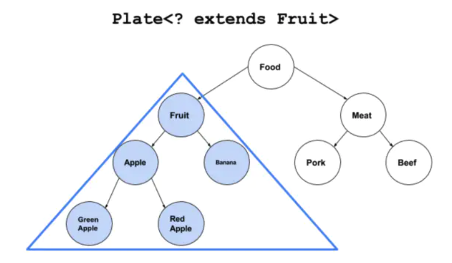
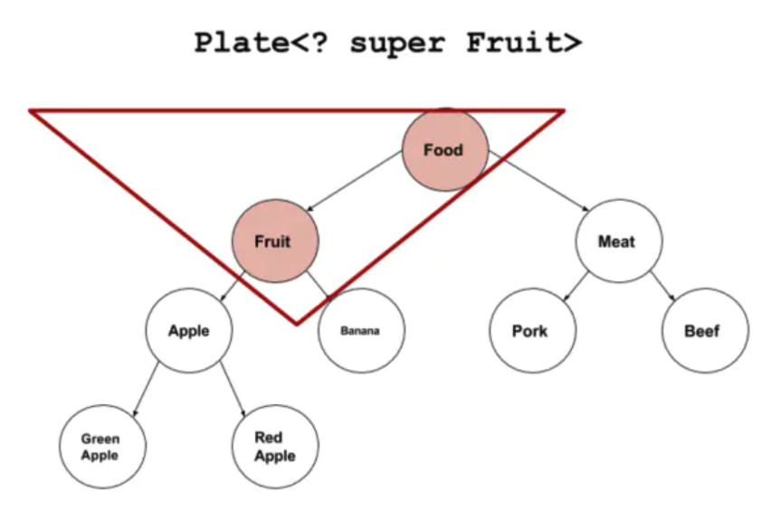

类型信息

- 上界<? extends T>不能往里存，只能往外取，适合频繁往外面读取内容的场景。
- 下界<? super T>不影响往里存，但往外取只能放在Object对象里，适合经常往里面插入数据的场景。


**如果静态方法要使用泛型的话，必须将静态方法也定义成泛型方法** 

```
public class StaticGenerator<T> {
    ....
    ....
    /**
     * 如果在类中定义使用泛型的静态方法，需要添加额外的泛型声明（将这个方法定义成泛型方法）
     * 即使静态方法要使用泛型类中已经声明过的泛型也不可以。
     * 如：public static void show(T t){..},此时编译器会提示错误信息：
          "StaticGenerator cannot be refrenced from static context"
     */
    public static <T> void show(T t){

    }
}
```

#### 泛型上下边界

##### 上界通配符	<? extends T>


```
class Fruit {
}

class Apple extends Fruit {
}

class Plate<T> {
    T item;
    
		public Plate() {
    }
    public Plate(T item) {
        this.item = item;
    }

    public T get() {
        return item;
    }

    public void set(T item) {
        this.item = item;
    }
}
```


`Plate<Fruit> p=new Plate<Apple>(new Apple());  `

定义一个 `Plate<Fruit>` 理论上可以放 Apple，但是无法编译  Plate<Apple> cannot be converted to Plate<Fruit>

所以 就算容器中的类型之间存在继承关系 Plate<Apple> 	 Plate<Fruit>也不存在继承关系,Java就设计成Plate<? extend Fruit>来让两个容器之间存在继承关系.

Plate< Fruit >和Plate< Apple > 是 Plate<? extend Fruit>的子类.

```
Plate<? extends  Fruit> p = new Plate<Apple>(new Apple());
```


```
p.set(new Fruit());
p.set(new Apple());
```

>  你会发现无法往里面设置数据，按道理说我们将泛型类型设置为? extend Fruit。按理说我们往里面添加Fruit的子类应该是可以的。但是Java编译器不允许这样操作。<? extends Fruit>会使往盘子里放东西的set()方法失效。但取东西get()方法还有效

>  原因是：Java编译期只知道容器里面存放的是Fruit和它的子类，具体是什么类型不知道，可能是Fruit？可能是Apple？也可能是Banana，RedApple，GreenApple？编译器在后面看到Plate< Apple >赋值以后，盘子里面没有标记为“苹果”。只是标记了一个占位符“CAP#1”，来表示捕获一个Fruit或者Fruit的派生类，具体是什么类型不知道。所有调用代码无论往容器里面插入Apple或者Meat或者Fruit编译器都不知道能不能和这个“CAP#1”匹配，所以这些操作都不允许。
>
> 一个Plate<? extends Fruit>的引用，可能是一个Plate <Apple>类型的盘子，要往这个盘子里放<Banana>当然是不被允许的.


但是上界通配符是允许读取操作的。例如代码

```
Fruit fruit=p.get();
Object object=p.get();
```

这个我们很好理解，由于上界通配符设定容器中只能存放Fruit及其子类，那么获取出来的我们都可以隐式的转为Fruit基类。所以上界描述符Extends适合频繁读取的场景。


##### 下界通配符 <? super T>




>  下界通配符<? super Fruit>不影响往里面存储，但是读取出来的数据只能是Object类型。

```
Plate<? super  Fruit> p = new Plate<>();
p.set(new Fruit());
p.set(new Apple());
p.set(new RedApple());
```

> 下界通配符规定了元素最小的粒度，必须是Fruit或其基类，那么我往里面存储Fruit及其子类都是可以的，因为它都可以隐式的转化为Fruit类型。但是往外读就不好控制了，里面存储的都是Fruit及其基类，无法转型为任何一种类型，只有Object基类才能装下。


#### <?>无限通配符

无界通配符 意味着可以使用任何对象，因此使用它类似于使用原生类型

https://juejin.im/post/5b614848e51d45355d51f792

www.jianshu.com/p/dd34211f2565

https://itimetraveler.github.io/2016/12/27/%E3%80%90Java%E3%80%91%E6%B3%9B%E5%9E%8B%E4%B8%AD%20extends%20%E5%92%8C%20super%20%E7%9A%84%E5%8C%BA%E5%88%AB%EF%BC%9F/