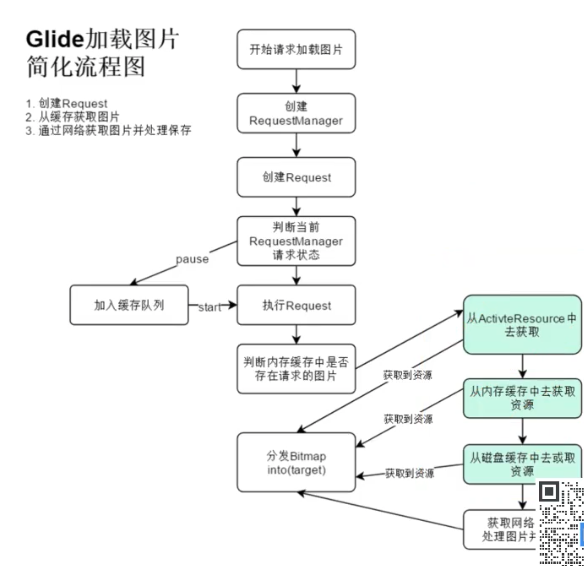
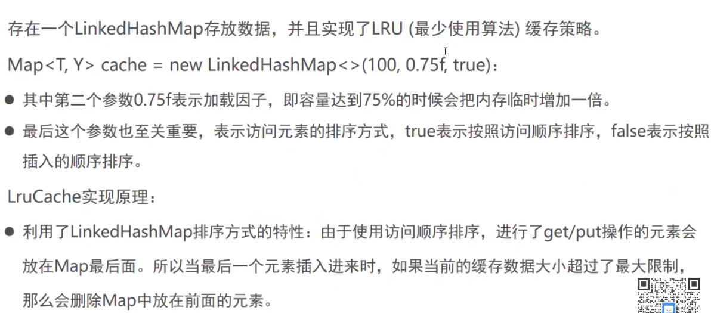

#### Glide加载流程

\


#### LruCache



##### LinkedHashMap参数含义

initialCapacity : 最大容量

loadFactor 	:	 负载因子

accessOrder	: 排序方式, true 按照访问顺序排序， false 按照插入顺序排序


##### 访问顺序排序

accessOrder : true


```java
LinkedHashMap<String, String> map = new LinkedHashMap<>(0, 0.75f, true);
map.put("a", "A");
map.put("b", "B");
map.put("c", "C");
map.put("d", "D");
map.put("e", "E");
map.put("f", "F");

map.get("a");
map.put("n","N");

for (Map.Entry<String, String> entry : map.entrySet()) {
    Log.d("LruCacheTest", "testLinkedHashMap : "+ entry.getKey()+" : " + entry.getValue());
}
```

结果

>  D LruCacheTest: testLinkedHashMap : b : B
>  D LruCacheTest: testLinkedHashMap : c : C
>  D LruCacheTest: testLinkedHashMap : d : D
>  D LruCacheTest: testLinkedHashMap : e : E
>  D LruCacheTest: testLinkedHashMap : f : F
>  D LruCacheTest: testLinkedHashMap : a : A
>  D LruCacheTest: testLinkedHashMap : n : N

可以看到 先访问a ,在插入n,把最新最近使用和访问的 A N,放到链表后面


```java
LinkedHashMap<String, String> map = new LinkedHashMap<>(100, 0.75f, true);
```


> D LruCacheTest: testLinkedHashMap : a : A
> D LruCacheTest: testLinkedHashMap : b : B
> D LruCacheTest: testLinkedHashMap : c : C
> D LruCacheTest: testLinkedHashMap : d : D
> D LruCacheTest: testLinkedHashMap : e : E
> D LruCacheTest: testLinkedHashMap : f : F
> D LruCacheTest: testLinkedHashMap : n : N


#### 感知生命周期


https://www.bilibili.com/video/BV1Qy4y1s7Gh?p=15&spm_id_from=pageDriver

https://github.com/bumptech/glide

https://muyangmin.github.io/glide-docs-cn/doc/generatedapi.html


https://juejin.im/post/6844904136266219534

https://www.jianshu.com/p/48d9e4d5d75d