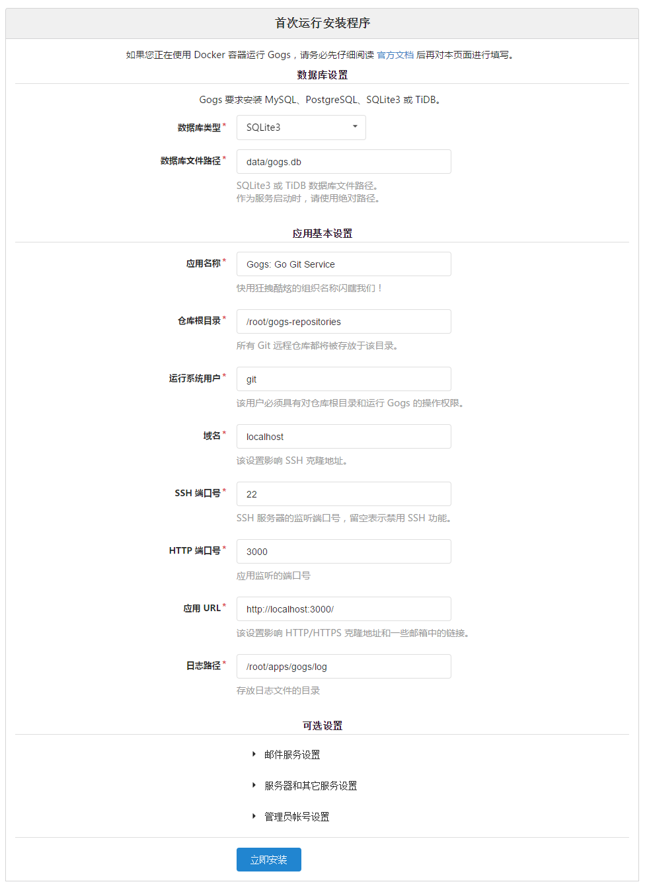

ubuntu 17.04  Gogs搭建git服务器


#####  创建git用户

```
sudo apt-get update

sudo apt-get upgrade

sudo adduser git //创建用户  密码 *******

su git//切换到git用户

cd ~  //进入用户git根目录

git --version //检查git是否安装
```
 修改git密码

　　到root下
　　passwd git
　　然后输入密码
http://wangchujiang.com/linux-command/c/passwd.html

~~#　创建数据库~~

这个可以选择默认的sqlite3救不需要安装mysql

```
mysql -u root -p
mysql> SET GLOBAL storage_engine = 'InnoDB';
mysql> CREATE DATABASE gogs CHARACTER SET utf8 COLLATE utf8_bin;
mysql> GRANT ALL PRIVILEGES ON gogs.* TO ‘root’@‘localhost’ IDENTIFIED BY ‘itadmin’;
mysql> FLUSH PRIVILEGES;
mysql> QUIT；
```

~~##  安装golang环境(可以忽略)~~

```
su git
环境变量
export GOROOT=$HOME/go        //目录下
export GOARCH=amd64   #系统位数，386表示32位系统，amd64表示64位系统。
export GOOS=linux   #系统类型
export PATH=$PATH:$GOROOT/bin

//使环境变量生效：
source ~/.bashrc

wget https://github.com/gogits/gogs/releases/download/v0.11.29/go1.9.2.linux-amd64.tar.gz
tar zxvf  go1.9.2.linux-amd64.tar.gz
mv go $GOROOT  //这一步有点问题，已存在文件
go env //测试这个一步　倒是没问题
```
##### 安装Gogs 

```
su git 
cd ~
wget https://github.com/gogits/gogs/releases/download/v0.11.29/linux_amd64.tar.gz
tar zxvf  linux_amd64.tar.gz   //解压后会右gogs文件
  cd gogs
 ./gogs web
```

##### 安装配置

浏览器输入  http://yourip:3000/install  进行配置

 如图　把localhost改成yourip


##### 后台运行　

```

su git
cd gogs 
nohup ./gogs web&
```
参考：
[雨巷前端](http://www.yuxang.com/%E4%BD%BF%E7%94%A8-gogs-%E6%90%AD%E5%BB%BA%E8%87%AA%E5%B7%B1%E7%9A%84-git-%E6%9C%8D%E5%8A%A1%E5%99%A8/) 雨巷前端

##### 重启

查找gogs目录 	`find / -name 'gogs' `

然后按照后台运行


