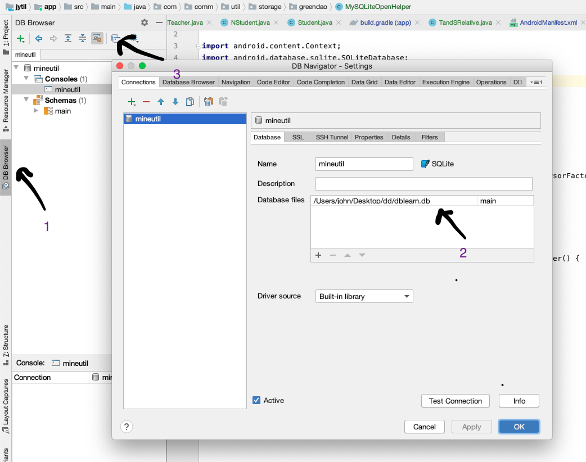

#### 基本使用

##### 数据库定义

* Bean

>  schema：告知GreenDao当前实体属于哪个schema
>  active：标记一个实体处于活跃状态，活动实体有更新、删除和刷新方法
>  nameInDb：在数据库中使用的别名，默认使用的是实体的类名
>  indexes：定义索引，可以跨越多个列
>  createInDb：标记创建数据库表

* 基础属性注解

  >@Id：主键 Long 型，可以通过@Id(autoincrement = true)设置自增长
  >@Property：设置一个非默认关系映射所对应的列名，默认是使用字段名，例如：@Property(nameInDb = "name")
  > @NotNull：设置数据库表当前列不能为空
  > @Transient：添加此标记后不会生成数据库表的列
  >
  >

* 索引注解

> @Index：使用@Index作为一个属性来创建一个索引，通过name设置索引别名，也可以通过unique给索引添加约束
> @Unique：向数据库添加了一个唯一的约束

- 关系注解

  >@ToOne：定义与另一个实体（一个实体对象）的关系
  >@ToMany：定义与多个实体对象的关系

<https://blog.csdn.net/speedystone/article/details/72769793>


##### @Convert 自定义类型

```
public @interface Convert {
    Class<? extends PropertyConverter> converter();
    Class columnType(); //可以在DB中保留的列的类。这仅限于greenDAO原生支持的所有java类。
}
@Convert(converter = NoteTypeConverter.class, columnType = String.class) //类型转换类，自定义的类型在数据库中存储的类型
private NoteType type; //在保存到数据库时会将自定义的类型 NoteType 通过 NoteTypeConverter 转换为数据库支持的 String 类型。反之亦然
```


##### Basic


```
@Entity
public class Student {

    @Id(autoincrement = true)  // id  递增
            Long id;
    @Unique
    public int studentNo;

    public int age; //年龄
    @Property(nameInDb = "usePhone") //数据库中映射的字段就是 usePhone
    public String telPhone;//手机号

    @Transient  //数据库中不会创建对应的字段
            String sex; //性别

    String name;//姓名
    String address;//家庭住址
    String schoolName;//学校名字
    String grade;//几年级

    private boolean statue;
```

###### insert

* insertData

  ```
  for (int i = 0; i < 4; i++) {
      Student student = new Student();
      student.setStudentNo(i);
      student.age = new Random().nextInt() + 10;
      student.telPhone = RandomValue.getTel();
      student.setName(RandomValue.getChineseName());
      if (i % 2 == 0) {
          student.setSex("男");
      } else {
          student.setSex("女");
      }
      if (i == 0) {
          student.setStatue(true);
      }
      student.setAddress(RandomValue.getRoad());
      student.setSchoolName(RandomValue.getSchoolName());
      long dsoi = studaoImpl.insert(student);
      Timber.i("insertData " + dsoi);
  }
  ```


* insertOrReplace

  ```
  Student student = new Student();
  student.setStudentNo(1);
  student.setName("我改名了");
  long df = studaoImpl.insertOrReplace(student);
  ```

* updateData

  ```
  Student student = new Student();
  student.setStudentNo(1);
  student.setName("我改名了");
  studaoImpl.update(student);
  ```

* delete

  ```
  Student student = new Student();
  student.setId(1l);
  studaoImpl.delete(student);
  ```

* deleteAll

​     `  studaoImpl.deleteAll();`


###### query

* QueryAll

```
List<Student> dd = studaoImpl.loadAll();
studaoImpl.loadAll().forEach(current->Timber.i(current.toString())); // print student
```

* QueryLastState

```
List<Student> sList = studaoImpl.queryBuilder().limit(1).where(StudentDao.Properties.Statue.eq(false)).list();
Timber.i(sList.toString());
Student student = sList.get(0);
student.setStatue(true);
studaoImpl.update(student);
sList = studaoImpl.queryBuilder().limit(1).where(StudentDao.Properties.Statue.eq(false)).list();
```

 

##### oneToOne

```
@Entity
public class Person {
    @Id(autoincrement = true)
    private long pid;
    private String name;
    private int age;
}
```


```
@Entity
public class CreditCard {
    @Id(autoincrement = true)
    private long cid;
    private long pid;
    //idcard和person是一对一关系，外键为personId
    @ToOne(joinProperty = "pid")
    private Person person;
 }
```

###### insert

```
Long pid = 6L;//personId

Person p = new Person(pid, "xiaoMing", 18);
mPersonDao.insert(p);
Long cid = 2L;//idcardid;
CreditCard c = new CreditCard(cid, 100); //这个写了100（无论写什么）,实际还是6,关联了personId
c.setPerson(p);
mCreditCardDao.insert(c);
```

###### query

```
List<CreditCard> list = mCreditCardDao.loadAll();
CreditCard card = list.get(0);
if (card != null) {
    Timber.i("CardInfo  cardid---------->" + card.getCid() + "  personid---------->" + card.getPid());
}
switch (position) {
    case 0:
        selectPersonInfoByCard(card);//根据idcard获取person
        break;
}

  private void selectPersonInfoByCard(CreditCard card) {
        Person person = null;
        if (card != null) {
            person = card.getPerson();
        }
        if (person != null) {
            Timber.i("PersonByCard   personId   + ----------> " + person.getPid() + "  name---------->   " + person.getName() + "    age---------->" + person.getAge());
        } else {
            Timber.i("----获取person信息失败------");
        }
    }
```


https://juejin.im/post/5a30f79c6fb9a045031014fd

https://blog.csdn.net/qq_34358104/article/details/69833909


##### OneToMany

```
@Entity
public class MStudent {
    @Id(autoincrement = true)
    private Long sid;
    private String name;
    private Long tid;
}

@Entity
public class MTecher {
    @Id(autoincrement = true)
    private Long tid;
    private String name;

    //一对多关系，tid为Student表的外键
    @ToMany(referencedJoinProperty = "tid")
    private List<MStudent> students;   
}
```


###### insert

```
 /**
     * 添加Student信息
     */
    private void insertStudent() {
        try {
            Long sid = 1L;
            for (int i = 0; i < 5; i++) {
                MStudent s = new MStudent(sid, "xiaoMing-->" + i, tid);
                mStudentDao.insert(s);
                sid++;
            }
            Log.i("tag", "学生信息添加成功");
        } catch (Exception e) {
            e.printStackTrace();
            Log.i("tag", "学生信息添加失败");
        }
    }
    
    
      /**
     * 添加Teacher信息
     */
    private void insertTeacher() {
        try {
            String name = "Miss zhang";
            MTecher mTecher = new MTecher(tid, name);
            mTecherDao.insert(mTecher);
            Log.i("tag","教师信息添加成功");
        } catch (Exception e) {
            e.printStackTrace();
            Log.i("tag","教师信息添加失败");
        }
    }
```


###### query

```
private void selectTeacher() {
    MTecher t = null;
    try {
        t = mTecherDao.loadByRowId(tid);
        if (t != null){
            Log.i("tag","查询教师信息---->成功");
            Log.i("tag","tid--->"+t.getTid());
            Log.i("tag","teacher's name----->"+t.getName());
            selectStudentByTeacher(t);
        }else{
            Log.i("tag","查询表中没有该教师信息");
        }
    } catch (Exception e) {
        e.printStackTrace();
        Log.i("tag","查询教师信息---->失败");
    }
}

  /**
     * 根据获取得到的Teacher获取其名下的学生信息
     * @param t
     */
    private void selectStudentByTeacher(MTecher t) {
        List<MStudent> list = t.getStudents();
        if (list != null && list.size() > 0){
            for (MStudent mStudent : list) {
                Log.i("tag","sid--------->  "+mStudent.getSid() +"    tid--------->"+mStudent.getTid()+"  name-------->"+mStudent.getName());
            }
        }else{
            Log.i("tag","--------获取学生信息失败--------");
        }
    }
```


##### ManyToMany


```
@Entity
public class NTeacher {

    @Id(autoincrement = true)
    private Long tid;
    private String name;
    @ToMany
    @JoinEntity(entity = TandSRelative.class, sourceProperty = "tid", targetProperty = "sid")
    private List<TandSRelative> list;
 }
```


```
@Entity
public class NStudent {

    @Id(autoincrement = true)
    private Long sid;
    private String name;

    @ToMany
    @JoinEntity(entity = TandSRelative.class,sourceProperty = "sid",targetProperty = "tid")
    List<NTeacher> teacherList;
}
```


```
@Entity
public class TandSRelative {

    @Id(autoincrement = true)
    private Long tsid;
    private Long tid;//teacher的id
    private Long sid;//student的id
}
```


###### insert

```
    //2个教师和3个学生的关系
//教师1，带学生1、2
//教师2，带学生1、3
//学生1，选修教师1和教师2的课
    private void addTeacherStu() {
        List<NTeacher> teacherList = new ArrayList<>();
        for (long i = 1; i < 3; i++) {
            NTeacher teacherBean = new NTeacher();
            teacherBean.setTid(i);
            teacherList.add(teacherBean);
        }
        daoSession.getNTeacherDao().insertInTx(teacherList);

        List<NStudent> studentList = new ArrayList<>();
        for (long j = 1; j < 4; j++) {
            NStudent studentBean = new NStudent();
            studentBean.setSid(j);
            studentList.add(studentBean);
        }

        //教师1带学生1、2
        List<TandSRelative> teacherTeachStuList = new ArrayList<>();
        TandSRelative tandSRelative1 = new TandSRelative(null, 1L, 1L);
        teacherTeachStuList.add(tandSRelative1);

        TandSRelative tandSRelative2 = new TandSRelative(null, 1L, 2L);
        teacherTeachStuList.add(tandSRelative2);

        TandSRelative tandSRelative3 = new TandSRelative(null, 2L, 1L);
        teacherTeachStuList.add(tandSRelative3);

        TandSRelative tandSRelative4 = new TandSRelative(null, 2L, 3L);
        teacherTeachStuList.add(tandSRelative4);

        daoSession.getTandSRelativeDao().insertInTx(teacherTeachStuList);

    }
```


https://www.cnblogs.com/Free-Thinker/p/10654474.html

https://juejin.im/post/5a30f79c6fb9a045031014fd

https://blog.csdn.net/RobotHost/article/details/70098744


##### migration


```
public class MySQLiteOpenHelper extends DaoMaster.OpenHelper {

    public MySQLiteOpenHelper(Context context, String name, SQLiteDatabase.CursorFactory factory) {
        super(context, name, factory);
    }

    @Override
    public void onUpgrade(Database db, int oldVersion, int newVersion) {
//        super.onUpgrade(db, oldVersion, newVersion);
        MigrationHelper.migrate(db, new MigrationHelper.ReCreateAllTableListener() {
            @Override
            public void onCreateAllTables(Database db, boolean ifNotExists) {
                DaoMaster.createAllTables(db, ifNotExists);
            }

            @Override
            public void onDropAllTables(Database db, boolean ifExists) {
                DaoMaster.dropAllTables(db, ifExists);
            }
        }, StudentDao.class); //可以添加多个
    }
}
```


```
//        DaoMaster.DevOpenHelper helper = new DaoMaster.DevOpenHelper(this, "dblearn.db");
        MigrationHelper.DEBUG = true;
        MySQLiteOpenHelper helper = new MySQLiteOpenHelper(this,"dblearn.db",null);
        SQLiteDatabase db = helper.getWritableDatabase();
        DaoMaster daoMaster = new DaoMaster(db);
        daoSession = daoMaster.newSession();
```


```
@Entity
public class Student {

    @Id(autoincrement = true)  // id  递增
            Long id;
    @Unique
    public int studentNo;

    public int age; //年龄
    @Property(nameInDb = "usePhone") //数据库中映射的字段就是 usePhone
    public String telPhone;//手机号

    @Transient  //数据库中不会创建对应的字段
            String sex; //性别

    String name;//姓名
    String address;//家庭住址
    String schoolName;//学校名字
    String grade;//几年级

    private boolean statue;


    @ToOne(joinProperty = "name")
    IdCard student;


    private String migrate; //新添加的字段 迁移
  }
```


https://github.com/yuweiguocn/GreenDaoUpgradeHelper/blob/master/README_CH.md

https://stackoverflow.com/questions/13373170/greendao-schema-update-and-data-migration/30334668#30334668


#### 查看数据库

##### database navigator





C:\Users\john\Desktop\dbsqlite

Device file explorer里面查看

data/data/{$packname}/mine

https://blog.csdn.net/yu75567218/article/details/78904909


#### 数据缓存

* RxJava实现数据网络数据缓存

  https://blog.csdn.net/qq_35064774/article/details/53449795

* 用户测量数据有网上传

  https://wenku.baidu.com/view/65f16f61998fcc22bdd10d5b.html

  https://my.oschina.net/banxi/blog/57984

  https://www.infoq.cn/article/q-EjPtHOVFaE46XKjhlf
  
  


