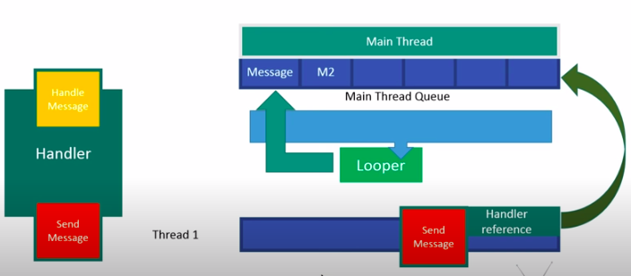

##### 原理图





 


##### 各组件作用

- Handler：事件的发送及处理者，在构造方法中可以设置其 async，默认为 false。若 async 为 true 则该 Handler 发送的 Message 均为异步消息，有同步屏障的情况下会被优先处理。
- Looper：一个用于遍历 MessageQueue 的类，每个线程有一个独有的 Looper，它会在所处的线程开启一个死循环，不断从 MessageQueue 中拿出消息，并将其发送给 target 进行处理
- MessageQueue：在主线程,用于存储 Message，内部维护了 Message 的链表，每次拿取 Message 时，若该  Message 离真正执行还需要一段时间，会通过 nativePollOnce  进入阻塞状态，避免资源的浪费。若存在消息屏障，则会忽略同步消息优先拿取异步消息，从而实现异步消息的优先消费。


##### ThreadLocal存取算法
　ThreadLocal是一个线程内部的数据存储类，它可以指定线程的存储数据，数据存储后只有在指定的线程种裁可以获取到存储的数据, 其他线程无法获取。

 验证:


      private ThreadLocal<String> mStringThreadLocal = new ThreadLocal<>();
      mStringThreadLocal.set("我是主线程");
        Log.d(TAG, "mStringThreadLocal 主线程 :　" + mStringThreadLocal.get());
        exec.submit(new Runnable() {
            @Override
            public void run() {
                mStringThreadLocal.set("我是线程１");
                Log.d(TAG, "mStringThreadLocal 线程１:　" + mStringThreadLocal.get());
            }
        });
    
        exec.submit(new Runnable() {
            @Override
            public void run() {
                Log.d(TAG, "mStringThreadLocal 线程2: " + mStringThreadLocal.get());
            }
        });

运行结果:
>    D/MainActivity: mStringThreadLocal 主线程 :　我是主线程
     D/MainActivity: mStringThreadLocal 线程１:　我是线程１
     D/MainActivity: mStringThreadLocal 线程2: null

从日志可以看到，虽然在不同线程访问的同一个ThreadLocal对象，但是他们通过ThreadLocal获取到的值确不一样
　结论：　对ThreadLocal所做的　读写操作仅限于各自线程的内部，ThreadLocal可以在多个线程互不干扰的存储和修改数据。
  !!!任务： 分析ThreadLocal存取算法

[^参考：Android开发艺术探索　p377]


#####  异步消息处理机制
 来个简单的例子  
 ```
    new Thread(new Runnable() {
            @Override
            public void run() {
              Looper.prepare();
              handler = new Handler();
              Looper.loop();
            }
        }).start();
 ```
把　Looper.prepare();注释，报错日志 : `java.lang.RuntimeException: Can't create handler inside thread that has not called Looper.prepare()`

从报错信息入手看原因，初始化Handler (API = 25)

```
 public Handler(Callback callback, boolean async) {
        if (FIND_POTENTIAL_LEAKS) {
            final Class<? extends Handler> klass = getClass();
            if ((klass.isAnonymousClass() || klass.isMemberClass() || klass.isLocalClass()) &&
                    (klass.getModifiers() & Modifier.STATIC) == 0) {
                Log.w(TAG, "The following Handler class should be static or leaks might occur: " +
                    klass.getCanonicalName());
            }
        }

        mLooper = Looper.myLooper();
        if (mLooper == null) {
            throw new RuntimeException(
                "Can't create handler inside thread that has not called Looper.prepare()");  //报错信息
        }
        mQueue = mLooper.mQueue;
        mCallback = callback;
        mAsynchronous = async;
    }
```
　mLooper为空,所以报错，看下`Looper.myLooper();`

```
 /**
     * Return the Looper object associated with the current thread.  Returns
     * null if the calling thread is not associated with a Looper.
     */
    public static @Nullable Looper myLooper() {
        return sThreadLocal.get();
    }
```
  注释可以看到，当前线程没有Looper对象, 那么Looper对象是怎么创建的呢，很显然就是上面例子里的` Looper.prepare();`

```
 /** Initialize the current thread as a looper.
      * This gives you a chance to create handlers that then reference
      * this looper, before actually starting the loop. Be sure to call
      * {@link #loop()} after calling this method, and end it by calling
      * {@link #quit()}.
      */
    public static void prepare() {
        prepare(true);
    }

    private static void prepare(boolean quitAllowed) {
        if (sThreadLocal.get() != null) {
            throw new RuntimeException("Only one Looper may be created per thread");
        }
        sThreadLocal.set(new Looper(quitAllowed));
    }
```
如果没有Looper　则new 一个，由此也看到每个线程最多一个Looper对象,接着看初始化的Looper
```
 private Looper(boolean quitAllowed) {
        mQueue = new MessageQueue(quitAllowed);
        mThread = Thread.currentThread();
    }
```
MesageQueue也是通过Looper创建的，看到private 构造方法,一个Looper管理一个　ＭesageQueue,
但是我们通常在UI线程初始化Handler不需要调用 `Looper.prepare();`,这是因为应用启动后,主线程
ActivityThread main方法为我们做了工作。

```
 public static void main(String[] args) {
        Trace.traceBegin(Trace.TRACE_TAG_ACTIVITY_MANAGER, "ActivityThreadMain");
        SamplingProfilerIntegration.start();

        // CloseGuard defaults to true and can be quite spammy.  We
        // disable it here, but selectively enable it later (via
        // StrictMode) on debug builds, but using DropBox, not logs.
        CloseGuard.setEnabled(false);

        Environment.initForCurrentUser();

        // Set the reporter for event logging in libcore
        EventLogger.setReporter(new EventLoggingReporter());

        // Make sure TrustedCertificateStore looks in the right place for CA certificates
        final File configDir = Environment.getUserConfigDirectory(UserHandle.myUserId());
        TrustedCertificateStore.setDefaultUserDirectory(configDir);

        Process.setArgV0("<pre-initialized>");

        Looper.prepareMainLooper();

        ActivityThread thread = new ActivityThread();
        thread.attach(false);

        if (sMainThreadHandler == null) {
            sMainThreadHandler = thread.getHandler();
        }

        if (false) {
            Looper.myLooper().setMessageLogging(new
                    LogPrinter(Log.DEBUG, "ActivityThread"));
        }

        // End of event ActivityThreadMain.
        Trace.traceEnd(Trace.TRACE_TAG_ACTIVITY_MANAGER);
        Looper.loop();

        throw new RuntimeException("Main thread loop unexpectedly exited");
    }
```
这样初始化Handler操作分析好了，接着就开始发消息了 `handler.sendMessage(message);`,经过层层调用来到这个方法

```
　 public boolean sendMessageAtTime(Message msg, long uptimeMillis) {
        MessageQueue queue = mQueue;
        if (queue == null) {
            RuntimeException e = new RuntimeException(
                    this + " sendMessageAtTime() called with no mQueue");
            Log.w("Looper", e.getMessage(), e);
            return false;
        }
        return enqueueMessage(queue, msg, uptimeMillis);
    }
```
第二个参数时间是可以添加延时的参数
```
 boolean enqueueMessage(Message msg, long when) {
        if (msg.target == null) {
            throw new IllegalArgumentException("Message must have a target.");
        }
        if (msg.isInUse()) {
            throw new IllegalStateException(msg + " This message is already in use.");
        }

        synchronized (this) {
            if (mQuitting) {
                IllegalStateException e = new IllegalStateException(
                        msg.target + " sending message to a Handler on a dead thread");
                Log.w(TAG, e.getMessage(), e);
                msg.recycle();
                return false;
            }

            msg.markInUse();
            msg.when = when;
            Message p = mMessages;
            boolean needWake;
            if (p == null || when == 0 || when < p.when) {
                // New head, wake up the event queue if blocked.
                msg.next = p;
                mMessages = msg;
                needWake = mBlocked;
            } else {
                // Inserted within the middle of the queue.  Usually we don't have to wake
                // up the event queue unless there is a barrier at the head of the queue
                // and the message is the earliest asynchronous message in the queue.
                needWake = mBlocked && p.target == null && msg.isAsynchronous();
                Message prev;
                for (;;) {
                    prev = p;
                    p = p.next;
                    if (p == null || when < p.when) {
                        break;
                    }
                    if (needWake && p.isAsynchronous()) {
                        needWake = false;
                    }
                }
                msg.next = p; // invariant: p == prev.next
                prev.next = msg;
            }

            // We can assume mPtr != 0 because mQuitting is false.
            if (needWake) {
                nativeWake(mPtr);
            }
        }
        return true;
    }
```
这要Mesage消息就添加到 MesageQueue中了，按事件顺序添加，然后就是取消息了，通过调用`Looper.loop();`
```
 /**
     * Run the message queue in this thread. Be sure to call
     * {@link #quit()} to end the loop.
     */
    public static void loop() {
        final Looper me = myLooper();
        if (me == null) {
            throw new RuntimeException("No Looper; Looper.prepare() wasn't called on this thread.");
        }
        final MessageQueue queue = me.mQueue;

        // Make sure the identity of this thread is that of the local process,
        // and keep track of what that identity token actually is.
        Binder.clearCallingIdentity();
        final long ident = Binder.clearCallingIdentity();

        for (;;) {
            Message msg = queue.next(); // might block
            if (msg == null) {
                // No message indicates that the message queue is quitting.
                return;
            }

            // This must be in a local variable, in case a UI event sets the logger
            final Printer logging = me.mLogging;
            if (logging != null) {
                logging.println(">>>>> Dispatching to " + msg.target + " " +
                        msg.callback + ": " + msg.what);
            }

            final long traceTag = me.mTraceTag;
            if (traceTag != 0 && Trace.isTagEnabled(traceTag)) {
                Trace.traceBegin(traceTag, msg.target.getTraceName(msg));
            }
            try {
                msg.target.dispatchMessage(msg);
            } finally {
                if (traceTag != 0) {
                    Trace.traceEnd(traceTag);
                }
            }

            if (logging != null) {
                logging.println("<<<<< Finished to " + msg.target + " " + msg.callback);
            }

            // Make sure that during the course of dispatching the
            // identity of the thread wasn't corrupted.
            final long newIdent = Binder.clearCallingIdentity();
            if (ident != newIdent) {
                Log.wtf(TAG, "Thread identity changed from 0x"
                        + Long.toHexString(ident) + " to 0x"
                        + Long.toHexString(newIdent) + " while dispatching to "
                        + msg.target.getClass().getName() + " "
                        + msg.callback + " what=" + msg.what);
            }

            msg.recycleUnchecked();
        }
    }
```
通过 Message msg = queue.next();　获取消息，然后用`  msg.target.dispatchMessage(msg);`把消息往哪发呢 ?
```
/**
     * Handle system messages here.
     */
    public void dispatchMessage(Message msg) {
        if (msg.callback != null) {
            handleCallback(msg);
        } else {
            if (mCallback != null) {
                if (mCallback.handleMessage(msg)) {
                    return;
                }
            }
            handleMessage(msg);
        }
    }
```
点开　handleMesage(msg),msg.target 就是Handler

```
 /**
     * Subclasses must implement this to receive messages.
     */
    public void handleMessage(Message msg) {
    }
```
这里就清楚了，消息就传到了　Hanlder里面handleMessage的实现方法
从上面分析handler消息传递基本了解了，借张图看下整片森林


##### 问题

* handler的是怎样实现的？

* Handler通信，Binder通信

* 简单描述下Handler,Handler是怎么切换线程的,Handler同步屏障

* handler如何实现延时发消息postdelay()

* 从源码了解handler looper ,messageQueue思路

* handler的post(Runnable)如何实现的。callback，runnable，msg的执行优先级。阻塞是怎么实现的？为什么不会阻塞主线程？

* Handler机制了解吗？一个线程有几个Looper？为什么？

* 说说你对Handler机制的了解，同步消息，异步消息等

* IdleHandler用过吗,IdleHandler应用场景？

* Handler休眠是怎样的？epoll的原理是什么？如何实现延时消息，如果移除一个延时消息会解除休眠吗？

* handler内存泄露问题

* Handler内存泄漏的GCRoot是什么？

* 主线程死循环不会卡死吗

* epoll的时候算是卡顿吗

* 怎么样算是卡顿了

* 怎么利用消息机制检测卡顿

* 除了这种方式还有别的监测卡顿的方式吗

* 从源码了解handler looper ,messageQueue思路

* handler如何实现延时发消息postdelay()

* Android中为什么主线程不会因为Looper.loop()里的死循环卡死？

* 1、Handler问题三连：是什么？有什么用？为什么要用，不用行不行？

  2、Android UI更新机制(GUI) 为何设计成了单线程的？

  3、真的只能在主(UI)线程中更新UI吗？

  4、真的不能在主(UI)线程中执行网络操作吗？

  5、Handler怎么用？

  6、为什么建议使用Message.obtain()来创建Message实例？

  7、为什么子线程中不可以直接new Handler()而主线程中可以？

  8、主线程给子线程的Handler发送消息怎么写？

  9、HandlerThread实现的核心原理？

  10、当你用Handler发送一个Message，发生了什么？

  11、Looper是怎么拣队列里的消息的？

  12、分发给Handler的消息是怎么处理的？

  13、IdleHandler是什么？

  14、Looper在主线程中死循环，为啥不会ANR？

  15、Handler泄露的原因及正确写法

  16、Handler中的同步屏障机制

  17、Android 11 Handler相关变更

  https://juejin.cn/post/6844904150140977165

* handler post和handleMesage区别

    https://segmentfault.com/a/1190000006700118  写的不错

​	

---


https://www.bilibili.com/video/BV1A7411M7zQ?from=search&seid=14693797999095810218

https://juejin.im/post/6844904150140977165


http://blog.csdn.net/ljd2038/article/details/50889754
http://blog.csdn.net/guolin_blog/article/details/9991569

https://xiaozhuanlan.com/topic/0843791256