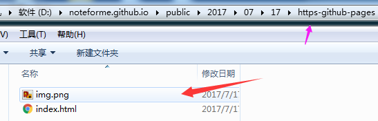

##  基本配置

​    官方文档:https://hexo.io/zh-cn/docs/index.html

下载

1. 下载 [Node.js ](https://nodejs.org/en/))

2. Git

     下载的是 node-v6.11.3-x64.msi ，一路安装下去自动配置好了环境变量
      输入 `node -v` 测试

3. npm  

      `npm install -g hexo-cli  `

     注意： 安装Node.js最佳方式使用nvm，使用master分支不起作用,需要github推荐的分支

    接着安装node.js

    搭建好hexo后，由于他是本地生成的，那么就要考虑同步的问题了，目前解决在github建一个分支 hexo，然后把本地资源用git分支管理

4. 安装 npm install

   

##  上传文件到分支

        // git初始化
         git init
        // 添加仓库地址
        git remote add origin https://github.com/用户名/仓库名.git
        // 新建分支并切换到新建的分支
        git checkout -b 分支名
        // 添加所有本地文件到git
        git add .
        // git提交
        git commit -m ""
        // 文件推送到hexo分支
        git push origin hexo

## #  

   其他设备安装好环境(支持跨平台)，先clone　hexo分支到本地

    git clone -b hexo git@github.com:noteforme/noteforme.github.io.git
    // 安装hexo , 下不下来就用privoxy
    npm install hexo
    // 注意这里不需要hexo初始化：hexo init；否则之前的hexo配置参数会重置
    // 安装依赖库
    npm install
    // 安装部署相关配置
    npm install hexo-deployer-git
    
    //如果出错执行下面的
    npm install -g hexo-cli

这要就完成同步了(上面的流程还不是很规范，不过执行上面几个命令基本都能解决)

如果有这些不用管了 
>npm WARN optional SKIPPING OPTIONAL DEPENDENCY: fsevents@^1.0.0 (node_modules\chokidar\node_modules\fsevents):
>npm WARN notsup SKIPPING OPTIONAL DEPENDENCY: Unsupported platform for fsevents@1.1.2: wanted {"os":"darwin","arch":"any"} (current: {"os":"win32","arch":"x64"

问题:在ubuntu上，执行hexo d部署后每次都要输入github用户名和密码，在这里也找到了答案，就是根目录下的 _config.yml文件没有配置成ssh,之前是这样的     repository:https://github.com/noteforme/noteforme.github.io.git
    # Deployment
    ## Docs: https://hexo.io/docs/deployment.html
    deploy:
      type: git 
      repository: git@github.com:noteforme/noteforme.github.io.git
      branch: master

参考：http://www.jianshu.com/p/6fb0b287f950

## 博客嵌入图片

-  我们生成的路径是以public目录的路径为相对路径，所以要看public下面有没有生成图片
   

     所以我的写法是
     “    ”
     别忘了2017前面的 “/”，否则文章页面不显示图片

  参考： http://www.jianshu.com/p/950f8f13a36c

- 之前用上面的方式比较麻烦，有时候还有问题
>      

 竟然也是可以的，可以看下效果

 

奇怪了　这里又不显示了,明明　AndroidStudioTool这篇博客可以显示的,看来还得摸索

## https认证:Cloudflare免费的ssl

* 创建账户
     注册　　https://www.cloudflare.com/a/sign-up

* 登录后输入域名,点击扫描
    　　　　如图
                   

*  一直continue，到了Selet a Cloudflare Plan 选择Free Website
*  解析域名的地方，修改域名服务器,我这里是在godaddy修改，然后continue
* 点击Preview on your site instantly－> 点击Overview(显示Ａctive即可)－>点击Crypto(选择Ｆlexible)

   参考：http://www.jianshu.com/p/92b6d4a6ecd5

