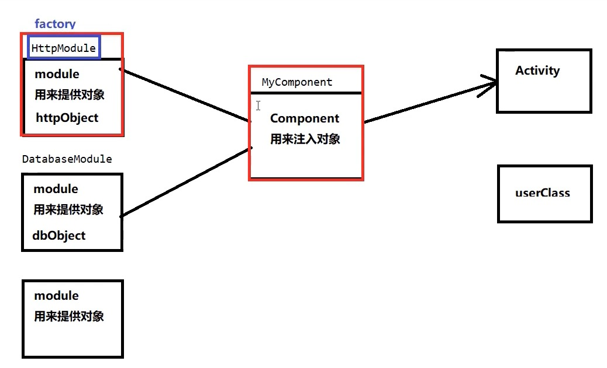
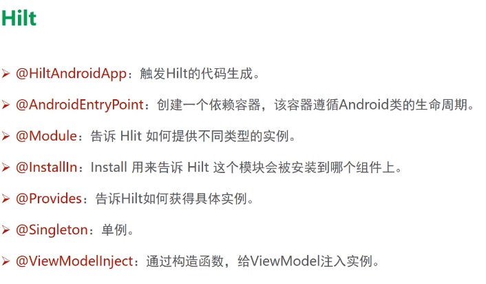

https://developer.android.google.cn/training/dependency-injection


### Hilt作用


https://www.bilibili.com/video/BV18o4y1S7KH 「社区说」《Hilt-把握住Android依赖项注入的“利器”》

https://www.bilibili.com/video/BV1eM4y1G7aR  码牛

https://www.bilibili.com/video/BV1Ki4y1A7hA 动脑学院

https://services.google.cn/fh/files/misc/hilt-annotations-2.3.3_zh-cn.pdf

https://mp.weixin.qq.com/s/OEX1d2cU1zGG5BBM-nANBg

https://developer.android.google.cn/training/dependency-injection/hilt-android?hl=zh-cn




Component种注入了Activity对象 ，Factory提供的Module对象和Activity关联起来.

依赖注入有什么用

* 自动加载
* 自动加载的关键 : 数据共享




https://www.bilibili.com/video/BV1e54y1S72A/


由于会和Dagger冲突，所以写在JYKot里


##### 用法

使用Hilt 注入


配置HiltAndroidApp注解

```java
@HiltAndroidApp // 1.  HiltAndroidApp注解,生成相应的组件
class MyApp : Application() {}
```

##### 构造方法注入


```kotlin
// 构造方法绑定
class User @Inject() constructor()
```

```kotlin
@AndroidEntryPoint
class HiltMainActivity : AppCompatActivity() {
    private val TAG = javaClass.simpleName

    @Inject
    lateinit var user: User

    override fun onCreate(savedInstanceState: Bundle?) {
        super.onCreate(savedInstanceState)
        val biding = ActivityHiltMainBinding.inflate(layoutInflater)
        setContentView(biding.root)
        Log.i(TAG, "user: $user")
    }
}
```


##### Module对象注入

建立绑定,就是说User对象实例由谁提供

可以通AppModule提供

```kotlin
class User1
```

```java
//Module装载到ApplicationComponent中,Module作用域就被限定起来了
@InstallIn(ApplicationComponent.class) //通过这种方式和组件关联
@Module
public class AppModule {

    @Provides
    User1 provideUser() {
        return new User1();
    }
}
```

往Activity注入实例

主要是@AndroidEntryPoint  @Inject

```java
@AndroidEntryPoint
public class HiltActivity extends AppCompatActivity {
    String TAG ="HiltActivity";
    @Inject
    User user; //inject注解作用在User变量上,注入对象实例

    @Inject
    User1 user1; // 方式2

    @Override
    protected void onCreate(Bundle savedInstanceState) {
        super.onCreate(savedInstanceState);
        setContentView(R.layout.activity_hilt);
        Log.i(TAG, "user: " + user);
        Log.i(TAG, "user1: " + user1);
    }
}
```

运行结果

> 28743-28743/com.john.kot I/HiltActivity: user: com.john.kot.hilt.User@d33a8d5
> 28743-28743/com.john.kot I/HiltActivity: user1: com.john.kot.hilt.User1@62df8ea


### 默认标准组件


Component lifetimes

Hilt 也允许将绑定的作用域限定为特定组件。Hilt 只为绑定作用域限定到的组件的每个实例创建一次限定作用域的绑定，对该绑定的所有请求共享同一实例。


组件实例由关联的Android类来创建的

```java
//Module装载到ActivityComponent中
@InstallIn(ActivityComponent.class) //通过这种方式和组件关联
@Module
public class AppModule1 {

    @ActivityScoped //ActivityComponent只能设置ActivityScoped作用域
    @Provides
    User1 provideUser() {
        return new User1();
    }
}
```


```java
@AndroidEntryPoint
public class HiltActivity extends AppCompatActivity {

    String TAG ="HiltActivity";
 		//inject注解作用在User变量上,注入对象实例

    @Inject
    User1 user1; // 方式2

    @Inject
    User1 user2;

    @Override
    protected void onCreate(Bundle savedInstanceState) {
        super.onCreate(savedInstanceState);
        setContentView(R.layout.activity_hilt);

        //测试  ActivityComponent
        Log.i(TAG, "user1: " + user1);
        Log.i(TAG, "user2: " + user2);

        startActivity(new Intent(this,SecondActivity.class));
    }
}
```


```java
@AndroidEntryPoint
public class SecondActivity extends AppCompatActivity {
    String TAG = "SecondActivity";
    @Inject
    User1 user3;
    @Override
    protected void onCreate(Bundle savedInstanceState) {
        super.onCreate(savedInstanceState);
        setContentView(R.layout.activity_second);
        Log.i(TAG, "user3: " + user3);
    }
}
```


运行结果

> 2021-09-25 23:02:57.595 29397-29397/com.john.kot I/HiltActivity: user1: com.john.kot.hilt.User1@62df8ea
> 2021-09-25 23:02:57.595 29397-29397/com.john.kot I/HiltActivity: user2: com.john.kot.hilt.User1@62df8ea
> 2021-09-25 23:02:57.883 29397-29397/com.john.kot I/SecondActivity: user3: com.john.kot.hilt.User1@1aa35b5

可以看到作用域在Activity中


##### 单例对象的注入


##### 构造方法单例

```kotlin
@Singleton
class User6 @Inject constructor()
```


```
@Inject
lateinit var user6: User6 // 方式2
```

在Activity这样注入后，User6的对象就是单例的了。


###### AppModule1

修改成 ApplicationComponent 和Singleton

```java
//Module装载到ApplicationComponent中
@InstallIn(ApplicationComponent.class) //通过这种方式和组件关联
@Module
public class AppModule1 {

    @Singleton //ActivityComponent只能设置ActivityScoped作用域
    @Provides
    User1 provideUser() {
        return new User1();
    }
}
```

运行结果

> 2021-09-25 23:09:24.752 29553-29553/com.john.kot I/HiltActivity: user1: com.john.kot.hilt.User1@62df8ea
> 2021-09-25 23:09:24.752 29553-29553/com.john.kot I/HiltActivity: user2: com.john.kot.hilt.User1@62df8ea
> 2021-09-25 23:09:25.106 29553-29553/com.john.kot I/SecondActivity: user3: com.john.kot.hilt.User1@62df8ea

明显一样的实例了


###### 方式一

```kotlin
@InstallIn(SingletonComponent::class) //通过这种方式和组件关联
@Module
class AppModule5 {

    @Singleton
    @Provides
    fun provideUser(): UserHilt5 {
        return UserHilt5()
    }

    @Singleton
    @Provides
    fun provideUserParam5(user: UserHilt5): UserParam5 {
        return UserParam5(user)
    }
}
```


```kotlin
Log.i(TAG, "userParam: ${userParam.user1}")
Log.i(TAG, "userParam5: ${userParam5.user5}")
Log.i(TAG, "userParam: ${userParam.user1}")
Log.i(TAG, "userParam5: ${userParam5.user5}")
```

从下面结果可以看到userParam5是相同的对象

```
com.john.kot I/HiltActivity: userParam: com.john.kot.hilt.model.User1@7459850
com.john.kot I/HiltActivity: userParam5: com.john.kot.hilt.model.UserHilt5@aea6a49
com.john.kot I/HiltSecondActivity: userParam: com.john.kot.hilt.model.User1@bf41510
com.john.kot I/HiltSecondActivity: userParam5: com.john.kot.hilt.model.UserHilt5@aea6a49
```


###### 方式2


但是在Dagger里，组建注入不同的Activity对象后，对象也是不相同的,只有在相同Activity才是单例的。 必须用Application组建，才能实现全局APP的单例

```kotlin
@InstallIn(SingletonComponent::class) //通过这种方式和组件关联
@Module
class AppModule5 {

    @Singleton
    @Provides
    fun provideUser(): User5 {
        return User5()
    }
}

class UserParam5 @Inject constructor(var user5: User5)
```


###### 方式3

```kotlin
@Singleton
class User5 @Inject constructor()

class UserParam5 @Inject constructor(var user5: User5)
```


### 组件作用域

组件和组件作用域一一对应.

| Android class                                 | Generated component         | Scope                     |
| :-------------------------------------------- | :-------------------------- | :------------------------ |
| `Application`                                 | `SingletonComponent`        | `@Singleton`              |
| `Activity`(应该是view model)                  | `ActivityRetainedComponent` | `@ActivityRetainedScoped` |
| `ViewModel`                                   | `ViewModelComponent`        | `@ViewModelScoped`        |
| `Activity`                                    | `ActivityComponent`         | `@ActivityScoped`         |
| `Fragment`                                    | `FragmentComponent`         | `@FragmentScoped`         |
| `View`                                        | `ViewComponent`             | `@ViewScoped`             |
| `View` annotated with `@WithFragmentBindings` | `ViewWithFragmentComponent` | `@ViewScoped`             |
| `Service`                                     | `ServiceComponent`          | `@ServiceScoped`          |


##### @ActivityScoped


```kotlin
@AndroidEntryPoint
class HiltMainActivity : AppCompatActivity() {
    private val TAG = javaClass.simpleName

    @Inject
    lateinit var user3: User2
    @Inject
    lateinit var user4: User2


    override fun onCreate(savedInstanceState: Bundle?) {
        super.onCreate(savedInstanceState)
        val biding = ActivityHiltMainBinding.inflate(layoutInflater)
        setContentView(biding.root)

        Log.i(TAG, "user3: $user3")
        Log.i(TAG, "user4: $user4")
        startActivity(Intent(this,HiltSecondActivity::class.java))
    }
}
```


```kotlin
//Module装载到ActivityComponent中
@InstallIn(ActivityComponent::class) //通过这种方式和组件关联
@Module
class AppModule2 {
    // ApplicationComponent对应的作用域 @Singleton
    @ActivityScoped
    @Provides
    fun provideUser(): User2 {
        return User2()
    }
}
```


@ActivityScoped必须用ActivityComponent, 可以看到在Activity生命周期内对象相同

```
469 5433-5433/com.john.kot I/HiltMainActivity: user3: com.john.kot.hilt.dn.di.User2@1ca33ad
469 5433-5433/com.john.kot I/HiltMainActivity: user4: com.john.kot.hilt.dn.di.User2@1ca33ad
521 5433-5433/com.john.kot I/HiltSecondActivity: user5: com.john.kot.hilt.dn.di.User2@8d0e984
```


##### @Singleton


```kotlin
//Module装载到ActivityComponent中
@InstallIn(SingletonComponent::class) //通过这种方式和组件关联
@Module
class AppModule2 {
    // ApplicationComponent对应的作用域 @Singleton
    @Singleton
    @Provides
    fun provideUser(): User2 {
        return User2()
    }
}
```


可以看到，这种情况应用内单例

```
773 5726-5726/com.john.kot I/HiltMainActivity: user3: com.john.kot.hilt.dn.di.User2@aa56b56
773 5726-5726/com.john.kot I/HiltMainActivity: user4: com.john.kot.hilt.dn.di.User2@aa56b56
816 5726-5726/com.john.kot I/HiltSecondActivity: user5: com.john.kot.hilt.dn.di.User2@aa56b56
```


### 组件层次结构


ApplicationComponent 顶级父组件 ,下一层ActivityRetanedComponent是的子组件，往下是子子组件。

那么ActivityRetanedComponent可以获取到ApplicationComponent提供的对象的实例.


```kotlin
//Module装载到ActivityComponent中
@InstallIn(SingletonComponent::class) //通过这种方式和组件关联
@Module
class AppModule2 {
    // ApplicationComponent对应的作用域 @Singleton
    @Singleton
    @Provides
    fun provideUser(): User2 {
        return User2()
    }
}
```

例如就像上面一样， Activity中可以访问SingletonComponent组件的实例。


### 组件默认绑定

| Android component           | Default bindings                              |
| :-------------------------- | :-------------------------------------------- |
| `SingletonComponent`        | `Application`                                 |
| `ActivityRetainedComponent` | `Application`                                 |
| `ViewModelComponent`        | `SavedStateHandle`                            |
| `ActivityComponent`         | `Application`, `Activity`                     |
| `FragmentComponent`         | `Application`, `Activity`, `Fragment`         |
| `ViewComponent`             | `Application`, `Activity`, `View`             |
| `ViewWithFragmentComponent` | `Application`, `Activity`, `Fragment`, `View` |
| `ServiceComponent`          | `Application`, `Service`                      |


##### ApplicationComponent

这里ViewModel和jetpack viewmodel还没有关联 。

老师说HiltViewModel3 默认装载到了ApplicationComponent中,我觉得不是，应该是装载到ActivityComponent，如果SingletonComponent是获取不到Activity的。

```java
// HiltViewModel3 默认装载到了ApplicationComponent中
class HiltViewModel3 @Inject constructor(
    var user: User3,
    var application: Application,
    var activity: Activity
) {
    var TAG = javaClass.simpleName
    fun test() {
        Log.i(TAG, "test:user $user")
        Log.i(TAG, "test: application $application")
        Log.i(TAG, "test: activity$activity")
    }
}
```


```kotlin
@AndroidEntryPoint
class HiltMainActivity : AppCompatActivity() {
    private val TAG = javaClass.simpleName
    @Inject
    lateinit var viewModel: HiltViewModel3
    override fun onCreate(savedInstanceState: Bundle?) {
        super.onCreate(savedInstanceState)
        val biding = ActivityHiltMainBinding.inflate(layoutInflater)
        setContentView(biding.root)
        viewModel.test()
    }
}
```

```
6613/com.john.kot I/ViewModel: test:user com.john.kot.hilt.dn.di.User3@1ca33ad
6613/com.john.kot I/ViewModel: test: application com.john.kot.MyApp@3a4e6e2
6613/com.john.kot I/ViewModel: test: activitycom.john.kot.hilt.dn.HiltMainActivity@211813d
```

可以看到都有 Application, Activity实例对象,这就是默认绑定


##### Activity默认绑定


下面的没有 @Inject

```kotlin
class HiltViewModel4(var user: User3, var application: Application, var activity: Activity) {
    var TAG = javaClass.simpleName
    fun test() {
        Log.i(TAG, "test:user $user")
        Log.i(TAG, "test: application $application")
        Log.i(TAG, "test: activity$activity")
    }
}
```


```kotlin
//Module装载到ActivityComponent中
@InstallIn(ActivityComponent::class) //这里用SingletonComponent会报错,因为Application不能提供activity实例
@Module
class AppModule4 {

    @Singleton //Singleton,因为Application不能提供activity实例
    @Provides
    fun provideViewModel(
        user: User3,
        application: Application,
        activity: Activity
    ): HiltViewModel4 {
        return HiltViewModel4(user, application, activity)
    }
}
```


```kotlin
viewModel1.test();
```


```
com.john.kot I/HiltViewModel4: test:user com.john.kot.hilt.dn.di.User3@5b5a73
com.john.kot I/HiltViewModel4: test: application com.john.kot.MyApp@3a4e6e2
com.john.kot I/HiltViewModel4: test: activitycom.john.kot.hilt.dn.HiltMainActivity@211813d
```

可以看到也能提供Appilicaton和activity默认绑定的实例


### 预定义限定符

提供了几种预定义限定符(Qualifier) : @ApplicationContext 和 @ActivityContext


##### ApplicationContext VS ActivityContext ?


### Hilt支持Jetpack组件


##### ViewModel

* User由我们自己提供

* Application application, Activity activity由 Dagger提供
* Context预定义的限定符.

```java
public class MainViewModel extends ViewModel {
    String TAG = "MainViewModel";

    User3 user;
    Application application;
    Activity activity;

    Context context;

    @ViewModelInject
    public MainViewModel(User3 user, Application application, Activity activity,@ApplicationContext  Context context) {
        this.user = user;
        this.application = application;
        this.activity = activity;
        this.context =context;
    }

    public void  test(){
        Log.i(TAG, "test:user="+user);
        Log.i(TAG, "test: application="+application);
        Log.i(TAG, "test: activity="+activity);
        Log.i(TAG, "test: context="+context);
    }
}
```


https://www.bilibili.com/video/BV1Ki4y1A7hA?spm_id_from=333.999.0.0

https://www.bilibili.com/video/BV1BK4y1V7no?p=4&spm_id_from=pageDriver

https://developer.android.com/codelabs/android-hilt?hl=zh-cn#7


### Interface inject 接口注入

https://juejin.cn/post/6967148539277213733

```kotlin
@InstallIn(ActivityComponent::class)
@Module
abstract class BannerRepoModule {
  //BannerRepository实例自动new出来交给对应的接口
    @Binds
    abstract fun bannerRepo(repoImpl: BannerRepository): IBannerApi 
}
```


#### viewModel

在ViewModel上添加`@HiltViewModel`，必须有带参的构造函数，用`Inject`注入

##### 1.  viewModel

在ViewModel上添加`@HiltViewModel`，必须有带参的构造函数，用`Inject`注入

```
@HiltViewModel
class DataViewModel @Inject constructor(
        private val dataRepo: DataRepository
) : ViewModel()
```

##### 2. fragment和activity

在fragment和activity上添加`@AndroidEntryPoint`注解

然后可以使用by viewModels()直接获取viewmodel

```
@AndroidEntryPoint
class DataFragment : Fragment() {
   private val dataViewModel: DataViewModel by viewModels()
}
```

##### 3. 遇到的坑

通过ViewPager创建的Fragment无法使用`@HiltViewModel`，只能通过普通的方式注入，弄了很久都没有找到解决方案。配合[navigation](https://developer.android.com/jetpack/androidx/releases/navigation)使用的话没有问题


#### 字节码技术

Javassit 动态修改字节码


#### Hilt UnitTest

https://mahendranv.github.io/posts/hilt-instrument/


