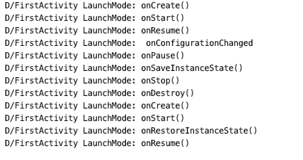

##### 一）Android基础知识点

#### 四大组件是什么

Activity ,Service ,BroadCastReceiver,ContentProvider

#### Activity各种情况下的生命周期

* 先启动A 再跳转B

  A_onCreate()-> A_onStart()->A_onResume-> A_onPause()-> B_onCreate() -> B_onStart() -> B_resume -> A_onSaveInstanceState()->A_onStop()
  
* 弹出Dialog

  不调用任何生命周期,所以Activity上有Dialog的时候按Home键时的生命周期,有没有Dialog都一样的。

* 横竖屏切换的时候，Activity 各种情况下的生命周期

  

  1. Activity状态保存于恢复 (什么都不设置)

     

  2. 设置`android:screenOrientation="portrait"` 不会旋转

  3. Android 8.0 设置`android:configChanges="orientation|keyboardHidden|screenSize"` 

     会发生旋转，生命周期不发生变化，只是会调用 `onConfigurationChanged()` 

     https://blog.csdn.net/qq_36713816/article/details/80538467

     

* 前台切换到后台，然后再回到前台，Activity生命周期回调方法。

  前台切换到后台: A_onCreate()-> A_onStart()->A_onResume-> A_onPause()->A_onSaveInstanceState()-> A_onStop()

  再回到前台: A_onRestart() ->A_onStart()-> A_onResume()

  

#### Activity之间的通信方式

* Intent

  startActivity()或startActivityForResult(),通过Intent传递信息,需要注意，Intent对携带信息大小有限制。

- BroadcastReceiver

- 数据存取传递，sharePreference/sql/File

- Application 静态变量

  

#### Activity的四种启动模式对比

* Standard 

  默认启动模式，每次都重新创建一个新的Activity 。

* SingleStop

  当前Activity如果再栈顶，那么就不会创建新的Activity，会原先调用Activity的onNewIntent()
  
* SingleTask

  当前任务栈已经有Activity实例，就不会再创建了，会调用 onNewIntent().

* SingleInstance

  单一实例模式，整个手机操作系统里面只有一个实例存在。不同的应用去打开这个activity  共享公用的同一个activity。他会运行在自己单独，独立的任务栈里面，并且任务栈里面只有他一个实例存在。应用场景：呼叫来电界面。这种模式的使用情况比较罕见，在Launcher中可能使用。或者你确定你需要使Activity只有一个实例。 
   可以得出以下结论： 
   \1. 以singleInstance模式启动的Activity具有全局唯一性，即整个系统中只会存在一个这样的实例。 
   \2. 以singleInstance模式启动的Activity在整个系统中是单例的，如果在启动这样的Activiyt时，已经存在了一个实例，那么会把它所在的任务调度到前台，重用这个实例。 
   \3. 以singleInstance模式启动的Activity具有独占性，即它会独自占用一个任务，被他开启的任何activity都会运行在其他任务中。 
   \4. 被singleInstance模式的Activity开启的其他activity，能够在新的任务中启动，但不一定开启新的任务，也可能在已有的一个任务中开启。
  
  https://blog.csdn.net/zivensonice/article/details/51569502
  
  
  
  https://ayusch.com/android-launch-modes-explained/
  
  https://noteforme.github.io/2021/01/16/Activity/

任务栈的底层原理

#### fragment各种情况下的生命周期 Activity与Fragment之间生命周期比较

1.<u>onAttach() -> onCreate() -</u>> onCreateView() -> onActivityCreate() -> onStart() ->  onResume() -> onPause() -> onStop() -> 	 

​	onDestroyView() -> onDestroy() -> onDetach() 

Fragment状态保存startActivityForResult是哪个类的方法，在什么情况下使用？

如何实现Fragment的滑动？

fragment之间传递数据的方式？

Activity 怎么和Service 绑定？

怎么在Activity 中启动自己对应的Service？

service和activity怎么进行数据交互？

Service的开启方式

请描述一下Service 的生命周期

谈谈你对ContentProvider的理解

- 说说ContentProvider、ContentResolver、ContentObserver 之间的关系
- 请描述一下广播BroadcastReceiver的理解
- 广播的分类
- 广播使用的方式和场景
- 在manifest 和代码中如何注册和使用BroadcastReceiver?
- 本地广播和全局广播有什么差别？
- BroadcastReceiver，LocalBroadcastReceiver 区别
- AlertDialog,popupWindow,Activity区别
- Application 和 Activity 的 Context 对象的区别
- Android属性动画特性
- 如何导入外部数据库?
- LinearLayout、RelativeLayout、FrameLayout的特性及对比，并介绍使用场景。
- 谈谈对接口与回调的理解
- 回调的原理
- 写一个回调demo
- 介绍下SurfView
- RecycleView的使用
- 序列化的作用，以及Android两种序列化的区别
- 差值器
- 估值器
- Android中数据存储方式

##### （二）Android源码相关分析

- Android动画框架实现原理
- Android各个版本API的区别
- Requestlayout，onlayout，onDraw，DrawChild区别与联系
- invalidate和postInvalidate的区别及使用
- Activity-Window-View三者的差别
- 谈谈对Volley的理解
- 如何优化自定义View
- 低版本SDK如何实现高版本api？
- 描述一次网络请求的流程
- HttpUrlConnection 和 okhttp关系
- Bitmap对象的理解
- looper架构
- ActivityThread，AMS，WMS的工作原理
- 自定义View如何考虑机型适配
- 自定义View的事件
- AstncTask+HttpClient 与 AsyncHttpClient有什么区别？
- LaunchMode应用场景
- AsyncTask 如何使用?
- SpareArray原理
- 请介绍下ContentProvider 是如何实现数据共享的？
- AndroidService与Activity之间通信的几种方式
- IntentService原理及作用是什么？
- 说说Activity、Intent、Service 是什么关系
- ApplicationContext和ActivityContext的区别
- SP是进程同步的吗?有什么方法做到同步？
- 谈谈多线程在Android中的使用
- 进程和 Application 的生命周期
- 封装View的时候怎么知道view的大小
- RecycleView原理
- AndroidManifest的作用与理解

##### （三）常见的一些原理性问题

- Handler机制和底层实现
- Handler、Thread和HandlerThread的差别
- handler发消息给子线程，looper怎么启动？
- 关于Handler，在任何地方new Handler 都是什么线程下?
- ThreadLocal原理，实现及如何保证Local属性？
- 请解释下在单线程模型中Message、Handler、Message Queue、Looper之间的关系
- 请描述一下View事件传递分发机制
- Touch事件传递流程
- 事件分发中的onTouch 和onTouchEvent 有什么区别，又该如何使用？
- View和ViewGroup分别有哪些事件分发相关的回调方法
- View刷新机制
- View绘制流程
- 自定义控件原理
- 自定义View如何提供获取View属性的接口？
- Android代码中实现WAP方式联网
- AsyncTask机制
- AsyncTask原理及不足
- 如何取消AsyncTask？
- 为什么不能在子线程更新UI？
- ANR产生的原因是什么？
- ANR定位和修正
- oom是什么？
- 什么情况导致oom？
- 有什么解决方法可以避免OOM？
- Oom 是否可以try catch？为什么？
- 内存泄漏是什么？
- 什么情况导致内存泄漏？
- 如何防止线程的内存泄漏？
- 内存泄露场的解决方法
- 内存泄漏和内存溢出区别？
- LruCache默认缓存大小
- ContentProvider的权限管理(解答：读写分离，权限控制-精确到表级，URL控制)
- 如何通过广播拦截和abort一条短信？
- 广播是否可以请求网络？
- 广播引起anr的时间限制是多少？
- 计算一个view的嵌套层级
- Activity栈
- Android线程有没有上限？
- 线程池有没有上限？
- ListView重用的是什么？
- Android为什么引入Parcelable？
- 有没有尝试简化Parcelable的使用？

##### （四）开发中常见的一些问题

- ListView 中图片错位的问题是如何产生的?
- 混合开发有了解吗？
- 知道哪些混合开发的方式？说出它们的优缺点和各自使用场景？（解答：比如:RN，weex，H5，小程序，WPA等。做Android的了解一些前端js等还是很有好处的)；
- 屏幕适配的处理技巧都有哪些?
- 服务器只提供数据接收接口，在多线程或多进程条件下，如何保证数据的有序到达？
- 动态布局的理解
- 怎么去除重复代码？
- 画出 Android 的大体架构图
- Recycleview和ListView的区别
- ListView图片加载错乱的原理和解决方案
- 动态权限适配方案，权限组的概念
- Android系统为什么会设计ContentProvider？
- 下拉状态栏是不是影响activity的生命周期
- 如果在onStop的时候做了网络请求，onResume的时候怎么恢复？
- Bitmap 使用时候注意什么？
- Bitmap的recycler()
- Android中开启摄像头的主要步骤
- ViewPager使用细节，如何设置成每次只初始化当前的Fragment，其他的不初始化？
- 点击事件被拦截，但是想传到下面的View，如何操作？
- 微信主页面的实现方式
- 微信上消息小红点的原理
- CAS介绍（这是阿里巴巴的面试题，我不是很了解，可以参考博客: [CAS简介](http://blog.csdn.net/jly4758/article/details/46673835)）