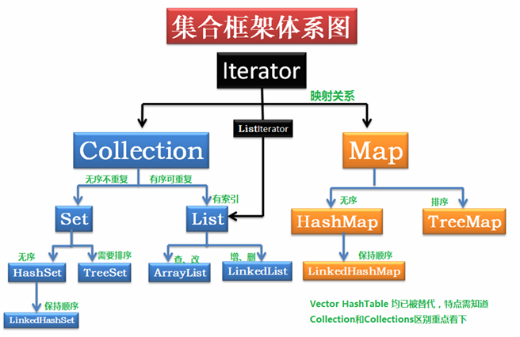

https://interview-q-a-1gdnkgkla15afdbe-1258598664.tcloudbaseapp.com/Java/HashMap%E5%8E%9F%E7%90%86-%E7%BE%8E%E5%9B%A2.html


[面试题含答案](https://www.cnblogs.com/huangjialin/p/12411842.html)

###   java基础面试知识点

##### java中==和equals和hashCode的区别

类型

- 基本类型：比较的是值是否相同；
- 引用类型：如果是 类、接口、数组的话,当他们用双等号（==）进行比较的时候，比较的是他们的引用，如果要比较堆中对象是否相同，那么就要重写equals方法了；
- 默认情况下（没有覆写equals方法）的equals方法都是调用Object类的equals方法，而Object的equals方法主要是用于判断**对象的内存地址引用是不是同一个地址**（是不是同一个对象）。

##### int、char、long各占多少字节数

   byte   1字节       short   2字节         int    4字节           long   8字节          

   char   2字节       float   4字节         double  8字节      boolean  false/true(理论上占用1bit,1/8字节，实际处理按1byte处理) 

##### int与integer的区别

​	Integer 是int的包装类；int是基本数据类型;

​	Integer实际是对象的引用，int是直接存储数据值

##### 谈谈对java多态(polymorphism)的理解,Java中实现多态的机制是什么

 实现的机制是，父类或者接口定义的引用变量指向子类或者子类的实现， 执行期间判断所引用对象的实际类型，根据其实际的类型调用相应的方法。

1. 编译时多态(静态多态)==重载

2. 运行时多态（动态多态）

   

   无论哪种方法，核心之处在对父类方法的改写或对接口方法的实现，以取得运行时不同的执行效果.

https://docs.oracle.com/javase/tutorial/java/IandI/polymorphism.html

https://cloud.tencent.com/developer/article/1447574


##### String、StringBuffer、StringBuilder区别

 * 都是fianl类，不能被继承,底层都是 char[] value实现
 * String类长度是不可变的，substring()、  concat(),最终实现都是通过  new String(buf, true)实现的,StringBuffer,StringBuilder是通过操作本类的value实现的
 * StringBuffer类是线程安全的，StringBuilder不是线程安全的
 * String：字符串常量。

​	

##### 什么是内部类？内部类的作用

​	内部类:	一个类定义在另一个类的内部，就叫内部类

​	作用: 

 * 内部类  拥有外部类的所有访问权限，包括被private修饰的私有数据

 * 内部类可以很好的隐藏实现

 * 内部类可以实现多重继承

    ```java
    //类一
    public class ClassA {
       public String name(){
           return "liutao";
       }
       public String doSomeThing(){
        // doSomeThing
       }
    }
    //类二
    public class ClassB {
        public int age(){
            return 25;
        }
    }
    
    //类三
    public class MainExample{
       private class Test1 extends ClassA{
            public String name(){
              return super.name();
            }
        }
        private class Test2 extends ClassB{
           public int age(){
             return super.age();
           }
        }
       public String name(){
        return new Test1().name();
       }
       public int age(){
           return new Test2().age();
       }
       public static void main(String args[]){
           MainExample mi=new MainExample();
           System.out.println("姓名:"+mi.name());
           System.out.println("年龄:"+mi.age());
       }
    }
    
    ```

    MainExample 类通过内部类拥有了 ClassA 和 ClassB 的两个类的继承关系。 而无需关注 ClassA 中的 doSomeThing 方法的实现。这就是比接口实现更有戏的地方

    https://juejin.cn/post/6844903566293860366

#####  抽象类和接口区别

| Abstract class                                               | Interface                                                    |
| ------------------------------------------------------------ | ------------------------------------------------------------ |
| 1) Abstract class can **have abstract and non-abstract** methods. | Interface can have **only abstract** methods. Since Java 8, it can have **default and static methods** also. |
| 2) Abstract class **doesn't support multiple inheritance**.  | Interface **supports multiple inheritance**.                 |
| 3) Abstract class **can have final, non-final, static and non-static variables**. | Interface has **only static and final variables**.           |
| 4) Abstract class **can provide the implementation of interface**. | Interface **can't provide the implementation of abstract class**. |
| 5) The **abstract keyword** is used to declare abstract class. | The **interface keyword** is used to declare interface.      |
| 6) An **abstract class** can extend another Java class and implement multiple Java interfaces. | An **interface** can extend another Java interface only.     |
| 7) An **abstract class** can be extended using keyword "extends". | An **interface** can be implemented using keyword "implements". |
| 8) A Java **abstract class** can have class members like private, protected, etc. | Members of a Java interface are public by default.           |
| 9)**Example:**  public abstract class Shape{ public abstract void draw(); } | **Example:**  public interface Drawable{ void draw(); }      |

https://www.javatpoint.com/difference-between-abstract-class-and-interface

 

##### ? 泛型中extends和super的区别

- 上界<? extends T>不能往里存，只能往外取，适合频繁往外面读取内容的场景。

- 下界<? super T>不影响往里存，但往外取只能放在Object对象里，适合经常往里面插入数据的场景

  https://noteforme.github.io/2018/04/16/Generics/

##### string 转换成 integer的方式及原理

  1. 判断是否null或""
  2. 判断第一位正负数，逐位获取值 ?

  https://blog.csdn.net/nobody_1/article/details/91488686

#####   静态内部类的设计意图

​	非静态内部类编译后会隐含的保存着一个引用，改引用指向创建它的外围类，静态内部类没有，

​	它不能使用任何外围类的非static成员变量和方法.

##### final，finally，finalize的区别

  Final : 用于申明属性，方法，类，表示属性不可变，方法不可以覆盖，类不能继承

1. final数组

   **Java 中数组也是对象**

   ```java
     final int arr[] = {1, 2, 3, 4, 5};  //  注意，数组 arr 是 final 的
          for (int i = 0; i < arr.length; i++) {
              arr[i] = arr[i]*10;
              System.out.println(arr[i]);
          }
   ```

   数组是对象的一种，现在数组是被 final 修饰的，所以它的意思是一旦被赋值之后，变量的引用不能修改。但是我们现在想证明的是，数组对象里面的内容可以修改

2. 非数组对象

   ```java
   class Test { 
       int p = 20; 
       public static void main(String args[]){ 
          final Test t = new Test();
          t.p = 30; 
          System.out.println(t.p);
       }
   }
   ```

   把它用 final 修饰，然后去尝试改它里面成员变量 p 的值，并打印出结果，程序会打印出“30”。一开始 p 的值是 20，但是最后修改完毕变成了 30，说明这次修改是成功的。

   以上我们就得出了一个结论，**final 修饰一个指向对象的变量的时候，对象本身的内容依然是可以变化的**。

   https://kaiwu.lagou.com/course/courseInfo.htm?courseId=16#/detail/pc?id=311


* Finally: 异常语句处理机构中，与try{}进行配合使用，不论try中的代码是否执行完，表示总是执行的部分

* Finalize: Object类的一个方法，用于对象"消失"时，由JVM进行调用用于对对象进行垃圾回收，释放对象占用的资源.


##### Serializable 和Parcelable 的区别，如何将一个Java对象序列化到文件里？

1. 两者最大的区别在于 **存储媒介的不同**，`Serializable` 使用 **I/O 读写存储在硬盘上**，而 `Parcelable` 是直接 **在内存中读写**。很明显，内存的读写速度通常大于 IO 读写，所以在 Android 中传递数据优先选择 `Parcelable`。

2. `Serializable` 会使用反射，序列化和反序列化过程需要大量 I/O 操作，也会创建很多临时对象， `Parcelable` 自已实现封送和解封（marshalled &unmarshalled）操作不需要用反射，数据也存放在 Native 内存中，效率要快很多。

    https://juejin.cn/post/6844903518826921991

   

父类的静态方法能否被子类重写

 不能，静态方法只和类有关,JVM加载后先初始化static相关属性方法,重写依赖于类的实例.

   


##### 成员内部类、局部内部类以及项目中的应用

成员内部类 : 普通的内部类，不存在任何static的变量和方法；

局部内部类： 嵌套于方法和作用域内

```java
public class Parcel5 {
    public Destionation destionation(String str){
        class PDestionation implements Destionation{
            private String label;
            private PDestionation(String whereTo){
                label = whereTo;
            }
            public String readLabel(){
                return label;
            }
        }
        return new PDestionation(str);
    }
    
  public static void main(String[] args) {
      Parcel5 parcel5 = new Parcel5();
      Destionation d = parcel5.destionation("chenssy");
    }
}
```


闭包和局部内部类的区别


##### Java中对象的生命周期

​	**1、创建阶段(Created)**
  `检测类是否被加载没有加载的先加载`→`为新生对象分配内存`→`将分配到的内存空间都初始化为零值`→`对对象进行必要的设置`→`执行<init>方法把对象进行初始化`
 对象的加载大小是类加载中就已经确定好了的，类加载过程就相当复杂了，如下图：


类加载过程.png


**2、应用阶段(In Use)**
  至少有一个强引用使用着

**3、不可见阶段(Invisible)**
  程序的执行已经超出了该对象的作用域了

**4、不可达阶段(Unreachable)**
  程序不再持有该对象的任何强引用，这种情况下，该对象仍可能被JVM等系统下的某些已装载的静态变量或线程或JNI等强引用持有着，这些特殊的强引用被称为”GC root”

**5、收集阶段(Collected)**
  垃圾回收器发现该对象已经处于“不可达阶段”并且垃圾回收器已经对该对象的内存空间重新分配做好准备时，则对象进入了“收集阶段”。如果该对象已经重写了finalize()方法，则会去执行该方法的终端操作。

**6、终结阶段(Finalized)**
  当对象执行完finalize()方法后仍然处于不可达状态时，则该对象进入终结阶段。在该阶段是等待垃圾回收器对该对象空间进行回收。

**7、对象空间重分配阶段(De-allocated)**
  垃圾回收器对该对象的所占用的内存空间进行回收或者再分配了，则该对象彻底消失了，称之为“对象空间重新分配阶段”。


链接：https://www.jianshu.com/p/72f5017c6649


###  JVM 

##### String特性 

Java虚拟机在内存中开辟出一块单独的区域

https://zhuanlan.zhihu.com/p/60643031

https://www.bilibili.com/video/BV1PJ411n7xZ?p=118   几个视频讲到用法，最好能用图画出来

https://www.iteye.com/blog/rednaxelafx-774673


##### 哪些情况下的对象会被垃圾回收机制处理掉？

1. 可达性分析,GC Root向下搜索，产生一个reference chain 。当一个对象不能和任何GC Root产生关系时就被回收.
2. * 强引用 ：那**垃圾回收器**绝不会回收
   * 软引用: 内存溢出时候对象回收
   * 弱引用:下一次GC时候对象回收
   * 虚引用：随时可能被回收
3. 当前商业虚拟机的垃圾回收都采用分代收集算法，这种算法并没有什么新的思想，只是根据对象的存活周期将内存划分为几块。一般是把Java堆分为新生代和老年代，这样就可以根据各个年代的特点采用最适当的收集算法。在新生代中，每次垃圾回收都有大批对象死去，只有少量存活，那就选用复制算法，只要付出少量存活对象的复制成本就可以完成收集。而老年代中因为对象存活率高，没有额外的空间对它进行分配担保，那就使用标记清理或者标记整理算法来进行回收。

https://noteforme.github.io/2021/01/05/JVM-GC/

https://noteforme.github.io/2020/04/18/JVM/


##### String为什么要设计成不可变的？

1. 便于实现字符串池

   由于会大量的使用String常量，如果每一次声明一个String都创建一个String对象，那将会造成极大的空间资源的浪费。Java提出了String pool的概念，在堆中开辟一块存储空间String  pool，当初始化一个String变量时，如果该字符串已经存在了，就不会去创建一个新的字符串变量，而是会返回已经存在了的字符串的引用。

   如果字符串是可变的，某一个字符串变量改变了其值，那么其指向的变量的值也会改变，String pool将不能够实现！

   https://www.cnblogs.com/wkfvawl/p/11693260.html


###  java深入源码级的面试题


##### 讲一下常见编码方式？

1. ASCII码:  用一个字节的低7位表示，总共128个,0~31 是控制字符如换行回车删除等；32~126 是打印字符，可以通过键盘输入并且能够显示出来

2. UTF-16:  固定两个字节表示一个字符：说到 UTF 必须要提到 Unicode（Universal Code 统一码），ISO  试图想创建一个全新的超语言字典，世界上所有的语言都可以通过这本字典来相互翻译。可想而知这个字典是多么的复杂，关于 Unicode  的详细规范可以参考相应文档。Unicode 是 Java 和 XML 的基础，下面详细介绍 Unicode 在计算机中的存储形式。 
   UTF-16 具体定义了 Unicode 字符在计算机中存取方法。UTF-16 用两个字节来表示 Unicode  转化格式，这个是定长的表示方法，不论什么字符都可以用两个字节表示，两个字节是 16 个 bit，所以叫 UTF-16。UTF-16  表示字符非常方便，每两个字节表示一个字符，这个在字符串操作时就大大简化了操作，这也是 Java 以 UTF-16  作为内存的字符存储格式的一个很重要的原因。

3. UTF-8:  优化UTF-16,UTF-16  统一采用两个字节表示一个字符，虽然在表示上非常简单方便，但是也有其缺点，有很大一部分字符用一个字节就可以表示的现在要两个字节表示，存储空间放大了一倍，在现在的网络带宽还非常有限的今天，这样会增大网络传输的流量，而且也没必要。而 UTF-8 采用了一种变长技术，每个编码区域有不同的字码长度。不同类型的字符可以是由 1~6 个字节组成。 
   UTF-8 有以下编码规则： 
   如果一个字节，最高位（第 8 位）为 0，表示这是一个 ASCII 字符（00 - 7F）。可见，所有 ASCII 编码已经是 UTF-8 了。 
   如果一个字节，以 11 开头，连续的 1 的个数暗示这个字符的字节数，例如：110xxxxx 代表它是双字节 UTF-8 字符的首字节。 
   如果一个字节，以 10 开始，表示它不是首字节，需要向前查找才能得到当前字符的首字节 

4. GBK 、ISO-8859-1、GB2312

   https://www.cnblogs.com/mlan/p/7823375.html

5. https://www.cnblogs.com/mlan/p/7823375.html

##### utf-8编码中的中文占几个字节；int型几个字节？

​	少数是汉字每个占用3个字节，多数占用4个字节。

​	https://blog.csdn.net/hellokatewj/article/details/24325653

​	int类型 4个字节


##### 静态代理和动态代理的区别，什么场景使用？

​	静态代理 :  编译的时候就已经存在，

​	动态代理 ： 通过反射机制生成的代理对象

​	https://noteforme.github.io/2021/01/14/DesignPattern-Proxy/

​	https://www.jianshu.com/p/2f518a4a4c2b

##### Java的异常体系

非运行时异常 :编译期间可以检查到的异常, 像IoException,DataFormatException,CertificateException

运行时异常 : NullPointerException, ClassCastException,IndexOutOfBoundsException

##### ? 谈谈你对解析与分派的认识。

##### 说说你对Java反射的理解

​	对于任何一个类都可以通过反射知道的它的属性和方法。

##### 说说你对Java注解的理解

​	注解，对代码进行注明。使得程序在编译或者运行时，读取到注解并加以处理，以间接的改变程序的运行。

##### 为什么Java里的匿名内部类只能访问final修饰的外部变量？

​	因为匿名内部类最终会被编译成一个单独的类，而被该类使用的变量会以构造函数参数的形式传递给该类。如果变量不定义为final的，参数在匿名内部类中可以被修改，进而造成和外部的变量不一致的问题，为了避免这种不一致的情况，规定匿名内部类只能访问final修饰的外部变量。

##### 说说你对依赖注入的理解?

​	给予调用方它所需要的对象


#### 泛型

##### 说一下泛型原理，并举例说明

​	泛型实现了参数化类型的概念，使代码可以应用于多种类型。

​	在泛型代码内部，无法获得任何有关泛型参数类型的信息。	


###  容器

##### 常用数据结构简介

数组 栈 队列  链表 图 树 哈希表

##### 并发集合了解哪些？

ConcurrentHashMap  CopyOnWriteArrayList  CopyOnWriteArraySet  ArrayBlockingQueue  LinkedBlockingQueue

https://blog.csdn.net/u010942020/article/details/73610121

##### 列举java的集合以及集合之间的继承关系




##### List,Set,Map的区别

容器类介绍以及之间的区别（容器类估计很多人没听这个词，Java容器主要可以划分为4个部分：List列表、Set集合、Map映射、工具类（Iterator迭代器、Enumeration枚举类、Arrays和Collections），具体的可以看看这篇博文 [Java容器类](http://alexyyek.github.io/2015/04/06/Collection/)）

1. List是一个有序的队列，每一个元素都有它的索引。Set是一个不允许有重复元素的集合。
2. Map是一个映射接口，即key-value键值对。

##### List和Map的实现方式以及存储方式

1. list

   ArrayList    查询快 .  LinkedList  插入删除快

   

修改对象A的equals方法的签名，那么使用HashMap存放这个对象实例的时候，会调用哪个equals方法？


##### 集合Set实现Hash怎么防止碰撞

1，如果hash码值不相同，说明是一个新元素，存储；

如果没有元素和传入对象（也就是add的元素）的hash值相等，那么就认为这个元素在table中不存在，将其添加进table；

2.1，如果hash码值相同，且equles判断相等，说明元素已经存在，不存；

2.2，如果hash码值相同，且equles判断不相等，说明元素不存在，存；

原文链接：https://blog.csdn.net/github_37130188/article/details/96508272

​					https://noteforme.github.io/2018/05/31/HashMap/


##### HashMap

1. 对key的Dashcode()做hash运算，计算index.
2. 如果没碰撞直接放到bucket⾥
3. 如果碰撞了，以链表的形式存在buckets后
4. 如果节点已经存在就替换old value(保证key的唯⼀性)
5. 如果bucket满了(超过load factor*current capacity)，就要resize

get数据

1. 对key的hashCode()做hash运算，计算index;

2. 如果在bucket⾥的第⼀个节点⾥直接命中，则直接返回；

3. 如果有冲突，则通过key.equals(k)去查找对应的Entry;分为下面两种方式.

4. 若为树，则在树中通过key.equals(k)查找，O(logn)；

5. 若为链表，则在链表中通过key.equals(k)查找，O(n)。

   

##### ArrayMap

ArrayMap相比传统的HashMap速度更慢，因为其查找方法是二分法，并且当删除或添加数据时，会对空间重新调整，可以说ArrayMap是牺牲了时间来换空间，ArrayMap与HashMap的区别主要在：

存储方式不同：HashMap内部有一个HashMapEntry<K,V>[ ]对象，而ArrayMap是一个<key,value>映射的数据结构，内部使用两个数组进行数据存储，一个数组记录key的hash值，另一个数组记录value值。

添加数据时扩容的处理不一样：HashMap进行了new操作，重新创建对象，开销很大，而ArrayMap用的是copy数据，效率相对高很多。

ArrayMap提供了数组收缩的功能，在clear或remove之后，会重新收缩数组，释放空间。

ArrayMap采用的是二分法查找。


##### hashmap hashtable区别


堆的结构

​	堆分为两种：*最大堆*和*最小堆*，两者的差别在于节点的排序方式。

在最大堆中，父节点的值比每一个子节点的值都要大。在最小堆中，父节点的值比每一个子节点的值都要小。这就是所谓的“堆属性”，并且这个属性对堆中的每一个节点都成立。
https://www.jianshu.com/p/6b526aa481b1

##### 堆和树的区别

​	左子节点必须比父节点小，右子节点必须必比父节点大。但是在堆中并非如此。在最大堆中两个子节点都必须比父节点小，而在最小堆中，它们都必须比父节点大。


堆和栈在内存中的区别是什么(解答提示：可以从数据结构方面以及实际实现方面两个方面去回答)？

##### 什么是深拷贝和浅拷贝

* 浅拷贝

  是一个传址,也就是把a的值赋给b的时候同时也把a的地址赋给了b，当b（a）的值改变的时候，a（b）的值同时也会改变

* 深拷贝

  ​	深拷贝是指，拷贝对象的具体内容，二内存地址是自主分配的，拷贝结束之后俩个对象虽然存的值是一样的，但是内存地址不一样，俩个对象页互相不影响，互不干涉


手写链表逆序代码

讲一下对树，B+树的理解

讲一下对图的理解

判断单链表成环与否？

链表翻转（即：翻转一个单项链表）

合并多个单有序链表（假设都是递增的）


