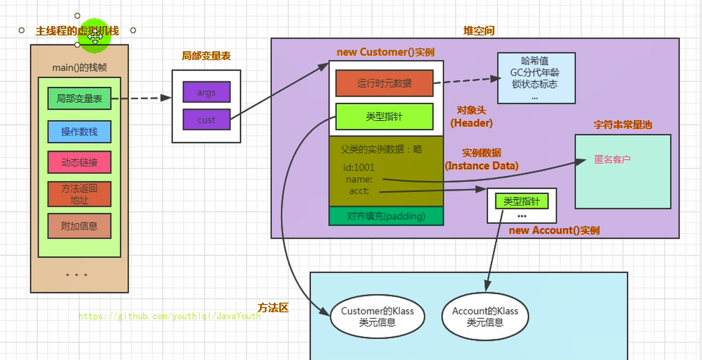

**内存布局总结**

```java
public class Customer{
    int id = 1001;
    String name;
    Account acct;

    {
        name = "匿名客户";
    }
    public Customer(){
        acct = new Account();
    }
    public static void main(String[] args) {
        Customer cust = new Customer();
    }
}
class Account{

}
```

图解内存布局




原子性、可见性与有序性

* 原子性(Atomicity)

  由 J a v a 内 存 模 型 来 直 接 保 证 的 原 子 性 变 量 操 作 包 括 r e a d 、 l o a d 、 a s s i gn 、 u s e 、 s t o r e 和 w r i t e 这 六 个 ， 我们大致可以认为，基本数据类型的访问、读写都是具备原子性的(例外就是long和double的非原子性 协定，读者只要知道这件事情就可以了，无须太过在意这些几乎不会发生的例外情况)。

  如果应用场景需要一个更大范围的原子性保证(经常会遇到)，Java内存模型还提供了lock和 unlock操作来满足这种需求，尽管虚拟机未把lock和unlock操作直接开放给用户使用，但是却提供了更 高 层 次 的 字 节 码 指 令 m o n i t o r e n t e r 和 m o n i t o r e xi t 来 隐 式 地 使 用 这 两 个 操 作 。 这 两 个 字 节 码 指 令 反 映 到 J a v a 代码中就是同步块——synchronized关键字，因此在synchronized块之间的操作也具备原子性。

* 可 见 性 ( Vi s i b i l i t y )

  可见性就是指当一个线程修改了共享变量的值时，其他线程能够立即得知这个修改。上文在讲解 volat ile变量的时候我们已详细讨论过这一点。Java内存模型是通过在变量修改后将新值同步回主内 存，在变量读取前从主内存刷新变量值这种依赖主内存作为传递媒介的方式来实现可见性的，无论是 普通变量还是volat ile变量都是如此。普通变量与volat ile变量的区别是，volat ile的特殊规则保证了<u>新值 能立即同步到主内存</u>，以及每次使用前立即从主内存刷新。因此我们可以说volat ile保证了多线程操作 时变量的可见性，而普通变量则不能保证这一点。

  能立即同步到主内存 ？？ 感觉也有问题