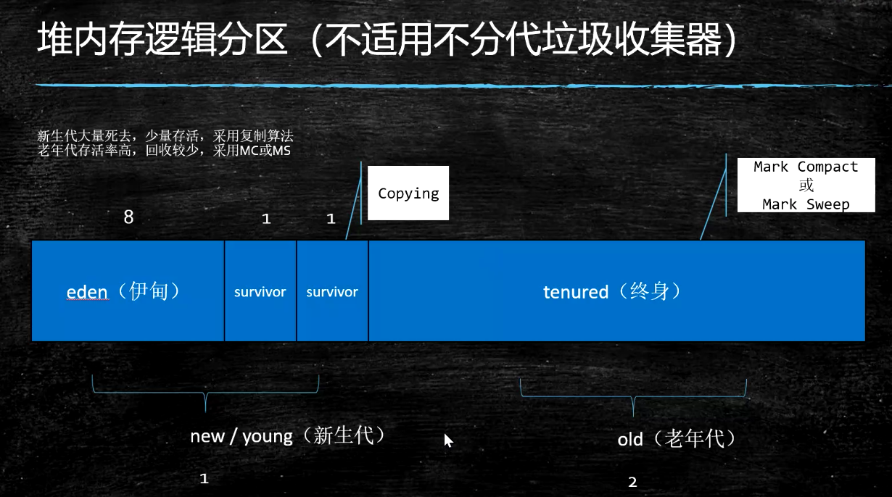

[JVM方法区-第六章](https://noteforme.github.io/2020/01/04/JVM-METHOD/)





https://www.iteye.com/blog/rednaxelafx-656951

https://www.bilibili.com/video/av75247289?p=2


这种情况全局变量 b: B是否会造成内存泄漏

```kotlin
class A {
    val b = B.getInstance()
}

class B {
    companion object {
        val b = B()
        fun getInstance(): B {
            return b
        }
    }
}
```

我觉得不会,B 并不指向A


https://www.bilibili.com/video/BV1GA4y197VR?spm_id_from=333.337.search-card.all.click&vd_source=d4c5260002405798a57476b318eccac9


mOpenEnv  加