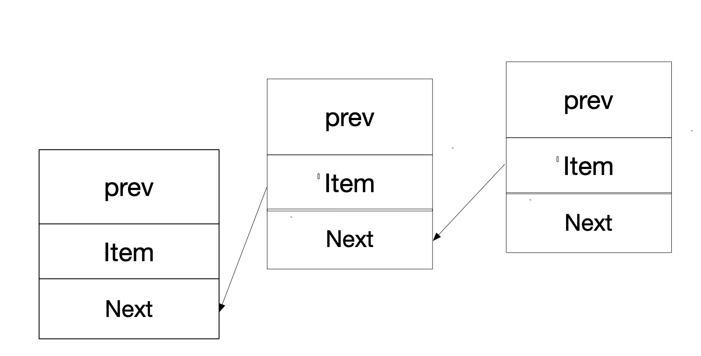

---

title: Java_List
comments: true
date: 2020-01-05 21:50:30
tags:
categories: JAVA
---

Java List source analysis

List  <-- ArrayList  LinkedList


##### ArrayList


1. ```
   ArrayList<Integer>  arrayList = new ArrayList<>();
   ```

    得到一个object数组 `private static final Object[] DEFAULTCAPACITY_EMPTY_ELEMENTDATA = {};`

   source

   ```
   public ArrayList() {
       this.elementData = DEFAULTCAPACITY_EMPTY_ELEMENTDATA;
   }
   ```

2. ```
   arrayList.add(1);
   arrayList.add(2);
   ```

    source 

   ```
   public boolean add(E e) {
       ensureCapacityInternal(size + 1);  // Increments modCount!!
       elementData[size++] = e;
       return true;
   }
   
    
    private void ensureCapacityInternal(int minCapacity) {
        ensureExplicitCapacity(calculateCapacity(elementData, minCapacity));
    }
    
   ```

   * 先看看calculateCapacity

     ```
     private static final Object[] DEFAULTCAPACITY_EMPTY_ELEMENTDATA = {};
     private static final int DEFAULT_CAPACITY = 10;
     
     private static int calculateCapacity(Object[] elementData, int minCapacity) {
         if (elementData == DEFAULTCAPACITY_EMPTY_ELEMENTDATA) {
             return Math.max(DEFAULT_CAPACITY, minCapacity);
         }
         return minCapacity;
     }
     ```

      `if (elementData == DEFAULTCAPACITY_EMPTY_ELEMENTDATA)` minCapacity==10

   * ensureExplicitCapacity()

     ```
     private void ensureExplicitCapacity(int minCapacity) {
         modCount++;
     
         // overflow-conscious code
         if (minCapacity - elementData.length > 0)
             grow(minCapacity);
     }
     
      private void grow(int minCapacity) {
             // overflow-conscious code
             int oldCapacity = elementData.length;
             int newCapacity = oldCapacity + (oldCapacity >> 1);
             if (newCapacity - minCapacity < 0)
                 newCapacity = minCapacity;
             if (newCapacity - MAX_ARRAY_SIZE > 0)
                 newCapacity = hugeCapacity(minCapacity);
             // minCapacity is usually close to size, so this is a win:
             elementData = Arrays.copyOf(elementData, newCapacity);
     }
     
     ```

     添加`arrayList.add(1);`时，size 为10的数组， elementData[size++] = e; 注意size初始化值==0，程序先 执行elementData[0]=1,然后是size++;

     当添加的数是11时，`        int newCapacity = oldCapacity + (oldCapacity >> 1);`开始执行 10 + 1010>>1 = 10+5,申请了5个空间

     然后get()可以获取element

   * 源码简写

     ```
     int size =0;
     Object[] elementData= {};
     Object[] elementArr = Arrays.copyOf(elementData, 10);
     elementArr[size++] = 5;
     elementArr[size++] = 7;
     for ( Object el :elementArr){
         System.out.print(el+"  ");
     }
     System.out.println(elementArr[0]);
     ```

##### LinkedList

 源码功能如图所示

```
void linkLast(E e) {
    final Node<E> l = last;
    final Node<E> newNode = new Node<>(l, e, null);
    last = newNode;
    if (l == null)
        first = newNode;
    else
        l.next = newNode;
    size++;
    modCount++;
}

private static class Node<E> {
        E item;
        Node<E> next;
        Node<E> prev;

        Node(Node<E> prev, E element, Node<E> next) {
            this.item = element;
            this.next = next;
            this.prev = prev;
        }
    }
```

