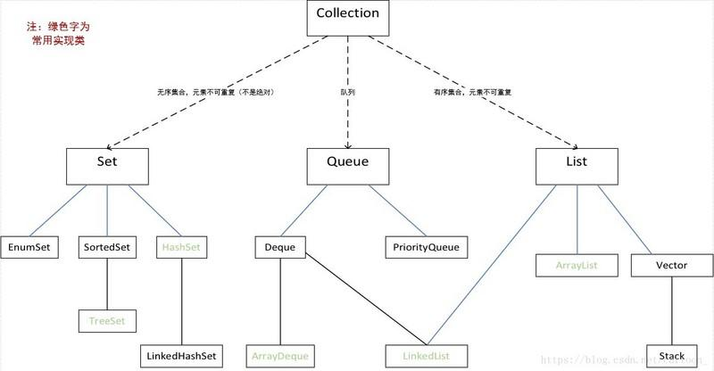

https://blog.csdn.net/bn493235694/article/details/79600634

*队列是一个先进先出的的数据结构*

##### Deque

**I need to have a thread-safe LIFO structure**

Use LinkedBlockingDeque if at a time you want only single thread can operate your data.

Use ConcurrentLinkedDeque if you want that each thread can access the shared data

https://docs.oracle.com/javase/7/docs/api/java/util/concurrent/ConcurrentLinkedDeque.html

* ConcurrentLinkedDeque

  https://blog.csdn.net/hello_worldee/article/details/77880532

Deque : https://docs.oracle.com/javase/7/docs/api/java/util/Deque.html

https://www.liaoxuefeng.com/wiki/1252599548343744/1265122668445536

https://www.geeksforgeeks.org/deque-interface-java-example/

* LinkedList 线程安全处理

https://blog.csdn.net/d380025303/article/details/81010980

