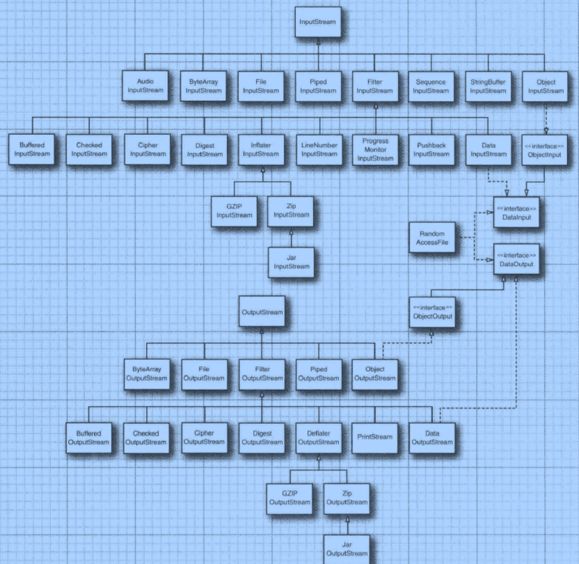

Byte Stream : 对于二进制文件或处理 数字字母之类的数据

  

https://www.javazhiyin.com/17362.html

#### FileInputStream


单个字节读

```
FileInputStream fis = null;
try {
    fis = new FileInputStream("/Users/john/Documents/jywork/THINKJAVA/src/main/resource/a.txt");
    int data;
    while ((data = fis.read()) != -1) {
        System.out.print((char) data+"  ");
    }
} catch (FileNotFoundException e) {
    e.printStackTrace();
} catch (IOException e) {
    e.printStackTrace();
}
```


读到bytes数组里面

```
FileInputStream fis = null;
try {
    byte[] bytes = new byte[14];
    fis = new FileInputStream("/Users/john/Documents/jywork/THINKJAVA/src/main/resource/a.txt");
    int read = fis.read(bytes);
    String s  = new String(bytes);
    System.out.println(s);
    System.out.println(read);
} catch (FileNotFoundException e) {
    e.printStackTrace();
} catch (IOException e) {
    e.printStackTrace();
}
```


读到bytes里面 ,限定读的字节个数

```
FileInputStream fis = null;
try {
    byte[] bytes = new byte[14];
    fis = new FileInputStream("/Users/john/Documents/jywork/THINKJAVA/src/main/resource/a.txt");
    int read = fis.read(bytes,0,4);
    String s  = new String(bytes);
    System.out.println(s);
    System.out.println(read);
} catch (FileNotFoundException e) {
    e.printStackTrace();
} catch (IOException e) {
    e.printStackTrace();
}
```

对于为什么必须继承装饰器父类 FilterInputStream的思考

> 实际上，如果去查看 JDK 的源码，你会发现，BufferedInputStream、DataInputStream 并非继承自 InputStream，而是另外一个叫 FilterInputStream 的类。那这又是出于什么样的设计意图，才引入这样一个类呢？我们再重新来看一下 BufferedInputStream 类的代码。InputStream 是一个抽象类而非接口，而且它的大部分函数（比如 read()、available()）都有默认实现，按理来说，我们只需要在 BufferedInputStream 类中重新实现那些需要增加缓存功能的函数就可以了，其他函数继承 InputStream 的默认实现。但实际上，这样做是行不通的。对于即便是不需要增加缓存功能的函数来说，BufferedInputStream 还是必须把它重新实现一遍，简单包裹对 InputStream 对象的函数调用。具体的代码示例如下所示。如果不重新实现，那 BufferedInputStream 类就无法将最终读取数据的任务，委托给传递进来的 InputStream 对象来完成。这一部分稍微有点不好理解，你自己多思考一下。