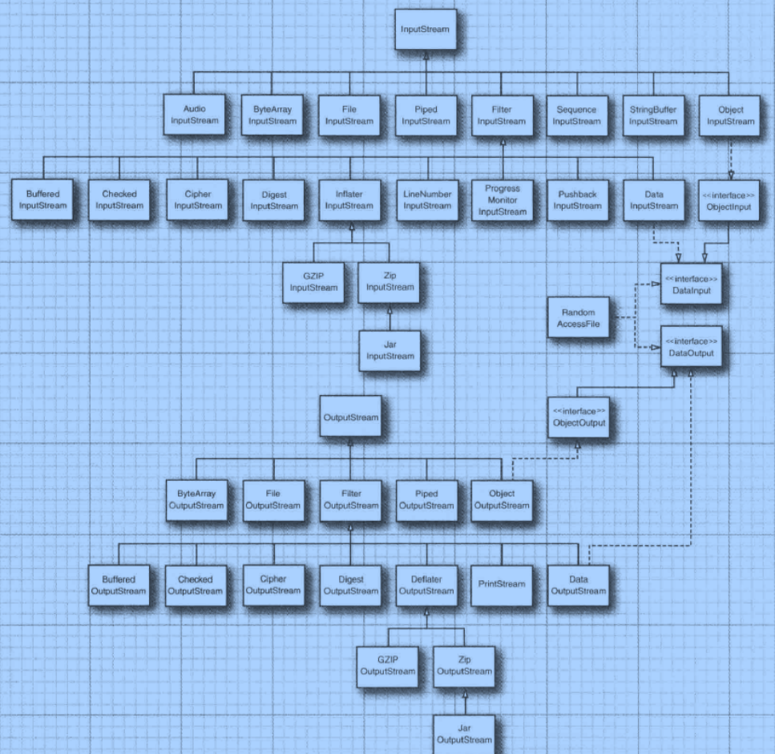
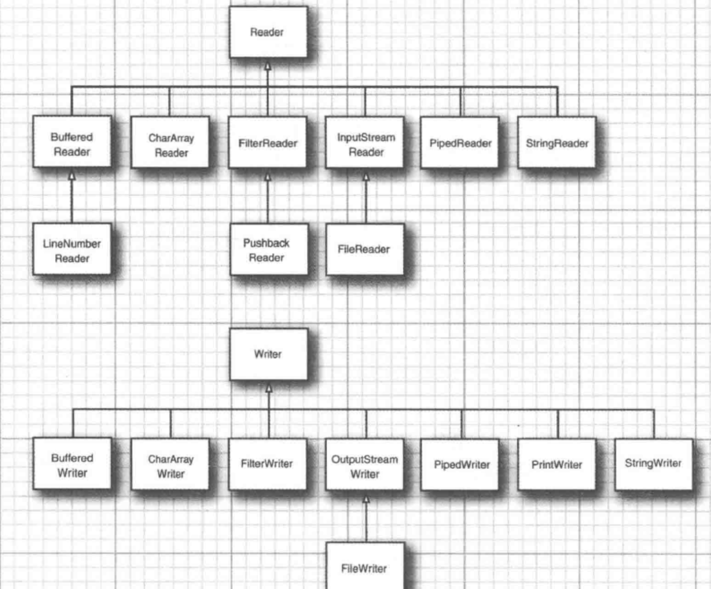
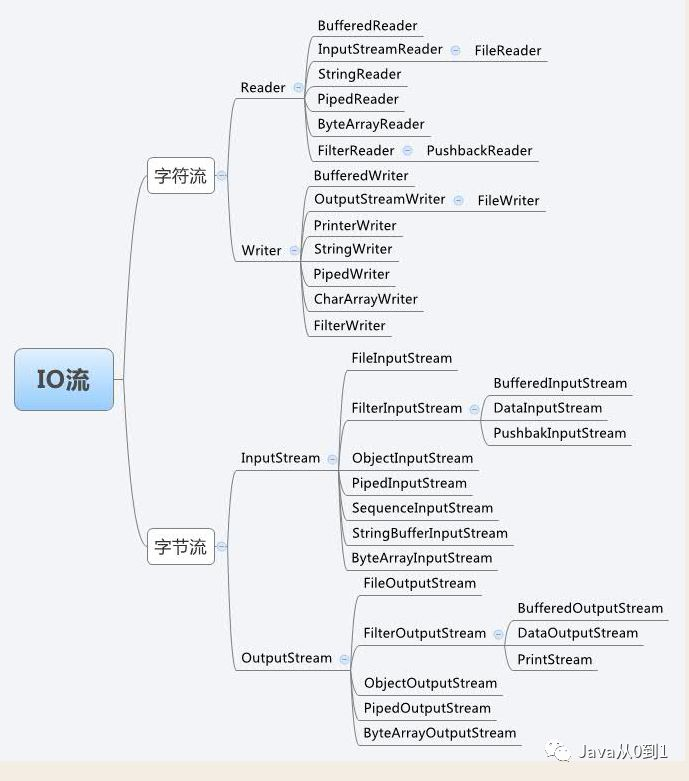

Byte Stream : 对于二进制文件或处理 数字字母之类的数据

  

https://www.javazhiyin.com/17362.html

#### FileInputStream


单个字节读

```
FileInputStream fis = null;
try {
    fis = new FileInputStream("/Users/john/Documents/jywork/THINKJAVA/src/main/resource/a.txt");
    int data;
    while ((data = fis.read()) != -1) {
        System.out.print((char) data+"  ");
    }
} catch (FileNotFoundException e) {
    e.printStackTrace();
} catch (IOException e) {
    e.printStackTrace();
}
```


读到bytes数组里面

```
FileInputStream fis = null;
try {
    byte[] bytes = new byte[14];
    fis = new FileInputStream("/Users/john/Documents/jywork/THINKJAVA/src/main/resource/a.txt");
    int read = fis.read(bytes);
    String s  = new String(bytes);
    System.out.println(s);
    System.out.println(read);
} catch (FileNotFoundException e) {
    e.printStackTrace();
} catch (IOException e) {
    e.printStackTrace();
}
```


读到bytes里面 ,限定读的字节个数

```
FileInputStream fis = null;
try {
    byte[] bytes = new byte[14];
    fis = new FileInputStream("/Users/john/Documents/jywork/THINKJAVA/src/main/resource/a.txt");
    int read = fis.read(bytes,0,4);
    String s  = new String(bytes);
    System.out.println(s);
    System.out.println(read);
} catch (FileNotFoundException e) {
    e.printStackTrace();
} catch (IOException e) {
    e.printStackTrace();
}
```