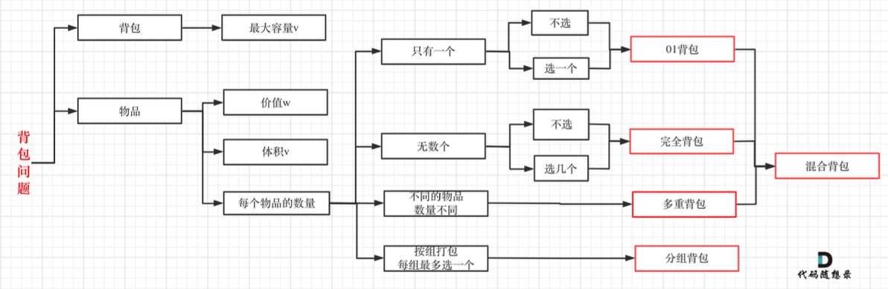
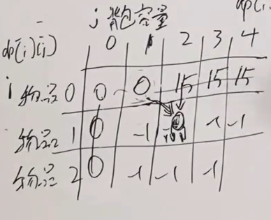
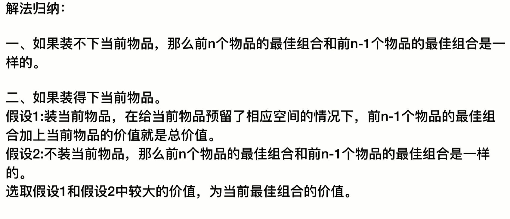
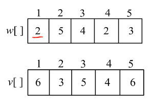
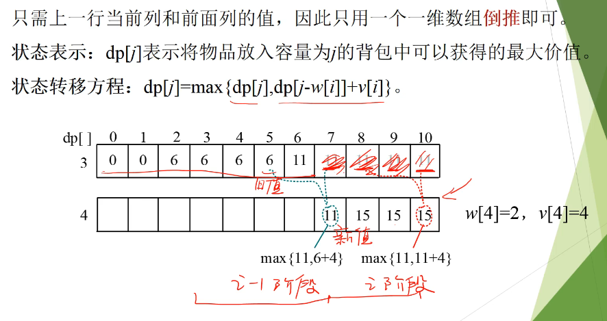

对于01背包，物品i，我觉得也是从0开始更好。

## 解法一

随想录

背包问题理论基础

这个视频讲的很好

https://www.bilibili.com/video/BV1jT4y1o71J/

[0/1 Knapsack problem | Dynamic Programming - YouTube](https://www.youtube.com/watch?v=cJ21moQpofY&t=575s)

https://www.bilibili.com/video/BV1cg411g7Y6/

The 0/1 Knapsack Problem (Demystifying Dynamic Programming) - YouTube

有N件物品和一个最多能背重量为W 的背包。第i件物品的重量是weight[i]，得到的价值是 value[i] 。

```
dp[i][j] 
[0,i]物品任取放容量为j的背包

不放物品i : dp[i-1][j]
放物品i :  dp[i-1][j-weight[i]] + value[i]， 那么就是前i-1种物品的选择，减去当前i物品的重量 + 当前i物品的价值，其实就转化为 i-1种物品 j-weight[i]的容量下的最大值。

dp[i][j] = max(dp[i-1][j], dp[i-1][j-weight[i]] + value[i])
```

从上面的递推公式可以看出，当前值都是由 左上角的值，其实我觉得是正上角， 来递推出来的。`dp[i-1][j]`



随想录的解法，物品0是第一个物品，所以X方向初始化是有值的

下面两个视频，x,y都初始化0，感觉更好。

01背包问题，这个视频讲的很好 

https://www.bilibili.com/video/BV1pY4y1J7na

https://www.bilibili.com/video/BV1K4411X766

对第0行，第0行没有任何物品，在任何背包容量下，前0个物品，能装进背包的最大价值为0.

对第0列，第0列没有任何容量，在任何物品都无法放进背包，因此价值也都为0.

最后一个单元格的数字，就是我们要得到的最终答案。

j

sts/LC-DP/2023-09-09-21.54.02.png)

1. [2,1] 放葡萄情况下： 葡萄占用2，并且葡萄无法再次被选择 ， 此时问题从背包容量为2的情况下，对前一种物品取舍选择后获得的容量，变成了背包容量最大为0的情况下，对前0种物品进行取舍选择后获得的最大价值。


第2行3列的单元格，背包容量最大为3的情况下，对前面2种物品进行选择。

对于i行j列的单元格，背包容量最大为j的情况下，对前面i种物品进行选择，能使得背包价值最大，也就是说每个单元格都是当前条件下的最优解。



下面这个代码，把x,y 0的点都初始化为0.


### 放入的物品





https://www.bilibili.com/video/BV1jT4y1o71J/

- caculate what goods were added in bag. 33:00
1.  先从dp[5][10] ,17开始，15 !=17 所以 物品5放入了背包, 这个是 dp[4][10-3]=11+6 得出来的，我们可以用10-3 走到了dp[4][7],

2. dp[4][7] 11 == dp[3][7] 所以物品4没有放入背包。然后走到了dp[3][7],

3. dp[3][7] 11 != dp[2][7] 9 , 所以物品3放入背包,  dp[2][7-4] + 3 = 9 .  然后走到了 dp[2[3]

4.  dp[2][3] == dp[1][3] ==6,所以物品2没有放入背包, 然后走到了 dp[1][3]

5.  dp[1][3] != dp[0][3] 说明 物品1放入背包，dp[0][3-2] + 6 , 然后就走到了dp[0][1]. 

and then will impement above code


```
    fun knap01(): Int {

        val weightArr = arrayOf(1, 3, 4)
        val valueArr = arrayOf(15, 20, 30)

        val n = 5 // the number of goods
        val w = 8// the max of bag weight
        val dp = Array(n + 1) { IntArray(w + 1) } // 0 is nothing , so need one more

        //即dp[i][j] 表示从下标为[0-i]的物品里任意取，放进容量为j的背包，价值总和最大是多少。
        //初始化

        //j==0 , 背包容量为0，放物品
        for (i in 1 until n) { //number
            dp[i][0] = 0
        }

        // i==0 nothing to put in bag
        for (j in 1 until w) { //weights
            dp[0][j] = 0
        }

        for (i in 0 until n) { //number
            // i==0 , nothing to put in bag
            for (j in 0 until w) { //weights
                if (weightArr[i] > j) { // 物品重量大于 背包容量
                    dp[i][j] = dp[i - 1][j]   // if object weight < j , then use top item
                } else {
                    dp[i][j] = Math.max(dp[i - 1][j], dp[i - 1][j - weightArr[i]] + valueArr[i])
                }
            }
        }

        
     //这个需要后续的真题验证 
        val addedList = ArrayList<Int>()
        var j = w
        for (i in n downTo 0) {
            if (dp[i - 1][j] >= dp[i][j]) {
                j-=weightArr[j]
            }
        }
        return dp[n][w]
    }

```


### 滑动数组


 https://www.bilibili.com/video/BV1jT4y1o71J/

40:00


the video  clearly  talking about 01 knapstack problem which two ways.





正推的时候，是拿着新值，  去更新,新的值。所以第4个数会放入多次。

完全背包

1 - i 种物品可以取  n 次。

完全背包就是01背包


这个代码需要验证

```
    fun knapStackarray(N: Int, W: Int) {
        val weightArr = arrayOf(1, 3, 4)
        val valueArr = arrayOf(15, 20, 30)

        val dp = Array(4) { 0 }
        for (i in 1..N) {
            for (j in W downTo weightArr[i]) { // 只有j容量大于当前物品的容量，才会考虑添加到数组中，更新当前cell的值，否则就直接用上一层的值
                dp[j] = Math.max(dp[j],dp[j-weightArr[i]+valueArr[i]])
            }
        }
    }
```
