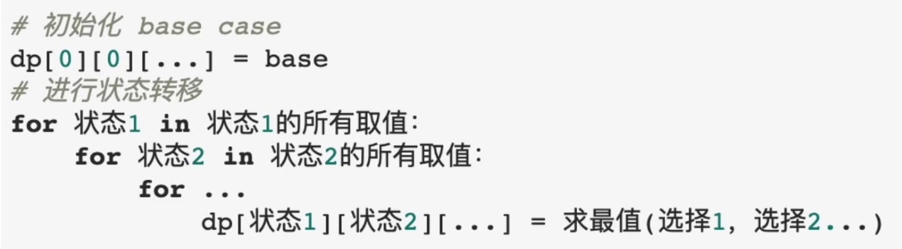

Labuladong

https://www.bilibili.com/video/BV1XV411Y7oE

1. 重叠子问题
2. 状态转移方程 (最关键)
3. 最优子结构


1. 明确状态
2. 明确 选择
3. 明确dp函数/数组的定义
4. 明确base case


随想录

https://www.bilibili.com/video/BV13Q4y197Wg


**对于动态规划问题，我将拆解为如下五步曲，这五步都搞清楚了，才能说把动态规划真的掌握了！**

1. 确定dp数组（dp table）以及下标的含义
2. 确定递推公式
3. dp数组如何初始化
4. 确定遍历顺序
5. 举例推导dp数组


动态规划解法代码框架




#### [509. 斐波那契数](https://leetcode.cn/problems/fibonacci-number/)


##### 随想录 迭代递推

自底向上

通过for循环递推出 dp[n]的值，一开始解的时候写成了  dp[n] = dp[n - 1] + dp[n- 2] 


```kotlin
    /**
     * 随想录视频思路解法1
     */
    fun fib1(n: Int): Int {
//        println(n)
        if (n == 0) return 0
        else if (n == 1) return 1
        val dp = IntArray(n+1)
        dp[0] = 0
        dp[1] = 1
        for (i in 2..n) {
            dp[i] = dp[i - 1] + dp[i - 2]
//            println(" dp[n - 1]= ${ dp[n - 1]}  dp[n - 2]= ${dp[n - 2]}")
        }
        return dp[n]
    }
```


##### 随想录  视频思路解法2


这种解法，dp数组空间复杂度减少了。

```kotlin
/**
 * 随想录视频思路解法2
 */
fun fib(n: Int): Int {
    if (n == 0) return 0
    else if (n == 1) return 1
    val dp = IntArray(2)
    dp[0] = 0
    dp[1] = 1
    var sum = 0
    for (i in 2..n) {
        sum = dp[0] + dp[1]
        println("sum $sum  dp[0]= ${dp[0]} , dp[1]= ${dp[1]}")
        dp[0] = dp[1]
        dp[1] = sum
    }
    return sum
}
```


##### labuladong

把所有计算的值先保存起来，后面需要的话先直接返回，避免重复计算.


为什么申请 n+1 数组大小

因为索引从0开始 ，后面要取memory[n]，所有就申请 n+1 大小.


自顶向下


```kotlin
    fun fib(n: Int): Int {
        val memory = IntArray(n + 1)
        if (memory[n] != 0) {
            return memory[n]
        } else if (n == 0) return 0
        else if (n == 1) return 1

        memory[n] = fib(n - 1) + fib(n - 2)
        return memory[n]
    }


    fun fib(n: Int): Int {
        if (n == 0) return 0
        if (n == 1) return 1
        return fib(n - 1) + fib(n - 2)
    }
```


还有一种lablado解法一开始没想出来,双指针应该怎么操作


这个思路和随想录的思路2是一样的

```kotlin
fun fib(n: Int): Int {
    var pre1 = 0
    var pre2 = 1
    var sum = 0

    if (n == 0) return 0
    else if (n == 1) return 1
    for (i in 2..n) {
        sum = pre1 + pre2  // 得到当前n的num
        pre1 = pre2     //移动指针
        pre2 = sum
    }
    return sum
}
```


#### [70 爬楼梯](https://leetcode.cn/problems/climbing-stairs/)


根据阶梯

0阶								 1 //  需要返回1，2 = 1 +1,否则2就不正确了,正常理解应该返回0,不过递归解法，需要返回1

1阶 					 			1 	 

2阶	1+1 , 2	  			 2

3阶  1+1+1, 1+2, 2+1	3

四阶	 							5

根据上面的推导，这个问题也类似于 斐波那契数	， 看了随想录的视频，这个推导过程还是没看明白


看了这个视频推导明白了

https://www.bilibili.com/video/BV1G54y1X72H/		进度条5分钟.

到达 k 只有 两种方式 , k-2过去和k-1过去，所以到k的所有情况就是  (k-2)  + (k-1) ,我们这里讨论的是多少种不同的方法，而不用管k-2,k-1多少步到达k.

|      |      |      |      |      |      |
| :--: | :--: | :--: | ---- | ---- | ---- |
|      |      |  k   |      |      |      |
|      | k-1  |      |      |      |      |
| k-2  |      |      |      |      |      |


##### 递归解法

超时

```kotlin
/**
 * 递归解法 ， 会超时
 */
fun climbStairs(n: Int): Int {
    if (n == 0) return 1 // 需要返回1，2 = 1 +1,否则2就不正确了
    if (n == 1) return 1
    val dp = IntArray(n + 1)
    dp[0] = 1
    dp[1] = 1
    return climbStairs(n - 1) + climbStairs(n - 2)
}
```


##### 迭代解法

```kotlin
fun climbStairs1(n: Int): Int {
    if (n == 0) return 1
    if (n == 1) return 1
    val dp = IntArray(n + 1)
    dp[0] = 1
    dp[1] = 1
    for (i in 2..n) {
        dp[i] = dp[i - 1] + dp[i - 2]
    }
    return dp[n]
}
```


#### [746 使用最小花费爬楼梯](https://leetcode.cn/problems/min-cost-climbing-stairs/)


如果要走到dp[i] 的位置， 有两种选择，dp[i-1] + cost[i-1]	，dp[i-2] + cost[i-2]， cost就是从当前位置跳出消耗的能量值，dp[i-1] 已经包含dp[0]开始的所有 消费值。 	

``` 
dp[i] = min(dp[i-1] + cost[i-1], dp[i-2] + cost[i-2]) 
```


可以用这个推导


官方题解

这种方式比较好理解

```kotlin
fun minCostClimbingStairs(cost: IntArray): Int {
    val dp = IntArray(cost.size + 1) //要走完数组最后一步的下一步
    dp[0] = 0
    dp[1] = 0
    for (i in 2..cost.size) {
        dp[i] = min(dp[i - 1] + cost[i - 1], dp[i - 2] + cost[i - 2])
    }
    return dp[cost.size]
}
```

其他的后面在看吧
